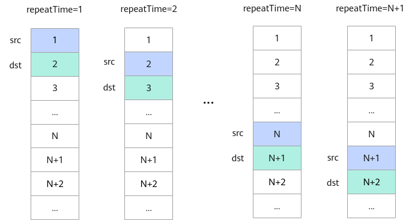

# 通用说明和约束-Ascend C算子开发接口-API-CANN社区版8.5.0开发文档-昇腾社区

**页面ID:** atlasascendc_api_07_0004
**来源：** https://www.hiascend.com/document/detail/zh/CANNCommunityEdition/850/API/ascendcopapi/atlasascendc_api_07_0004.html
---

# 通用说明和约束

#### 需要包含的头文件

为方便开发者使用，Ascend C基础API和高阶API均支持通过包含kernel_operator.h文件来调用相应接口。如无特殊说明，包含该头文件即可满足接口调用需求。若API文档中有特殊说明，则应遵循API的具体说明。

| 1   | #include"kernel_operator.h" |
| --- | --------------------------- |

#### 逻辑位置和物理存储的映射关系

| TPosition | 物理内存                                                                                                                                                                                                                                          |
| --------- | ------------------------------------------------------------------------------------------------------------------------------------------------------------------------------------------------------------------------------------------------- |
| GM        | Global Memory                                                                                                                                                                                                                                     |
| VECIN     | Unified Buffer                                                                                                                                                                                                                                    |
| VECCALC   | Unified Buffer                                                                                                                                                                                                                                    |
| VECOUT    | Unified Buffer                                                                                                                                                                                                                                    |
| A1        | L1 Buffer                                                                                                                                                                                                                                         |
| A2        | L0A Buffer                                                                                                                                                                                                                                        |
| B1        | L1 Buffer                                                                                                                                                                                                                                         |
| B2        | L0B Buffer                                                                                                                                                                                                                                        |
| C1        | Atlas训练系列产品，Unified Buffer。Atlas推理系列产品AI Core，Unified Buffer。Atlas A2 训练系列产品/Atlas A2 推理系列产品，L1 Buffer。Atlas A3 训练系列产品/Atlas A3 推理系列产品，L1 Buffer。Atlas 200I/500 A2 推理产品，Unified Buffer。         |
| C2        | Atlas训练系列产品，L0C Buffer。Atlas推理系列产品AI Core，L0C Buffer。Atlas A2 训练系列产品/Atlas A2 推理系列产品，BiasTable Buffer。Atlas A3 训练系列产品/Atlas A3 推理系列产品，BiasTable Buffer。Atlas 200I/500 A2 推理产品，BiasTable Buffer。 |
| CO1       | L0C Buffer                                                                                                                                                                                                                                        |
| CO2       | Atlas训练系列产品，Unified Buffer。Atlas推理系列产品AI Core，Unified Buffer。Atlas A2 训练系列产品/Atlas A2 推理系列产品，Global Memory。Atlas A3 训练系列产品/Atlas A3 推理系列产品，Global Memory。Atlas 200I/500 A2 推理产品，Global Memory。  |
| TSCM      | L1 Buffer                                                                                                                                                                                                                                         |
| SPM       | Atlas训练系列产品，L1 Buffer。Atlas推理系列产品AI Core，L1 Buffer。Atlas A2 训练系列产品/Atlas A2 推理系列产品，Global Memory。Atlas A3 训练系列产品/Atlas A3 推理系列产品，Global Memory。                                                       |
| C2PIPE2GM | Atlas A2 训练系列产品/Atlas A2 推理系列产品，Fixpipe Buffer。Atlas A3 训练系列产品/Atlas A3 推理系列产品，Fixpipe Buffer。                                                                                                                        |

#### 通用地址对齐约束

| 存储单元              | 对齐要求      |
| --------------------- | ------------- |
| Global Memory         | 无对齐要求。  |
| Unified Buffer        | 32Byte对齐。  |
| L1 Buffer             | 32Byte对齐。  |
| L0A Buffer/L0B Buffer | 512Byte对齐。 |
| L0C Buffer            | 64Byte对齐。  |
| BiasTable Buffer      | 64Byte对齐。  |
| Fixpipe Buffer        | 64Byte对齐。  |

#### 通用地址重叠约束

使用基础API的Tensor高维切分计算接口时，为了节省地址空间，开发者可以定义一个Tensor，供源操作数与目的操作数同时使用（即地址重叠）。使用时需要注意以下约束：

- 单次迭代内：源操作数与目的操作数必须100%完全重叠，不支持部分重叠。
- 多次迭代间：不支持前序迭代的目的操作数与后序迭代的源操作数重叠。例如，第N次迭代的目的操作数是第N+1次的源操作数（如下图所示）。在这种情况下，第N次迭代可能会改写覆盖源操作数的数值，导致无法得到预期结果。特别地，对于部分双目计算类的API(Add、Sub、Mul、Max、Min、AddRelu、SubRelu)，当数据类型为half、int32_t、float时，支持前序迭代的目的操作数与后序迭代的源操作数重叠：仅针对目的操作数和第二个源操作数重叠的情况，且src1RepStride或者dstRepStride必须为0。

本节所述地址重叠通用约束适用于一般情况，API参考中如有额外特殊说明的，则以具体API中的说明为准。

API中没有描述地址重叠约束的，视为不支持Tensor高维切分计算的地址重叠，地址重叠时计算结果可能不满足预期。
