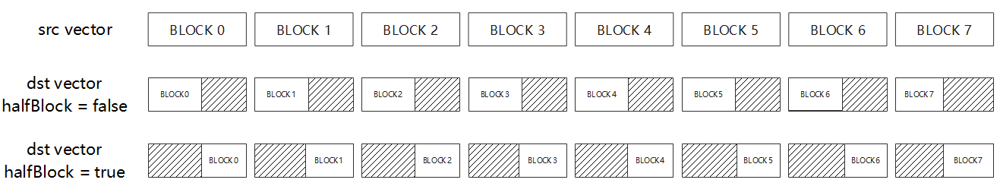

# CastDeq-复合计算-矢量计算-基础API-Ascend C算子开发接口-API-CANN社区版8.5.0开发文档-昇腾社区

**页面ID:** atlasascendc_api_07_0074
**来源：** https://www.hiascend.com/document/detail/zh/CANNCommunityEdition/850/API/ascendcopapi/atlasascendc_api_07_0074.html
---

# CastDeq

#### 产品支持情况

| 产品                                        | 是否支持 |
| ------------------------------------------- | -------- |
| Atlas A3 训练系列产品/Atlas A3 推理系列产品 | √        |
| Atlas A2 训练系列产品/Atlas A2 推理系列产品 | √        |
| Atlas 200I/500 A2 推理产品                  | x        |
| Atlas推理系列产品AI Core                    | √        |
| Atlas推理系列产品Vector Core                | x        |
| Atlas训练系列产品                           | x        |

#### 功能说明

对输入做量化并进行精度转换。不同的数据类型，转换公式不同。

- 在输入类型为int16_t的情况下，对int16_t类型的输入做量化并进行精度转换，得到int8_t/uint8_t类型的数据。使用该接口前需要调用SetDeqScale设置scale、offset、signMode等量化参数。通过模板参数isVecDeq控制是否选择向量量化模式。当isVecDeq=false时，根据SetDeqScale设置的scale、offset、signMode，对输入做量化并进行精度转换。计算公式如下：当isVecDeq=true时，根据SetDeqScale设置的一段128B的UB上的16组量化参数scale0-scale15、offset0-offset15、signMode0-signMode15，以循环的方式对输入做量化并进行精度转换。计算公式如下：
- 在输入类型为int32_t的情况下，对int32_t类型的输入做量化并进行精度转换，得到half类型的数据。使用该接口前需要调用SetDeqScale设置scale参数。.

#### 函数原型

- tensor前n个数据计算12template<typenameT,typenameU,boolisVecDeq=true,boolhalfBlock=true>__aicore__inlinevoidCastDeq(constLocalTensor<T>&dst,constLocalTensor<U>&src,constuint32_tcount)
- tensor高维切分计算mask逐bit模式12template<typenameT,typenameU,boolisSetMask=true,boolisVecDeq=true,boolhalfBlock=true>__aicore__inlinevoidCastDeq(constLocalTensor<T>&dst,constLocalTensor<U>&src,constuint64_tmask[],uint8_trepeatTime,constUnaryRepeatParams&repeatParams)mask连续模式12template<typenameT,typenameU,boolisSetMask=true,boolisVecDeq=true,boolhalfBlock=true>__aicore__inlinevoidCastDeq(constLocalTensor<T>&dst,constLocalTensor<U>&src,constint32_tmask,uint8_trepeatTime,constUnaryRepeatParams&repeatParams)

#### 参数说明

| 参数名    | 描述                                                                                                                                                                                                                                                                                                                                                                    |
| --------- | ----------------------------------------------------------------------------------------------------------------------------------------------------------------------------------------------------------------------------------------------------------------------------------------------------------------------------------------------------------------------- |
| T         | 输出Tensor的数据类型。Atlas A3 训练系列产品/Atlas A3 推理系列产品，支持的数据类型为：int8_t/uint8_t/halfAtlas A2 训练系列产品/Atlas A2 推理系列产品，支持的数据类型为：int8_t/uint8_t/halfAtlas推理系列产品AI Core，支持的数据类型为：int8_t/uint8_t和SetDeqScale接口的signMode入参配合使用，当signMode=true时输出数据类型int8_t；signMode=false时输出数据类型uint8_t。 |
| U         | 输入Tensor的数据类型。Atlas A3 训练系列产品/Atlas A3 推理系列产品，支持的数据类型为：int16_t/int32_tAtlas A2 训练系列产品/Atlas A2 推理系列产品，支持的数据类型为：int16_t/int32_tAtlas推理系列产品AI Core，支持的数据类型为：int16_t                                                                                                                                   |
| isSetMask | 是否在接口内部设置mask。true，表示在接口内部设置mask。false，表示在接口外部设置mask，开发者需要使用SetVectorMask接口设置mask值。这种模式下，本接口入参中的mask值必须设置为占位符MASK_PLACEHOLDER。                                                                                                                                                                      |
| isVecDeq  | 控制是否选择向量量化模式。和SetDeqScale(const LocalTensor<T>& src)接口配合使用，当SetDeqScale接口传入Tensor时，isVecDeq必须为true。                                                                                                                                                                                                                                     |
| halfBlock | 对int16_t类型的输入做量化并进行精度转换得到int8_t/uint8_t类型的数据时，halfBlock参数用于指示输出元素存放在上半还是下半Block。halfBlock=true时，结果存放在下半Block；halfBlock=false时，结果存放在上半Block，如图图1。                                                                                                                                                   |

| 参数名       | 输入/输出 | 描述                                                                                                                                                                                                                                                                                                                                                                                                                                                                                                                                                                                                                                                                                                                                                                                                           |
| ------------ | --------- | -------------------------------------------------------------------------------------------------------------------------------------------------------------------------------------------------------------------------------------------------------------------------------------------------------------------------------------------------------------------------------------------------------------------------------------------------------------------------------------------------------------------------------------------------------------------------------------------------------------------------------------------------------------------------------------------------------------------------------------------------------------------------------------------------------------- |
| dst          | 输出      | 目的操作数。类型为LocalTensor，支持的TPosition为VECIN/VECCALC/VECOUT。LocalTensor的起始地址需要32字节对齐。                                                                                                                                                                                                                                                                                                                                                                                                                                                                                                                                                                                                                                                                                                    |
| src          | 输入      | 源操作数。类型为LocalTensor，支持的TPosition为VECIN/VECCALC/VECOUT。LocalTensor的起始地址需要32字节对齐。                                                                                                                                                                                                                                                                                                                                                                                                                                                                                                                                                                                                                                                                                                      |
| mask/mask[]  | 输入      | mask用于控制每次迭代内参与计算的元素。逐bit模式：可以按位控制哪些元素参与计算，bit位的值为1表示参与计算，0表示不参与。mask为数组形式，数组长度和数组元素的取值范围和操作数的数据类型有关。当操作数为16位时，数组长度为2，mask[0]、mask[1]∈[0, 264-1]并且不同时为0；当操作数为32位时，数组长度为1，mask[0]∈(0, 264-1]；当操作数为64位时，数组长度为1，mask[0]∈(0, 232-1]。例如，mask=[8, 0]，8=0b1000，表示仅第4个元素参与计算。连续模式：表示前面连续的多少个元素参与计算。取值范围和操作数的数据类型有关，数据类型不同，每次迭代内能够处理的元素个数最大值不同。当操作数为16位时，mask∈[1, 128]；当操作数为32位时，mask∈[1, 64]；当操作数为64位时，mask∈[1, 32]。当源操作数和目的操作数位数不同时，以数据类型的字节较大的为准。例如，源操作数为int16_t类型，目的操作数为int8_t类型，计算mask时以int16_t为准。 |
| repeatTime   | 输入      | 重复迭代次数。矢量计算单元，每次读取连续的256Bytes数据进行计算，为完成对输入数据的处理，必须通过多次迭代(repeat)才能完成所有数据的读取与计算。repeatTime表示迭代的次数。关于该参数的具体描述请参考高维切分API。                                                                                                                                                                                                                                                                                                                                                                                                                                                                                                                                                                                                |
| repeatParams | 输入      | 控制操作数地址步长的参数。UnaryRepeatParams类型，包含操作数相邻迭代间相同DataBlock的地址步长，操作数同一迭代内不同DataBlock的地址步长等参数。相邻迭代间的地址步长参数说明请参考repeatStride；同一迭代内DataBlock的地址步长参数说明请参考dataBlockStride。                                                                                                                                                                                                                                                                                                                                                                                                                                                                                                                                                      |
| count        | 输入      | 参与计算的元素个数。                                                                                                                                                                                                                                                                                                                                                                                                                                                                                                                                                                                                                                                                                                                                                                                           |

#### 返回值说明

无

#### 约束说明

- 操作数地址对齐要求请参见通用地址对齐约束。
- 操作数地址重叠约束请参考通用地址重叠约束。

#### 调用示例

如果您需要运行样例代码，请将该代码段拷贝并替换样例模板中Compute函数的部分代码即可。

- 高维切分计算接口样例-mask连续模式12345int32_tmask=256/sizeof(int16_t);// repeatTime = 2, 128 elements one repeat, 256 elements total// dstBlkStride, srcBlkStride = 1, no gap between blocks in one repeat// dstRepStride, srcRepStride = 8, no gap between repeatsAscendC:CastDeq<uint8_t,int16_t,true,true,true>(dstLocal,srcLocal,mask,2,{1,1,8,8});
- 高维切分计算接口样例-mask逐bit模式12345uint64_tmask[2]={UINT64_MAX,UINT64_MAX};// repeatTime = 2, 128 elements one repeat, 256 elements total// dstBlkStride, srcBlkStride = 1, no gap between blocks in one repeat// dstRepStride, srcRepStride = 8, no gap between repeatsAscendC:CastDeq<uint8_t,int16_t,true,true,true>(dstLocal,srcLocal,mask,2,{1,1,8,8});
- 前n个数计算接口样例1AscendC:CastDeq<uint8_t,int16_t,true,true>(dstLocal,srcLocal,256);

结果示例如下：

#### 样例模板

| 123456789101112131415161718192021222324252627282930313233343536373839404142434445464748495051525354555657585960616263646566676869707172737475767778798081828384858687888990919293949596979899100101102103104105 | #include"kernel_operator.h"template<typenamesrcType,typenamedstType>classKernelCastDeq{public:__aicore__inlineKernelCastDeq(){}__aicore__inlinevoidInit(GM_ADDRsrc_gm,GM_ADDRdst_gm,uint32_tinputSize,boolhalfBlock,boolisVecDeq){srcSize=inputSize;dstSize=inputSize*2;this->halfBlock=halfBlock;this->isVecDeq=isVecDeq;src_global.SetGlobalBuffer(reinterpret_cast<__gm__srcType*>(src_gm),srcSize);dst_global.SetGlobalBuffer(reinterpret_cast<__gm__dstType*>(dst_gm),dstSize);pipe.InitBuffer(inQueueX,1,srcSize*sizeof(srcType));pipe.InitBuffer(outQueue,1,dstSize*sizeof(dstType));pipe.InitBuffer(tmpQueue,1,128);}__aicore__inlinevoidProcess(){CopyIn();Compute();CopyOut();}private:__aicore__inlinevoidCopyIn(){AscendC:LocalTensor<srcType>srcLocal=inQueueX.AllocTensor<srcType>();AscendC:DataCopy(srcLocal,src_global,srcSize);inQueueX.EnQue(srcLocal);}__aicore__inlinevoidCompute(){AscendC:LocalTensor<dstType>dstLocal=outQueue.AllocTensor<dstType>();AscendC:LocalTensor<uint64_t>tmpBuffer=tmpQueue.AllocTensor<uint64_t>();AscendC:Duplicate(tmpBuffer.ReinterpretCast<int32_t>(),static_cast<int32_t>(0),32);AscendC:PipeBarrier<PIPE_V>();AscendC:Duplicate<int32_t>(dstLocal.templateReinterpretCast<int32_t>(),static_cast<int32_t>(0),dstSize/sizeof(int32_t));AscendC:PipeBarrier<PIPE_ALL>();boolsignMode=false;ifconstexpr(AscendC:Std:is_same<dstType,int8_t>:value){signMode=true;}AscendC:LocalTensor<srcType>srcLocal=inQueueX.DeQue<srcType>();if(halfBlock){if(isVecDeq){floatvdeqScale[16]={1.0};int16_tvdeqOffset[16]={0};boolvdeqSignMode[16]={signMode};AscendC:VdeqInfovdeqInfo(vdeqScale,vdeqOffset,vdeqSignMode);AscendC:SetDeqScale(tmpBuffer,vdeqInfo);AscendC:CastDeq<dstType,srcType,true,true>(dstLocal,srcLocal,srcSize);}else{floatscale=1.0;int16_toffset=0;AscendC:SetDeqScale(scale,offset,signMode);AscendC:CastDeq<dstType,srcType,false,true>(dstLocal,srcLocal,srcSize);}}else{if(isVecDeq){floatvdeqScale[16]={1.0};int16_tvdeqOffset[16]={0};boolvdeqSignMode[16]={signMode};AscendC:VdeqInfovdeqInfo(vdeqScale,vdeqOffset,vdeqSignMode);AscendC:SetDeqScale(tmpBuffer,vdeqInfo);AscendC:CastDeq<dstType,srcType,true,false>(dstLocal,srcLocal,srcSize);}else{floatscale=1.0;int16_toffset=0;AscendC:SetDeqScale(scale,offset,signMode);AscendC:CastDeq<dstType,srcType,false,false>(dstLocal,srcLocal,srcSize);}}outQueue.EnQue<dstType>(dstLocal);tmpQueue.FreeTensor(tmpBuffer);inQueueX.FreeTensor(srcLocal);}__aicore__inlinevoidCopyOut(){AscendC:LocalTensor<dstType>dstLocal=outQueue.DeQue<dstType>();AscendC:DataCopy(dst_global,dstLocal,dstSize);outQueue.FreeTensor(dstLocal);}private:AscendC:GlobalTensor<srcType>src_global;AscendC:GlobalTensor<dstType>dst_global;AscendC:TPipepipe;AscendC:TQue<AscendC:TPosition:VECIN,1>inQueueX;AscendC:TQue<AscendC:TPosition:VECIN,1>tmpQueue;AscendC:TQue<AscendC:TPosition:VECOUT,1>outQueue;boolhalfBlock=false;boolisVecDeq=false;uint32_tsrcSize=0;uint32_tdstSize=0;};template<typenamesrcType,typenamedstType>__aicore__voidkernel_cast_deqscale_operator(GM_ADDRsrc_gm,GM_ADDRdst_gm,uint32_tdataSize,boolhalfBlock,boolisVecDeq){KernelCastDeq<srcType,dstType>op;op.Init(src_gm,dst_gm,dataSize,halfBlock,isVecDeq);op.Process();}extern"C"__global____aicore__voidkernel_cast_deqscale_operator_256_int16_t_uint8_t_true_true(GM_ADDRsrc_gm,GM_ADDRdst_gm){kernel_cast_deqscale_operator<int16_t,uint8_t>(src_gm,dst_gm,256,true,true);} |
| --------------------------------------------------------------------------------------------------------------------------------------------------------------------------------------------------------------- | --------------------------------------------------------------------------------------------------------------------------------------------------------------------------------------------------------------------------------------------------------------------------------------------------------------------------------------------------------------------------------------------------------------------------------------------------------------------------------------------------------------------------------------------------------------------------------------------------------------------------------------------------------------------------------------------------------------------------------------------------------------------------------------------------------------------------------------------------------------------------------------------------------------------------------------------------------------------------------------------------------------------------------------------------------------------------------------------------------------------------------------------------------------------------------------------------------------------------------------------------------------------------------------------------------------------------------------------------------------------------------------------------------------------------------------------------------------------------------------------------------------------------------------------------------------------------------------------------------------------------------------------------------------------------------------------------------------------------------------------------------------------------------------------------------------------------------------------------------------------------------------------------------------------------------------------------------------------------------------------------------------------------------------------------------------------------------------------------------------------------------------------------------------------------------------------------------------------------------------------------------------------------------------------------------------------------------------------------------------------------------------------------------------------------------------------------------------------------------------------------------------------------------------------------------------------------------------------------------------------------------------------------------------------------------------------------------------------------------------------------------------------------------------------------------------------------------------------------------------------------------------------------------------------------------------------------------------------------------------------------------------------------------------------------------------------------------------------------------------------------------------------------------------------------------------------------------------------------------------------------------------------------------------------------------------------------------------------------------------------------------------------------------------------------------------------------------------------------- |
