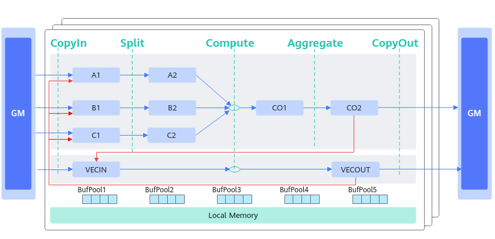

# TQueBind简介-TQueBind-Pipe和Que框架-资源管理-基础API-Ascend C算子开发接口-API-CANN社区版8.5.0开发文档-昇腾社区

**页面ID:** atlasascendc_api_07_0146
**来源：** https://www.hiascend.com/document/detail/zh/CANNCommunityEdition/850/API/ascendcopapi/atlasascendc_api_07_0146.html
---

# TQueBind简介

TQueBind绑定源逻辑位置和目的逻辑位置，根据源位置和目的位置，来确定内存分配的位置 、插入对应的同步事件，帮助开发者解决内存分配和管理、同步等问题。Tque是TQueBind的简化模式。通常情况下开发者使用TQue进行编程，TQueBind对外提供一些特殊数据通路的内存管理和同步控制，涉及这些通路时可以直接使用TQueBind。

如下图的数据通路示意图所示，红色线条和蓝色线条的通路可通过TQueBind定义表达，蓝色线条的通路可通过TQue进行简化表达。

| 数据通路      | TQueBind定义                                   | TQue定义                  |
| ------------- | ---------------------------------------------- | ------------------------- |
| GM->VECIN     | TQueBind<TPosition:GM, TPosition:VECIN, 1>     | TQue<TPosition:VECIN, 1>  |
| VECOUT->GM    | TQueBind<TPosition:VECOUT, TPosition:GM, 1>    | TQue<TPosition:VECOUT, 1> |
| VECIN->VECOUT | TQueBind<TPosition:VECIN, TPosition:VECOUT, 1> | -                         |
| GM->A1        | TQueBind<TPosition:GM, TPosition:A1, 1>        | TQue<TPosition:A1, 1>     |
| GM->B1        | TQueBind<TPosition:GM, TPosition:B1, 1>        | TQue<TPosition:B1, 1>     |
| GM->C1        | TQueBind<TPosition:GM, TPosition:C1, 1>        | TQue<TPosition:C1, 1>     |
| A1->A2        | TQueBind<TPosition:A1, TPosition:A2, 1>        | TQue<TPosition:A2, 1>     |
| B1->B2        | TQueBind<TPosition:B1, TPosition:B2, 1>        | TQue<TPosition:B2, 1>     |
| C1->C2        | TQueBind<TPosition:C1, TPosition:C2, 1>        | TQue<TPosition:C2, 1>     |
| CO1->CO2      | TQueBind<TPosition:CO1, TPosition:CO2, 1>      | TQue<TPosition:CO1, 1>    |
| CO2->GM       | TQueBind<TPosition:CO2, TPosition:GM, 1>       | TQue<TPosition:CO2, 1>    |
| VECOUT->A1/B1/C1 | TQueBind<TPosition:VECOUT, TPosition:A1, 1>
TQueBind<TPosition:VECOUT, TPosition:B1, 1>
TQueBind<TPosition:VECOUT, TPosition:C1, 1> | - |
| CO2->VECIN | TQueBind<TPosition:CO2, TPosition:VECIN, 1> | -   |

下面通过两个具体的示例展示了矢量编程场景下TQueBind的使用方法：

- 如下的编程范式示例，图中的两个队列分别绑定的是GM VECIN和VECOUT GM。

- 如果不需要进行Vector计算，比如仅需要做格式随路转换等场景，可对上述流程进行优化，对VECIN和VECOUT进行绑定，绑定的效果可以实现输入输出使用相同buffer，实现double buffer。

#### 模板参数

| 1   | template<TPositionsrc,TPositiondst,int32_tdepth,automask=0>classTQueBind{...}; |
| --- | ------------------------------------------------------------------------------ |

| 参数名 | 描述                                                                                                                                                           |
| ------ | -------------------------------------------------------------------------------------------------------------------------------------------------------------- |
| src    | 源逻辑位置，支持的TPosition可以为VECIN、VECOUT、A1、A2、B1、B2、CO1、CO2。关于TPosition的具体介绍请参考TPosition。支持的src和dst组合请参考表1。                |
| dst    | 目的逻辑位置，TPosition可以为VECIN、VECOUT、A1、A2、B1、B2、CO1、CO2。                                                                                         |
| depth  | TQue的深度，一般不超过4。                                                                                                                                      |
| mask   | 如果用户在某一个Que上，数据搬运的时候需要做转换，可以设置为0或1。一般不需要用户配置，默认为0。设置为0，代表数据格式从ND转换为NZ，目前仅支持TPosition为A1或B1。 |
