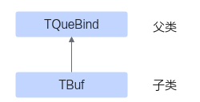

# TBuf简介-TBuf-Pipe和Que框架-资源管理-基础API-Ascend C算子开发接口-API-CANN社区版8.5.0开发文档-昇腾社区

**页面ID:** atlasascendc_api_07_0160
**来源：** https://www.hiascend.com/document/detail/zh/CANNCommunityEdition/850/API/ascendcopapi/atlasascendc_api_07_0160.html
---

# TBuf简介

使用Ascend C编程的过程中，可能会用到一些临时变量。这些临时变量占用的内存可以使用TBuf数据结构来管理，存储位置通过模板参数来设置，可以设置为不同的TPosition逻辑位置。

TBuf继承自TQueBind父类，继承关系如下：

TBuf占用的存储空间通过TPipe进行管理，您可以通过InitBuffer接口为TBuf进行内存初始化操作，之后即可通过Get获取指定长度的Tensor参与计算。

使用InitBuffer为TBuf分配内存和为队列分配内存有以下差异：

- 为TBuf分配的内存空间只能参与计算，无法执行队列的入队出队操作。
- 调用一次内存初始化接口，TPipe只会为TBuf分配一块内存，为队列可以通过参数设置申请多块内存。如果要使用多个临时变量，需要定义多个TBuf数据结构，对每个TBuf数据结构分别调用InitBuffer接口进行内存初始化。
- TBuf获取的Tensor无需释放。
