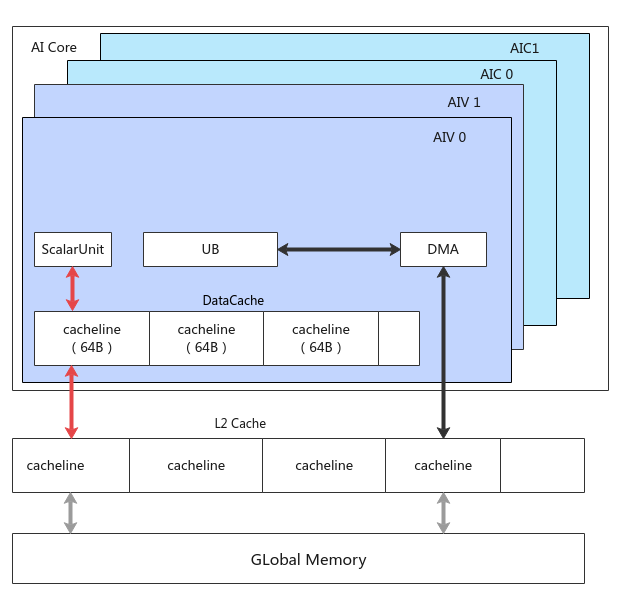

# DataCacheCleanAndInvalid-缓存控制-基础API-Ascend C算子开发接口-API-CANN社区版8.5.0开发文档-昇腾社区

**页面ID:** atlasascendc_api_07_0177
**来源：** https://www.hiascend.com/document/detail/zh/CANNCommunityEdition/850/API/ascendcopapi/atlasascendc_api_07_0177.html
---

# DataCacheCleanAndInvalid

#### 产品支持情况

| 产品                                        | 是否支持（支持配置dcciDst的原型） | 是否支持（不支持配置dcciDst的原型） |
| ------------------------------------------- | --------------------------------- | ----------------------------------- |
| Atlas A3 训练系列产品/Atlas A3 推理系列产品 | √                                 | √                                   |
| Atlas A2 训练系列产品/Atlas A2 推理系列产品 | √                                 | √                                   |
| Atlas 200I/500 A2 推理产品                  | √                                 | √                                   |
| Atlas推理系列产品AI Core                    | x                                 | √                                   |
| Atlas推理系列产品Vector Core                | x                                 | x                                   |
| Atlas训练系列产品                           | x                                 | x                                   |

#### 功能说明

在AI Core内部，Scalar单元和DMA单元都可能对Global Memory进行访问。

如上图所示：

- DMA搬运单元读写Global Memory，数据通过DataCopy等接口在UB等Local Memory和Global Memory间交互，没有Cache一致性问题；
- Scalar单元访问Global Memory，首先会访问每个核内的Data Cache，因此存在Data Cache与Global Memory的Cache一致性问题。

该接口用来刷新Cache，保证Cache的一致性，使用场景如下：

- 读取Global Memory的数据，但该数据可能在外部被其余核修改，此时需要使用DataCacheCleanAndInvalid接口，直接访问Global Memory，获取最新数据；

- 用户通过Scalar单元写Global Memory的数据，希望立刻写出，也需要使用DataCacheCleanAndInvalid接口。

#### 函数原型

- 支持通过配置dcciDst确保Data Cache与GM存储的一致性12template<typenameT,CacheLineentireType,DcciDstdcciDst>__aicore__inlinevoidDataCacheCleanAndInvalid(constGlobalTensor<T>&dst)
- 预留接口，为后续功能做保留12template<typenameT,CacheLineentireType,DcciDstdcciDst>__aicore__inlinevoidDataCacheCleanAndInvalid(constLocalTensor<T>&dst)
- 不支持配置dcciDst，仅支持保证Data Cache与GM的一致性12template<typenameT,CacheLineentireType>__aicore__inlinevoidDataCacheCleanAndInvalid(constGlobalTensor<T>&dst)

#### 参数说明

| 参数名     | 描述                                                                                                                                                                                                                                                                                                                                                                                                                                                                          |
| ---------- | ----------------------------------------------------------------------------------------------------------------------------------------------------------------------------------------------------------------------------------------------------------------------------------------------------------------------------------------------------------------------------------------------------------------------------------------------------------------------------- |
| T          | dst的数据类型。                                                                                                                                                                                                                                                                                                                                                                                                                                                               |
| entireType | 指令操作的模式：SINGLE_CACHE_LINE：只刷新传入地址所在的Cache Line，注意如果该地址非64B对齐，只会操作传入地址到64B对齐的部分。ENTIRE_DATA_CACHE：此时传入的地址无效，核内会刷新整个Data Cache，但是耗时较大，性能敏感的场景慎用。                                                                                                                                                                                                                                              |
| dcciDst    | 表示使用该接口来保证Data Cache与哪一种存储保持一致性，类型为DcciDst枚举类。CACHELINE_ALL：与CACHELINE_OUT效果一致。CACHELINE_UB：预留参数，暂未支持。CACHELINE_OUT：表示通过该接口来保证Data Cache与Global Memory的一致性。CACHELINE_ATOMIC：Atlas A3 训练系列产品/Atlas A3 推理系列产品，预留参数，暂未支持。Atlas A2 训练系列产品/Atlas A2 推理系列产品，预留参数，暂未支持。Atlas 200I/500 A2 推理产品，预留参数，暂未支持。Atlas推理系列产品AI Core，预留参数，暂未支持。 |

| 参数名 | 输入/输出 | 描述                    |
| ------ | --------- | ----------------------- |
| dst    | 输入      | 需要刷新Cache的Tensor。 |

#### 返回值说明

无

#### 约束说明

无

#### 调用示例

| 12345678910111213141516171819202122232425262728293031323334 | // 示例1：SINGLE_CACHE_LINE模式，假设mmAddr_为0x40（64B对齐）AscendC:GlobalTensor<uint64_t>global;global.SetGlobalBuffer((__gm__uint64_t*)mmAddr_+AscendC:GetBlockIdx()*1024);for(inti=0;i<8;i++){global.SetValue(i,AscendC:GetBlockIdx());}// 由于首地址64B对齐，调用DataCacheCleanAndInvalid指令后，会立刻刷新前8个数AscendC:DataCacheCleanAndInvalid<uint64_t,AscendC:CacheLine:SINGLE_CACHE_LINE,AscendC:DcciDst:CACHELINE_OUT>(global);// 示例2：SINGLE_CACHE_LINE模式，假设mmAddr_为0x20（非64B对齐）AscendC:GlobalTensor<uint64_t>global;global.SetGlobalBuffer((__gm__uint64_t*)mmAddr_+AscendC:GetBlockIdx()*1024);for(inti=0;i<8;i++){global.SetValue(i,AscendC:GetBlockIdx());}// 由于首地址非64B对齐，调用1条指令，只会刷新起始地址至64B字节对齐的部分，即前4个数AscendC:DataCacheCleanAndInvalid<uint64_t,AscendC:CacheLine:SINGLE_CACHE_LINE,AscendC:DcciDst:CACHELINE_OUT>(global);// 需要再次调用DataCacheCleanAndInvalid指令，刷新后4个数AscendC:DataCacheCleanAndInvalid<uint64_t,AscendC:CacheLine:SINGLE_CACHE_LINE,AscendC:DcciDst:CACHELINE_OUT>(global[4]);// 示例3：SINGLE_CACHE_LINE模式，假设mmAddr_为0x40（64B对齐），多核处理场景（本样例仅做示例说明，便于开发者理解使用限制，非正常使用样例）AscendC:GlobalTensor<uint64_t>global;global.SetGlobalBuffer((__gm__uint64_t*)mmAddr_);global.SetValue(AscendC:GetBlockIdx(),AscendC:GetBlockIdx());// 算子中多核操作虽然不在同一个地址，但在同一个Cache Line, 会出现数据的随机覆盖，和通用CPU的行为不同// 调用DataCacheCleanAndInvalid指令后，由于多核操作的时间不一致，最终结果存在随机性，后执行的核会覆盖前面核的结果AscendC:DataCacheCleanAndInvalid<uint64_t,AscendC:CacheLine:SINGLE_CACHE_LINE,AscendC:DcciDst:CACHELINE_OUT>(global);// 示例4：ENTIRE_DATA_CACHE模式，假设mmAddr_为0x20（非64B对齐）// 本样例仅做示例说明，便于开发者理解使用限制，非正常使用样例AscendC:GlobalTensor<uint64_t>global;global.SetGlobalBuffer((__gm__uint64_t*)mmAddr_+AscendC:GetBlockIdx()*1024);for(inti=0;i<8;i++){global.SetValue(i,AscendC:GetBlockIdx());}// 刷新整个Data Cache，性能较差AscendC:DataCacheCleanAndInvalid<uint64_t,AscendC:CacheLine:ENTIRE_DATA_CACHE,AscendC:DcciDst:CACHELINE_OUT>(global); |
| ----------------------------------------------------------- | --------------------------------------------------------------------------------------------------------------------------------------------------------------------------------------------------------------------------------------------------------------------------------------------------------------------------------------------------------------------------------------------------------------------------------------------------------------------------------------------------------------------------------------------------------------------------------------------------------------------------------------------------------------------------------------------------------------------------------------------------------------------------------------------------------------------------------------------------------------------------------------------------------------------------------------------------------------------------------------------------------------------------------------------------------------------------------------------------------------------------------------------------------------------------------------------------------------------------------------------------------------------------------------------------------------------------------------------------------------------------------------------------------------------------------------------------------------------------------------------------------------------------------------------------------------------------------------------------------------------------------------------------------------------------------------------------------------------------------------------------------------------------------------------------------------------------------------------------------------------------------------------------------------------------------------------------------------------------------------------------------------------------------------------------------------------------------------------------------------------------------------------------------------------------------------- |
