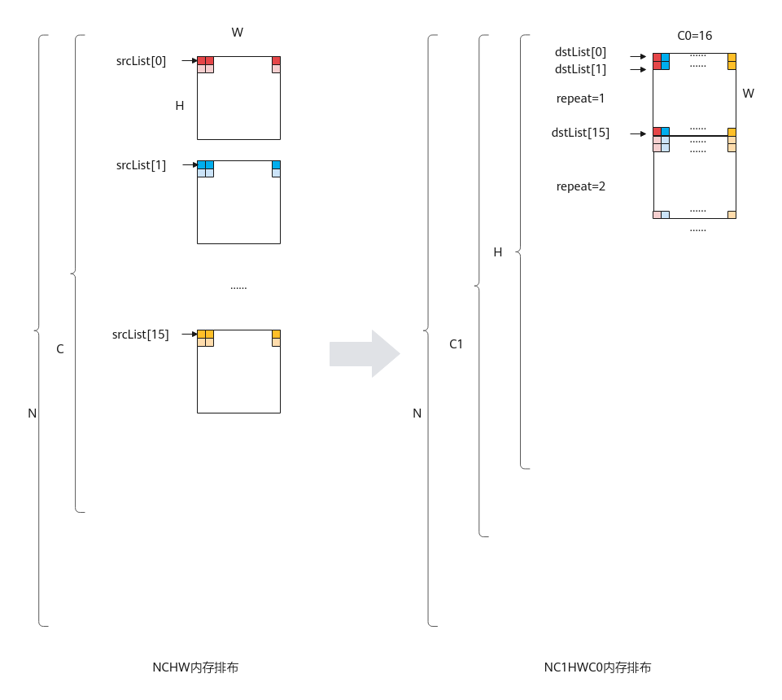

# TransDataTo5HD-数据转换-矢量计算-基础API-Ascend C算子开发接口-API-CANN社区版8.5.0开发文档-昇腾社区

**页面ID:** atlasascendc_api_07_0200
**来源：** https://www.hiascend.com/document/detail/zh/CANNCommunityEdition/850/API/ascendcopapi/atlasascendc_api_07_0200.html
---

# TransDataTo5HD

#### 产品支持情况

| 产品                                        | 是否支持 |
| ------------------------------------------- | -------- |
| Atlas A3 训练系列产品/Atlas A3 推理系列产品 | √        |
| Atlas A2 训练系列产品/Atlas A2 推理系列产品 | √        |
| Atlas 200I/500 A2 推理产品                  | √        |
| Atlas推理系列产品AI Core                    | √        |
| Atlas推理系列产品Vector Core                | x        |
| Atlas训练系列产品                           | √        |

#### 功能说明

数据格式转换，一般用于将NCHW格式转换成NC1HWC0格式。特别的，也可以用于二维矩阵数据块的转置。完成转置功能时，相比于Transpose接口，Transpose仅支持16*16大小的矩阵转置；本接口单次repeat内可处理512Byte的数据（16个datablock），根据数据类型不同，支持不同shape的矩阵转置（比如数据类型为half时，单次repeat可完成16*16大小的矩阵转置），同时还可以支持多次repeat操作。

单次repeat内转换规则如下：

- 当输入数据类型位宽为16位时，每个datablock中包含16个数，指令内部会循环16次，每次循环都会分别从指定的16个datablock中的对应位置取值，组成一个新的datablock单元放入目的地址中。如下图所示，图中的srcList[0]-srcList[15]代表源操作数的16个datablock。图1输入数据类型位宽为16位时的转换规则
- 当数据类型位宽为32位时，每个datablock包含8个数，指令内部会循环8次，每次循环都会分别从指定的16个datablock中的对应位置取值，组成2个新的datablock放入目的地址中。如下图所示：图2输入数据类型位宽为32位时的转换规则
- 当数据类型位宽为8位时，每个datablock包含32个数，指令内部会循环16次，每次循环都会分别从指定的16个datablock中的对应位置取值，组成半个datablock放入目的地址中，读取和存放是在datablock的高半部还是低半部由参数srcHighHalf和dstHighHalf决定。如下图所示：图3输入数据类型位宽为8位时的转换规则

基于以上的转换规则，使用该接口进行NC1HWC0格式转换或者矩阵转置。NC1HWC0格式转换相对复杂，这里给出其具体的转换方法：

NCHW格式转换成NC1HWC0格式时，如果是数据类型的位宽为32位或者16位，则C0=16；如果数据类型的位宽为8位，则C0=32。下图以C0=16为例进行介绍：

#### 函数原型

- dstList与srcList类型为LocalTensor的数组。123// NCHW_CONV_ADDR_LIST_SIZE值为16template<typenameT>__aicore__inlinevoidTransDataTo5HD(constLocalTensor<T>(&dstList)[NCHW_CONV_ADDR_LIST_SIZE],constLocalTensor<T>(&srcList)[NCHW_CONV_ADDR_LIST_SIZE],constTransDataTo5HDParams&nchwconvParams)
- dstList与srcList类型为uint64_t的数组，数组元素对应LocaTensor的地址值，该接口性能更优。开发者可以通过LocalTensor的GetPhyAddr接口获取该地址值。123// NCHW_CONV_ADDR_LIST_SIZE值为16template<typenameT>__aicore__inlinevoidTransDataTo5HD(uint64_tdstList[NCHW_CONV_ADDR_LIST_SIZE],uint64_tsrcList[NCHW_CONV_ADDR_LIST_SIZE],constTransDataTo5HDParams&nchwconvParams)

- dst与src类型为uint64_t的LocalTensor，连续存储对应LocalTensor的地址值。开发者可以通过LocalTensor的GetPhyAddr接口获取该地址值。12template<typenameT>__aicore__inlinevoidTransDataTo5HD(constLocalTensor<uint64_t>&dst,constLocalTensor<uint64_t>&src,constTransDataTo5HDParams&nchwconvParams)

#### 参数说明

| 参数名 | 描述                                                                                                                                                                                                                                                                                                                                                                                                                                                                                                                                                          |
| ------ | ------------------------------------------------------------------------------------------------------------------------------------------------------------------------------------------------------------------------------------------------------------------------------------------------------------------------------------------------------------------------------------------------------------------------------------------------------------------------------------------------------------------------------------------------------------- |
| T      | 操作数数据类型。Atlas A3 训练系列产品/Atlas A3 推理系列产品，支持的数据类型为：int8_t/uint8_t/int16_t/uint16_t/half/int32_t/uint32_t/floatAtlas A2 训练系列产品/Atlas A2 推理系列产品，支持的数据类型为：int8_t/uint8_t/int16_t/uint16_t/half/int32_t/uint32_t/floatAtlas 200I/500 A2 推理产品，支持的数据类型为：int8_t/uint8_t/int16_t/uint16_t/half/int32_t/uint32_t/floatAtlas推理系列产品AI Core，支持的数据类型为：int8_t/uint8_t/int16_t/uint16_t/half/int32_t/uint32_t/floatAtlas训练系列产品，支持的数据类型为：int8_t/uint8_t/int16_t/uint16_t/half |

| 参数名称       | 输入/输出 | 含义                                                                                                                                                                                                                                                                          |
| -------------- | --------- | ----------------------------------------------------------------------------------------------------------------------------------------------------------------------------------------------------------------------------------------------------------------------------- |
| dstList        | 输出      | 目的操作数地址序列。类型为LocalTensor或者LocalTensor的地址值，LocalTensor支持的TPosition为VECIN/VECCALC/VECOUT。LocalTensor的起始地址需要32B对齐。支持的数据类型参考模板参数T说明。                                                                                           |
| srcList        | 输入      | 源操作数地址序列。类型为LocalTensor或者LocalTensor的地址值，LocalTensor支持的TPosition为VECIN/VECCALC/VECOUT。LocalTensor的起始地址需要32B对齐。支持的数据类型参考模板参数T说明。数据类型需要与dstList保持一致。                                                              |
| dst            | 输出      | 目的操作数。类型为LocalTensor，连续存储对应LocalTensor的地址值。LocalTensor支持的TPosition为VECIN/VECCALC/VECOUT。LocalTensor的起始地址需要32B对齐。                                                                                                                          |
| src            | 输入      | 源操作数。类型为LocalTensor，连续存储对应LocalTensor的地址值。LocalTensor支持的TPosition为VECIN/VECCALC/VECOUT。LocalTensor的起始地址需要32B对齐。                                                                                                                            |
| nchwconvParams | 输入      | 控制TransdataTo5HD的数据结构。结构体内包含：读取和写入位置的控制参数，迭代次数，相邻迭代间的地址步长等参数。具体定义请参考${INSTALL_DIR}/include/ascendc/basic_api/interface/kernel_struct_transpose.h，${INSTALL_DIR}请替换为CANN软件安装后文件存储路径。参数说明请参考表3。 |

| 参数名称     | 类型 | 说明                                                                                                                                                                                                                                                                                                                                                                                                                                                                                                         |
| ------------ | ---- | ------------------------------------------------------------------------------------------------------------------------------------------------------------------------------------------------------------------------------------------------------------------------------------------------------------------------------------------------------------------------------------------------------------------------------------------------------------------------------------------------------------ |
| dstHighHalf  | 输入 | 指定每个dstList地址中的数据存储到datablock的高半部还是低半部，该配置只支持int8_t/uint8_t的数据类型。支持的数据类型为bool，有以下两种取值：True：表示存储于datablock的高半部False：表示存储于datablock的低半部                                                                                                                                                                                                                                                                                                |
| srcHighHalf  | 输入 | 指定每个srcList地址中的数据从datablock的高半部还是低半部读取，该配置只支持int8_t/uint8_t的数据类型。支持的数据类型为bool，有以下两种取值：True：表示从datablock的高半部读取False：表示从datablock的低半部读取                                                                                                                                                                                                                                                                                                |
| repeatTimes  | 输入 | 重复迭代次数，repeatTimes∈[0,255]。关于该参数的具体描述请参考高维切分API。注意事项：当repeatTimes为1时，目的操作数/源操作数的有效起始位置为dstList/srcList序列输入的起始位置加上dstRepStride/srcRepStride；repeatTimes为1，如果要让目的操作数/源操作数的有效起始位置为dstList/srcList序列输入的起始位置，需要将dstRepStride/srcRepStride置为0。当repeatTimes大于1时，第一次repeat中目的操作数/源操作数的有效起始位置为dstList/srcList序列输入的起始位置，第二次需要加上dstRepStride/srcRepStride。以此类推。 |
| dstRepStride | 输入 | 相邻迭代间，目的操作数相同datablock地址stride，单位：datablock。相邻迭代间相同datablock的地址步长参数的详细说明请参考repeatStride。                                                                                                                                                                                                                                                                                                                                                                          |
| srcRepStride | 输入 | 相邻迭代间，源操作数相同datablock地址stride，单位：datablock。相邻迭代间相同datablock的地址步长参数的详细说明请参考repeatStride。                                                                                                                                                                                                                                                                                                                                                                            |

#### 约束说明

- 操作数地址对齐要求请参见通用地址对齐约束。
- 操作数地址重叠约束请参考通用地址重叠约束。

- 进行NCHW格式到NC1HWC0格式的转换时，一般用法是将srcList/dstList中的每个元素配置为每个HW平面的起点。
- 为了性能更优，数据类型位宽为8位时建议先固定dstHighHalf、srcHighHalf，在HW方向repeat后，再改变dstHighHalf、srcHighHalf。
- dst与src中的地址需要连续存放，详见调用示例。

#### 返回值说明

无

#### 调用示例

- NCHW格式转换成NC1HWC0格式调用示例，其中输入数据为half类型，输入NCHW格式为(2，32，16，16)，目标格式NC1HWC0为(2，2，16，16，16)。123456789101112131415161718192021222324252627282930313233343536373839404142434445464748495051525354555657585960616263646566676869707172737475767778798081828384858687888990919293949596979899100#include"kernel_operator.h"classKernelTransDataTo5HD{public:__aicore__inlineKernelTransDataTo5HD(){}__aicore__inlinevoidInit(__gm__uint8_t*src,__gm__uint8_t*dstGm){srcGlobal.SetGlobalBuffer((__gm__half*)src);dstGlobal.SetGlobalBuffer((__gm__half*)dstGm);pipe.InitBuffer(inQueueSrc,1,srcDataSize*sizeof(half));pipe.InitBuffer(workQueueSrc1,1,16*sizeof(uint64_t));pipe.InitBuffer(workQueueSrc2,1,16*sizeof(uint64_t));pipe.InitBuffer(outQueueDst,1,dstDataSize*sizeof(half));}__aicore__inlinevoidProcess(){CopyIn();Compute();CopyOut();}private:__aicore__inlinevoidCopyIn(){AscendC:LocalTensor<half>srcLocal=inQueueSrc.AllocTensor<half>();AscendC:DataCopy(srcLocal,srcGlobal,srcDataSize);inQueueSrc.EnQue(srcLocal);}__aicore__inlinevoidCompute(){AscendC:LocalTensor<half>srcLocal=inQueueSrc.DeQue<half>();AscendC:LocalTensor<half>dstLocal=outQueueDst.AllocTensor<half>();AscendC:TransDataTo5HDParamstransDataParams;transDataParams.dstHighHalf=false;transDataParams.srcHighHalf=false;transDataParams.repeatTimes=16;transDataParams.dstRepStride=16;transDataParams.srcRepStride=1;for(intj=0;j<4;j++){// // 入参类型是LocalTensor的调用方式// AscendC:LocalTensor<half> dstLocalList[16];// for (int i = 0; i < 16; i++) {//     dstLocalList[i] = dstLocal[j * c0size * height * width + width * i];// }// AscendC:LocalTensor<half> srcLocalList[16];// for (int i = 0; i < 16; i++) {//     srcLocalList[i] = srcLocal[j * c0size * height * width + height * width * i];// }// AscendC:TransDataTo5HD<half>(dstLocalList, srcLocalList, transDataParams);// 入参类型是LocalTensor地址值的调用方式，推荐使用uint64_tdstLocalList[16];for(inti=0;i<16;i++){dstLocalList[i]=(uint64_t)(dstLocal[j*c0size*height*width+width*i].GetPhyAddr());}uint64_tsrcLocalList[16];for(inti=0;i<16;i++){srcLocalList[i]=(uint64_t)(srcLocal[j*c0size*height*width+height*width*i].GetPhyAddr());}AscendC:TransDataTo5HD<half>(dstLocalList,srcLocalList,transDataParams);// // 入参类型是地址LocalTensor的调用方式// AscendC:LocalTensor<uint64_t> dst = workQueueSrc1.AllocTensor<uint64_t>();// for (int i = 0; i < 16; i++) {//     dst.SetValue(i, (uint64_t)(dstLocal[j * c0size * height * width + width * i].GetPhyAddr()));// }// AscendC:LocalTensor<uint64_t> src = workQueueSrc2.AllocTensor<uint64_t>();// for (int i = 0; i < 16; i++) {//     src.SetValue(i, (uint64_t)(srcLocal[j * c0size * height * width + height * width * i].GetPhyAddr()));// }// AscendC:TransDataTo5HD<half>(dst, src, transDataParams);// workQueueSrc1.FreeTensor(dst);// workQueueSrc2.FreeTensor(src);}outQueueDst.EnQue<half>(dstLocal);inQueueSrc.FreeTensor(srcLocal);}__aicore__inlinevoidCopyOut(){AscendC:LocalTensor<half>dstLocal=outQueueDst.DeQue<half>();AscendC:DataCopy(dstGlobal,dstLocal,dstDataSize);outQueueDst.FreeTensor(dstLocal);}private:AscendC:TPipepipe;AscendC:TQue<AscendC:TPosition:VECIN,1>inQueueSrc;AscendC:TQue<AscendC:TPosition:VECIN,1>workQueueSrc1;AscendC:TQue<AscendC:TPosition:VECIN,1>workQueueSrc2;AscendC:TQue<AscendC:TPosition:VECOUT,1>outQueueDst;AscendC:GlobalTensor<half>srcGlobal,dstGlobal;intsrcDataSize=16384;intdstDataSize=16384;intwidth=16;// Hintheight=16;// Wintc0size=16;// C0};extern"C"__global____aicore__voidvec_transdata5hd_b16_nchw2nc1hwc0(__gm__uint8_t*src,__gm__uint8_t*dstGm){KernelTransDataTo5HDop;op.Init(src,dstGm);op.Process();}输入数据：
[[[[ 0.  0.  0. ...  0.  0.  0.]
   [ 0.  0.  0. ...  0.  0.  0.]
   [ 0.  0.  0. ...  0.  0.  0.]
   ...
   [ 0.  0.  0. ...  0.  0.  0.]
   [ 0.  0.  0. ...  0.  0.  0.]
   [ 0.  0.  0. ...  0.  0.  0.]]

  [[ 1.  1.  1. ...  1.  1.  1.]
   [ 1.  1.  1. ...  1.  1.  1.]
   [ 1.  1.  1. ...  1.  1.  1.]
   ...
   [ 1.  1.  1. ...  1.  1.  1.]
   [ 1.  1.  1. ...  1.  1.  1.]
   [ 1.  1.  1. ...  1.  1.  1.]]

  [[ 2.  2.  2. ...  2.  2.  2.]
   [ 2.  2.  2. ...  2.  2.  2.]
   [ 2.  2.  2. ...  2.  2.  2.]
   ...
   [ 2.  2.  2. ...  2.  2.  2.]
   [ 2.  2.  2. ...  2.  2.  2.]
   [ 2.  2.  2. ...  2.  2.  2.]]

  ...

  [[29. 29. 29. ... 29. 29. 29.]
   [29. 29. 29. ... 29. 29. 29.]
   [29. 29. 29. ... 29. 29. 29.]
   ...
   [29. 29. 29. ... 29. 29. 29.]
   [29. 29. 29. ... 29. 29. 29.]
   [29. 29. 29. ... 29. 29. 29.]]

  [[30. 30. 30. ... 30. 30. 30.]
   [30. 30. 30. ... 30. 30. 30.]
   [30. 30. 30. ... 30. 30. 30.]
   ...
   [30. 30. 30. ... 30. 30. 30.]
   [30. 30. 30. ... 30. 30. 30.]
   [30. 30. 30. ... 30. 30. 30.]]

  [[31. 31. 31. ... 31. 31. 31.]
   [31. 31. 31. ... 31. 31. 31.]
   [31. 31. 31. ... 31. 31. 31.]
   ...
   [31. 31. 31. ... 31. 31. 31.]
   [31. 31. 31. ... 31. 31. 31.]
   [31. 31. 31. ... 31. 31. 31.]]]

 [[[32. 32. 32. ... 32. 32. 32.]
   [32. 32. 32. ... 32. 32. 32.]
   [32. 32. 32. ... 32. 32. 32.]
   ...
   [32. 32. 32. ... 32. 32. 32.]
   [32. 32. 32. ... 32. 32. 32.]
   [32. 32. 32. ... 32. 32. 32.]]

  [[33. 33. 33. ... 33. 33. 33.]
   [33. 33. 33. ... 33. 33. 33.]
   [33. 33. 33. ... 33. 33. 33.]
   ...
   [33. 33. 33. ... 33. 33. 33.]
   [33. 33. 33. ... 33. 33. 33.]
   [33. 33. 33. ... 33. 33. 33.]]

  [[34. 34. 34. ... 34. 34. 34.]
   [34. 34. 34. ... 34. 34. 34.]
   [34. 34. 34. ... 34. 34. 34.]
   ...
   [34. 34. 34. ... 34. 34. 34.]
   [34. 34. 34. ... 34. 34. 34.]
   [34. 34. 34. ... 34. 34. 34.]]

  ...

  [[61. 61. 61. ... 61. 61. 61.]
   [61. 61. 61. ... 61. 61. 61.]
   [61. 61. 61. ... 61. 61. 61.]
   ...
   [61. 61. 61. ... 61. 61. 61.]
   [61. 61. 61. ... 61. 61. 61.]
   [61. 61. 61. ... 61. 61. 61.]]

  [[62. 62. 62. ... 62. 62. 62.]
   [62. 62. 62. ... 62. 62. 62.]
   [62. 62. 62. ... 62. 62. 62.]
   ...
   [62. 62. 62. ... 62. 62. 62.]
   [62. 62. 62. ... 62. 62. 62.]
   [62. 62. 62. ... 62. 62. 62.]]

  [[63. 63. 63. ... 63. 63. 63.]
   [63. 63. 63. ... 63. 63. 63.]
   [63. 63. 63. ... 63. 63. 63.]
   ...
   [63. 63. 63. ... 63. 63. 63.]
   [63. 63. 63. ... 63. 63. 63.]
   [63. 63. 63. ... 63. 63. 63.]]]]
输出数据：
[[[[[ 0.  1.  2. ... 13. 14. 15.]
    [ 0.  1.  2. ... 13. 14. 15.]
    [ 0.  1.  2. ... 13. 14. 15.]
    ...
    [ 0.  1.  2. ... 13. 14. 15.]
    [ 0.  1.  2. ... 13. 14. 15.]
    [ 0.  1.  2. ... 13. 14. 15.]]

   [[ 0.  1.  2. ... 13. 14. 15.]
    [ 0.  1.  2. ... 13. 14. 15.]
    [ 0.  1.  2. ... 13. 14. 15.]
    ...
    [ 0.  1.  2. ... 13. 14. 15.]
    [ 0.  1.  2. ... 13. 14. 15.]
    [ 0.  1.  2. ... 13. 14. 15.]]

   [[ 0.  1.  2. ... 13. 14. 15.]
    [ 0.  1.  2. ... 13. 14. 15.]
    [ 0.  1.  2. ... 13. 14. 15.]
    ...
    [ 0.  1.  2. ... 13. 14. 15.]
    [ 0.  1.  2. ... 13. 14. 15.]
    [ 0.  1.  2. ... 13. 14. 15.]]

   ...

   [[ 0.  1.  2. ... 13. 14. 15.]
    [ 0.  1.  2. ... 13. 14. 15.]
    [ 0.  1.  2. ... 13. 14. 15.]
    ...
    [ 0.  1.  2. ... 13. 14. 15.]
    [ 0.  1.  2. ... 13. 14. 15.]
    [ 0.  1.  2. ... 13. 14. 15.]]

   [[ 0.  1.  2. ... 13. 14. 15.]
    [ 0.  1.  2. ... 13. 14. 15.]
    [ 0.  1.  2. ... 13. 14. 15.]
    ...
    [ 0.  1.  2. ... 13. 14. 15.]
    [ 0.  1.  2. ... 13. 14. 15.]
    [ 0.  1.  2. ... 13. 14. 15.]]

   [[ 0.  1.  2. ... 13. 14. 15.]
    [ 0.  1.  2. ... 13. 14. 15.]
    [ 0.  1.  2. ... 13. 14. 15.]
    ...
    [ 0.  1.  2. ... 13. 14. 15.]
    [ 0.  1.  2. ... 13. 14. 15.]
    [ 0.  1.  2. ... 13. 14. 15.]]]

  [[[16. 17. 18. ... 29. 30. 31.]
    [16. 17. 18. ... 29. 30. 31.]
    [16. 17. 18. ... 29. 30. 31.]
    ...
    [16. 17. 18. ... 29. 30. 31.]
    [16. 17. 18. ... 29. 30. 31.]
    [16. 17. 18. ... 29. 30. 31.]]

   [[16. 17. 18. ... 29. 30. 31.]
    [16. 17. 18. ... 29. 30. 31.]
    [16. 17. 18. ... 29. 30. 31.]
    ...
    [16. 17. 18. ... 29. 30. 31.]
    [16. 17. 18. ... 29. 30. 31.]
    [16. 17. 18. ... 29. 30. 31.]]

   [[16. 17. 18. ... 29. 30. 31.]
    [16. 17. 18. ... 29. 30. 31.]
    [16. 17. 18. ... 29. 30. 31.]
    ...
    [16. 17. 18. ... 29. 30. 31.]
    [16. 17. 18. ... 29. 30. 31.]
    [16. 17. 18. ... 29. 30. 31.]]

   ...

   [[16. 17. 18. ... 29. 30. 31.]
    [16. 17. 18. ... 29. 30. 31.]
    [16. 17. 18. ... 29. 30. 31.]
    ...
    [16. 17. 18. ... 29. 30. 31.]
    [16. 17. 18. ... 29. 30. 31.]
    [16. 17. 18. ... 29. 30. 31.]]

   [[16. 17. 18. ... 29. 30. 31.]
    [16. 17. 18. ... 29. 30. 31.]
    [16. 17. 18. ... 29. 30. 31.]
    ...
    [16. 17. 18. ... 29. 30. 31.]
    [16. 17. 18. ... 29. 30. 31.]
    [16. 17. 18. ... 29. 30. 31.]]

   [[16. 17. 18. ... 29. 30. 31.]
    [16. 17. 18. ... 29. 30. 31.]
    [16. 17. 18. ... 29. 30. 31.]
    ...
    [16. 17. 18. ... 29. 30. 31.]
    [16. 17. 18. ... 29. 30. 31.]
    [16. 17. 18. ... 29. 30. 31.]]]]

 [[[[32. 33. 34. ... 45. 46. 47.]
    [32. 33. 34. ... 45. 46. 47.]
    [32. 33. 34. ... 45. 46. 47.]
    ...
    [32. 33. 34. ... 45. 46. 47.]
    [32. 33. 34. ... 45. 46. 47.]
    [32. 33. 34. ... 45. 46. 47.]]

   [[32. 33. 34. ... 45. 46. 47.]
    [32. 33. 34. ... 45. 46. 47.]
    [32. 33. 34. ... 45. 46. 47.]
    ...
    [32. 33. 34. ... 45. 46. 47.]
    [32. 33. 34. ... 45. 46. 47.]
    [32. 33. 34. ... 45. 46. 47.]]

   [[32. 33. 34. ... 45. 46. 47.]
    [32. 33. 34. ... 45. 46. 47.]
    [32. 33. 34. ... 45. 46. 47.]
    ...
    [32. 33. 34. ... 45. 46. 47.]
    [32. 33. 34. ... 45. 46. 47.]
    [32. 33. 34. ... 45. 46. 47.]]

   ...

   [[32. 33. 34. ... 45. 46. 47.]
    [32. 33. 34. ... 45. 46. 47.]
    [32. 33. 34. ... 45. 46. 47.]
    ...
    [32. 33. 34. ... 45. 46. 47.]
    [32. 33. 34. ... 45. 46. 47.]
    [32. 33. 34. ... 45. 46. 47.]]

   [[32. 33. 34. ... 45. 46. 47.]
    [32. 33. 34. ... 45. 46. 47.]
    [32. 33. 34. ... 45. 46. 47.]
    ...
    [32. 33. 34. ... 45. 46. 47.]
    [32. 33. 34. ... 45. 46. 47.]
    [32. 33. 34. ... 45. 46. 47.]]

   [[32. 33. 34. ... 45. 46. 47.]
    [32. 33. 34. ... 45. 46. 47.]
    [32. 33. 34. ... 45. 46. 47.]
    ...
    [32. 33. 34. ... 45. 46. 47.]
    [32. 33. 34. ... 45. 46. 47.]
    [32. 33. 34. ... 45. 46. 47.]]]

  [[[48. 49. 50. ... 61. 62. 63.]
    [48. 49. 50. ... 61. 62. 63.]
    [48. 49. 50. ... 61. 62. 63.]
    ...
    [48. 49. 50. ... 61. 62. 63.]
    [48. 49. 50. ... 61. 62. 63.]
    [48. 49. 50. ... 61. 62. 63.]]

   [[48. 49. 50. ... 61. 62. 63.]
    [48. 49. 50. ... 61. 62. 63.]
    [48. 49. 50. ... 61. 62. 63.]
    ...
    [48. 49. 50. ... 61. 62. 63.]
    [48. 49. 50. ... 61. 62. 63.]
    [48. 49. 50. ... 61. 62. 63.]]

   [[48. 49. 50. ... 61. 62. 63.]
    [48. 49. 50. ... 61. 62. 63.]
    [48. 49. 50. ... 61. 62. 63.]
    ...
    [48. 49. 50. ... 61. 62. 63.]
    [48. 49. 50. ... 61. 62. 63.]
    [48. 49. 50. ... 61. 62. 63.]]

   ...

   [[48. 49. 50. ... 61. 62. 63.]
    [48. 49. 50. ... 61. 62. 63.]
    [48. 49. 50. ... 61. 62. 63.]
    ...
    [48. 49. 50. ... 61. 62. 63.]
    [48. 49. 50. ... 61. 62. 63.]
    [48. 49. 50. ... 61. 62. 63.]]

   [[48. 49. 50. ... 61. 62. 63.]
    [48. 49. 50. ... 61. 62. 63.]
    [48. 49. 50. ... 61. 62. 63.]
    ...
    [48. 49. 50. ... 61. 62. 63.]
    [48. 49. 50. ... 61. 62. 63.]
    [48. 49. 50. ... 61. 62. 63.]]

   [[48. 49. 50. ... 61. 62. 63.]
    [48. 49. 50. ... 61. 62. 63.]
    [48. 49. 50. ... 61. 62. 63.]
    ...
    [48. 49. 50. ... 61. 62. 63.]
    [48. 49. 50. ... 61. 62. 63.]
    [48. 49. 50. ... 61. 62. 63.]]]]]

- 用于二维矩阵数据块的转置的int8_t（8bit位）调用示例。123456789101112131415161718192021222324252627282930313233343536373839404142434445464748495051525354555657585960616263646566676869707172737475767778798081828384858687888990919293949596979899100101#include"kernel_operator.h"classKernelTransDataTo5HD{public:__aicore__inlineKernelTransDataTo5HD(){}__aicore__inlinevoidInit(__gm__uint8_t*src,__gm__uint8_t*dstGm){srcGlobal.SetGlobalBuffer((__gm__int8_t*)src);dstGlobal.SetGlobalBuffer((__gm__int8_t*)dstGm);pipe.InitBuffer(inQueueSrc,1,srcDataSize*sizeof(int8_t));pipe.InitBuffer(workQueueSrc1,1,16*sizeof(uint64_t));pipe.InitBuffer(workQueueSrc2,1,16*sizeof(uint64_t));pipe.InitBuffer(outQueueDst,1,dstDataSize*sizeof(int8_t));}__aicore__inlinevoidProcess(){CopyIn();Compute();CopyOut();}private:__aicore__inlinevoidCopyIn(){AscendC:LocalTensor<int8_t>srcLocal=inQueueSrc.AllocTensor<int8_t>();AscendC:DataCopy(srcLocal,srcGlobal,srcDataSize);inQueueSrc.EnQue(srcLocal);}__aicore__inlinevoidCompute(){AscendC:LocalTensor<int8_t>srcLocal=inQueueSrc.DeQue<int8_t>();AscendC:LocalTensor<int8_t>dstLocal=outQueueDst.AllocTensor<int8_t>();for(inti=0;i<dstDataSize;i++){dstLocal.SetValue(i,0);}AscendC:TransDataTo5HDParamstransDataParams;// 写入dstLocalList的高半位transDataParams.dstHighHalf=1;// 从srcLocalList的高半位读取数据transDataParams.srcHighHalf=1;transDataParams.repeatTimes=1;transDataParams.dstRepStride=0;transDataParams.srcRepStride=0;// 入参类型是LocalTensor的调用方式AscendC:LocalTensor<int8_t>dstLocalList[16];for(inti=0;i<16;i++){dstLocalList[i]=dstLocal[width*i];}AscendC:LocalTensor<int8_t>srcLocalList[16];for(inti=0;i<16;i++){srcLocalList[i]=srcLocal[width*i];}AscendC:TransDataTo5HD(dstLocalList,srcLocalList,transDataParams);// // 入参类型是LocalTensor地址值的调用方式// uint64_t dstLocalList[16];// for (int i = 0; i < 16; i++) {//    dstLocalList[i] = (uint64_t)(dstLocal[width * i].GetPhyAddr());// }// uint64_t srcLocalList[16];// for (int i = 0; i < 16; i++) {//    srcLocalList[i] = (uint64_t)(srcLocal[width * i].GetPhyAddr());// }// AscendC:TransDataTo5HD<int8_t>(dstLocalList, srcLocalList, transDataParams);// // 入参类型是地址LocalTensor的调用方式// AscendC:LocalTensor<uint64_t> dst = workQueueSrc1.AllocTensor<uint64_t>();// for (int i = 0; i < 16; i++) {//     dst.SetValue(i, (uint64_t)(dstLocal[width * i].GetPhyAddr()));// }// AscendC:LocalTensor<uint64_t> src = workQueueSrc2.AllocTensor<uint64_t>();// for (int i = 0; i < 16; i++) {//     src.SetValue(i, (uint64_t)(srcLocal[width * i].GetPhyAddr()));// }// AscendC:TransDataTo5HD<int8_t>(dst, src, transDataParams);// workQueueSrc1.FreeTensor(dst);// workQueueSrc2.FreeTensor(src);outQueueDst.EnQue<int8_t>(dstLocal);inQueueSrc.FreeTensor(srcLocal);}__aicore__inlinevoidCopyOut(){AscendC:LocalTensor<int8_t>dstLocal=outQueueDst.DeQue<int8_t>();AscendC:DataCopy(dstGlobal,dstLocal,dstDataSize);outQueueDst.FreeTensor(dstLocal);}private:AscendC:TPipepipe;AscendC:TQue<AscendC:TPosition:VECIN,1>inQueueSrc;AscendC:TQue<AscendC:TPosition:VECIN,1>workQueueSrc1;AscendC:TQue<AscendC:TPosition:VECIN,1>workQueueSrc2;AscendC:TQue<AscendC:TPosition:VECOUT,1>outQueueDst;AscendC:GlobalTensor<int8_t>srcGlobal,dstGlobal;intsrcDataSize=512;intdstDataSize=512;intwidth=32;};extern"C"__global____aicore__voidtransdata5hd_simple_kernel(__gm__uint8_t*src,__gm__uint8_t*dstGm){KernelTransDataTo5HDop;op.Init(src,dstGm);op.Process();}输入数据：
[[  0   1   2   3   4   5   6   7   8   9  10  11  12  13  14  15  16  17
   18  19  20  21  22  23  24  25  26  27  28  29  30  31]
 [ 32  33  34  35  36  37  38  39  40  41  42  43  44  45  46  47  48  49
   50  51  52  53  54  55  56  57  58  59  60  61  62  63]
 [ 64  65  66  67  68  69  70  71  72  73  74  75  76  77  78  79  80  81
   82  83  84  85  86  87  88  89  90  91  92  93  94  95]
 [ 96  97  98  99 100 101 102 103 104 105 106 107 108 109 110 111 112 113
  114 115 116 117 118 119 120 121 122 123 124 125 126 127]
 [  0   1   2   3   4   5   6   7   8   9  10  11  12  13  14  15  16  17
   18  19  20  21  22  23  24  25  26  27  28  29  30  31]
 [ 32  33  34  35  36  37  38  39  40  41  42  43  44  45  46  47  48  49
   50  51  52  53  54  55  56  57  58  59  60  61  62  63]
 [ 64  65  66  67  68  69  70  71  72  73  74  75  76  77  78  79  80  81
   82  83  84  85  86  87  88  89  90  91  92  93  94  95]
 [ 96  97  98  99 100 101 102 103 104 105 106 107 108 109 110 111 112 113
  114 115 116 117 118 119 120 121 122 123 124 125 126 127]
 [  0   1   2   3   4   5   6   7   8   9  10  11  12  13  14  15  16  17
   18  19  20  21  22  23  24  25  26  27  28  29  30  31]
 [ 32  33  34  35  36  37  38  39  40  41  42  43  44  45  46  47  48  49
   50  51  52  53  54  55  56  57  58  59  60  61  62  63]
 [ 64  65  66  67  68  69  70  71  72  73  74  75  76  77  78  79  80  81
   82  83  84  85  86  87  88  89  90  91  92  93  94  95]
 [ 96  97  98  99 100 101 102 103 104 105 106 107 108 109 110 111 112 113
  114 115 116 117 118 119 120 121 122 123 124 125 126 127]
 [  0   1   2   3   4   5   6   7   8   9  10  11  12  13  14  15  16  17
   18  19  20  21  22  23  24  25  26  27  28  29  30  31]
 [ 32  33  34  35  36  37  38  39  40  41  42  43  44  45  46  47  48  49
   50  51  52  53  54  55  56  57  58  59  60  61  62  63]
 [ 64  65  66  67  68  69  70  71  72  73  74  75  76  77  78  79  80  81
   82  83  84  85  86  87  88  89  90  91  92  93  94  95]
 [ 96  97  98  99 100 101 102 103 104 105 106 107 108 109 110 111 112 113
  114 115 116 117 118 119 120 121 122 123 124 125 126 127]]
输出数据：
// 从输入数据的高半位读取数据，写入输出数据的高半位
[[0 0 0 0 0 0 0 0 0 0 0 0 0 0 0 0 16 48 80 112 16 48 80 112 16 48 80 112 16 48 80 112 ]
[0 0 0 0 0 0 0 0 0 0 0 0 0 0 0 0 17 49 81 113 17 49 81 113 17 49 81 113 17 49 81 113 ]
[0 0 0 0 0 0 0 0 0 0 0 0 0 0 0 0 18 50 82 114 18 50 82 114 18 50 82 114 18 50 82 114 ]
[0 0 0 0 0 0 0 0 0 0 0 0 0 0 0 0 19 51 83 115 19 51 83 115 19 51 83 115 19 51 83 115 ]
[0 0 0 0 0 0 0 0 0 0 0 0 0 0 0 0 20 52 84 116 20 52 84 116 20 52 84 116 20 52 84 116 ]
[0 0 0 0 0 0 0 0 0 0 0 0 0 0 0 0 21 53 85 117 21 53 85 117 21 53 85 117 21 53 85 117 ]
[0 0 0 0 0 0 0 0 0 0 0 0 0 0 0 0 22 54 86 118 22 54 86 118 22 54 86 118 22 54 86 118 ]
[0 0 0 0 0 0 0 0 0 0 0 0 0 0 0 0 23 55 87 119 23 55 87 119 23 55 87 119 23 55 87 119 ]
[0 0 0 0 0 0 0 0 0 0 0 0 0 0 0 0 24 56 88 120 24 56 88 120 24 56 88 120 24 56 88 120 ]
[0 0 0 0 0 0 0 0 0 0 0 0 0 0 0 0 25 57 89 121 25 57 89 121 25 57 89 121 25 57 89 121 ]
[0 0 0 0 0 0 0 0 0 0 0 0 0 0 0 0 26 58 90 122 26 58 90 122 26 58 90 122 26 58 90 122 ]
[0 0 0 0 0 0 0 0 0 0 0 0 0 0 0 0 27 59 91 123 27 59 91 123 27 59 91 123 27 59 91 123 ]
[0 0 0 0 0 0 0 0 0 0 0 0 0 0 0 0 28 60 92 124 28 60 92 124 28 60 92 124 28 60 92 124 ]
[0 0 0 0 0 0 0 0 0 0 0 0 0 0 0 0 29 61 93 125 29 61 93 125 29 61 93 125 29 61 93 125 ]
[0 0 0 0 0 0 0 0 0 0 0 0 0 0 0 0 30 62 94 126 30 62 94 126 30 62 94 126 30 62 94 126 ]
[0 0 0 0 0 0 0 0 0 0 0 0 0 0 0 0 31 63 95 127 31 63 95 127 31 63 95 127 31 63 95 127 ]]
- 用于二维矩阵数据块的转置的half（16bit位）调用示例。123456789101112131415161718192021222324252627282930313233343536373839404142434445464748495051525354555657585960616263646566676869707172737475767778798081828384858687888990919293949596#include"kernel_operator.h"classKernelTransDataTo5HD{public:__aicore__inlineKernelTransDataTo5HD(){}__aicore__inlinevoidInit(__gm__uint8_t*src,__gm__uint8_t*dstGm){srcGlobal.SetGlobalBuffer((__gm__half*)src);dstGlobal.SetGlobalBuffer((__gm__half*)dstGm);pipe.InitBuffer(inQueueSrc,1,srcDataSize*sizeof(half));pipe.InitBuffer(workQueueSrc1,1,16*sizeof(uint64_t));pipe.InitBuffer(workQueueSrc2,1,16*sizeof(uint64_t));pipe.InitBuffer(outQueueDst,1,dstDataSize*sizeof(half));}__aicore__inlinevoidProcess(){CopyIn();Compute();CopyOut();}private:__aicore__inlinevoidCopyIn(){AscendC:LocalTensor<half>srcLocal=inQueueSrc.AllocTensor<half>();AscendC:DataCopy(srcLocal,srcGlobal,srcDataSize);inQueueSrc.EnQue(srcLocal);}__aicore__inlinevoidCompute(){AscendC:LocalTensor<half>srcLocal=inQueueSrc.DeQue<half>();AscendC:LocalTensor<half>dstLocal=outQueueDst.AllocTensor<half>();AscendC:TransDataTo5HDParamstransDataParams;transDataParams.dstHighHalf=false;transDataParams.srcHighHalf=false;transDataParams.repeatTimes=1;transDataParams.dstRepStride=0;transDataParams.srcRepStride=0;// 入参类型是LocalTensor的调用方式AscendC:LocalTensor<half>dstLocalList[16];for(inti=0;i<16;i++){dstLocalList[i]=dstLocal[width*i];}AscendC:LocalTensor<half>srcLocalList[16];for(inti=0;i<16;i++){srcLocalList[i]=srcLocal[width*i];}AscendC:TransDataTo5HD(dstLocalList,srcLocalList,transDataParams);// // 入参类型是LocalTensor地址值的调用方式// uint64_t dstLocalList[16];// for (int i = 0; i < 16; i++) {//    dstLocalList[i] = (uint64_t)(dstLocal[width * i].GetPhyAddr());// }// uint64_t srcLocalList[16];// for (int i = 0; i < 16; i++) {//    srcLocalList[i] = (uint64_t)(srcLocal[width * i].GetPhyAddr());// }// AscendC:TransDataTo5HD<half>(dstLocalList, srcLocalList, transDataParams);// // 入参类型是地址LocalTensor的调用方式// AscendC:LocalTensor<uint64_t> dst = workQueueSrc1.AllocTensor<uint64_t>();// for (int i = 0; i < 16; i++) {//     dst.SetValue(i, (uint64_t)(dstLocal[width * i].GetPhyAddr()));// }// AscendC:LocalTensor<uint64_t> src = workQueueSrc2.AllocTensor<uint64_t>();// for (int i = 0; i < 16; i++) {//     src.SetValue(i, (uint64_t)(srcLocal[width * i].GetPhyAddr()));// }// AscendC:TransDataTo5HD<half>(dst, src, transDataParams);// workQueueSrc1.FreeTensor(dst);// workQueueSrc2.FreeTensor(src);outQueueDst.EnQue<half>(dstLocal);inQueueSrc.FreeTensor(srcLocal);}__aicore__inlinevoidCopyOut(){AscendC:LocalTensor<half>dstLocal=outQueueDst.DeQue<half>();AscendC:DataCopy(dstGlobal,dstLocal,dstDataSize);outQueueDst.FreeTensor(dstLocal);}private:AscendC:TPipepipe;AscendC:TQue<AscendC:TPosition:VECIN,1>inQueueSrc;AscendC:TQue<AscendC:TPosition:VECIN,1>workQueueSrc1;AscendC:TQue<AscendC:TPosition:VECIN,1>workQueueSrc2;AscendC:TQue<AscendC:TPosition:VECOUT,1>outQueueDst;AscendC:GlobalTensor<half>srcGlobal,dstGlobal;intsrcDataSize=256;intdstDataSize=256;intwidth=16;};extern"C"__global____aicore__voidnchwconv_demo_first(__gm__uint8_t*src,__gm__uint8_t*dstGm){KernelTransDataTo5HDop;op.Init(src,dstGm);op.Process();}输入数据(src):
[[  0.   1.   2.   3.   4.   5.   6.   7.   8.   9.  10.  11.  12.  13.
14.  15.]
 [ 16.  17.  18.  19.  20.  21.  22.  23.  24.  25.  26.  27.  28.  29.
30.  31.]
 [ 32.  33.  34.  35.  36.  37.  38.  39.  40.  41.  42.  43.  44.  45.
46.  47.]
 [ 48.  49.  50.  51.  52.  53.  54.  55.  56.  57.  58.  59.  60.  61.
62.  63.]
 [ 64.  65.  66.  67.  68.  69.  70.  71.  72.  73.  74.  75.  76.  77.
78.  79.]
 [ 80.  81.  82.  83.  84.  85.  86.  87.  88.  89.  90.  91.  92.  93.
94.  95.]
 [ 96.  97.  98.  99. 100. 101. 102. 103. 104. 105. 106. 107. 108. 109.
110. 111.]
 [112. 113. 114. 115. 116. 117. 118. 119. 120. 121. 122. 123. 124. 125.
126. 127.]
 [128. 129. 130. 131. 132. 133. 134. 135. 136. 137. 138. 139. 140. 141.
142. 143.]
 [144. 145. 146. 147. 148. 149. 150. 151. 152. 153. 154. 155. 156. 157.
158. 159.]
 [160. 161. 162. 163. 164. 165. 166. 167. 168. 169. 170. 171. 172. 173.
174. 175.]
 [176. 177. 178. 179. 180. 181. 182. 183. 184. 185. 186. 187. 188. 189.
190. 191.]
 [192. 193. 194. 195. 196. 197. 198. 199. 200. 201. 202. 203. 204. 205.
206. 207.]
 [208. 209. 210. 211. 212. 213. 214. 215. 216. 217. 218. 219. 220. 221.
222. 223.]
 [224. 225. 226. 227. 228. 229. 230. 231. 232. 233. 234. 235. 236. 237.
238. 239.]
 [240. 241. 242. 243. 244. 245. 246. 247. 248. 249. 250. 251. 252. 253.
254. 255.]]

输出数据(dstGm):
[[  0.  16.  32.  48.  64.  80.  96. 112. 128. 144. 160. 176. 192. 208.
224. 240.]
 [  1.  17.  33.  49.  65.  81.  97. 113. 129. 145. 161. 177. 193. 209.
225. 241.]
 [  2.  18.  34.  50.  66.  82.  98. 114. 130. 146. 162. 178. 194. 210.
226. 242.]
 [  3.  19.  35.  51.  67.  83.  99. 115. 131. 147. 163. 179. 195. 211.
227. 243.]
 [  4.  20.  36.  52.  68.  84. 100. 116. 132. 148. 164. 180. 196. 212.
228. 244.]
 [  5.  21.  37.  53.  69.  85. 101. 117. 133. 149. 165. 181. 197. 213.
229. 245.]
 [  6.  22.  38.  54.  70.  86. 102. 118. 134. 150. 166. 182. 198. 214.
230. 246.]
 [  7.  23.  39.  55.  71.  87. 103. 119. 135. 151. 167. 183. 199. 215.
231. 247.]
 [  8.  24.  40.  56.  72.  88. 104. 120. 136. 152. 168. 184. 200. 216.
232. 248.]
 [  9.  25.  41.  57.  73.  89. 105. 121. 137. 153. 169. 185. 201. 217.
233. 249.]
 [ 10.  26.  42.  58.  74.  90. 106. 122. 138. 154. 170. 186. 202. 218.
234. 250.]
 [ 11.  27.  43.  59.  75.  91. 107. 123. 139. 155. 171. 187. 203. 219.
235. 251.]
 [ 12.  28.  44.  60.  76.  92. 108. 124. 140. 156. 172. 188. 204. 220.
236. 252.]
 [ 13.  29.  45.  61.  77.  93. 109. 125. 141. 157. 173. 189. 205. 221.
237. 253.]
 [ 14.  30.  46.  62.  78.  94. 110. 126. 142. 158. 174. 190. 206. 222.
238. 254.]
 [ 15.  31.  47.  63.  79.  95. 111. 127. 143. 159. 175. 191. 207. 223.
239. 255.]]

- 用于二维矩阵数据块的转置的int32_t（32bit位）调用示例。123456789101112131415161718192021222324252627282930313233343536373839404142434445464748495051525354555657585960616263646566676869707172737475767778798081828384858687888990919293949596#include"kernel_operator.h"classKernelTransDataTo5HD{public:__aicore__inlineKernelTransDataTo5HD(){}__aicore__inlinevoidInit(__gm__uint8_t*src,__gm__uint8_t*dstGm){srcGlobal.SetGlobalBuffer((__gm__int32_t*)src);dstGlobal.SetGlobalBuffer((__gm__int32_t*)dstGm);pipe.InitBuffer(inQueueSrc,1,srcDataSize*sizeof(int32_t));pipe.InitBuffer(workQueueSrc1,1,16*sizeof(uint64_t));pipe.InitBuffer(workQueueSrc2,1,16*sizeof(uint64_t));pipe.InitBuffer(outQueueDst,1,dstDataSize*sizeof(int32_t));}__aicore__inlinevoidProcess(){CopyIn();Compute();CopyOut();}private:__aicore__inlinevoidCopyIn(){AscendC:LocalTensor<int32_t>srcLocal=inQueueSrc.AllocTensor<int32_t>();AscendC:DataCopy(srcLocal,srcGlobal,srcDataSize);inQueueSrc.EnQue(srcLocal);}__aicore__inlinevoidCompute(){AscendC:LocalTensor<int32_t>srcLocal=inQueueSrc.DeQue<int32_t>();AscendC:LocalTensor<int32_t>dstLocal=outQueueDst.AllocTensor<int32_t>();AscendC:TransDataTo5HDParamstransDataParams;transDataParams.dstHighHalf=false;transDataParams.srcHighHalf=false;transDataParams.repeatTimes=1;transDataParams.dstRepStride=0;transDataParams.srcRepStride=0;// 入参类型是LocalTensor的调用方式AscendC:LocalTensor<int32_t>dstLocalList[16];for(inti=0;i<16;i++){dstLocalList[i]=dstLocal[width*i];}AscendC:LocalTensor<int32_t>srcLocalList[16];for(inti=0;i<16;i++){srcLocalList[i]=srcLocal[width*i];}AscendC:TransDataTo5HD(dstLocalList,srcLocalList,transDataParams);// // 入参类型是LocalTensor地址值的调用方式// uint64_t dstLocalList[16];// for (int i = 0; i < 16; i++) {//    dstLocalList[i] = (uint64_t)(dstLocal[width * i].GetPhyAddr());// }// uint64_t srcLocalList[16];// for (int i = 0; i < 16; i++) {//    srcLocalList[i] = (uint64_t)(srcLocal[width * i].GetPhyAddr());// }// AscendC:TransDataTo5HD<int32_t>(dstLocalList, srcLocalList, transDataParams);// // 入参类型是地址LocalTensor的调用方式// AscendC:LocalTensor<uint64_t> dst = workQueueSrc1.AllocTensor<uint64_t>();// for (int i = 0; i < 16; i++) {//     dst.SetValue(i, (uint64_t)(dstLocal[width * i].GetPhyAddr()));// }// AscendC:LocalTensor<uint64_t> src = workQueueSrc2.AllocTensor<uint64_t>();// for (int i = 0; i < 16; i++) {//     src.SetValue(i, (uint64_t)(srcLocal[width * i].GetPhyAddr()));// }// AscendC:TransDataTo5HD<int32_t>(dst, src, transDataParams);// workQueueSrc1.FreeTensor(dst);// workQueueSrc2.FreeTensor(src);outQueueDst.EnQue<int32_t>(dstLocal);inQueueSrc.FreeTensor(srcLocal);}__aicore__inlinevoidCopyOut(){AscendC:LocalTensor<int32_t>dstLocal=outQueueDst.DeQue<int32_t>();AscendC:DataCopy(dstGlobal,dstLocal,dstDataSize);outQueueDst.FreeTensor(dstLocal);}private:AscendC:TPipepipe;AscendC:TQue<AscendC:TPosition:VECIN,1>inQueueSrc;AscendC:TQue<AscendC:TPosition:VECIN,1>workQueueSrc1;AscendC:TQue<AscendC:TPosition:VECIN,1>workQueueSrc2;AscendC:TQue<AscendC:TPosition:VECOUT,1>outQueueDst;AscendC:GlobalTensor<int32_t>srcGlobal,dstGlobal;intsrcDataSize=128;intdstDataSize=128;intwidth=8;};extern"C"__global____aicore__voidtrans5hd_simple_kernel(__gm__uint8_t*src,__gm__uint8_t*dstGm){KernelTransDataTo5HDop;op.Init(src,dstGm);op.Process();}输入数据(src)：
[  0   1   2   3   4   5   6   7  
   8   9  10  11  12  13  14  15  
  16  17  18  19  20  21  22  23
  24  25  26  27  28  29  30  31 
  32  33  34  35  36  37  38  39
  40  41  42  43  44  45  46  47  
  48  49  50  51  52  53  54  55
  56  57  58  59  60  61  62  63
  64  65  66  67  68  69  70  71
  72  73  74  75  76  77  78  79  
  80  81  82  83  84  85  86  87
  88  89  90  91  92  93  94  95  
  96  97  98  99  100 101 102 103
  104 105 106 107 108 109 110 111 
  112 113 114 115 116 117 118 119
  120 121 122 123 124 125  126 127]
输出数据(dstGm)：
 [0 8 16 24 32 40 48 56 64 72 80 88 96 104 112 120
  1 9 17 25 33 41 49 57 65 73 81 89 97 105 113 121 
  2 10 18 26 34 42 50 58 66 74 82 90 98 106 114 122 
  3 11 19 27 35 43 51 59 67 75 83 91 99 107 115 123 
  4 12 20 28 36 44 52 60 68 76 84 92 100 108 116 124 
  5 13 21 29 37 45 53 61 69 77 85 93 101 109 117 125 
  6 14 22 30 38 46 54 62 70 78 86 94 102 110 118 126
  7 15 23 31 39 47 55 63 71 79 87 95 103 111 119 127]
