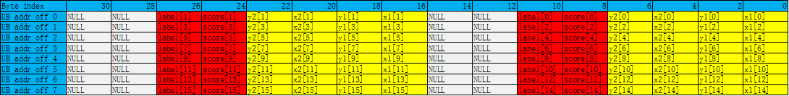

# ProposalConcat-排序组合(ISASI)-矢量计算-基础API-Ascend C算子开发接口-API-CANN社区版8.5.0开发文档-昇腾社区

**页面ID:** atlasascendc_api_07_0227
**来源：** https://www.hiascend.com/document/detail/zh/CANNCommunityEdition/850/API/ascendcopapi/atlasascendc_api_07_0227.html
---

# ProposalConcat

#### 产品支持情况

| 产品                                        | 是否支持 |
| ------------------------------------------- | -------- |
| Atlas A3 训练系列产品/Atlas A3 推理系列产品 | x        |
| Atlas A2 训练系列产品/Atlas A2 推理系列产品 | x        |
| Atlas 200I/500 A2 推理产品                  | x        |
| Atlas推理系列产品AI Core                    | √        |
| Atlas推理系列产品Vector Core                | x        |
| Atlas训练系列产品                           | √        |

#### 功能说明

将连续元素合入Region Proposal内对应位置，每次迭代会将16个连续元素合入到16个Region Proposals的对应位置里。

Region Proposal说明：

目前仅支持两种数据类型：half、float。

对于数据类型half，每一个Region Proposal占16Bytes，Byte[15:12]是无效数据，Byte[11:0]包含6个half类型的元素，其中Byte[11:10]定义为label，Byte[9:8]定义为score，Byte[7:6]定义为y2，Byte[5:4]定义为x2，Byte[3:2]定义为y1，Byte[1:0]定义为x1。

如下图所示，总共包含16个Region Proposals。

对于数据类型float，每一个Region Proposal占32Bytes，Byte[31:24]是无效数据，Byte[23:0]包含6个float类型的元素，其中Byte[23:20]定义为label，Byte[19:16]定义为score，Byte[15:12]定义为y2，Byte[11:8]定义为x2，Byte[7:4]定义为y1，Byte[3:0]定义为x1。

如下图所示，总共包含16个Region Proposals。

#### 函数原型

| 12  | template<typenameT>__aicore__inlinevoidProposalConcat(constLocalTensor<T>&dst,constLocalTensor<T>&src,constint32_trepeatTime,constint32_tmodeNumber) |
| --- | ---------------------------------------------------------------------------------------------------------------------------------------------------- |

#### 参数说明

| 参数名 | 描述                                                                                                            |
| ------ | --------------------------------------------------------------------------------------------------------------- |
| T      | 操作数数据类型。Atlas训练系列产品，支持的数据类型为：halfAtlas推理系列产品AI Core，支持的数据类型为：half/float |

| 参数名称   | 输入/输出 | 含义                                                                                                                                                                      |
| ---------- | --------- | ------------------------------------------------------------------------------------------------------------------------------------------------------------------------- |
| dst        | 输出      | 目的操作数。类型为LocalTensor，支持的TPosition为VECIN/VECCALC/VECOUT。LocalTensor的起始地址需要32字节对齐。                                                               |
| src        | 输入      | 源操作数。类型为LocalTensor，支持的TPosition为VECIN/VECCALC/VECOUT。LocalTensor的起始地址需要32字节对齐。源操作数的数据类型需要与目的操作数保持一致。                     |
| repeatTime | 输入      | 重复迭代次数，int32_t类型，每次迭代完成16个元素合入到16个Region Proposals里，下次迭代跳至相邻的下一组16个Region Proposals和下一组16个元素。取值范围：repeatTime∈[0,255]。 |
| modeNumber | 输入      | 合入位置参数，取值范围：modeNumber∈[0, 5]，int32_t类型，仅限于以下配置：0 – 合入x11 – 合入y12 – 合入x23 – 合入y24 – 合入score5 – 合入label                                |

#### 返回值说明

无

#### 约束说明

- 用户需保证dst中存储的proposal数目大于等于实际所需数目，否则会存在tensor越界错误。
- 用户需保证src中存储的元素大于等于实际所需数目，否则会存在tensor越界错误。
- 操作数地址对齐要求请参见通用地址对齐约束。

#### 调用示例

- 接口使用样例12// repeatTime = 2, modeNumber = 4, 把32个数合入到32个Region Proposal中的score域中AscendC:ProposalConcat(dstLocal,srcLocal,2,4);
- 完整样例12345678910111213141516171819202122232425262728293031323334353637383940414243444546474849505152535455565758#include"kernel_operator.h"classKernelVecProposal{public:__aicore__inlineKernelVecProposal(){}__aicore__inlinevoidInit(__gm__uint8_t*src,__gm__uint8_t*dstGm){srcGlobal.SetGlobalBuffer((__gm__half*)src);dstGlobal.SetGlobalBuffer((__gm__half*)dstGm);pipe.InitBuffer(inQueueSrc,1,srcDataSize*sizeof(half));pipe.InitBuffer(outQueueDst,1,dstDataSize*sizeof(half));}__aicore__inlinevoidProcess(){CopyIn();Compute();CopyOut();}private:__aicore__inlinevoidCopyIn(){AscendC:LocalTensor<half>srcLocal=inQueueSrc.AllocTensor<half>();AscendC:DataCopy(srcLocal,srcGlobal,srcDataSize);inQueueSrc.EnQue(srcLocal);}__aicore__inlinevoidCompute(){AscendC:LocalTensor<half>srcLocal=inQueueSrc.DeQue<half>();AscendC:LocalTensor<half>dstLocal=outQueueDst.AllocTensor<half>();AscendC:ProposalConcat(dstLocal,srcLocal,repeat,mode);// 此处仅演示Concat指令用法，需要注意，dstLocal中非score处的数据可能是随机值outQueueDst.EnQue<half>(dstLocal);inQueueSrc.FreeTensor(srcLocal);}__aicore__inlinevoidCopyOut(){AscendC:LocalTensor<half>dstLocal=outQueueDst.DeQue<half>();AscendC:DataCopy(dstGlobal,dstLocal,dstDataSize);outQueueDst.FreeTensor(dstLocal);}private:AscendC:TPipepipe;AscendC:TQue<AscendC:TPosition:VECIN,1>inQueueSrc;AscendC:TQue<AscendC:TPosition:VECOUT,1>outQueueDst;AscendC:GlobalTensor<half>srcGlobal,dstGlobal;intsrcDataSize=32;intdstDataSize=256;intrepeat=srcDataSize/16;intmode=4;};extern"C"__global____aicore__voidvec_proposal_kernel(__gm__uint8_t*src,__gm__uint8_t*dstGm){KernelVecProposalop;op.Init(src,dstGm);op.Process();}示例结果 
输入数据(src_gm):
[ 33.3    67.56   68.5   -11.914  25.19  -72.8    11.79  -49.47   49.44
  84.4   -14.36   45.97   52.47   -5.387 -13.12  -88.9    54.    -51.62
 -20.67   59.56   35.72   -6.12  -39.4   -11.46   -7.066  30.23  -11.18
 -35.84  -40.88   60.9   -73.3    38.47 ]
输出数据(dst_gm):
[  0.      0.      0.      0.     33.3     0.      0.      0.      0.
0.      0.      0.     67.56    0.      0.      0.      0.      0.
0.      0.     68.5     0.      0.      0.      0.      0.      0.
0.    -11.914   0.      0.      0.      0.      0.      0.      0.
  25.19    0.      0.      0.      0.      0.      0.      0.    -72.8
0.      0.      0.      0.      0.      0.      0.     11.79    0.
0.      0.      0.      0.      0.      0.    -49.47    0.      0.
0.      0.      0.      0.      0.     49.44    0.      0.      0.
0.      0.      0.      0.     84.4     0.      0.      0.      0.
0.      0.      0.    -14.36    0.      0.      0.      0.      0.
0.      0.     45.97    0.      0.      0.      0.      0.      0.
0.     52.47    0.      0.      0.      0.      0.      0.      0.
  -5.387   0.      0.      0.      0.      0.      0.      0.    -13.12
0.      0.      0.      0.      0.      0.      0.    -88.9     0.
0.      0.      0.      0.      0.      0.     54.      0.      0.
0.      0.      0.      0.      0.    -51.62    0.      0.      0.
0.      0.      0.      0.    -20.67    0.      0.      0.      0.
0.      0.      0.     59.56    0.      0.      0.      0.      0.
0.      0.     35.72    0.      0.      0.      0.      0.      0.
0.     -6.12    0.      0.      0.      0.      0.      0.      0.
 -39.4     0.      0.      0.      0.      0.      0.      0.    -11.46
0.      0.      0.      0.      0.      0.      0.     -7.066   0.
0.      0.      0.      0.      0.      0.     30.23    0.      0.
0.      0.      0.      0.      0.    -11.18    0.      0.      0.
0.      0.      0.      0.    -35.84    0.      0.      0.      0.
0.      0.      0.    -40.88    0.      0.      0.      0.      0.
0.      0.     60.9     0.      0.      0.      0.      0.      0.
0.    -73.3     0.      0.      0.      0.      0.      0.      0.
  38.47    0.      0.      0.   ]
