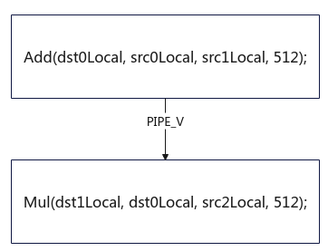

# PipeBarrier(ISASI)-核内同步-同步控制-基础API-Ascend C算子开发接口-API-CANN社区版8.5.0开发文档-昇腾社区

**页面ID:** atlasascendc_api_07_0271
**来源：** https://www.hiascend.com/document/detail/zh/CANNCommunityEdition/850/API/ascendcopapi/atlasascendc_api_07_0271.html
---

# PipeBarrier(ISASI)

#### 产品支持情况

| 产品                                        | 是否支持 |
| ------------------------------------------- | -------- |
| Atlas A3 训练系列产品/Atlas A3 推理系列产品 | √        |
| Atlas A2 训练系列产品/Atlas A2 推理系列产品 | √        |
| Atlas 200I/500 A2 推理产品                  | √        |
| Atlas推理系列产品AI Core                    | √        |
| Atlas推理系列产品Vector Core                | x        |
| Atlas训练系列产品                           | √        |

#### 功能说明

阻塞相同流水，具有数据依赖的相同流水之间需要插入此同步。

#### 函数原型

| 12  | template<pipe_tpipe>__aicore__inlinevoidPipeBarrier() |
| --- | ----------------------------------------------------- |

#### 参数说明

| 参数名 | 描述                                                                                                               |
| ------ | ------------------------------------------------------------------------------------------------------------------ |
| pipe   | 模板参数，表示阻塞的流水类别。支持的流水参考硬件流水类型。如果不关注流水类别，希望阻塞所有流水，可以传入PIPE_ALL。 |

#### 返回值说明

无

#### 约束说明

Scalar流水之间的同步由硬件自动保证，调用PipeBarrier<PIPE_S>()会引发硬件错误。

#### 调用示例

如下示例，Mul指令的输入dst0Local是Add指令的输出，两个矢量运算指令产生依赖，需要插入PipeBarrier保证两条指令的执行顺序。

注：仅作为示例参考，开启自动同步（Kernel直调算子工程和自定义算子开发工程已默认开启）的情况下，编译器自动插入PIPE_V同步，无需开发者手动插入。

| 123456789 | AscendC:LocalTensor<half>src0Local;AscendC:LocalTensor<half>src1Local;AscendC:LocalTensor<half>src2Local;AscendC:LocalTensor<half>dst0Local;AscendC:LocalTensor<half>dst1Local;AscendC:Add(dst0Local,src0Local,src1Local,512);AscendC:PipeBarrier<PIPE_V>();AscendC:Mul(dst1Local,dst0Local,src2Local,512); |
| --------- | ----------------------------------------------------------------------------------------------------------------------------------------------------------------------------------------------------------------------------------------------------------------------------------------------------------- |
