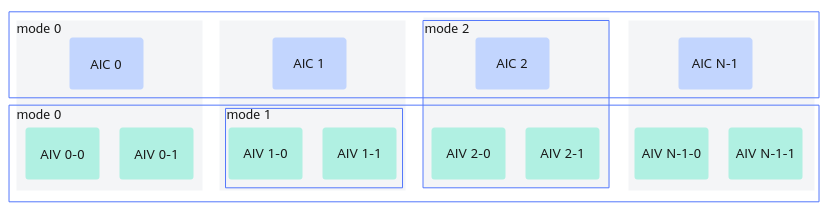

# CrossCoreSetFlag(ISASI)-核间同步-同步控制-基础API-Ascend C算子开发接口-API-CANN社区版8.5.0开发文档-昇腾社区

**页面ID:** atlasascendc_api_07_0273
**来源：** https://www.hiascend.com/document/detail/zh/CANNCommunityEdition/850/API/ascendcopapi/atlasascendc_api_07_0273.html
---

# CrossCoreSetFlag(ISASI)

#### 产品支持情况

| 产品                                        | 是否支持 |
| ------------------------------------------- | -------- |
| Atlas A3 训练系列产品/Atlas A3 推理系列产品 | √        |
| Atlas A2 训练系列产品/Atlas A2 推理系列产品 | √        |
| Atlas 200I/500 A2 推理产品                  | x        |
| Atlas推理系列产品AI Core                    | x        |
| Atlas推理系列产品Vector Core                | x        |
| Atlas训练系列产品                           | x        |

#### 功能说明

面向分离模式的核间同步控制接口。

该接口和CrossCoreWaitFlag接口配合使用。使用时需传入核间同步的标记ID(flagId)，每个ID对应一个用于控制同步的计数器。

同步控制分为以下几种模式，如图1所示：

- 模式0：AI Core核间的同步控制。对于AIC场景，同步所有的AIC核，直到所有的AIC核都执行到CrossCoreSetFlag时，CrossCoreWaitFlag后续的指令才会执行；对于AIV场景，同步所有的AIV核，直到所有的AIV核都执行到CrossCoreSetFlag时，CrossCoreWaitFlag后续的指令才会执行。
- 模式1：AI Core内部，AIV核之间的同步控制。如果两个AIV核都运行了CrossCoreSetFlag，CrossCoreWaitFlag后续的指令才会执行。
- 模式2：AI Core内部，AIC与AIV之间的同步控制。在AIC核执行CrossCoreSetFlag之后，两个AIV上CrossCoreWaitFlag后续的指令才会继续执行；两个AIV都执行CrossCoreSetFlag后，AIC上CrossCoreWaitFlag后续的指令才能执行。

#### 函数原型

| 12  | template<uint8_tmodeId,pipe_tpipe>__aicore__inlinevoidCrossCoreSetFlag(uint16_tflagId) |
| --- | -------------------------------------------------------------------------------------- |

#### 参数说明

| 参数名 | 描述                                                                                                                                                                    |
| ------ | ----------------------------------------------------------------------------------------------------------------------------------------------------------------------- |
| modeId | 核间同步的模式，取值如下：模式0：AI Core核间的同步控制。模式1：AI Core内部，Vector核(AIV)之间的同步控制。模式2：AI Core内部，Cube核(AIC)与Vector核(AIV)之间的同步控制。 |
| pipe   | 设置这条指令所在的流水类型，流水类型可参考硬件流水类型。                                                                                                                |

| 参数名 | 输入/输出 | 描述                                                                                                                                       |
| ------ | --------- | ------------------------------------------------------------------------------------------------------------------------------------------ |
| flagId | 输入      | 核间同步的标记。Atlas A2 训练系列产品/Atlas A2 推理系列产品，取值范围是0-10。Atlas A3 训练系列产品/Atlas A3 推理系列产品，取值范围是0-10。 |

#### 返回值说明

无

#### 约束说明

- 使用该同步接口时，需要按照如下规则设置Kernel类型：在纯Vector/Cube场景下，需设置Kernel类型为KERNEL_TYPE_MIX_AIV_1_0或KERNEL_TYPE_MIX_AIC_1_0。对于Vector和Cube混合场景，需根据实际情况灵活配置Kernel类型。

- 因为Matmul高阶API内部实现中使用了本接口进行核间同步控制，所以不建议开发者同时使用该接口和Matmul高阶API，否则会有flagID冲突的风险。
- 同一flagId的计数器最多设置15次。

#### 调用示例

| 123456789101112131415161718192021222324 | // 使用模式0的方式同步所有的AIV核if(g_coreType==AscendC:AIV){AscendC:CrossCoreSetFlag<0x0,PIPE_MTE3>(0x8);AscendC:CrossCoreWaitFlag(0x8);}// 使用模式1的方式同步当前AICore内的所有AIV子核if(g_coreType==AscendC:AIV){AscendC:CrossCoreSetFlag<0x1,PIPE_MTE3>(0x8);AscendC:CrossCoreWaitFlag(0x8);}// 注意：如果调用高阶API,无需开发者处理AIC和AIV的同步// AIC侧做完Matmul计算后通知AIV进行后处理if(g_coreType==AscendC:AIC){// Matmul处理AscendC:CrossCoreSetFlag<0x2,PIPE_FIX>(0x8);}// AIV侧等待AIC Set消息，进行Vector后处理if(g_coreType==AscendC:AIV){AscendC:CrossCoreWaitFlag(0x8);// Vector后处理} |
| --------------------------------------- | ---------------------------------------------------------------------------------------------------------------------------------------------------------------------------------------------------------------------------------------------------------------------------------------------------------------------------------------------------------------------------------------------------------------------------------------------------------------------------------------------------------------------------------------------------------------------------------------------------------- |
