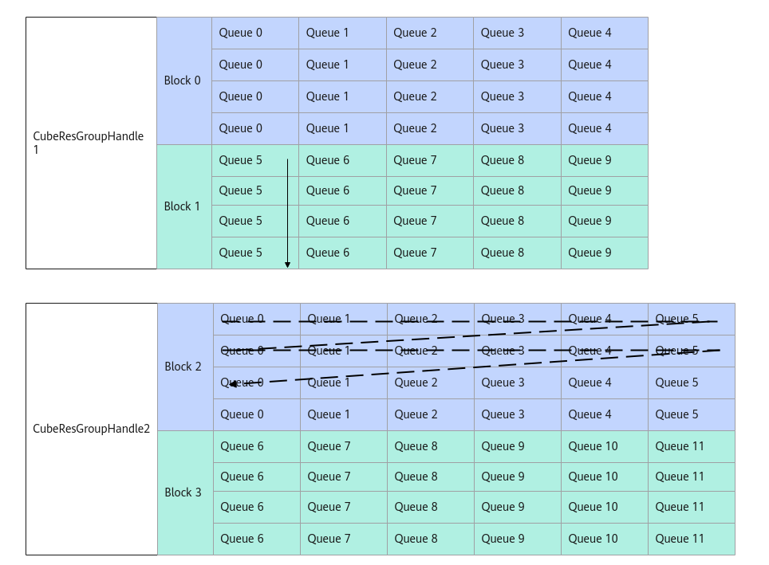

# CubeResGroupHandle使用说明-CubeResGroupHandle-Cube分组管理(ISASI)-基础API-Ascend C算子开发接口-API-CANN社区版8.5.0开发文档-昇腾社区

**页面ID:** atlasascendc_api_07_0290
**来源：** https://www.hiascend.com/document/detail/zh/CANNCommunityEdition/850/API/ascendcopapi/atlasascendc_api_07_0290.html
---

# CubeResGroupHandle使用说明

CubeResGroupHandle用于在分离模式下对AI Core计算资源分组。分组后，开发者可以对不同的分组指定不同的计算任务。一个AI Core分组可包含多个AIV和AIC，AIV和AIC之间采取Client和Server架构进行任务处理。AIV为Client，每一个Cube计算任务为一个消息，AIV发送消息至消息队列，AIC作为Server，遍历消息队列的消息，根据消息类型及内容执行对应的计算任务。一个CubeResGroupHandle中可以有一个或多个AIC，同一个AIC只能属于一个CubeResGroupHandle，AIV无此限制，即同一个AIV可以属于多个CubeResGroupHandle。

如下图所示，CubeResGroupHandle1中有2个AIC，10个AIV，AIC为Block0和Block1。其中Block0与Queue0、Queue1、Queue2、Queue3、Queue4进行通信，Block1与Queue 5、Queue 6、Queue 7、Queue 8、Queue9进行通信。每一个消息队列对应一个AIV，消息队列的深度固定为4，即一次性最多可以容纳4个消息。CubeResGroupHandle2的消息队列个数为12，表明有12个AIV。CubeResGroupHandle的消息处理顺序如CubeResGroupHandle2中黑色箭头所示。

基于CubeResGroupHandle实现AI Core计算资源分组步骤如下：

1. 创建AIC上所需要的计算对象类型。
1. 创建通信区域描述KfcWorkspace，用于记录通信消息Msg的地址分配。
1. 自定义消息结构体，用于通信。
1. 自定义回调计算结构体，根据实际业务场景实现Init函数和Call函数。
1. 创建CubeResGroupHandle。
1. 绑定AIV到CubeResGroupHandle。
1. 收发消息。
1. AIV退出消息队列。

下文仅提供示例代码片段，更多完整样例请参考CubeGroup样例。

1. 创建AIC上所需要的计算对象类型。用户根据实际需求，自定义AIC所需要的计算对象类型，或者高阶API已提供的Matmul类型。例如，创建Matmul类型如下，其中A_TYPE、B_TYPE、 C_TYPE、BIAS_TYPE、CFG_NORM等含义请参考Matmul模板参数。12// A_TYPE, B_TYPE, C_TYPE, BIAS_TYPE, CFG_NORM根据实际需求场景构造usingMatmulApiType=MatmulImpl<A_TYPE,B_TYPE,C_TYPE,C_TYPE,CFG_NORM>;
1. 创建KfcWorkspace。使用KfcWorkspace管理不同CubeResGrouphandle的消息通信区的划分。12// 创建KfcWorkspace对象前，需要对该workspaceGM清零KfcWorkspacedesc(workspaceGM);
1. 自定义消息结构体。用户需要自行构造消息结构体CubeMsgBody，用于AIV向AIC发送通信消息。构造的CubeMsgBody必须64字节对齐，该结构体最前面需要定义2字节的CubeGroupMsgHead，使消息收发机制正常运行，CubeGroupMsgHead结构定义请参考表2。除2字节的CubeGroupMsgHead外，其余参数根据业务需求自行构造。表1CubeMsgBody消息结构体参数名称含义CubeMsgBody用户自定义的消息结构体。结构体名称可自定义，结构体大小需要64字节对齐。12345678910111213141516171819// 这里提供64B对齐的结构体示例，用户实际使用时，除CubeGroupMsgHead外，其他参数个数及参数类型可自行构造structCubeMsgBody{CubeGroupMsgHeadhead;// 2B，需放在结构体最前面，自定义的CubeMsgBody中，CubeGroupMsgHead的变量名需设置为head，否则会编译报错。uint8_tfuncID;uint8_tskipCnt;uint32_tvalue;boolisTransA;boolisTransB;boolisAtomic;boolisLast;int32_ttailM;int32_ttailN;int32_ttailK;uint64_taAddr;uint64_tbAddr;uint64_tcAddr;uint64_taGap;uint64_tbGap;}表2CubeGroupMsgHead结构体参数定义参数名称含义msgState表明该位置的消息状态。参数取值如下：CubeMsgState:FREE：表明该位置还未填写消息，可执行AllocMessage。CubeMsgState:VALID：表明该位置已经含有AIV发送的消息，待AIC接收执行。CubeMsgState:QUIT：表明该位置的消息为通知AIC有AIV将退出流程。CubeMsgState:FAKE：表明该位置的消息为假消息。在消息合并场景，被跳过处理任务的AIV需要发送假消息，消息合并场景请参考PostFakeMsg中的介绍。aivID发送消息的AIV的序号。
1. 自定义回调计算结构体，根据实际业务场景实现Init函数和Call函数。1234567891011template<classMatmulApiCfg,classCubeMsgBody>structNormalCallbackFuncs{__aicore__inlinestaticvoidCall(MatmulApiCfg&mm,__gm__CubeMsgBody*rcvMsg,CubeResGroupHandle<CubeMsgBody>&handle){// 用户自行实现逻辑};__aicore__inlinestaticvoidInit(NormalCallbackFuncs<MatmulApiCfg,CubeMsgBody>&foo,MatmulApiCfg&mm,GM_ADDRtilingGM){// 用户自行实现逻辑};};计算逻辑结构体的模板参数请参考表3。表3模板参数说明参数说明MatmulApiCfg用户自定义的AIC上计算所需要对象的数据类型，参考步骤1，该模板参数必须填入。CubeMsgBody用户自定义的消息结构体，该模板参数必须填入。用户自定义回调计算结构体中需要包含固定的Init函数和Call函数，函数原型如下所示。其中，Init函数的参数说明请参考表4，Call函数的参数说明请参考表5。1234// 该函数的参数和名称为固定格式，函数实现根据业务逻辑自行实现。__aicore__inlinestaticvoidInit(MyCallbackFunc<MatmulApiCfg,CubeMsgBody>&myCallBack,MatmulApiCfg&mm,GM_ADDRtilingGM){// 用户自行实现内部逻辑}表4Init函数参数说明参数输入/输出说明myCallBack输入用户自定义的带模板参数的回调计算结构体。mm输入AIC上计算对象，多为Matmul对象。tilingGM输入用户传入的tiling指针。1234// 该函数的参数和名称为固定格式，函数实现根据业务逻辑自行实现。__aicore__inlinestaticvoidCall(MatmulApiCfg&mm,__gm__CubeMsgBody*rcvMsg,CubeResGroupHandle<CubeMsgBody>&handle){// 用户自行实现内部逻辑}表5Call函数参数说明参数输入/输出说明mm输入AIC上计算对象，多为Matmul对象。rcvMsg输入用户自定义的消息结构体指针。handle输入分组管理Handle，用户调用其接口进行收发消息，释放消息等。某算子的回调计算结构体的代码示例如下。12345678910111213141516171819202122232425262728293031323334353637383940414243444546474849505152535455565758// 用户自定义的回调计算逻辑template<classMatmulApiCfg,typenameCubeMsgBody>structMyCallbackFunc{template<int32_tfuncId>__aicore__inlinestatictypenameIsEqual<funcId,0>:TypeCubeGroupCallBack(MatmulApiCfg&mm,__gm__CubeMsgBody*rcvMsg,CubeResGroupHandle<CubeMsgBody>&handle){GlobalTensor<int64_t>msgGlobal;msgGlobal.SetGlobalBuffer(reinterpret_cast<__gm__int64_t*>(rcvMsg)+sizeof(int64_t));DataCacheCleanAndInvalid<int64_t,CacheLine:SINGLE_CACHE_LINE,DcciDst:CACHELINE_OUT>(msgGlobal);usingSrcAT=typenameMatmulApiCfg:AType:T;autoskipNum=0;for(inti=0;i<skipNum+1;++i){autotmpId=handle.FreeMessage(rcvMsg+i);// msgPtr process is complete}handle.SetSkipMsg(skipNum);}template<int32_tfuncId>__aicore__inlinestatictypenameIsEqual<funcId,1>:TypeCubeGroupCallBack(MatmulApiCfg&mm,__gm__CubeMsgBody*rcvMsg,CubeResGroupHandle<CubeMsgBody>&handle){GlobalTensor<int64_t>msgGlobal;msgGlobal.SetGlobalBuffer(reinterpret_cast<__gm__int64_t*>(rcvMsg)+sizeof(int64_t));DataCacheCleanAndInvalid<int64_t,CacheLine:SINGLE_CACHE_LINE,DcciDst:CACHELINE_OUT>(msgGlobal);usingSrcAT=typenameMatmulApiCfg:AType:T;LocalTensor<SrcAT>tensor_temp;autoskipNum=3;autotmpId=handle.FreeMessage(rcvMsg,CubeMsgState:VALID);for(inti=1;i<skipNum+1;++i){autotmpId=handle.FreeMessage(rcvMsg+i,CubeMsgState:FAKE);}handle.SetSkipMsg(skipNum);// notify the cube not to process}__aicore__inlinestaticvoidCall(MatmulApiCfg&mm,__gm__CubeMsgBody*rcvMsg,CubeResGroupHandle<CubeMsgBody>&handle){if(rcvMsg->funcId==0){CubeGroupCallBack<0>(mm,rcvMsg,handle);}elseif(rcvMsg->funcId==1){CubeGroupCallBack<1>(mm,rcvMsg,handle);}}__aicore__inlinestaticvoidInit(MyCallbackFunc<MatmulApiCfg,CubeMsgBody>&foo,MatmulApiCfg&mm,GM_ADDRtilingGM){autotempTilingGM=(__gm__uint32_t*)tilingGM;autotempTiling=(uint32_t*)&(foo.tiling);for(inti=0;i<sizeof(TCubeTiling)/sizeof(int32_t);++i,++tempTilingGM,++tempTiling){*tempTiling=*tempTilingGM;}mm.SetSubBlockIdx(0);mm.Init(&foo.tiling,GetTPipePtr());}TCubeTilingtiling;};
1. 创建CubeResGroupHandle。用户使用CreateCubeResGroup接口创建一个或多个CubeResGroupHandle。123456789/** groupID为用户自定义的CreateCubeResGroup的groupID* MatmulApiType为定义好的AIC上计算对象的类型* MyCallbackFunc为定义好的自定义回调计算结构体* CubeMsgBody为自定义消息结构体* desc为用户初始化好的通信区域描述* groupID为1，blockStart为0，blockSize为12，msgQueueSize为48，tilingGm为指针，存储了用户在AIC上所需要的tiling信息*/autohandle=AscendC:CreateCubeResGroup<groupID,MatmulApiType,MyCallbackFunc,CubeMsgBody>(desc,0,12,48,tilingGM);
1. 绑定AIV到CubeResGroupHandle。绑定AIV和消息队列序号。注意：消息队列序号queIdx小于该CubeGroupHandle的消息队列总数，每个AIV需要传入不同的queIdx。handle为步骤5中CreateCubeResGroup创建的CubeResGroupHandle对象。1handle.AssignQueue(queIdx);
1. AIV发消息。用户调用AllocMessage,PostMessage等接口进行消息的收发。其中，调用AllocMessage获取消息结构体指针，通过PostMessage发送消息，在消息合并场景调用PostFakeMessage发送假消息，示例如下。12345678910111213141516171819202122CubeGroupMsgHeadhead={CubeMsgState:VALID,(uint8_t)queIdx};CubeMsgBodyaCubeMsgBody{head,0,0,0,false,false,false,false,0,0,0,0,0,0,0,0};CubeMsgBodybCubeMsgBody{head,1,0,0,false,false,false,false,0,0,0,0,0,0,0,0};autooffset=0;if(GetBlockIdx()==0){automsgPtr=handle.templateAllocMessage();// alloc for queue spaceoffset=handle.templatePostMessage(msgPtr,bCubeMsgBody);// post true msgPtrboolwaitState=handle.templateWait<true>(offset);// wait until the msgPtr is proscessed}elseif(GetBlockIdx()<4){automsgPtr=handle.AllocMessage();offset=handle.PostFakeMsg(msgPtr);// post fake msgPtrboolwaitState=handle.templateWait<true>(offset);// wait until the msgPtr is proscessed}else{automsgPtr=handle.templateAllocMessage();offset=handle.templatePostMessage(msgPtr,aCubeMsgBody);boolwaitState=handle.templateWait<true>(offset);// wait until the msgPtr is proscessed}
1. AIV退出消息队列。调用AllocMessage获取消息结构体指针后，通过SendQuitMsg发送当前消息队列退出。12automsgPtr=handle.AllocMessage();// 获取消息空间指针msgPtrhandle.SetQuit(msgPtr);// 发送退出消息
