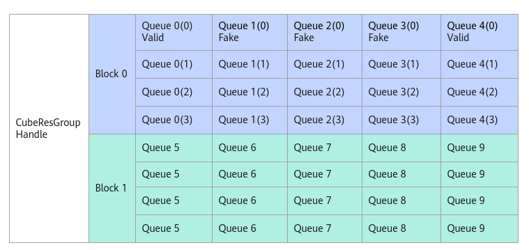

# PostFakeMsg-CubeResGroupHandle-Cube分组管理(ISASI)-基础API-Ascend C算子开发接口-API-CANN社区版8.5.0开发文档-昇腾社区

**页面ID:** atlasascendc_api_07_0295
**来源：** https://www.hiascend.com/document/detail/zh/CANNCommunityEdition/850/API/ascendcopapi/atlasascendc_api_07_0295.html
---

# PostFakeMsg

#### 产品支持情况

| 产品                                        | 是否支持 |
| ------------------------------------------- | -------- |
| Atlas A3 训练系列产品/Atlas A3 推理系列产品 | x        |
| Atlas A2 训练系列产品/Atlas A2 推理系列产品 | √        |
| Atlas 200I/500 A2 推理产品                  | x        |
| Atlas推理系列产品AI Core                    | x        |
| Atlas推理系列产品Vector Core                | x        |
| Atlas训练系列产品                           | x        |

#### 功能说明

通过AllocMessage接口获取到消息空间地址后，AIV发送假消息，刷新消息状态msgState为FAKE。

当多个AIV的消息内容一致时，AIC仅需要读取一次位置靠前的第一个消息，通过将消息结构体中自定义的参数skipCnt设置为n，通知AIC后续n条消息无需处理，直接跳过，被跳过的AIV需要使用本接口发送假消息，这被称之为消息合并机制或消息合并场景。

如下图所示，假设Queue1、2、3的第0条消息与Queue0的第0条消息相同，在消息合并场景中，从AIC视角来看，Queue0(0)，Queue4(0)的消息会被处理，并根据用户自定义的消息内容完成相应的AIC上的计算。Queue1(0), Queue2(0), Queue3(0)由于发了假消息，AIC将不会读取消息内容进行计算，直接释放消息。

#### 函数原型

| 1   | __aicore__inlineuint16_tPostFakeMsg(__gm__CubeMsgType*msg) |
| --- | ---------------------------------------------------------- |

#### 参数说明

| 参数 | 输入/输出 | 说明                                           |
| ---- | --------- | ---------------------------------------------- |
| msg  | 输入      | 该CubeResGroupHandle中某个任务的消息空间地址。 |

#### 返回值说明

当前消息空间与该消息队列队首空间的地址偏移。

#### 约束说明

无

#### 调用示例

| 123 | hanndle.AssignQueue(queIdx);automsgPtr=handle.AllocMessage();// 获取消息空间指针msgPtrautooffset=handle.PostFakeMsg(msgPtr);// 在msgPtr指针位置，发送假消息 |
| --- | ----------------------------------------------------------------------------------------------------------------------------------------------------------- |
