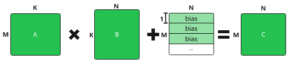
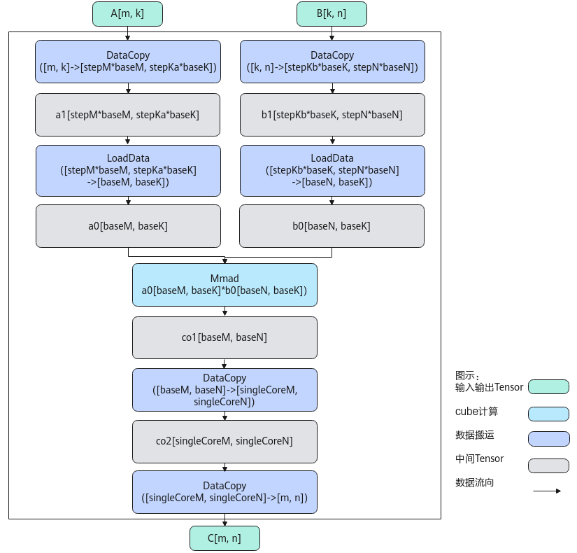

# Matmul使用说明-Matmul Kernel侧接口-矩阵计算-高阶API-Ascend C算子开发接口-API-CANN社区版8.5.0开发文档-昇腾社区

**页面ID:** atlasascendc_api_07_0614
**来源：** https://www.hiascend.com/document/detail/zh/CANNCommunityEdition/850/API/ascendcopapi/atlasascendc_api_07_0614.html
---

# Matmul使用说明

Ascend C提供一组Matmul高阶API，方便用户快速实现Matmul矩阵乘法的运算操作。

Matmul的计算公式为：C = A * B + Bias，其示意图如下。

- A、B为源操作数，A为左矩阵，形状为[M, K]；B为右矩阵，形状为[K, N]。
- C为目的操作数，存放矩阵乘结果的矩阵，形状为[M, N]。
- Bias为矩阵乘偏置，形状为[1, N]。对A*B结果矩阵的每一行都采用该Bias进行偏置。

Kernel侧实现Matmul矩阵乘运算的步骤概括为：

1. 创建Matmul对象。
1. 初始化操作。
1. 设置左矩阵A、右矩阵B、Bias。
1. 完成矩阵乘操作。
1. 结束矩阵乘操作。

使用Matmul API实现矩阵乘运算的具体步骤如下：

1. 创建Matmul对象。创建Matmul对象的示例如下：默认为MIX模式（包含矩阵计算和矢量计算），该场景下通常不定义ASCENDC_CUBE_ONLY宏，如果在程序中使用了ASCENDC_CUBE_ONLY宏，则必须使用ASCEND_IS_AIC宏和ASCEND_IS_AIV宏将Cube计算和Vector计算隔离开。纯Cube模式（只有矩阵计算）场景下，建议在代码中定义ASCENDC_CUBE_ONLY宏，避免额外的性能开销。123456789// 纯cube模式（只有矩阵计算）场景下，需要设置该代码宏，并且必须在#include "lib/matmul_intf.h"之前设置// #define ASCENDC_CUBE_ONLY#include"lib/matmul_intf.h"typedefAscendC:MatmulType<AscendC:TPosition:GM,CubeFormat:ND,half>aType;typedefAscendC:MatmulType<AscendC:TPosition:GM,CubeFormat:ND,half>bType;typedefAscendC:MatmulType<AscendC:TPosition:GM,CubeFormat:ND,float>cType;typedefAscendC:MatmulType<AscendC:TPosition:GM,CubeFormat:ND,float>biasType;AscendC:Matmul<aType,bType,cType,biasType>mm;创建对象时需要传入A、B、C、Bias的参数类型信息，类型信息通过MatmulType来定义，包括：内存逻辑位置、数据格式、数据类型。123456789template<AscendC:TPositionPOSITION,CubeFormatFORMAT,typenameTYPE,boolISTRANS=false,LayoutModeLAYOUT=LayoutMode:NONE,boolIBSHARE=false>structMatmulType{constexprstaticAscendC:TPositionpos=POSITION;constexprstaticCubeFormatformat=FORMAT;usingT=TYPE;constexprstaticboolisTrans=ISTRANS;constexprstaticLayoutModelayout=LAYOUT;constexprstaticboolibShare=IBSHARE;};表1MatmulType参数说明参数说明POSITION内存逻辑位置。针对Atlas A3 训练系列产品/Atlas A3 推理系列产品：A矩阵可设置为TPosition:GM，TPosition:VECOUT，TPosition:TSCMB矩阵可设置为TPosition:GM，TPosition:VECOUT，TPosition:TSCMBias可设置为TPosition:GM，TPosition:VECOUTC矩阵可设置为TPosition:GM，TPosition:VECIN, TPosition:CO1针对Atlas A2 训练系列产品/Atlas A2 推理系列产品：A矩阵可设置为TPosition:GM，TPosition:VECOUT，TPosition:TSCMB矩阵可设置为TPosition:GM，TPosition:VECOUT，TPosition:TSCMBias可设置为TPosition:GM，TPosition:VECOUTC矩阵可设置为TPosition:GM，TPosition:VECIN, TPosition:CO1注意，C矩阵设置为TPosition:CO1时，C矩阵的数据排布格式仅支持CubeFormat:NZ，C矩阵的数据类型仅支持float、int32_t。针对Atlas推理系列产品AI Core：A矩阵可设置为TPosition:GM，TPosition:VECOUTB矩阵可设置为TPosition:GM，TPosition:VECOUTBias可设置为TPosition:GM，TPosition:VECOUTC矩阵可设置为TPosition:GM，TPosition:VECIN针对Atlas 200I/500 A2 推理产品：A矩阵可设置为TPosition:GMB矩阵可设置为TPosition:GMBias可设置为TPosition:GMC矩阵可设置为TPosition:GM、FORMAT数据的物理排布格式，详细介绍请参考数据格式。针对Atlas A3 训练系列产品/Atlas A3 推理系列产品：A矩阵可设置为CubeFormat:ND，CubeFormat:NZ, CubeFormat:VECTORB矩阵可设置为CubeFormat:ND，CubeFormat:NZBias可设置为CubeFormat:NDC矩阵可设置为CubeFormat:ND，CubeFormat:NZ，CubeFormat:ND_ALIGN针对Atlas A2 训练系列产品/Atlas A2 推理系列产品：A矩阵可设置为CubeFormat:ND，CubeFormat:NZ, CubeFormat:VECTORB矩阵可设置为CubeFormat:ND，CubeFormat:NZBias可设置为CubeFormat:NDC矩阵可设置为CubeFormat:ND，CubeFormat:NZ，CubeFormat:ND_ALIGN针对Atlas推理系列产品AI Core：A矩阵可设置为CubeFormat:ND，CubeFormat:NZB矩阵可设置为CubeFormat:ND，CubeFormat:NZBias可设置为CubeFormat:NDC矩阵可设置为CubeFormat:ND，CubeFormat:NZ，CubeFormat:ND_ALIGN注意：针对Atlas推理系列产品AI Core，C矩阵设置为CubeFormat:ND时，要求尾轴32字节对齐，比如数据类型是half的情况下，N要求是16的倍数。针对Atlas 200I/500 A2 推理产品：A矩阵可设置为CubeFormat:ND，CubeFormat:NZB矩阵可设置为CubeFormat:ND，CubeFormat:NZBias可设置为CubeFormat:NDC矩阵可设置为CubeFormat:ND，CubeFormat:NZ注意：针对Atlas 200I/500 A2 推理产品，C矩阵设置为TPosition:VECIN或者TPosition:TSCM，CubeFormat:ND时，要求尾轴32字节对齐，比如数据类型是half的情况下，N要求是16的倍数；C矩阵设置为TPosition:VECIN或者TPosition:TSCM，CubeFormat:NZ时，N要求是16的倍数。关于CubeFormat:NZ格式的A矩阵、B矩阵、C矩阵的对齐约束，请参考表3。TYPE数据类型。针对Atlas A3 训练系列产品/Atlas A3 推理系列产品：A矩阵可设置为half、float、bfloat16_t 、int8_t、int4b_tB矩阵可设置为half、float、bfloat16_t 、int8_t、int4b_tBias可设置为half、float、int32_tC矩阵可设置为half、float、bfloat16_t、int32_t、int8_t针对Atlas A2 训练系列产品/Atlas A2 推理系列产品：A矩阵可设置为half、float、bfloat16_t 、int8_t、int4b_tB矩阵可设置为half、float、bfloat16_t 、int8_t、int4b_tBias可设置为half、float、int32_tC矩阵可设置为half、float、bfloat16_t、int32_t、int8_t针对Atlas推理系列产品AI Core：A矩阵可设置为half、int8_tB矩阵可设置为half、int8_tBias可设置为float、int32_tC矩阵可设置为half、float、int8_t、int32_t针对Atlas 200I/500 A2 推理产品：A矩阵可设置为half、float、bfloat16_t 、int8_tB矩阵可设置为half、float、bfloat16_t 、int8_tBias矩阵可设置为half、float、int32_tC矩阵可设置为half、float、bfloat16_t、int32_t注意：除B矩阵为int8_t数据类型外，A矩阵和B矩阵数据类型需要一致，具体数据类型组合关系请参考表2。A矩阵和B矩阵为int4b_t数据类型时，矩阵内轴的数据个数必须为偶数。例如，A矩阵为int4b_t数据类型且不转置时，singleCoreK必须是偶数。关于int4b_t数据类型的使用样例请参考Int4类型输入的Matmul算子样例。ISTRANS是否开启支持矩阵转置的功能。true：开启支持矩阵转置的功能，运行时可以分别通过SetTensorA和SetTensorB中的isTransposeA、isTransposeB参数设置A、B矩阵是否转置。若设置A、B矩阵转置，Matmul会认为A矩阵形状为[K, M]，B矩阵形状为[N, K]。false：默认值，不开启支持矩阵转置的功能，通过SetTensorA和SetTensorB不能设置A、B矩阵的转置情况。Matmul会认为A矩阵形状为[M, K]，B矩阵形状为[K, N]。注意，由于L1 Buffer上的矩阵数据有分形对齐的约束，A、B矩阵转置和不转置时所需的L1空间可能不相同，在开启支持矩阵转置功能时，必须保证按照Matmul Tiling参数申请的L1空间不超过L1 Buffer的规格，判断方式为(depthA1*Ceil(baseM/c0Size)*baseK + depthB1*Ceil(baseN/c0Size)*baseK) * db * sizeoof(dtype) < L1Size，db表示L1是否开启double buffer，取值1（不开启double buffer）或2（开启double buffer），其余参数的含义请参考表1。LAYOUT表征数据的排布。NONE：默认值，表示不使用BatchMatmul；其他选项表示使用BatchMatmul。NORMAL：BMNK的数据排布格式，具体可参考IterateBatch中对该数据排布的介绍。BSNGD：原始BSH shape做reshape后的数据排布，具体可参考IterateBatch中对该数据排布的介绍。SBNGD：原始SBH shape做reshape后的数据排布，具体可参考IterateBatch中对该数据排布的介绍。BNGS1S2：一般为前两种数据排布进行矩阵乘的输出，S1S2数据连续存放，一个S1S2为一个batch的计算数据，具体可参考IterateBatch中对该数据排布的介绍。IBSHARE是否使能IBShare(IntraBlock Share)。IBShare的功能是能够复用L1 Buffer上相同的A矩阵或B矩阵数据，复用的矩阵必须在L1 Buffer上全载。A矩阵和B矩阵仅有一个使能IBShare的场景，与IBShare模板配合使用，具体参数设置详见表2。注意，A矩阵和B矩阵同时使能IBShare的场景，表示L1 Buffer上的A矩阵和B矩阵同时复用，需要满足：同一算子中其它Matmul对象的A矩阵和B矩阵也必须同时使能IBShare；Atlas A2 训练系列产品/Atlas A2 推理系列产品，获取矩阵计算结果时，只支持调用IterateAll接口，且只支持输出到GlobalTensor，即计算结果放置于Global Memory的地址。Atlas A3 训练系列产品/Atlas A3 推理系列产品，获取矩阵计算结果时，只支持调用IterateAll接口，且只支持输出到GlobalTensor，即计算结果放置于Global Memory的地址。Atlas A3 训练系列产品/Atlas A3 推理系列产品支持该参数。Atlas A2 训练系列产品/Atlas A2 推理系列产品支持该参数。Atlas推理系列产品AI Core不支持该参数。Atlas 200I/500 A2 推理产品不支持该参数。该参数使用样例请参考MatmulABshare样例、A、B矩阵均使能IBShare样例、仅B矩阵使能IBShare样例。表2Matmul输入输出数据类型的支持列表A矩阵B矩阵BiasC矩阵支持平台floatfloatfloat/halffloatAtlas A3 训练系列产品/Atlas A3 推理系列产品Atlas A2 训练系列产品/Atlas A2 推理系列产品Atlas 200I/500 A2 推理产品halfhalffloatfloatAtlas A3 训练系列产品/Atlas A3 推理系列产品Atlas A2 训练系列产品/Atlas A2 推理系列产品Atlas推理系列产品AI CoreAtlas 200I/500 A2 推理产品halfhalfhalffloatAtlas A3 训练系列产品/Atlas A3 推理系列产品Atlas A2 训练系列产品/Atlas A2 推理系列产品Atlas 200I/500 A2 推理产品int8_tint8_tint32_tint32_t/halfAtlas A3 训练系列产品/Atlas A3 推理系列产品Atlas A2 训练系列产品/Atlas A2 推理系列产品Atlas推理系列产品AI CoreAtlas 200I/500 A2 推理产品int4b_tint4b_tint32_tint32_t/halfAtlas A3 训练系列产品/Atlas A3 推理系列产品Atlas A2 训练系列产品/Atlas A2 推理系列产品bfloat16_tbfloat16_tfloatfloatAtlas A3 训练系列产品/Atlas A3 推理系列产品Atlas A2 训练系列产品/Atlas A2 推理系列产品Atlas 200I/500 A2 推理产品bfloat16_tbfloat16_thalffloatAtlas A3 训练系列产品/Atlas A3 推理系列产品Atlas A2 训练系列产品/Atlas A2 推理系列产品halfhalffloatint8_tAtlas A3 训练系列产品/Atlas A3 推理系列产品Atlas A2 训练系列产品/Atlas A2 推理系列产品bfloat16_tbfloat16_tfloatint8_tAtlas A3 训练系列产品/Atlas A3 推理系列产品Atlas A2 训练系列产品/Atlas A2 推理系列产品int8_tint8_tint32_tint8_tAtlas A3 训练系列产品/Atlas A3 推理系列产品Atlas A2 训练系列产品/Atlas A2 推理系列产品Atlas推理系列产品AI CorehalfhalffloathalfAtlas A3 训练系列产品/Atlas A3 推理系列产品Atlas A2 训练系列产品/Atlas A2 推理系列产品Atlas推理系列产品AI CoreAtlas 200I/500 A2 推理产品halfhalfhalfhalfAtlas A3 训练系列产品/Atlas A3 推理系列产品Atlas A2 训练系列产品/Atlas A2 推理系列产品Atlas 200I/500 A2 推理产品bfloat16_tbfloat16_tfloatbfloat16_tAtlas A3 训练系列产品/Atlas A3 推理系列产品Atlas A2 训练系列产品/Atlas A2 推理系列产品Atlas 200I/500 A2 推理产品halfint8_tfloatfloatAtlas推理系列产品AI Core
1. 初始化操作。1REGIST_MATMUL_OBJ(&pipe,GetSysWorkSpacePtr(),mm,&tiling);// 初始化matmul对象，参数含义请参考REGIST_MATMUL_OBJ章节
1. 设置左矩阵A、右矩阵B、Bias。123456mm.SetTensorA(gm_a);// 设置左矩阵Amm.SetTensorB(gm_b);// 设置右矩阵Bmm.SetBias(gm_bias);// 设置Bias// Atlas推理系列产品AI Core上需要额外调用SetLocalWorkspace接口设置计算所需的UB空间mm.SetLocalWorkspace(usedUbBufLen);
1. 完成矩阵乘操作。用户可以选择以下三种调用方式之一。调用Iterate完成单次迭代计算，叠加while循环完成单核全量数据的计算。Iterate方式，可以自行控制迭代次数，完成所需数据量的计算，方式比较灵活。1234// API接口内部会进行循环结束条件判断处理while(mm.Iterate()){mm.GetTensorC(gm_c);}调用IterateAll完成单核上所有数据的计算。IterateAll方式，无需循环迭代，使用比较简单。1mm.IterateAll(gm_c);用户申请用于存放矩阵乘结果的逻辑位置CO1内存，调用一次或多次Iterate完成单次或多次迭代计算，在需要搬出计算结果时，调用Fixpipe接口完成CO1上计算结果的搬运，然后释放申请的CO1内存。该方式下，用户可以灵活控制计算和搬运的节奏，根据实际需要，一次计算对应一次结果的搬出，或者将多次计算结果缓存在CO1内存中，再一次性搬出计算结果。在此种调用方式下，创建Matmul对象时，必须定义C矩阵的内存逻辑位置为TPosition:CO1、数据排布格式为CubeFormat:NZ、数据类型为float或int32_t。Atlas推理系列产品AI Core暂不支持该方式。Atlas 200I/500 A2 推理产品暂不支持该方式。1234567891011121314151617181920212223242526272829// 定义C矩阵的类型信息typedefAscendC:MatmulType<AscendC:TPosition:CO1,CubeFormat:NZ,float>cType;// 创建Matmul对象AscendC:Matmul<aType,bType,cType,biasType>mm;// 用户提前申请CO1的内存l0cTensorTQue<TPosition:CO1,1>CO1_;// 128 * 1024为申请的CO1内存大小GetTPipePtr()->InitBuffer(CO1_,1,128*1024);// L0cT为C矩阵的数据类型。// A矩阵数据类型是int8_t或int4b_t时，C矩阵的数据类型是int32_t。// A矩阵数据类型是half、float或bfloat16_t时，C矩阵的数据类型是float。LocalTensor<L0cT>l0cTensor=CO1_.templateAllocTensor<L0cT>();// 将l0cTensor作为入参传入Iterate，矩阵乘结果输出到用户申请的l0cTensor上mm.Iterate(false,l0cTensor);// 调用Fixpipe接口将CO1上的计算结果搬运到GMFixpipeParamsV220params;params.nSize=nSize;params.mSize=mSize;params.srcStride=srcStride;params.dstStride=dstStride;CO1_.EnQue(l0cTensor);CO1_.templateDeQue<L0cT>();Fixpipe<cType,L0cT,CFG_ROW_MAJOR>(gm[dstOffset],l0cTensor,params);//释放CO1内存CO1_.FreeTensor(l0cTensor);
1. 结束矩阵乘操作。1mm.End();

| 源/目的操作数                                                                                                                                                                                                                                 | 外轴     | 内轴                                                         |
| --------------------------------------------------------------------------------------------------------------------------------------------------------------------------------------------------------------------------------------------- | -------- | ------------------------------------------------------------ |
| A矩阵/B矩阵                                                                                                                                                                                                                                   | 16的倍数 | C0_size的倍数                                                |
| C矩阵                                                                                                                                                                                                                                         | 16的倍数 | 16的倍数                                                     |
| C矩阵（使能channel_split功能）                                                                                                                                                                                                                | 16的倍数 | C0_size的倍数                                                |
| C矩阵（不使能channel_split功能）                                                                                                                                                                                                              | 16的倍数 | float/int32_t：16的倍数half/bfloat16_t/int8_t：C0_size的倍数 |
| 注1：float/int32_t数据类型的C0_size为8，half/bfloat16_t数据类型的C0_size为16，int8_t数据类型的C0_size为32，int4b_t数据类型的C0_size为64。注2：channel_split功能通过MatmulConfig中的isEnableChannelSplit参数配置，具体内容请参考MatmulConfig。 |          |                                                              |

#### 需要包含的头文件

| 1   | #include"lib/matmul/matmul_intf.h" |
| --- | ---------------------------------- |

#### 实现原理

计算过程分为如下几步：

1. 数据从GM搬到A1：DataCopy每次从矩阵A，搬出一个stepM*baseM*stepKa*baseK的矩阵块a1，循环多次完成矩阵A的搬运；数据从GM搬到B1：DataCopy每次从矩阵B，搬出一个stepKb*baseK*stepN*baseN的矩阵块b1，循环多次完成矩阵B的搬运；
1. 数据从A1搬到A2：LoadData每次从矩阵块a1，搬出一个baseM * baseK的矩阵块a0；数据从B1搬到B2，并完成转置：LoadData每次从矩阵块b1，搬出一个baseK * baseN的矩阵块，并将其转置为baseN * baseK的矩阵块b0；
1. 矩阵乘：每次完成一个矩阵块a0 * b0的计算，得到baseM * baseN的矩阵块co1；
1. 数据从矩阵块co1搬到矩阵块co2：DataCopy每次搬运一块baseM * baseN的矩阵块co1到singleCoreM * singleCoreN的矩阵块co2中；
1. 重复2-4步骤，完成矩阵块a1 * b1的计算；
1. 数据从矩阵块co2搬到矩阵块C：DataCopy每次搬运一块singleCoreM * singleCoreN的矩阵块co2到矩阵块C中；
1. 重复1-6步骤，完成矩阵A * B = C的计算。

注意：stepM、baseM等参数的含义请参考Tiling参数。
