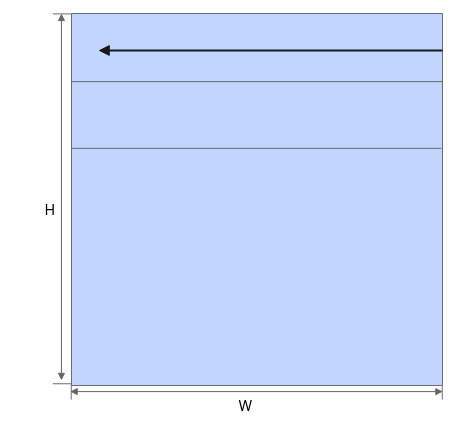
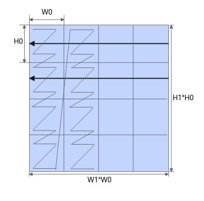
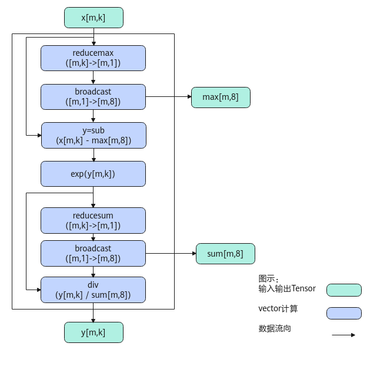

# SoftMax-SoftMax接口-激活函数-高阶API-Ascend C算子开发接口-API-CANN社区版8.5.0开发文档-昇腾社区

**页面ID:** atlasascendc_api_07_0754
**来源：** https://www.hiascend.com/document/detail/zh/CANNCommunityEdition/850/API/ascendcopapi/atlasascendc_api_07_0754.html
---

# SoftMax

#### 产品支持情况

| 产品                                        | 是否支持 |
| ------------------------------------------- | -------- |
| Atlas A3 训练系列产品/Atlas A3 推理系列产品 | √        |
| Atlas A2 训练系列产品/Atlas A2 推理系列产品 | √        |
| Atlas 200I/500 A2 推理产品                  | √        |
| Atlas推理系列产品AI Core                    | √        |
| Atlas推理系列产品Vector Core                | x        |
| Atlas训练系列产品                           | x        |

#### 功能说明

将输入tensor[m0, m1, ...mt, n]（t大于等于0）的非尾轴长度相乘的结果看作m，则输入tensor的shape看作[m, n]。对输入tensor[m, n]按行做如下SoftMax计算：

为方便理解，通过Python脚本实现的方式，表达其计算公式（以输入为ND格式为例）如下，其中src是源操作数（输入），dst、sum、max为目的操作数（输出）。

| 123456789 | defsoftmax(src):#基于last轴进行rowmax（按行取最大值）处理max=np.max(src,axis=-1,keepdims=True)sub=src-maxexp=np.exp(sub)#基于last轴进行rowsum（按行求和）处理sum=np.sum(exp,axis=-1,keepdims=True)dst=exp/sumreturndst,max,sum |
| --------- | ------------------------------------------------------------------------------------------------------------------------------------------------------------------------------------------------------------------------------ |

当输入的数据排布格式不同时，内部的reduce过程会有所不同：当输入为ND格式时，内部的reduce过程按last轴进行；当输入为NZ格式时，内部的reduce过程按照last轴和first轴进行，reduce过程如下图所示：

#### 实现原理

以float类型，ND格式，shape为[m, k]的输入Tensor为例，描述SoftMax高阶API内部算法框图，如下图所示。

计算过程分为如下几步，均在Vector上进行：

1. reducemax步骤：对输入x的每一行数据求最大值得到[m, 1]的结果，计算结果会保存到一个临时空间temp中；
1. broadcast步骤：对temp中的数据[m, 1]做一个按datablock为单位的填充，比如float类型下，把[m, 1]扩展成[m, 8]，同时输出max；
1. sub步骤：对输入x的所有数据按行减去max；
1. exp步骤：对sub之后的所有数据求exp；
1. reducesum步骤：对exp后的结果的每一行数据求和得到[m, 1]，计算结果会保存到临时空间temp中；
1. broadcast步骤：对temp([m, 1])做一个按datablock为单位的填充，比如float类型下，把[m, 1]扩展成[m, 8]，同时输出sum；
1. div步骤：对exp后的结果的所有数据按行除以sum，得到最终结果。

#### 函数原型

- 接口框架申请临时空间LocalTensor的数据类型相同12template<typenameT,boolisReuseSource=false,boolisBasicBlock=false,boolisDataFormatNZ=false,constSoftmaxConfig&config=SOFTMAX_DEFAULT_CFG>__aicore__inlinevoidSoftMax(constLocalTensor<T>&dstTensor,constLocalTensor<T>&sumTensor,constLocalTensor<T>&maxTensor,constLocalTensor<T>&srcTensor,constSoftMaxTiling&tiling,constSoftMaxShapeInfo&softmaxShapeInfo={})LocalTensor的数据类型不同12template<typenameT,boolisReuseSource=false,boolisBasicBlock=false,boolisDataFormatNZ=false,constSoftmaxConfig&config=SOFTMAX_DEFAULT_CFG>__aicore__inlinevoidSoftMax(constLocalTensor<half>&dstTensor,constLocalTensor<float>&sumTensor,constLocalTensor<float>&maxTensor,constLocalTensor<half>&srcTensor,constSoftMaxTiling&tiling,constSoftMaxShapeInfo&softmaxShapeInfo={})不带sumTensor和maxTensor参数12template<typenameT,boolisReuseSource=false,boolisBasicBlock=false,constSoftmaxConfig&config=SOFTMAX_DEFAULT_CFG>__aicore__inlinevoidSoftMax(constLocalTensor<T>&dstTensor,constLocalTensor<T>&srcTensor,constSoftMaxTiling&tiling,constSoftMaxShapeInfo&softmaxShapeInfo={})
- 通过sharedTmpBuffer入参传入临时空间LocalTensor的数据类型相同12template<typenameT,boolisReuseSource=false,boolisBasicBlock=false,boolisDataFormatNZ=false,constSoftmaxConfig&config=SOFTMAX_DEFAULT_CFG>__aicore__inlinevoidSoftMax(constLocalTensor<T>&dstTensor,constLocalTensor<T>&sumTensor,constLocalTensor<T>&maxTensor,constLocalTensor<T>&srcTensor,constLocalTensor<uint8_t>&sharedTmpBuffer,constSoftMaxTiling&tiling,constSoftMaxShapeInfo&softmaxShapeInfo={})LocalTensor的数据类型不同12template<typenameT,boolisReuseSource=false,boolisBasicBlock=false,boolisDataFormatNZ=false,constSoftmaxConfig&config=SOFTMAX_DEFAULT_CFG>__aicore__inlinevoidSoftMax(constLocalTensor<half>&dstTensor,constLocalTensor<float>&sumTensor,constLocalTensor<float>&maxTensor,constLocalTensor<half>&srcTensor,constLocalTensor<uint8_t>&sharedTmpBuffer,constSoftMaxTiling&tiling,constSoftMaxShapeInfo&softmaxShapeInfo={})不带sumTensor和maxTensor参数12template<typenameT,boolisReuseSource=false,boolisBasicBlock=false,constSoftmaxConfig&config=SOFTMAX_DEFAULT_CFG>__aicore__inlinevoidSoftMax(constLocalTensor<T>&dstTensor,constLocalTensor<T>&srcTensor,constLocalTensor<uint8_t>&sharedTmpBuffer,constSoftMaxTiling&tiling,constSoftMaxShapeInfo&softmaxShapeInfo={})

由于该接口的内部实现中涉及复杂的计算，需要额外的临时空间来存储计算过程中的中间变量。临时空间支持接口框架申请和开发者通过sharedTmpBuffer入参传入两种方式。

- 接口框架申请临时空间，开发者无需申请，但是需要预留临时空间的大小。

- 通过sharedTmpBuffer入参传入，使用该tensor作为临时空间进行处理，接口框架不再申请。该方式开发者可以自行管理sharedTmpBuffer内存空间，并在接口调用完成后，复用该部分内存，内存不会反复申请释放，灵活性较高，内存利用率也较高。具体内存复用方式可参考算子与高阶API共享临时Buffer。

接口框架申请的方式，开发者需要预留临时空间；通过sharedTmpBuffer传入的情况，开发者需要为tensor申请空间。临时空间大小BufferSize的获取方式如下：通过SoftMax/SimpleSoftMax Tiling中提供的GetSoftMaxMaxTmpSize/GetSoftMaxMinTmpSize接口获取所需最大和最小临时空间大小，最小空间可以保证功能正确，最大空间用于提升性能。

#### 参数说明

| 参数名         | 描述                                                                                                                                                                                                                                                                                                                                                                                                                                                                                                                                                                                                                                                                                                                                                                                                                                                                                                                                                                                                                                                                                                                              |             |                                                                                                                                                                                                                                                                                                                                                                                                                                                                                             |     |                                                                                  |
| -------------- | --------------------------------------------------------------------------------------------------------------------------------------------------------------------------------------------------------------------------------------------------------------------------------------------------------------------------------------------------------------------------------------------------------------------------------------------------------------------------------------------------------------------------------------------------------------------------------------------------------------------------------------------------------------------------------------------------------------------------------------------------------------------------------------------------------------------------------------------------------------------------------------------------------------------------------------------------------------------------------------------------------------------------------------------------------------------------------------------------------------------------------- | ----------- | ------------------------------------------------------------------------------------------------------------------------------------------------------------------------------------------------------------------------------------------------------------------------------------------------------------------------------------------------------------------------------------------------------------------------------------------------------------------------------------------- | --- | -------------------------------------------------------------------------------- |
| T              | 操作数的数据类型。Atlas A3 训练系列产品/Atlas A3 推理系列产品，支持的数据类型为：half、float。Atlas A2 训练系列产品/Atlas A2 推理系列产品，支持的数据类型为：half、float。Atlas 200I/500 A2 推理产品，支持的数据类型为：half、float。Atlas推理系列产品AI Core，支持的数据类型为：half、float。                                                                                                                                                                                                                                                                                                                                                                                                                                                                                                                                                                                                                                                                                                                                                                                                                                    |             |                                                                                                                                                                                                                                                                                                                                                                                                                                                                                             |     |                                                                                  |
| isReuseSource  | 该参数预留，传入默认值false即可。                                                                                                                                                                                                                                                                                                                                                                                                                                                                                                                                                                                                                                                                                                                                                                                                                                                                                                                                                                                                                                                                                                 |             |                                                                                                                                                                                                                                                                                                                                                                                                                                                                                             |     |                                                                                  |
| isBasicBlock   | srcTensor和dstTensor的shape信息和Tiling切分策略满足基本块要求的情况下，可以使能该参数用于提升性能，默认不使能。是否满足基本块的要求，可以采用如下两种方式之一判断：srcTensor和dstTensor的shape信息[m,n]需要满足如下条件：尾轴长度n小于2048并且大于等于256/sizeof(T)（即half场景下n最小为128，float场景下n最小为64），同时n是64的倍数；非尾轴长度的乘积m为8的倍数。在Tiling实现中，通过调用IsBasicBlockInSoftMax判断Tiling切分策略是否满足基本块的切分要求。针对Atlas 200I/500 A2 推理产品，该参数为预留参数，暂未启用，为后续的功能扩展做保留，保持默认值即可。                                                                                                                                                                                                                                                                                                                                                                                                                                                                                                                                                                   |             |                                                                                                                                                                                                                                                                                                                                                                                                                                                                                             |     |                                                                                  |
| isDataFormatNZ | 当前输入输出的数据格式是否为NZ格式，默认数据格式为ND，即默认取值为false。针对Atlas 200I/500 A2 推理产品，不支持配置为NZ格式。                                                                                                                                                                                                                                                                                                                                                                                                                                                                                                                                                                                                                                                                                                                                                                                                                                                                                                                                                                                                     |             |                                                                                                                                                                                                                                                                                                                                                                                                                                                                                             |     |                                                                                  |
| config         | 结构体模板参数，此参数可选配，SoftmaxConfig类型，具体定义如下。12345678910enumclassSoftmaxMode{SOFTMAX_NORMAL=0,SOFTMAX_OUTPUT_WITHOUT_BRC=1,};structSoftmaxConfig{boolisCheckTiling=true;// 是否需要检查shape和tiling的一致性；若不一致，API内会根据shape重新计算所需tiling。默认取值true：API内部会检查一致性uint32_toriSrcM=0;// 原始非尾轴长度的乘积。设置该参数后，将shape常量化，编译过程中使用常量化的shapeuint32_toriSrcK=0;// 原始尾轴长度。设置该参数后，将shape常量化，编译过程中使用常量化的shapeSoftmaxModemode=SoftmaxMode:SOFTMAX_NORMAL;// 预留参数};配置示例如下。1constexprSoftmaxConfigSOFTMAX_DEFAULT_CFG={true,0,0,SoftmaxMode:SOFTMAX_NORMAL};此参数一般用于配合kernel侧tiling计算的接口使用。注意：设置了oriSrcM与oriSrcK后，模板参数isBasicBlock不生效，计算数据是否为基本块由API内部判断并处理。Atlas A3 训练系列产品/Atlas A3 推理系列产品，支持该参数，不支持配置mode。Atlas A2 训练系列产品/Atlas A2 推理系列产品，支持该参数，不支持配置mode。针对Atlas推理系列产品AI Core，该参数为预留参数，暂未启用，保持默认值即可。针对Atlas 200I/500 A2 推理产品，该参数为预留参数，暂未启用，保持默认值即可。 | 12345678910 | enumclassSoftmaxMode{SOFTMAX_NORMAL=0,SOFTMAX_OUTPUT_WITHOUT_BRC=1,};structSoftmaxConfig{boolisCheckTiling=true;// 是否需要检查shape和tiling的一致性；若不一致，API内会根据shape重新计算所需tiling。默认取值true：API内部会检查一致性uint32_toriSrcM=0;// 原始非尾轴长度的乘积。设置该参数后，将shape常量化，编译过程中使用常量化的shapeuint32_toriSrcK=0;// 原始尾轴长度。设置该参数后，将shape常量化，编译过程中使用常量化的shapeSoftmaxModemode=SoftmaxMode:SOFTMAX_NORMAL;// 预留参数}; | 1   | constexprSoftmaxConfigSOFTMAX_DEFAULT_CFG={true,0,0,SoftmaxMode:SOFTMAX_NORMAL}; |
| 12345678910    | enumclassSoftmaxMode{SOFTMAX_NORMAL=0,SOFTMAX_OUTPUT_WITHOUT_BRC=1,};structSoftmaxConfig{boolisCheckTiling=true;// 是否需要检查shape和tiling的一致性；若不一致，API内会根据shape重新计算所需tiling。默认取值true：API内部会检查一致性uint32_toriSrcM=0;// 原始非尾轴长度的乘积。设置该参数后，将shape常量化，编译过程中使用常量化的shapeuint32_toriSrcK=0;// 原始尾轴长度。设置该参数后，将shape常量化，编译过程中使用常量化的shapeSoftmaxModemode=SoftmaxMode:SOFTMAX_NORMAL;// 预留参数};                                                                                                                                                                                                                                                                                                                                                                                                                                                                                                                                                                                                                                       |             |                                                                                                                                                                                                                                                                                                                                                                                                                                                                                             |     |                                                                                  |
| 1              | constexprSoftmaxConfigSOFTMAX_DEFAULT_CFG={true,0,0,SoftmaxMode:SOFTMAX_NORMAL};                                                                                                                                                                                                                                                                                                                                                                                                                                                                                                                                                                                                                                                                                                                                                                                                                                                                                                                                                                                                                                                  |             |                                                                                                                                                                                                                                                                                                                                                                                                                                                                                             |     |                                                                                  |

| 参数名           | 输入/输出                                                                                                                                                               | 描述                                                                                                                                                                                                                                                                                                                             |        |                                                                                                                                                                         |
| ---------------- | ----------------------------------------------------------------------------------------------------------------------------------------------------------------------- | -------------------------------------------------------------------------------------------------------------------------------------------------------------------------------------------------------------------------------------------------------------------------------------------------------------------------------- | ------ | ----------------------------------------------------------------------------------------------------------------------------------------------------------------------- |
| dstTensor        | 输出                                                                                                                                                                    | 目的操作数。类型为LocalTensor，支持的TPosition为VECIN/VECCALC/VECOUT。dst的shape和源操作数src一致。                                                                                                                                                                                                                              |        |                                                                                                                                                                         |
| sumTensor        | 输出                                                                                                                                                                    | 目的操作数。类型为LocalTensor，支持的TPosition为VECIN/VECCALC/VECOUT。用于保存SoftMax计算过程中reducesum的结果。sumTensor的last轴长度固定为32Byte，即一个datablock长度。该datablock中的所有数据为同一个值，比如half数据类型下，该datablock中的16个数均为相同的reducesum的值。非last轴的长度与dst保持一致。                       |        |                                                                                                                                                                         |
| maxTensor        | 输出                                                                                                                                                                    | 目的操作数。类型为LocalTensor，支持的TPosition为VECIN/VECCALC/VECOUT。用于保存SoftMax计算过程中reducemax的结果。maxTensor的last轴长度固定为32Byte，即一个datablock长度。该datablock中的所有数据为同一个值。比如half数据类型下，该datablock中的16个数均为相同的reducemax的值。非last轴的长度与dst保持一致。                       |        |                                                                                                                                                                         |
| srcTensor        | 输入                                                                                                                                                                    | 源操作数。类型为LocalTensor，支持的TPosition为VECIN/VECCALC/VECOUT。last轴长度需要32Byte对齐。                                                                                                                                                                                                                                   |        |                                                                                                                                                                         |
| sharedTmpBuffer  | 输入                                                                                                                                                                    | 临时空间。类型为LocalTensor，支持的TPosition为VECIN/VECCALC/VECOUT。接口内部复杂计算时用于存储中间变量，由开发者提供。临时空间大小BufferSize的获取方式请参考SoftMax/SimpleSoftMax Tiling。                                                                                                                                       |        |                                                                                                                                                                         |
| tiling           | 输入                                                                                                                                                                    | SoftMax计算所需Tiling信息，Tiling信息的获取请参考SoftMax/SimpleSoftMax Tiling。                                                                                                                                                                                                                                                  |        |                                                                                                                                                                         |
| softmaxShapeInfo | 输入                                                                                                                                                                    | src的shape信息。SoftMaxShapeInfo类型，具体定义如下：123456structSoftMaxShapeInfo{uint32_tsrcM;// 非尾轴长度的乘积uint32_tsrcK;// 尾轴长度，必须32Byte对齐uint32_toriSrcM;// 原始非尾轴长度的乘积uint32_toriSrcK;// 原始尾轴长度};需要注意，当输入输出的数据格式为NZ格式时，尾轴长度为reduce轴长度即图2中的W0*W1，非尾轴为H0*H1。 | 123456 | structSoftMaxShapeInfo{uint32_tsrcM;// 非尾轴长度的乘积uint32_tsrcK;// 尾轴长度，必须32Byte对齐uint32_toriSrcM;// 原始非尾轴长度的乘积uint32_toriSrcK;// 原始尾轴长度}; |
| 123456           | structSoftMaxShapeInfo{uint32_tsrcM;// 非尾轴长度的乘积uint32_tsrcK;// 尾轴长度，必须32Byte对齐uint32_toriSrcM;// 原始非尾轴长度的乘积uint32_toriSrcK;// 原始尾轴长度}; |                                                                                                                                                                                                                                                                                                                                  |        |                                                                                                                                                                         |

#### 返回值说明

无

#### 约束说明

- src和dst的Tensor空间可以复用。
- sumTensor和maxTensor为输出，并且last轴长度必须固定32Byte，非last轴大小需要和src以及dst保持一致。
- sumTensor和maxTensor的数据类型需要保持一致。

- 操作数地址对齐要求请参见通用地址对齐约束。
- 不支持sharedTmpBuffer与源操作数和目的操作数地址重叠。
- 当参数softmaxShapeInfo中srcM != oriSrcM或者srcK != oriSrcK时，开发者需要对GM上的原始输入(oriSrcM, oriSrcK)在M或K方向补齐数据到(srcM, srcK)，补齐的数据会参与部分运算，在输入输出复用的场景下，API的计算结果会覆盖srcTensor中补齐的原始数据，在输入输出不复用的场景下，API的计算结果会覆盖dstTensor中对应srcTensor补齐位置的数据。

#### 调用示例

本样例中输入src和输出dst的shape大小为[320,64]，中间计算结果sumTensor和maxTensor的shape大小为[320,16]，数据类型均为half，输入输出的数据排布格式为ND，src和dst空间不复用，不使能基本块。更多算子样例请参考softmax算子样例。

| 123456789101112131415 | AscendC:LocalTensor<T>srcLocal=inQueueSrc.DeQue<T>();AscendC:LocalTensor<T>sumTempLocal=sumQueue.AllocTensor<T>();AscendC:LocalTensor<T>maxTempLocal=maxQueue.AllocTensor<T>();AscendC:LocalTensor<T>dstLocal=outQueueDst.AllocTensor<T>();AscendC:SoftMaxShapeInfosrcShape={height,width,height,width};AscendC:SoftMax<T>(dstLocal,sumTempLocal,maxTempLocal,srcLocal,tiling,srcShape);// AscendC:SoftMax<T, false, false, false, static_config>(dstLocal, sumTempLocal,// maxTempLocal, srcLocal, tiling, srcShape); 使用SoftmaxConfig类型的参数static_config，传入模板参数将shape常量化outQueueDst.EnQue<T>(dstLocal);maxQueue.FreeTensor(maxTempLocal);sumQueue.FreeTensor(sumTempLocal);inQueueSrc.FreeTensor(srcLocal); |
| --------------------- | ----------------------------------------------------------------------------------------------------------------------------------------------------------------------------------------------------------------------------------------------------------------------------------------------------------------------------------------------------------------------------------------------------------------------------------------------------------------------------------------------------------------------------------------------------------------------------------------------------------------------------------------------------------------------------------------------------------------------------- |
