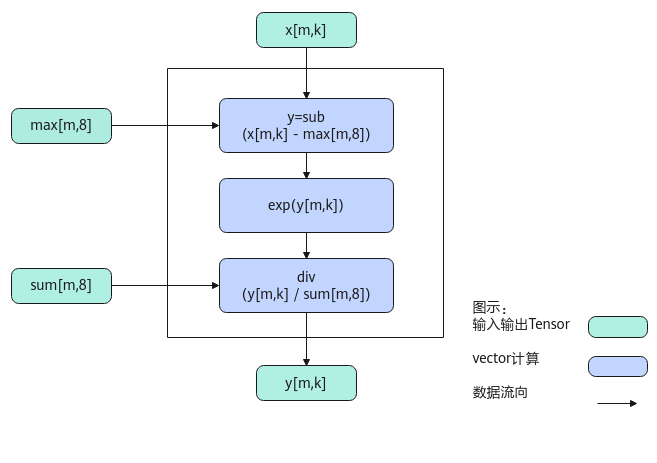

# SimpleSoftMax-SoftMax接口-激活函数-高阶API-Ascend C算子开发接口-API-CANN社区版8.5.0开发文档-昇腾社区

**页面ID:** atlasascendc_api_07_0755
**来源：** https://www.hiascend.com/document/detail/zh/CANNCommunityEdition/850/API/ascendcopapi/atlasascendc_api_07_0755.html
---

# SimpleSoftMax

#### 产品支持情况

| 产品                                        | 是否支持 |
| ------------------------------------------- | -------- |
| Atlas A3 训练系列产品/Atlas A3 推理系列产品 | √        |
| Atlas A2 训练系列产品/Atlas A2 推理系列产品 | √        |
| Atlas 200I/500 A2 推理产品                  | √        |
| Atlas推理系列产品AI Core                    | √        |
| Atlas推理系列产品Vector Core                | x        |
| Atlas训练系列产品                           | x        |

#### 功能说明

将输入tensor[m0, m1, ...mt, n]（t大于等于0）的非尾轴长度相乘的结果看作m，则输入tensor的shape看作[m, n]。对输入tensor[m,n]按行做如下计算，与SoftMax接口不同，该接口内部没有reduce过程计算sum和max数据，而是使用计算好的sum和max数据对输入tensor做Softmax计算。计算公式如下：

为方便理解，通过Python脚本实现的方式，表达其计算公式如下，其中src、max、sum是源操作数（输入），dst为目的操作数（输出）。

| 123 | defsimple_softmax(src,max,sum):dst=np.exp(src-max)/sumreturndst |
| --- | --------------------------------------------------------------- |

#### 实现原理

以float类型，ND格式，shape为[m, k]的输入Tensor为例，描述SimpleSoftMax高阶API内部算法框图，如下图所示。

计算过程分为如下几步，均在Vector上进行：

1.sub步骤：对输入x的所有数据按行减去输入的max；

2.exp步骤：对sub之后的所有数据求exp；

3.div步骤：对exp结果的所有数据按行除以输入的sum，得到结果；

#### 函数原型

- 接口框架申请临时空间LocalTensor的数据类型相同12template<typenameT,boolisReuseSource=false,boolisBasicBlock=false,boolisDataFormatNZ=false,constSoftmaxConfig&config=SOFTMAX_DEFAULT_CFG>__aicore__inlinevoidSimpleSoftMax(constLocalTensor<T>&dstTensor,constLocalTensor<T>&inSumTensor,constLocalTensor<T>&inMaxTensor,constLocalTensor<T>&srcTensor,constSoftMaxTiling&tiling,constSoftMaxShapeInfo&softmaxShapeInfo={})LocalTensor的数据类型不同12template<typenameT,boolisReuseSource=false,boolisBasicBlock=false,boolisDataFormatNZ=false,constSoftmaxConfig&config=SOFTMAX_DEFAULT_CFG>__aicore__inlinevoidSimpleSoftMax(constLocalTensor<half>&dstTensor,constLocalTensor<float>&inSumTensor,constLocalTensor<float>&inMaxTensor,constLocalTensor<half>&srcTensor,constSoftMaxTiling&tiling,constSoftMaxShapeInfo&softmaxShapeInfo={})

- 通过sharedTmpBuffer入参传入临时空间LocalTensor的数据类型相同12template<typenameT,boolisReuseSource=false,boolisBasicBlock=false,boolisDataFormatNZ=false,constSoftmaxConfig&config=SOFTMAX_DEFAULT_CFG>__aicore__inlinevoidSimpleSoftMax(constLocalTensor<T>&dstTensor,constLocalTensor<T>&inSumTensor,constLocalTensor<T>&inMaxTensor,constLocalTensor<T>&srcTensor,constLocalTensor<uint8_t>&sharedTmpBuffer,constSoftMaxTiling&tiling,constSoftMaxShapeInfo&softmaxShapeInfo={})LocalTensor的数据类型不同12template<typenameT,boolisReuseSource=false,boolisBasicBlock=false,boolisDataFormatNZ=false,constSoftmaxConfig&config=SOFTMAX_DEFAULT_CFG>__aicore__inlinevoidSimpleSoftMax(constLocalTensor<half>&dstTensor,constLocalTensor<float>&inSumTensor,constLocalTensor<float>&inMaxTensor,constLocalTensor<half>&srcTensor,constLocalTensor<uint8_t>&sharedTmpBuffer,constSoftMaxTiling&tiling,constSoftMaxShapeInfo&softmaxShapeInfo={})

由于该接口的内部实现中涉及复杂的计算，需要额外的临时空间来存储计算过程中的中间变量。临时空间支持接口框架申请和开发者通过sharedTmpBuffer入参传入两种方式。

- 接口框架申请临时空间，开发者无需申请，但是需要预留临时空间的大小。

- 通过sharedTmpBuffer入参传入，使用该tensor作为临时空间进行处理，接口框架不再申请。该方式开发者可以自行管理sharedTmpBuffer内存空间，并在接口调用完成后，复用该部分内存，内存不会反复申请释放，灵活性较高，内存利用率也较高。

接口框架申请的方式，开发者需要预留临时空间；通过sharedTmpBuffer传入的情况，开发者需要为tensor申请空间。临时空间大小BufferSize的获取方式如下：通过SoftMax/SimpleSoftMax Tiling中提供的GetSoftMaxMaxTmpSize/GetSoftMaxMinTmpSize接口获取所需最大和最小临时空间大小，最小空间可以保证功能正确，最大空间用于提升性能。

#### 参数说明

| 参数名         | 描述                                                                                                                                                                                                                                                                                                                                                                                                                                                                                                                                                                                                                                                                                                                                                                                                                                                                                                                                    |       |                                                                                                                                                                                                                                                                                                                                                                  |     |                                                       |
| -------------- | --------------------------------------------------------------------------------------------------------------------------------------------------------------------------------------------------------------------------------------------------------------------------------------------------------------------------------------------------------------------------------------------------------------------------------------------------------------------------------------------------------------------------------------------------------------------------------------------------------------------------------------------------------------------------------------------------------------------------------------------------------------------------------------------------------------------------------------------------------------------------------------------------------------------------------------- | ----- | ---------------------------------------------------------------------------------------------------------------------------------------------------------------------------------------------------------------------------------------------------------------------------------------------------------------------------------------------------------------- | --- | ----------------------------------------------------- |
| T              | 操作数的数据类型。Atlas A3 训练系列产品/Atlas A3 推理系列产品，支持的数据类型为：half、float。Atlas A2 训练系列产品/Atlas A2 推理系列产品，支持的数据类型为：half、float。Atlas推理系列产品AI Core，支持的数据类型为：half、float。Atlas 200I/500 A2 推理产品，支持的数据类型为：half、float。                                                                                                                                                                                                                                                                                                                                                                                                                                                                                                                                                                                                                                          |       |                                                                                                                                                                                                                                                                                                                                                                  |     |                                                       |
| isReuseSource  | 该参数预留，传入默认值false即可。                                                                                                                                                                                                                                                                                                                                                                                                                                                                                                                                                                                                                                                                                                                                                                                                                                                                                                       |       |                                                                                                                                                                                                                                                                                                                                                                  |     |                                                       |
| isBasicBlock   | srcTensor和dstTensor的shape信息和Tiling切分策略满足基本块要求的情况下，可以使能该参数用于提升性能，默认不使能。是否满足基本块的要求，可以采用如下两种方式之一判断：srcTensor和dstTensor的shape信息[m,n]需要满足如下条件：尾轴长度n小于2048并且大于等于256/sizeof(T)（即half场景下n最小为128，float场景下n最小为64），同时n是64的倍数；非尾轴长度的乘积m为8的倍数。在Tiling实现中，通过调用IsBasicBlockInSoftMax判断Tiling切分策略是否满足基本块的切分要求。针对Atlas 200/500 A2推理产品，该参数为预留参数，暂未启用，为后续的功能扩展做保留，保持默认值即可。                                                                                                                                                                                                                                                                                                                                                                           |       |                                                                                                                                                                                                                                                                                                                                                                  |     |                                                       |
| isDataFormatNZ | 当前输入输出的数据格式是否为NZ格式，默认数据格式为ND，即默认取值为false。针对Atlas 200/500 A2推理产品，不支持配置为NZ格式。                                                                                                                                                                                                                                                                                                                                                                                                                                                                                                                                                                                                                                                                                                                                                                                                             |       |                                                                                                                                                                                                                                                                                                                                                                  |     |                                                       |
| config         | 结构体模板参数，此参数可选配，SoftmaxConfig类型，具体定义如下。12345structSoftmaxConfig{boolisCheckTiling=true;// 是否需要检查shape和tiling的一致性；若不一致，API内会根据shape重新计算所需tiling。默认取值true：API内部会检查一致性uint32_toriSrcM=0;// 原始非尾轴长度的乘积。设置该参数后，将shape常量化，编译过程中使用常量化的shapeuint32_toriSrcK=0;// 原始尾轴长度。设置该参数后，将shape常量化，编译过程中使用常量化的shape};配置示例如下。1constexprSoftmaxConfigSOFTMAX_DEFAULT_CFG={true,0,0};此参数一般用于配合kernel侧tiling计算的接口使用。注意：config参数生效的优先级低于模板参数isBasicBlock，即使能isBasicBlock参数时，接口内部做基本块的切分优化，config参数的shape常量化不生效。Atlas A3 训练系列产品/Atlas A3 推理系列产品，支持该参数。Atlas A2 训练系列产品/Atlas A2 推理系列产品，支持该参数。Atlas推理系列产品AI Core，支持该参数。针对Atlas 200I/500 A2 推理产品，该参数为预留参数，暂未启用，保持默认值即可。 | 12345 | structSoftmaxConfig{boolisCheckTiling=true;// 是否需要检查shape和tiling的一致性；若不一致，API内会根据shape重新计算所需tiling。默认取值true：API内部会检查一致性uint32_toriSrcM=0;// 原始非尾轴长度的乘积。设置该参数后，将shape常量化，编译过程中使用常量化的shapeuint32_toriSrcK=0;// 原始尾轴长度。设置该参数后，将shape常量化，编译过程中使用常量化的shape}; | 1   | constexprSoftmaxConfigSOFTMAX_DEFAULT_CFG={true,0,0}; |
| 12345          | structSoftmaxConfig{boolisCheckTiling=true;// 是否需要检查shape和tiling的一致性；若不一致，API内会根据shape重新计算所需tiling。默认取值true：API内部会检查一致性uint32_toriSrcM=0;// 原始非尾轴长度的乘积。设置该参数后，将shape常量化，编译过程中使用常量化的shapeuint32_toriSrcK=0;// 原始尾轴长度。设置该参数后，将shape常量化，编译过程中使用常量化的shape};                                                                                                                                                                                                                                                                                                                                                                                                                                                                                                                                                                        |       |                                                                                                                                                                                                                                                                                                                                                                  |     |                                                       |
| 1              | constexprSoftmaxConfigSOFTMAX_DEFAULT_CFG={true,0,0};                                                                                                                                                                                                                                                                                                                                                                                                                                                                                                                                                                                                                                                                                                                                                                                                                                                                                   |       |                                                                                                                                                                                                                                                                                                                                                                  |     |                                                       |

| 参数名           | 输入/输出                                                                                                                                                               | 描述                                                                                                                                                                                                                                                                                                                                   |        |                                                                                                                                                                         |
| ---------------- | ----------------------------------------------------------------------------------------------------------------------------------------------------------------------- | -------------------------------------------------------------------------------------------------------------------------------------------------------------------------------------------------------------------------------------------------------------------------------------------------------------------------------------- | ------ | ----------------------------------------------------------------------------------------------------------------------------------------------------------------------- |
| dstTensor        | 输出                                                                                                                                                                    | 目的操作数。类型为LocalTensor，支持的TPosition为VECIN/VECCALC/VECOUT。dstTensor的shape和源操作数srcTensor一致。                                                                                                                                                                                                                        |        |                                                                                                                                                                         |
| inSumTensor      | 输入                                                                                                                                                                    | 源操作数。类型为LocalTensor，支持的TPosition为VECIN/VECCALC/VECOUT。softmax计算所需要的sum值。inSumTensor的last轴长度固定为32Byte，即一个datablock长度。该datablock中的所有数据为同一个值，比如half数据类型下，该datablock中的16个数均为相同的值。非last轴的长度需要与dstTensor保持一致。                                              |        |                                                                                                                                                                         |
| inMaxTensor      | 输入                                                                                                                                                                    | 源操作数。类型为LocalTensor，支持的TPosition为VECIN/VECCALC/VECOUT。softmax计算所需要的max值。inMaxTensor的last轴长度固定为32Byte，即一个datablock长度。该datablock中的所有数据为同一个值，比如half数据类型下，该datablock里的16个数均为相同的值。非last轴的长度需要与dstTensor保持一致。                                              |        |                                                                                                                                                                         |
| srcTensor        | 输入                                                                                                                                                                    | 源操作数。类型为LocalTensor，支持的TPosition为VECIN/VECCALC/VECOUT。last轴长度需要32B对齐。                                                                                                                                                                                                                                            |        |                                                                                                                                                                         |
| sharedTmpBuffer  | 输入                                                                                                                                                                    | 临时空间。类型为LocalTensor，支持的TPosition为VECIN/VECCALC/VECOUT。该操作数的数据类型固定uint8_t。接口内部复杂计算时用于存储中间变量，由开发者提供。临时空间大小BufferSize的获取方式请参考SoftMax/SimpleSoftMax Tiling。                                                                                                              |        |                                                                                                                                                                         |
| tiling           | 输入                                                                                                                                                                    | softmax计算所需tiling信息，Tiling信息的获取请参考SoftMax/SimpleSoftMax Tiling。                                                                                                                                                                                                                                                        |        |                                                                                                                                                                         |
| softmaxShapeInfo | 输入                                                                                                                                                                    | srcTensor的shape信息。SoftMaxShapeInfo类型，具体定义如下：123456structSoftMaxShapeInfo{uint32_tsrcM;// 非尾轴长度的乘积uint32_tsrcK;// 尾轴长度，必须32Byte对齐uint32_toriSrcM;// 原始非尾轴长度的乘积uint32_toriSrcK;// 原始尾轴长度};需要注意，当输入输出的数据格式为NZ格式时，尾轴长度为reduce轴长度即图2中的W0*W1，非尾轴为H0*H1。 | 123456 | structSoftMaxShapeInfo{uint32_tsrcM;// 非尾轴长度的乘积uint32_tsrcK;// 尾轴长度，必须32Byte对齐uint32_toriSrcM;// 原始非尾轴长度的乘积uint32_toriSrcK;// 原始尾轴长度}; |
| 123456           | structSoftMaxShapeInfo{uint32_tsrcM;// 非尾轴长度的乘积uint32_tsrcK;// 尾轴长度，必须32Byte对齐uint32_toriSrcM;// 原始非尾轴长度的乘积uint32_toriSrcK;// 原始尾轴长度}; |                                                                                                                                                                                                                                                                                                                                        |        |                                                                                                                                                                         |

#### 返回值说明

无

#### 约束说明

- srcTensor和dstTensor的Tensor空间可以复用。
- inSumTensor和inMaxTensor为输入，并且last轴长度必须固定32Byte。
- inSumTensor和inMaxTensor的数据类型需要保持一致。
- 操作数地址对齐要求请参见通用地址对齐约束。
- 不支持sharedTmpBuffer与源操作数和目的操作数地址重叠。
- 当参数softmaxShapeInfo中srcM != oriSrcM或者srcK != oriSrcK时，开发者需要对GM上的原始输入(oriSrcM, oriSrcK)在M或K方向补齐数据到(srcM, srcK)，补齐的数据会参与部分运算，在输入输出复用的场景下，API的计算结果会覆盖srcTensor中补齐的原始数据，在输入输出不复用的场景下，API的计算结果会覆盖dstTensor中对应srcTensor补齐位置的数据。

#### 调用示例

| 12345678910111213141516171819202122232425262728293031323334353637383940414243444546474849505152535455565758596061626364656667686970717273747576777879808182838485868788 | #include"kernel_operator.h"// constexpr AscendC:SoftmaxConfig static_config = {true, 320, 64}; shape常量化使用template<typenameT>classKernelSimpleSoftmax{public:__aicore__inlineKernelSimpleSoftmax(){}__aicore__inlinevoidInit(__gm__uint8_t*srcGm,__gm__uint8_t*inMaxGm,__gm__uint8_t*inSumGm,__gm__uint8_t*dstGm,constSoftMaxTiling&tilingData){elementNumPerBlk=32/sizeof(T);srcGlobal.SetGlobalBuffer((__gm__T*)srcGm);dstGlobal.SetGlobalBuffer((__gm__T*)dstGm);maxGlobal.SetGlobalBuffer((__gm__T*)inMaxGm);sumGlobal.SetGlobalBuffer((__gm__T*)inSumGm);pipe.InitBuffer(inQueueSrc,1,height*width*sizeof(T));pipe.InitBuffer(maxQueue,1,height*elementNumPerBlk*sizeof(T));pipe.InitBuffer(sumQueue,1,height*elementNumPerBlk*sizeof(T));pipe.InitBuffer(outQueueDst,1,height*width*sizeof(T));tiling=tilingData;}__aicore__inlinevoidProcess(){CopyIn();Compute();CopyOut();}private:__aicore__inlinevoidCopyIn(){AscendC:LocalTensor<T>srcLocal=inQueueSrc.AllocTensor<T>();AscendC:LocalTensor<T>sumTempLocal=sumQueue.AllocTensor<T>();AscendC:LocalTensor<T>maxTempLocal=maxQueue.AllocTensor<T>();AscendC:DataCopy(srcLocal,srcGlobal,height*width);AscendC:DataCopy(sumTempLocal,sumGlobal,height*elementNumPerBlk);AscendC:DataCopy(maxTempLocal,maxGlobal,height*elementNumPerBlk);inQueueSrc.EnQue(srcLocal);sumQueue.EnQue(sumTempLocal);maxQueue.EnQue(maxTempLocal);}__aicore__inlinevoidCompute(){AscendC:LocalTensor<T>srcLocal=inQueueSrc.DeQue<T>();AscendC:LocalTensor<T>sumTempLocal=sumQueue.DeQue<T>();AscendC:LocalTensor<T>maxTempLocal=maxQueue.DeQue<T>();AscendC:LocalTensor<T>dstLocal=outQueueDst.AllocTensor<T>();AscendC:SoftMaxShapeInfosrcShape={height,width,height,width};AscendC:SimpleSoftMax<T>(dstLocal,sumTempLocal,maxTempLocal,srcLocal,tiling,srcShape);//AscendC:SimpleSoftMax<T, false, false, static_config>(dstLocal, sumTempLocal, maxTempLocal, srcLocal, tiling, //srcShape);使用SoftmaxConfig类型的参数static_config，传入模板参数将shape常量化outQueueDst.EnQue<T>(dstLocal);maxQueue.FreeTensor(maxTempLocal);sumQueue.FreeTensor(sumTempLocal);inQueueSrc.FreeTensor(srcLocal);}__aicore__inlinevoidCopyOut(){AscendC:LocalTensor<T>dstLocal=outQueueDst.DeQue<T>();AscendC:DataCopy(dstGlobal,dstLocal,height*width);outQueueDst.FreeTensor(dstLocal);}private:AscendC:TPipepipe;AscendC:TQue<AscendC:TPosition:VECIN,1>inQueueSrc;AscendC:TQue<AscendC:TPosition:VECIN,1>maxQueue;AscendC:TQue<AscendC:TPosition:VECIN,1>sumQueue;AscendC:TQue<AscendC:TPosition:VECOUT,1>outQueueDst;AscendC:GlobalTensor<T>srcGlobal,dstGlobal;AscendC:GlobalTensor<T>maxGlobal,sumGlobal;uint32_telementNumPerBlk=0;uint32_twidth=64;uint32_theight=320;SoftMaxTilingtiling;};extern"C"__global____aicore__voidsimple_softmax_kernel_half(__gm__uint8_t*srcGm,__gm__uint8_t*inMaxGm,__gm__uint8_t*inSumGm,__gm__uint8_t*dstGm,__gm__uint8_t*tiling){GET_TILING_DATA(tilingData,tiling);KernelSimpleSoftmax<half>op;op.Init(srcGm,inMaxGm,inSumGm,dstGm,tilingData.softmaxTilingData);op.Process();} |
| ----------------------------------------------------------------------------------------------------------------------------------------------------------------------- | ------------------------------------------------------------------------------------------------------------------------------------------------------------------------------------------------------------------------------------------------------------------------------------------------------------------------------------------------------------------------------------------------------------------------------------------------------------------------------------------------------------------------------------------------------------------------------------------------------------------------------------------------------------------------------------------------------------------------------------------------------------------------------------------------------------------------------------------------------------------------------------------------------------------------------------------------------------------------------------------------------------------------------------------------------------------------------------------------------------------------------------------------------------------------------------------------------------------------------------------------------------------------------------------------------------------------------------------------------------------------------------------------------------------------------------------------------------------------------------------------------------------------------------------------------------------------------------------------------------------------------------------------------------------------------------------------------------------------------------------------------------------------------------------------------------------------------------------------------------------------------------------------------------------------------------------------------------------------------------------------------------------------------------------------------------------------------------------------------------------------------------------------------------------------------------------------------------------------------------------------------------------------------------------------------------------------------------------------------------------------------------------------------------------------------------------------------------------------------------------------------------------------------------------------------------------------------------------------------------------------------------------------------------------------------------------------------------------------------------------------------------------------------------------------------------------------------------------------------------------------------------------------------------------------------------------------------------------------------------------------------------------------------------------------------- |
