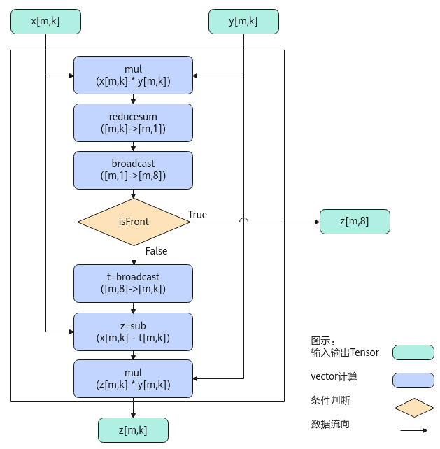

# SoftmaxGrad-SoftMax接口-激活函数-高阶API-Ascend C算子开发接口-API-CANN社区版8.5.0开发文档-昇腾社区

**页面ID:** atlasascendc_api_07_0757
**来源：** https://www.hiascend.com/document/detail/zh/CANNCommunityEdition/850/API/ascendcopapi/atlasascendc_api_07_0757.html
---

# SoftmaxGrad

#### 产品支持情况

| 产品                                        | 是否支持 |
| ------------------------------------------- | -------- |
| Atlas A3 训练系列产品/Atlas A3 推理系列产品 | √        |
| Atlas A2 训练系列产品/Atlas A2 推理系列产品 | √        |
| Atlas 200I/500 A2 推理产品                  | √        |
| Atlas推理系列产品AI Core                    | √        |
| Atlas推理系列产品Vector Core                | x        |
| Atlas训练系列产品                           | x        |

#### 功能说明

将输入tensor[m0, m1, ...mt, n]（t大于等于0）的非尾轴长度相乘的结果看作m，则输入tensor的shape看作[m, n]。对输入tensor[m,n]按行做grad反向计算，计算公式如下：

当输入shape为ND格式时，内部的reduce过程按last轴进行；当输入shape为NZ格式时，内部的reduce过程按照last轴和first轴进行，reduce过程可以参考SoftMax中的图示说明。

为方便理解，通过Python脚本实现的方式，表达其计算公式如下，其中src、grad、isFront是源操作数（输入），dst为目的操作数（输出）。

| 1234567 | defsoftmax_grad(grad,src,isFront=None):dst=grad*srcdst=np.sum(dst,axis=-1,keepdims=True)ifisFront:returndstdst=(grad-dst)*srcreturndst |
| ------- | -------------------------------------------------------------------------------------------------------------------------------------- |

#### 实现原理

以float类型，ND格式，shape为[m,k]的输入Tensor为例，描述SoftmaxGrad高阶API内部算法框图，如下图所示。

计算过程分为如下几步，均在Vector上进行：

1. mul步骤：对输入x和y所有数据相乘，计算结果会保存到一个临时空间temp中；
1. reducesum步骤：对temp数据([m, k])每一行求和得到[m, 1]，计算结果会保存到临时空间中；
1. broadcast步骤：对reducesum结果[m, 1]的数据做一个按datablock为单位的填充，比如float类型下，把[m, 1]扩展成[m, 8]；
1. 判断是否isFront模式，如果是，则输出broadcast后的结果，计算结束；如果不是，则继续执行后续步骤；
1. broadcast步骤：对[m, 8]做一个扩维，扩展成[m, k]，计算结果会保存到临时空间中；
1. sub步骤：输入x的所有数据减去上一步broadcast后的结果；
1. mul步骤：sub后的所有数据和输入y相乘，输出结果z。

#### 函数原型

- 接口框架申请临时空间12template<typenameT,boolisReuseSource=false,boolisDataFormatNZ=false>__aicore__inlinevoidSoftmaxGrad(constLocalTensor<T>&dstTensor,constLocalTensor<T>&gradTensor,constLocalTensor<T>&srcTensor,constSoftMaxTiling&tiling,boolisFront=false,constSoftMaxShapeInfo&softmaxShapeInfo={})

- 通过sharedTmpBuffer入参传入临时空间12template<typenameT,boolisReuseSource=false,boolisDataFormatNZ=false>__aicore__inlinevoidSoftmaxGrad(constLocalTensor<T>&dstTensor,constLocalTensor<T>&gradTensor,constLocalTensor<T>&srcTensor,constLocalTensor<uint8_t>&sharedTmpBuffer,constSoftMaxTiling&tiling,boolisFront=false,constSoftMaxShapeInfo&softmaxShapeInfo={})

由于该接口的内部实现中涉及复杂的计算，需要额外的临时空间来存储计算过程中的中间变量。临时空间支持接口框架申请和开发者通过sharedTmpBuffer入参传入两种方式。

- 接口框架申请临时空间，开发者无需申请，但是需要预留临时空间的大小。

- 通过sharedTmpBuffer入参传入，使用该tensor作为临时空间进行处理，接口框架不再申请。该方式开发者可以自行管理sharedTmpBuffer内存空间，并在接口调用完成后，复用该部分内存，内存不会反复申请释放，灵活性较高，内存利用率也较高。

接口框架申请的方式，开发者需要预留临时空间；通过sharedTmpBuffer传入的情况，开发者需要为tensor申请空间。临时空间大小BufferSize的获取方式如下：通过SoftmaxGrad Tiling接口中提供的GetSoftMaxGradMaxTmpSize/GetSoftMaxGradMinTmpSize接口获取所需最大和最小临时空间大小，最小空间可以保证功能正确，最大空间用于提升性能。

#### 参数说明

| 参数名         | 描述                                                                                                                                                                                                                                                                                           |
| -------------- | ---------------------------------------------------------------------------------------------------------------------------------------------------------------------------------------------------------------------------------------------------------------------------------------------- |
| T              | 操作数的数据类型。Atlas A3 训练系列产品/Atlas A3 推理系列产品，支持的数据类型为：half、float。Atlas A2 训练系列产品/Atlas A2 推理系列产品，支持的数据类型为：half、float。Atlas 200I/500 A2 推理产品，支持的数据类型为：half、float。Atlas推理系列产品AI Core，支持的数据类型为：half、float。 |
| isReuseSource  | 该参数预留，传入默认值false即可。                                                                                                                                                                                                                                                              |
| isDataFormatNZ | 当前输入输出的数据格式是否为NZ格式，默认数据格式为ND，即默认取值为false。针对Atlas 200I/500 A2 推理产品，不支持配置为NZ格式。                                                                                                                                                                  |

| 参数名           | 输入/输出                                                                                                                                                               | 描述                                                                                                                                                                                                                                                                                                                                   |        |                                                                                                                                                                         |
| ---------------- | ----------------------------------------------------------------------------------------------------------------------------------------------------------------------- | -------------------------------------------------------------------------------------------------------------------------------------------------------------------------------------------------------------------------------------------------------------------------------------------------------------------------------------- | ------ | ----------------------------------------------------------------------------------------------------------------------------------------------------------------------- |
| dstTensor        | 输出                                                                                                                                                                    | 目的操作数。类型为LocalTensor，支持的TPosition为VECIN/VECCALC/VECOUT。last轴长度需要32Byte对齐，dstTensor的shape与gradTensor，srcTensor的shape一致。                                                                                                                                                                                   |        |                                                                                                                                                                         |
| gradTensor       | 输入                                                                                                                                                                    | 源操作数。类型为LocalTensor，支持的TPosition为VECIN/VECCALC/VECOUT。last轴长度需要32Byte对齐，gradTensor的shape与dstTensor，srcTensor的shape一致。                                                                                                                                                                                     |        |                                                                                                                                                                         |
| srcTensor        | 输入                                                                                                                                                                    | 源操作数。类型为LocalTensor，支持的TPosition为VECIN/VECCALC/VECOUT。last轴长度需要32Byte对齐，srcTensor的shape与dstTensor，gradTensor的shape一致。                                                                                                                                                                                     |        |                                                                                                                                                                         |
| sharedTmpBuffer  | 输入                                                                                                                                                                    | 临时空间。类型为LocalTensor，支持的TPosition为VECIN/VECCALC/VECOUT。该操作数的数据类型固定uint8_t。接口内部复杂计算时用于存储中间变量，由开发者提供。临时空间大小BufferSize的获取方式请参考SoftmaxGrad Tiling接口。                                                                                                                    |        |                                                                                                                                                                         |
| softmaxShapeInfo | 输入                                                                                                                                                                    | srcTensor的shape信息。SoftMaxShapeInfo类型，具体定义如下：123456structSoftMaxShapeInfo{uint32_tsrcM;// 非尾轴长度的乘积uint32_tsrcK;// 尾轴长度，必须32Byte对齐uint32_toriSrcM;// 原始非尾轴长度的乘积uint32_toriSrcK;// 原始尾轴长度};需要注意，当输入输出的数据格式为NZ格式时，尾轴长度为reduce轴长度即图2中的W0*W1，非尾轴为H0*H1。 | 123456 | structSoftMaxShapeInfo{uint32_tsrcM;// 非尾轴长度的乘积uint32_tsrcK;// 尾轴长度，必须32Byte对齐uint32_toriSrcM;// 原始非尾轴长度的乘积uint32_toriSrcK;// 原始尾轴长度}; |
| 123456           | structSoftMaxShapeInfo{uint32_tsrcM;// 非尾轴长度的乘积uint32_tsrcK;// 尾轴长度，必须32Byte对齐uint32_toriSrcM;// 原始非尾轴长度的乘积uint32_toriSrcK;// 原始尾轴长度}; |                                                                                                                                                                                                                                                                                                                                        |        |                                                                                                                                                                         |
| tiling           | 输入                                                                                                                                                                    | softmaxgrad计算所需tiling信息，Tiling信息的获取请参考SoftmaxGrad Tiling接口。                                                                                                                                                                                                                                                          |        |                                                                                                                                                                         |
| isFront          | 输入                                                                                                                                                                    | 是否使能isFront计算，若为True，dstTensor的last轴长度必须固定32Byte。                                                                                                                                                                                                                                                                   |        |                                                                                                                                                                         |

#### 返回值说明

无

#### 约束说明

- srcTensor和dstTensor的Tensor空间可以复用。
- 操作数地址对齐要求请参见通用地址对齐约束。
- 不支持sharedTmpBuffer与源操作数和目的操作数地址重叠。
- 当参数softmaxShapeInfo中srcM != oriSrcM或者srcK != oriSrcK时，开发者需要对GM上的原始输入(oriSrcM, oriSrcK)在M或K方向补齐数据到(srcM, srcK)，补齐的数据会参与部分运算，在输入输出复用的场景下，API的计算结果会覆盖srcTensor中补齐的原始数据，在输入输出不复用的场景下，API的计算结果会覆盖dstTensor中对应srcTensor补齐位置的数据。

#### 调用示例

| 1234567891011121314151617181920212223242526272829303132333435363738394041424344454647484950515253545556575859606162636465666768697071727374757677 | #include"kernel_operator.h"template<typenameT>classKernelSoftmaxGrad{public:__aicore__inlineKernelSoftmaxGrad(){}__aicore__inlinevoidInit(__gm__uint8_t*src1Gm,__gm__uint8_t*src2Gm,__gm__uint8_t*dstGm,constSoftMaxTiling&tilingData){elementNumPerBlk=32/sizeof(T);src1Global.SetGlobalBuffer((__gm__T*)src1Gm);src2Global.SetGlobalBuffer((__gm__T*)src2Gm);dstGlobal.SetGlobalBuffer((__gm__T*)dstGm);pipe.InitBuffer(inQueueSrc1,1,height*width*sizeof(T));pipe.InitBuffer(inQueueSrc2,1,height*width*sizeof(T));pipe.InitBuffer(outQueueDst,1,height*width*sizeof(T));tiling=tilingData;}__aicore__inlinevoidProcess(){CopyIn();Compute();CopyOut();}private:__aicore__inlinevoidCopyIn(){AscendC:LocalTensor<T>srcLocal1=inQueueSrc1.AllocTensor<T>();AscendC:LocalTensor<T>srcLocal2=inQueueSrc2.AllocTensor<T>();AscendC:DataCopy(srcLocal1,src1Global,height*width);AscendC:DataCopy(srcLocal2,src2Global,height*width);inQueueSrc1.EnQue(srcLocal1);inQueueSrc2.EnQue(srcLocal2);}__aicore__inlinevoidCompute(){AscendC:LocalTensor<T>srcLocal1=inQueueSrc1.DeQue<T>();AscendC:LocalTensor<T>srcLocal2=inQueueSrc2.DeQue<T>();AscendC:LocalTensor<T>dstLocal=outQueueDst.AllocTensor<T>();AscendC:SoftMaxShapeInfosrcShape={height,width,height,width};AscendC:SoftmaxGrad<T>(dstLocal,srcLocal2,srcLocal1,tiling,false,srcShape);outQueueDst.EnQue<T>(dstLocal);inQueueSrc1.FreeTensor(srcLocal1);inQueueSrc2.FreeTensor(srcLocal2);}__aicore__inlinevoidCopyOut(){AscendC:LocalTensor<T>dstLocal=outQueueDst.DeQue<T>();AscendC:DataCopy(dstGlobal,dstLocal,height*width);outQueueDst.FreeTensor(dstLocal);}private:AscendC:TPipepipe;AscendC:TQue<AscendC:TPosition:VECIN,1>inQueueSrc1;AscendC:TQue<AscendC:TPosition:VECIN,1>inQueueSrc2;AscendC:TQue<AscendC:TPosition:VECOUT,1>outQueueDst;AscendC:GlobalTensor<T>src1Global,src2Global,dstGlobal;uint32_telementNumPerBlk=0;uint32_twidth=64;uint32_theight=128;SoftMaxTilingtiling;};extern"C"__global____aicore__voidsoftmax_grad_kernel_half(__gm__uint8_t*src1Gm,__gm__uint8_t*src2Gm,__gm__uint8_t*dstGm,__gm__uint8_t*tiling){GET_TILING_DATA(tilingData,tiling);KernelSoftmaxGrad<half>op;op.Init(src1Gm,src2Gm,dstGm,tilingData.softmaxTilingData);op.Process();} |
| ------------------------------------------------------------------------------------------------------------------------------------------------- | -------------------------------------------------------------------------------------------------------------------------------------------------------------------------------------------------------------------------------------------------------------------------------------------------------------------------------------------------------------------------------------------------------------------------------------------------------------------------------------------------------------------------------------------------------------------------------------------------------------------------------------------------------------------------------------------------------------------------------------------------------------------------------------------------------------------------------------------------------------------------------------------------------------------------------------------------------------------------------------------------------------------------------------------------------------------------------------------------------------------------------------------------------------------------------------------------------------------------------------------------------------------------------------------------------------------------------------------------------------------------------------------------------------------------------------------------------------------------------------------------------------------------------------------------------------------------------------------------------------------------------------------------------------------------------------------------------------------------------------------------------------------------------------------------------------------------------------------------------------------------------------------------------------------------------------------------------------------------------------------------------------------------------------------------------------------------------------------------------------------------------------------------------------------------------------------------------------------------------------------- |
