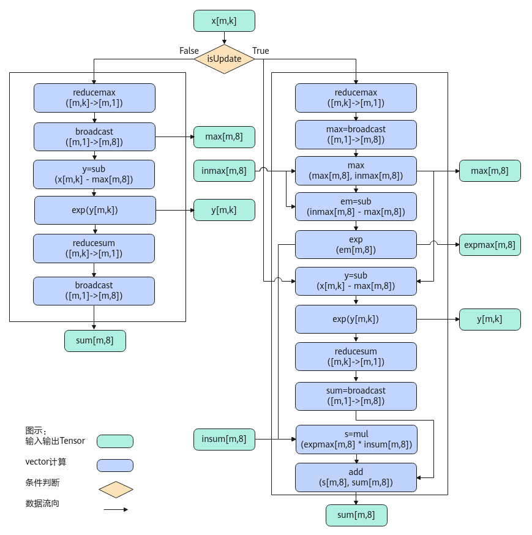

# SoftmaxFlashV2-SoftMax接口-激活函数-高阶API-Ascend C算子开发接口-API-CANN社区版8.5.0开发文档-昇腾社区

**页面ID:** atlasascendc_api_07_0758
**来源：** https://www.hiascend.com/document/detail/zh/CANNCommunityEdition/850/API/ascendcopapi/atlasascendc_api_07_0758.html
---

# SoftmaxFlashV2

#### 产品支持情况

| 产品                                        | 是否支持 |
| ------------------------------------------- | -------- |
| Atlas A3 训练系列产品/Atlas A3 推理系列产品 | √        |
| Atlas A2 训练系列产品/Atlas A2 推理系列产品 | √        |
| Atlas 200I/500 A2 推理产品                  | √        |
| Atlas推理系列产品AI Core                    | √        |
| Atlas推理系列产品Vector Core                | x        |
| Atlas训练系列产品                           | x        |

#### 功能说明

SoftmaxFlash增强版本，对应FlashAttention-2算法。将输入tensor[m0, m1, ...mt, n]（t大于等于0）的非尾轴长度相乘的结果看作m，则输入tensor的shape看作[m, n]。对输入tensor[m,n]按行做如下计算，不同的update值对应不同的计算公式，其中x、inmax和insum为输入，M、S、E均为输出。

- update为false：
- update为true：

当输入shape为ND格式时，内部的reduce过程按last轴进行；当输入shape为NZ格式时，内部的reduce过程按照last轴和first轴进行，reduce过程可以参考SoftMax中的图示说明。

为方便理解，通过Python脚本实现的方式，表达其计算公式如下，其中src、inmax、 insum、update为输入，dst、x_sum、x_max、exp_max为输出。

| 123456789101112131415 | defsoftmax_flash_2(src,inmax=None,insum=None,update=None):ifupdate==None:x_max=np.max(src,axis=-1,keepdims=True)x_sub=src-x_maxdst=np.exp(x_sub)x_sum=np.sum(dst,axis=-1,keepdims=True)exp_max=Nonereturndst,x_max,x_sum,exp_maxelse:x_max=np.max(np.concatenate((inmax,src),axis=-1),axis=-1,keepdims=True)dst=np.exp(src-x_max)exp_max=np.exp(inmax-x_max)x_sum=np.sum(dst,axis=-1,keepdims=True)x_sum=exp_max*insum+x_sumreturndst,x_max,x_sum,exp_max |
| --------------------- | --------------------------------------------------------------------------------------------------------------------------------------------------------------------------------------------------------------------------------------------------------------------------------------------------------------------------------------------------------------------------------------------------------------------------------------------------------- |

#### 实现原理

以float类型，ND格式，shape为[m, k]的输入Tensor为例，描述SoftmaxFlashV2高阶API内部算法框图，如下图所示。

计算过程根据isUpdate是否使能分为两个分支处理，均在Vector上进行。

- 当isUpdate为False时，分为如下几步：reducemax步骤：对输入x的每一行数据求最大值得到[m, 1]，计算结果会保存到一个临时空间temp中；broadcast步骤：对temp中的数据[m, 1]做一个按datablock为单位的填充，比如float类型下，把[m, 1]扩展成[m, 8]，同时输出max；sub步骤：对输入x的所有数据按行减去max；exp步骤：对sub之后的所有数据求exp，并且输出y；reducesum步骤：对exp结果的每一行数据求和得到[m, 1]，计算结果会保存到临时空间temp中；broadcast步骤：对temp[m, 1]做一个按datablock为单位的填充，比如float类型下，把[m, 1]扩展成[m, 8]，同时输出sum。

- 当isUpdate为True时，分为如下几步：reducemax步骤：对输入x的每一行数据求最大值得到[m, 1]，计算结果会保存到一个临时空间temp中；broadcast步骤：对temp中的数据[m, 1]做一个按datablock为单位的填充，比如float类型下，把[m, 1]扩展成[m, 8]，保存为max;max步骤：对输入inmax和上一步计算的max做max操作，得到新的max并输出；sub步骤：将输入inmax和新的max相减，然后做exp，计算得到expmax并输出；sub步骤：将输入x和新的max按行相减；exp步骤：对sub之后的所有数据求exp，并且输出y；reducesum步骤：对exp结果的每一行数据求和得到[m, 1]，计算结果会保存到临时空间temp中；broadcast步骤：对temp数据[m, 1]做一个按datablock为单位的填充，比如float类型下，把[m, 1]扩展成[m, 8]，保存到sum中；mul步骤：将输入insum和expmax结果相乘；add步骤：将相乘结果和sum相加，保存到sum并输出。

#### 函数原型

- 接口框架申请临时空间LocalTensor的数据类型相同，不输出ReduceMax12template<typenameT,boolisUpdate=false,boolisReuseSource=false,boolisBasicBlock=false,boolisDataFormatNZ=false,constSoftmaxConfig&config=SOFTMAX_DEFAULT_CFG>__aicore__inlinevoidSoftmaxFlashV2(constLocalTensor<T>&dstTensor,constLocalTensor<T>&expSumTensor,constLocalTensor<T>&maxTensor,constLocalTensor<T>&srcTensor,constLocalTensor<T>&expMaxTensor,constLocalTensor<T>&inExpSumTensor,constLocalTensor<T>&inMaxTensor,constSoftMaxTiling&tiling,constSoftMaxShapeInfo&softmaxShapeInfo={})LocalTensor的数据类型相同，且输出ReduceMax12template<typenameT,boolisUpdate=false,boolisReuseSource=false,boolisBasicBlock=false,boolisDataFormatNZ=false,constSoftmaxConfig&config=SOFTMAX_DEFAULT_CFG>__aicore__inlinevoidSoftmaxFlashV2(constLocalTensor<T>&dstTensor,constLocalTensor<T>&outReduceMax,constLocalTensor<T>&outExpSum,constLocalTensor<T>&outMax,constLocalTensor<T>&srcTensor,constLocalTensor<T>&outExpMax,constLocalTensor<T>&inExpSum,constLocalTensor<T>&inMax,constSoftMaxTiling&tiling,constSoftMaxShapeInfo&softmaxShapeInfo={})Atlas 200I/500 A2 推理产品不支持该接口。Atlas推理系列产品AI Core不支持该接口。LocalTensor的数据类型不同，不输出ReduceMax12template<typenameT,boolisUpdate=false,boolisReuseSource=false,boolisBasicBlock=false,boolisDataFormatNZ=false,constSoftmaxConfig&config=SOFTMAX_DEFAULT_CFG>__aicore__inlinevoidSoftmaxFlashV2(constLocalTensor<half>&dstTensor,constLocalTensor<float>&expSumTensor,constLocalTensor<float>&maxTensor,constLocalTensor<half>&srcTensor,constLocalTensor<half>&expMaxTensor,constLocalTensor<float>&inExpSumTensor,constLocalTensor<float>&inMaxTensor,constSoftMaxTiling&tiling,constSoftMaxShapeInfo&softmaxShapeInfo={})

- 通过sharedTmpBuffer入参传入临时空间LocalTensor的数据类型相同，不输出ReduceMax12template<typenameT,boolisUpdate=false,boolisReuseSource=false,boolisBasicBlock=false,boolisDataFormatNZ=false,constSoftmaxConfig&config=SOFTMAX_DEFAULT_CFG>__aicore__inlinevoidSoftmaxFlashV2(constLocalTensor<T>&dstTensor,constLocalTensor<T>&outExpSum,constLocalTensor<T>&outMax,constLocalTensor<T>&srcTensor,constLocalTensor<T>&outExpMax,constLocalTensor<T>&inExpSum,constLocalTensor<T>&inMax,constLocalTensor<uint8_t>&sharedTmpBuffer,constSoftMaxTiling&tiling,constSoftMaxShapeInfo&softmaxShapeInfo={})LocalTensor的数据类型相同，且输出ReduceMax12template<typenameT,boolisUpdate=false,boolisReuseSource=false,boolisBasicBlock=false,boolisDataFormatNZ=false,constSoftmaxConfig&config=SOFTMAX_DEFAULT_CFG>__aicore__inlinevoidSoftmaxFlashV2(constLocalTensor<T>&dstTensor,constLocalTensor<T>&outReduceMax,constLocalTensor<T>&expSumTensor,constLocalTensor<T>&maxTensor,constLocalTensor<T>&srcTensor,constLocalTensor<T>&expMaxTensor,constLocalTensor<T>&inExpSumTensor,constLocalTensor<T>&inMaxTensor,constLocalTensor<uint8_t>&sharedTmpBuffer,constSoftMaxTiling&tiling,constSoftMaxShapeInfo&softmaxShapeInfo={})Atlas 200I/500 A2 推理产品不支持该接口。Atlas推理系列产品AI Core不支持该接口。LocalTensor的数据类型不同，不输出ReduceMax12template<typenameT,boolisUpdate=false,boolisReuseSource=false,boolisBasicBlock=false,boolisDataFormatNZ=false,constSoftmaxConfig&config=SOFTMAX_DEFAULT_CFG>__aicore__inlinevoidSoftmaxFlashV2(constLocalTensor<half>&dstTensor,constLocalTensor<float>&expSumTensor,constLocalTensor<float>&maxTensor,constLocalTensor<half>&srcTensor,constLocalTensor<half>&expMaxTensor,constLocalTensor<float>&inExpSumTensor,constLocalTensor<float>&inMaxTensor,constLocalTensor<uint8_t>&sharedTmpBuffer,constSoftMaxTiling&tiling,constSoftMaxShapeInfo&softmaxShapeInfo={})

由于该接口的内部实现中涉及复杂的计算，需要额外的临时空间来存储计算过程中的中间变量。临时空间支持接口框架申请和开发者通过sharedTmpBuffer入参传入两种方式。

- 接口框架申请临时空间，开发者无需申请，但是需要预留临时空间的大小。

- 通过sharedTmpBuffer入参传入，使用该tensor作为临时空间进行处理，接口框架不再申请。该方式开发者可以自行管理sharedTmpBuffer内存空间，并在接口调用完成后，复用该部分内存，内存不会反复申请释放，灵活性较高，内存利用率也较高。

接口框架申请的方式，开发者需要预留临时空间；通过sharedTmpBuffer传入的情况，开发者需要为tensor申请空间。临时空间大小BufferSize的获取方式如下：通过SoftmaxFlashV2 Tiling接口中提供的GetSoftMaxFlashV2MinTmpSize/GetSoftMaxFlashV2MaxTmpSize接口获取所需最小和最大临时空间大小，最小空间可以保证功能正确，最大空间用于提升性能。

另外提供了一个kernel侧tiling计算的接口，当kernel侧的输入shape与通过host侧TilingData传入的shape不一致时，可使用该接口在kernel侧重新计算tiling。该接口的参数含义请参考SoftmaxFlashV2 Tiling接口。

- kernel侧tiling计算接口1__aicore__inlineconstexprSoftMaxTilingSoftMaxFlashV2TilingFunc(constSoftMaxShapeInfo&shapeInfo,constuint32_tdataTypeSize1,constuint32_tdataTypeSize2,constuint32_tlocalWorkSpaceSize,constboolisUpdate=false,constboolisBasicBlock=false,constboolisDataFormatNZ=false,constboolisFlashOutputBrc=false)

#### 参数说明

| 参数名         | 描述                                                                                                                                                                                                                                                                                                                                                                                                                                                                                                                                                                                                                                                                                                                                                                                                                                                                                                                                                                                                                                                                                                                                                                                                                                                                                                                                                                                                                                                  |        |                                                                                                                                                                                                                                                                                                                                                                                                                                   |     |                                                                                  |
| -------------- | ----------------------------------------------------------------------------------------------------------------------------------------------------------------------------------------------------------------------------------------------------------------------------------------------------------------------------------------------------------------------------------------------------------------------------------------------------------------------------------------------------------------------------------------------------------------------------------------------------------------------------------------------------------------------------------------------------------------------------------------------------------------------------------------------------------------------------------------------------------------------------------------------------------------------------------------------------------------------------------------------------------------------------------------------------------------------------------------------------------------------------------------------------------------------------------------------------------------------------------------------------------------------------------------------------------------------------------------------------------------------------------------------------------------------------------------------------- | ------ | --------------------------------------------------------------------------------------------------------------------------------------------------------------------------------------------------------------------------------------------------------------------------------------------------------------------------------------------------------------------------------------------------------------------------------- | --- | -------------------------------------------------------------------------------- |
| T              | 操作数的数据类型。Atlas A3 训练系列产品/Atlas A3 推理系列产品，支持的数据类型为：half、float。Atlas A2 训练系列产品/Atlas A2 推理系列产品，支持的数据类型为：half、float。Atlas 200I/500 A2 推理产品，支持的数据类型为：half、float。Atlas推理系列产品AI Core，支持的数据类型为：half、float。                                                                                                                                                                                                                                                                                                                                                                                                                                                                                                                                                                                                                                                                                                                                                                                                                                                                                                                                                                                                                                                                                                                                                        |        |                                                                                                                                                                                                                                                                                                                                                                                                                                   |     |                                                                                  |
| isUpdate       | 是否使能update部分中的计算。                                                                                                                                                                                                                                                                                                                                                                                                                                                                                                                                                                                                                                                                                                                                                                                                                                                                                                                                                                                                                                                                                                                                                                                                                                                                                                                                                                                                                          |        |                                                                                                                                                                                                                                                                                                                                                                                                                                   |     |                                                                                  |
| isReuseSource  | 该参数预留，传入默认值false即可。                                                                                                                                                                                                                                                                                                                                                                                                                                                                                                                                                                                                                                                                                                                                                                                                                                                                                                                                                                                                                                                                                                                                                                                                                                                                                                                                                                                                                     |        |                                                                                                                                                                                                                                                                                                                                                                                                                                   |     |                                                                                  |
| isBasicBlock   | srcTensor和dstTensor的shape信息和Tiling切分策略满足基本块要求的情况下，可以使能该参数用于提升性能，默认不使能。是否满足基本块的要求，可以采用如下两种方式之一判断：srcTensor和dstTensor的shape信息[m,n]需要满足如下条件：尾轴长度n小于2048并且大于等于256/sizeof(T)（即half场景下n最小为128，float场景下n最小为64），同时n是64的倍数；非尾轴长度的乘积m为8的倍数。在Tiling实现中，通过调用IsBasicBlockInSoftMax判断Tiling切分策略是否满足基本块的切分要求。针对Atlas 200I/500 A2 推理产品，该参数为预留参数，暂未启用，为后续的功能扩展做保留，保持默认值即可。                                                                                                                                                                                                                                                                                                                                                                                                                                                                                                                                                                                                                                                                                                                                                                                                                                                                                       |        |                                                                                                                                                                                                                                                                                                                                                                                                                                   |     |                                                                                  |
| isDataFormatNZ | 当前输入输出的数据格式是否为NZ格式，默认数据格式为ND，即默认取值为false。针对Atlas 200I/500 A2 推理产品，不支持配置为NZ格式。                                                                                                                                                                                                                                                                                                                                                                                                                                                                                                                                                                                                                                                                                                                                                                                                                                                                                                                                                                                                                                                                                                                                                                                                                                                                                                                         |        |                                                                                                                                                                                                                                                                                                                                                                                                                                   |     |                                                                                  |
| config         | 结构体模板参数，此参数可选配，SoftmaxConfig类型，具体定义如下。123456structSoftmaxConfig{boolisCheckTiling=true;// 是否需要检查shape和tiling的一致性；若不一致，API内会根据shape重新计算所需tiling。默认取值true：API内部会检查一致性uint32_toriSrcM=0;// 原始非尾轴长度的乘积。设置该参数后，将shape常量化，编译过程中使用常量化的shapeuint32_toriSrcK=0;// 原始尾轴长度。设置该参数后，将shape常量化，编译过程中使用常量化的shapeSoftmaxModemode=SoftmaxMode:SOFTMAX_NORMAL;// 输出shape的处理模式};其中，参数mode表示输出shape的处理模式，当输入输出的数据格式为NZ格式时，不支持配置mode参数。SoftmaxMode类型，取值如下：SOFTMAX_NORMAL：默认值，常规模式，对输出数据做Broadcast，使得输出shape由(m, 1)拓展成(m, 8)（输出为float数据类型）或者(m, 16)（输出为half数据类型）。SOFTMAX_OUTPUT_WITHOUT_BRC：非拓展模式，不对输出数据做Broadcast，输出shape均为(m, 1)，相应的输入参数（例如inExpSumTensor、inMaxTensor），shape也均为(m, 1) 。配置示例如下。1constexprSoftmaxConfigSOFTMAX_DEFAULT_CFG={true,0,0,SoftmaxMode:SOFTMAX_NORMAL};此参数一般用于配合kernel侧tiling计算的接口使用。注意：设置了oriSrcM与oriSrcK后，模板参数isBasicBlock不生效，计算数据是否为基本块由API内部判断并处理。Atlas A3 训练系列产品/Atlas A3 推理系列产品，支持该参数。Atlas A2 训练系列产品/Atlas A2 推理系列产品，支持该参数。针对Atlas 200I/500 A2 推理产品，该参数为预留参数，暂未启用，保持默认值即可。Atlas推理系列产品AI Core，支持该参数，不支持配置mode。 | 123456 | structSoftmaxConfig{boolisCheckTiling=true;// 是否需要检查shape和tiling的一致性；若不一致，API内会根据shape重新计算所需tiling。默认取值true：API内部会检查一致性uint32_toriSrcM=0;// 原始非尾轴长度的乘积。设置该参数后，将shape常量化，编译过程中使用常量化的shapeuint32_toriSrcK=0;// 原始尾轴长度。设置该参数后，将shape常量化，编译过程中使用常量化的shapeSoftmaxModemode=SoftmaxMode:SOFTMAX_NORMAL;// 输出shape的处理模式}; | 1   | constexprSoftmaxConfigSOFTMAX_DEFAULT_CFG={true,0,0,SoftmaxMode:SOFTMAX_NORMAL}; |
| 123456         | structSoftmaxConfig{boolisCheckTiling=true;// 是否需要检查shape和tiling的一致性；若不一致，API内会根据shape重新计算所需tiling。默认取值true：API内部会检查一致性uint32_toriSrcM=0;// 原始非尾轴长度的乘积。设置该参数后，将shape常量化，编译过程中使用常量化的shapeuint32_toriSrcK=0;// 原始尾轴长度。设置该参数后，将shape常量化，编译过程中使用常量化的shapeSoftmaxModemode=SoftmaxMode:SOFTMAX_NORMAL;// 输出shape的处理模式};                                                                                                                                                                                                                                                                                                                                                                                                                                                                                                                                                                                                                                                                                                                                                                                                                                                                                                                                                                                                                     |        |                                                                                                                                                                                                                                                                                                                                                                                                                                   |     |                                                                                  |
| 1              | constexprSoftmaxConfigSOFTMAX_DEFAULT_CFG={true,0,0,SoftmaxMode:SOFTMAX_NORMAL};                                                                                                                                                                                                                                                                                                                                                                                                                                                                                                                                                                                                                                                                                                                                                                                                                                                                                                                                                                                                                                                                                                                                                                                                                                                                                                                                                                      |        |                                                                                                                                                                                                                                                                                                                                                                                                                                   |     |                                                                                  |

| 参数名                   | 输入/输出                                                                                                                                                               | 描述                                                                                                                                                                                                                                                                                                                                                                                                                                                                       |        |                                                                                                                                                                         |
| ------------------------ | ----------------------------------------------------------------------------------------------------------------------------------------------------------------------- | -------------------------------------------------------------------------------------------------------------------------------------------------------------------------------------------------------------------------------------------------------------------------------------------------------------------------------------------------------------------------------------------------------------------------------------------------------------------------- | ------ | ----------------------------------------------------------------------------------------------------------------------------------------------------------------------- |
| dstTensor                | 输出                                                                                                                                                                    | 目的操作数。类型为LocalTensor，支持的TPosition为VECIN/VECCALC/VECOUT。dstTensor的shape和源操作数srcTensor一致。                                                                                                                                                                                                                                                                                                                                                            |        |                                                                                                                                                                         |
| outReduceMax             | 输出                                                                                                                                                                    | 目的操作数。用于保存softmax计算过程中reducemax第一次计算的结果。类型为LocalTensor，支持的TPosition为VECIN/VECCALC/VECOUT。outReduceMax的shape与目的操作数maxTensor一致。对于输出该结果的接口：模板参数isUpdate为false时，不输出该结果。仅支持输入输出的数据格式为ND，模板参数isDataFormatNZ为预留参数，传入默认值false即可。模板参数config.isCheckTiling为预留参数，传入默认值false即可。模板参数config.mode仅支持配置为非拓展模式SoftmaxMode:SOFTMAX_OUTPUT_WITHOUT_BRC。 |        |                                                                                                                                                                         |
| expSumTensor、outExpSum  | 输出                                                                                                                                                                    | 目的操作数。用于保存softmax计算过程中reducesum的结果。类型为LocalTensor，支持的TPosition为VECIN/VECCALC/VECOUT。除模板参数config配置为非拓展模式(SoftmaxMode:SOFTMAX_OUTPUT_WITHOUT_BRC)的场景外，expSumTensor的last轴长度固定为32Byte，即一个datablock长度。该datablock中的所有数据为同一个值，比如half数据类型下，该datablock中的16个数均为相同的reducesum的值。非last轴的长度与dstTensor保持一致。                                                                      |        |                                                                                                                                                                         |
| maxTensor、outMax        | 输出                                                                                                                                                                    | 目的操作数。用于保存softmax计算过程中reducemax的结果。类型为LocalTensor，支持的TPosition为VECIN/VECCALC/VECOUT。除模板参数config配置为非拓展模式(SoftmaxMode:SOFTMAX_OUTPUT_WITHOUT_BRC)的场景外，maxTensor的last轴长度固定为32Byte，即一个datablock长度。该datablock中的所有数据为同一个值。比如half数据类型下，该datablock中的16个数均为相同的reducemax的值。非last轴的长度与dstTensor保持一致。                                                                         |        |                                                                                                                                                                         |
| srcTensor                | 输入                                                                                                                                                                    | 源操作数。类型为LocalTensor，支持的TPosition为VECIN/VECCALC/VECOUT。last轴长度需要32Byte对齐。                                                                                                                                                                                                                                                                                                                                                                             |        |                                                                                                                                                                         |
| expMaxTensor、outExpMax  | 输出                                                                                                                                                                    | 目的操作数。用于保存inmax与reducemax差值的e的指数幂的结果。类型为LocalTensor，支持的TPosition为VECIN/VECCALC/VECOUT。除模板参数config配置为非拓展模式(SoftmaxMode:SOFTMAX_OUTPUT_WITHOUT_BRC)的场景外，expMaxTensor的last轴长度固定为32Byte，即一个datablock长度。该datablock中的所有数据为同一个值，比如half数据类型下，该datablock中的16个数均为相同的值。非last轴的长度需要与dstTensor保持一致。                                                                        |        |                                                                                                                                                                         |
| inExpSumTensor、inExpSum | 输入                                                                                                                                                                    | 源操作数。softmax计算所需要的sum值。类型为LocalTensor，支持的TPosition为VECIN/VECCALC/VECOUT。除模板参数config配置为非拓展模式(SoftmaxMode:SOFTMAX_OUTPUT_WITHOUT_BRC)的场景外，inExpSumTensor的last轴长度固定为32Byte，即一个datablock长度。该datablock中的所有数据为同一个值，比如half数据类型下，该datablock中的16个数均为相同的值。非last轴的长度需要与dstTensor保持一致。                                                                                             |        |                                                                                                                                                                         |
| inMaxTensor、inMax       | 输入                                                                                                                                                                    | 源操作数。softmax计算所需要的max值。类型为LocalTensor，支持的TPosition为VECIN/VECCALC/VECOUT。除模板参数config配置为非拓展模式(SoftmaxMode:SOFTMAX_OUTPUT_WITHOUT_BRC)的场景外，inMaxTensor的last轴长度固定为32Byte，即一个datablock长度。该datablock中的所有数据为同一个值，比如half数据类型下，该datablock里的16个数均为相同的值。非last轴的长度需要与dstTensor保持一致。                                                                                                |        |                                                                                                                                                                         |
| sharedTmpBuffer          | 输入                                                                                                                                                                    | 临时空间。类型为LocalTensor，支持的TPosition为VECIN/VECCALC/VECOUT。该操作数的数据类型固定uint8_t。接口内部复杂计算时用于存储中间变量，由开发者提供。临时空间大小BufferSize的获取方式请参考SoftmaxFlashV2 Tiling接口。                                                                                                                                                                                                                                                     |        |                                                                                                                                                                         |
| tiling                   | 输入                                                                                                                                                                    | softmaxflashv2接口计算所需tiling信息，Tiling信息的获取请参考SoftmaxFlashV2 Tiling接口。                                                                                                                                                                                                                                                                                                                                                                                    |        |                                                                                                                                                                         |
| softmaxShapeInfo         | 输入                                                                                                                                                                    | srcTensor的shape信息。SoftMaxShapeInfo类型，具体定义如下：123456structSoftMaxShapeInfo{uint32_tsrcM;// 非尾轴长度的乘积uint32_tsrcK;// 尾轴长度，必须32Byte对齐uint32_toriSrcM;// 原始非尾轴长度的乘积uint32_toriSrcK;// 原始尾轴长度};需要注意，当输入输出的数据格式为NZ格式时，尾轴长度为reduce轴长度即图2中的W0*W1，非尾轴为H0*H1。                                                                                                                                     | 123456 | structSoftMaxShapeInfo{uint32_tsrcM;// 非尾轴长度的乘积uint32_tsrcK;// 尾轴长度，必须32Byte对齐uint32_toriSrcM;// 原始非尾轴长度的乘积uint32_toriSrcK;// 原始尾轴长度}; |
| 123456                   | structSoftMaxShapeInfo{uint32_tsrcM;// 非尾轴长度的乘积uint32_tsrcK;// 尾轴长度，必须32Byte对齐uint32_toriSrcM;// 原始非尾轴长度的乘积uint32_toriSrcK;// 原始尾轴长度}; |                                                                                                                                                                                                                                                                                                                                                                                                                                                                            |        |                                                                                                                                                                         |

#### 返回值说明

无

#### 约束说明

- srcTensor和dstTensor的Tensor的空间可以复用，maxTensor和inMaxTensor的空间可以复用，expSumTensor和inExpSumTensor的空间可以复用。
- 除模板参数config配置为非拓展模式(SoftmaxMode:SOFTMAX_OUTPUT_WITHOUT_BRC)的场景外，expSumTensor、maxTensor、expMaxTensor、inExpSumTensor、inMaxTensor的Tensor空间，last轴长度必须固定32Byte。
- 对于输出ReduceMax的接口：模板参数isReuseSource、isDataFormatNZ、config.isCheckTiling均为预留参数；config.mode只支持配置为非拓展模式SOFTMAX_OUTPUT_WITHOUT_BRC，其配置为SOFTMAX_NORMAL模式时，接口功能不执行，不保存各输出；模板参数isUpdate为false时，outReduceMax不输出；除outReduceMax外，其余每个输出的计算结果与不输出ReduceMax的接口相同。
- 操作数地址对齐要求请参见通用地址对齐约束。
- 不支持sharedTmpBuffer与源操作数和目的操作数地址重叠。
- 当参数softmaxShapeInfo中srcM != oriSrcM或者srcK != oriSrcK时，开发者需要对GM上的原始输入(oriSrcM, oriSrcK)在M或K方向补齐数据到(srcM, srcK)，补齐的数据会参与部分运算，在输入输出复用的场景下，API的计算结果会覆盖srcTensor中补齐的原始数据，在输入输出不复用的场景下，API的计算结果会覆盖dstTensor中对应srcTensor补齐位置的数据。

#### 调用示例

| 123456789101112131415161718192021222324252627282930313233343536373839404142434445464748495051525354555657585960616263646566676869707172737475767778798081828384858687888990 | #include"kernel_operator.h"// constexpr AscendC:SoftmaxConfig static_config = {true, 320, 64}; shape常量化使用template<typenameT>classKernelSoftmaxFlashV2{public:__aicore__inlineKernelSoftmaxFlashV2(){}__aicore__inlinevoidInit(__gm__uint8_t*srcGm,__gm__uint8_t*inMaxGm,__gm__uint8_t*inSumGm,__gm__uint8_t*dstGm,constSoftMaxTiling&tilingData){elementNumPerBlk=32/sizeof(T);srcGlobal.SetGlobalBuffer((__gm__T*)srcGm);dstGlobal.SetGlobalBuffer((__gm__T*)dstGm);maxGlobal.SetGlobalBuffer((__gm__T*)inMaxGm);sumGlobal.SetGlobalBuffer((__gm__T*)inSumGm);pipe.InitBuffer(inQueueSrc,1,height*width*sizeof(T));pipe.InitBuffer(maxQueue,1,height*elementNumPerBlk*sizeof(T));pipe.InitBuffer(sumQueue,1,height*elementNumPerBlk*sizeof(T));pipe.InitBuffer(expMaxQueue,1,height*elementNumPerBlk*sizeof(T));pipe.InitBuffer(outQueueDst,1,height*width*sizeof(T));tiling=tilingData;}__aicore__inlinevoidProcess(){CopyIn();Compute();CopyOut();}private:__aicore__inlinevoidCopyIn(){AscendC:LocalTensor<T>srcLocal=inQueueSrc.AllocTensor<T>();AscendC:LocalTensor<T>insumLocal=sumQueue.AllocTensor<T>();AscendC:LocalTensor<T>inmaxLocal=maxQueue.AllocTensor<T>();AscendC:DataCopy(srcLocal,srcGlobal,height*width);AscendC:DataCopy(insumLocal,sumGlobal,height*elementNumPerBlk);AscendC:DataCopy(inmaxLocal,maxGlobal,height*elementNumPerBlk);inQueueSrc.EnQue(srcLocal);sumQueue.EnQue(insumLocal);maxQueue.EnQue(inmaxLocal);}__aicore__inlinevoidCompute(){AscendC:LocalTensor<T>srcLocal=inQueueSrc.DeQue<T>();AscendC:LocalTensor<T>insumLocal=sumQueue.DeQue<T>();AscendC:LocalTensor<T>inmaxLocal=maxQueue.DeQue<T>();AscendC:LocalTensor<T>expMaxTensor=expMaxQueue.AllocTensor<T>();AscendC:LocalTensor<T>dstLocal=outQueueDst.AllocTensor<T>();AscendC:SoftMaxShapeInfosrcShape={height,width,height,width};AscendC:SoftmaxFlashV2<T,true>(dstLocal,insumLocal,inmaxLocal,srcLocal,expMaxTensor,insumLocal,inmaxLocal,tiling,srcShape);//AscendC:SoftmaxFlashV2<T, true, false, false, false, static_config>(dstLocal, insumLocal, inmaxLocal, srcLocal,//expMaxTensor, insumLocal, inmaxLocal, tiling, srcShape);使用SoftmaxConfig类型的参数static_config,传入模板参数将shape常量化outQueueDst.EnQue<T>(dstLocal);maxQueue.FreeTensor(inmaxLocal);sumQueue.FreeTensor(insumLocal);inQueueSrc.FreeTensor(srcLocal);}__aicore__inlinevoidCopyOut(){AscendC:LocalTensor<T>dstLocal=outQueueDst.DeQue<T>();AscendC:DataCopy(dstGlobal,dstLocal,height*width);outQueueDst.FreeTensor(dstLocal);}private:AscendC:TPipepipe;AscendC:TQue<AscendC:TPosition:VECIN,1>inQueueSrc;AscendC:TQue<AscendC:TPosition:VECIN,1>maxQueue;AscendC:TQue<AscendC:TPosition:VECIN,1>sumQueue;AscendC:TQue<AscendC:TPosition:VECIN,1>expMaxQueue;AscendC:TQue<AscendC:TPosition:VECOUT,1>outQueueDst;AscendC:GlobalTensor<T>srcGlobal,dstGlobal;AscendC:GlobalTensor<T>maxGlobal,sumGlobal;uint32_telementNumPerBlk=0;uint32_twidth=64;uint32_theight=320;SoftMaxTilingtiling;};extern"C"__global____aicore__voidsoftmax_flashv2_generic_kernel_half(__gm__uint8_t*srcGm,__gm__uint8_t*inMaxGm,__gm__uint8_t*inSumGm,__gm__uint8_t*dstGm,__gm__uint8_t*tiling){GET_TILING_DATA(tilingData,tiling);KernelSoftmaxFlashV2<half>op;op.Init(srcGm,inMaxGm,inSumGm,dstGm,tilingData.softmaxTilingData);op.Process();} |
| --------------------------------------------------------------------------------------------------------------------------------------------------------------------------- | ---------------------------------------------------------------------------------------------------------------------------------------------------------------------------------------------------------------------------------------------------------------------------------------------------------------------------------------------------------------------------------------------------------------------------------------------------------------------------------------------------------------------------------------------------------------------------------------------------------------------------------------------------------------------------------------------------------------------------------------------------------------------------------------------------------------------------------------------------------------------------------------------------------------------------------------------------------------------------------------------------------------------------------------------------------------------------------------------------------------------------------------------------------------------------------------------------------------------------------------------------------------------------------------------------------------------------------------------------------------------------------------------------------------------------------------------------------------------------------------------------------------------------------------------------------------------------------------------------------------------------------------------------------------------------------------------------------------------------------------------------------------------------------------------------------------------------------------------------------------------------------------------------------------------------------------------------------------------------------------------------------------------------------------------------------------------------------------------------------------------------------------------------------------------------------------------------------------------------------------------------------------------------------------------------------------------------------------------------------------------------------------------------------------------------------------------------------------------------------------------------------------------------------------------------------------------------------------------------------------------------------------------------------------------------------------------------------------------------------------------------------------------------------------------------------------------------------------------------------------------------------------------------------------------------------------------------------------------------------------------------------------------------------------------------------------------------------------------------------------------------------------------------------------------------------------------------------------------------------------------------------------------------------------------------------------------- |
