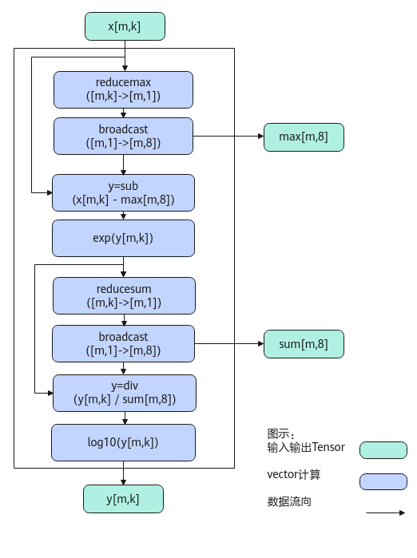

# LogSoftMax-LogSoftMax接口-激活函数-高阶API-Ascend C算子开发接口-API-CANN社区版8.5.0开发文档-昇腾社区

**页面ID:** atlasascendc_api_07_0768
**来源：** https://www.hiascend.com/document/detail/zh/CANNCommunityEdition/850/API/ascendcopapi/atlasascendc_api_07_0768.html
---

# LogSoftMax

#### 产品支持情况

| 产品                                        | 是否支持 |
| ------------------------------------------- | -------- |
| Atlas A3 训练系列产品/Atlas A3 推理系列产品 | √        |
| Atlas A2 训练系列产品/Atlas A2 推理系列产品 | √        |
| Atlas 200I/500 A2 推理产品                  | x        |
| Atlas推理系列产品AI Core                    | √        |
| Atlas推理系列产品Vector Core                | x        |
| Atlas训练系列产品                           | x        |

#### 功能说明

对输入tensor做LogSoftmax计算。计算公式如下：

为方便理解，通过Python脚本实现的方式表达计算公式如下，其中src是源操作数（输入），dst、sum、max为目的操作数（输出）。

| 12345678910 | deflog_softmax(src):#基于last轴进行rowmax（按行取最大值）处理max=np.max(src,axis=-1,keepdims=True)sub=src-maxexp=np.exp(sub)#基于last轴进行rowsum（按行求和）处理sum=np.sum(exp,axis=-1,keepdims=True)dst=exp/sumdst=np.log10(dst)returndst,max,sum |
| ----------- | --------------------------------------------------------------------------------------------------------------------------------------------------------------------------------------------------------------------------------------------------- |

#### 实现原理

以float类型，ND格式，shape为[m, k]的输入Tensor为例，描述LogSoftMax高阶API内部算法框图，如下图所示。

计算过程分为如下几步，均在Vector上进行：

1. reducemax步骤：对输入x的每一行数据求最大值得到[m, 1]，计算结果会保存到一个临时空间temp中；
1. broadcast步骤：对temp中的数据([m, 1])做一个按datablock为单位的填充，比如float类型下，把[m, 1]扩展成[m, 8]，同时输出max；
1. sub步骤：对输入x的所有数据按行减去max；
1. exp步骤：对sub之后的所有数据求exp；
1. reducesum步骤：对exp后的结果的每一行数据求和得到[m, 1]，计算结果会保存到临时空间temp中；
1. broadcast步骤：对temp([m, 1])做一个按datablock为单位的填充，比如float类型下，把[m, 1]扩展成[m, 8]，同时输出sum；
1. div步骤：对exp结果的所有数据按行除以sum；
1. log步骤：对div后的所有数据按行做log10计算，输出y。

#### 函数原型

| 12  | template<typenameT,boolisReuseSource=false,boolisDataFormatNZ=false>__aicore__inlinevoidLogSoftMax(constLocalTensor<T>&dst,constLocalTensor<T>&sum,constLocalTensor<T>&max,constLocalTensor<T>&src,constLocalTensor<uint8_t>&sharedTmpBuffer,constLogSoftMaxTiling&tiling,constSoftMaxShapeInfo&softmaxShapeInfo={}) |
| --- | -------------------------------------------------------------------------------------------------------------------------------------------------------------------------------------------------------------------------------------------------------------------------------------------------------------------- |

由于该接口的内部实现中涉及复杂的数学计算，需要额外的临时空间来存储计算过程中的中间变量。临时空间支持开发者通过sharedTmpBuffer入参传入。临时空间大小BufferSize的获取方式如下：通过LogSoftMax Tiling中提供的接口获取空间范围的大小。

#### 参数说明

| 参数名         | 描述                                                                                                                                                                                                                                |
| -------------- | ----------------------------------------------------------------------------------------------------------------------------------------------------------------------------------------------------------------------------------- |
| T              | 操作数的数据类型。Atlas A3 训练系列产品/Atlas A3 推理系列产品，支持的数据类型为：half、float。Atlas A2 训练系列产品/Atlas A2 推理系列产品，支持的数据类型为：half、float。Atlas推理系列产品AI Core，支持的数据类型为：half、float。 |
| isReuseSource  | 是否允许修改源操作数。该参数预留，传入默认值false即可。                                                                                                                                                                             |
| isDataFormatNZ | 源操作数是否为NZ格式。默认值为false。                                                                                                                                                                                               |

| 参数名           | 输入/输出                                                                                                                                                                | 描述                                                                                                                                                                                                                                                                                                                                        |        |                                                                                                                                                                          |
| ---------------- | ------------------------------------------------------------------------------------------------------------------------------------------------------------------------ | ------------------------------------------------------------------------------------------------------------------------------------------------------------------------------------------------------------------------------------------------------------------------------------------------------------------------------------------- | ------ | ------------------------------------------------------------------------------------------------------------------------------------------------------------------------ |
| dst              | 输出                                                                                                                                                                     | 目的操作数。类型为LocalTensor，支持的TPosition为VECIN/VECCALC/VECOUT。last轴长度需要32Byte对齐。                                                                                                                                                                                                                                            |        |                                                                                                                                                                          |
| sum              | 输出                                                                                                                                                                     | reduceSum操作数。reduceSum操作数的数据类型需要与目的操作数保持一致。类型为LocalTensor，支持的TPosition为VECIN/VECCALC/VECOUT。sum的last轴长度固定为32Byte，即一个datablock长度。该datablock中的所有数据为同一个值，比如half数据类型下，该datablock中的16个数均为相同的reducesum的值。非last轴的长度与目的操作数保持一致。                   |        |                                                                                                                                                                          |
| max              | 输出                                                                                                                                                                     | reduceMax操作数。reduceMax操作数的数据类型需要与目的操作数保持一致。类型为LocalTensor，支持的TPosition为VECIN/VECCALC/VECOUT。max的last轴长度固定为32Byte，即一个datablock长度。该datablock中的所有数据为同一个值。比如half数据类型下，该datablock中的16个数均为相同的reducemax的值。非last轴的长度与目的操作数保持一致。                   |        |                                                                                                                                                                          |
| src              | 输入                                                                                                                                                                     | 源操作数。类型为LocalTensor，支持的TPosition为VECIN/VECCALC/VECOUT。源操作数的数据类型需要与目的操作数保持一致。                                                                                                                                                                                                                            |        |                                                                                                                                                                          |
| sharedTmpBuffer  | 输入                                                                                                                                                                     | 临时缓存。临时空间大小BufferSize的获取方式请参考LogSoftMax Tiling。类型为LocalTensor，支持的TPosition为VECIN/VECCALC/VECOUT。                                                                                                                                                                                                               |        |                                                                                                                                                                          |
| tiling           | 输入                                                                                                                                                                     | LogSoftMax计算所需Tiling信息，Tiling信息的获取请参考LogSoftMax Tiling。                                                                                                                                                                                                                                                                     |        |                                                                                                                                                                          |
| softmaxShapeInfo | 输入                                                                                                                                                                     | src的shape信息。SoftMaxShapeInfo类型，具体定义如下：123456structSoftMaxShapeInfo{uint32_tsrcM;// 非尾轴长度的乘积uint32_tsrcK;// 尾轴长度，必须32Bytes对齐uint32_toriSrcM;// 原始非尾轴长度的乘积uint32_toriSrcK;// 原始尾轴长度};注意，当输入输出的数据格式为NZ(FRACTAL_NZ)格式时，尾轴长度为reduce轴长度，即图2中的W0*W1，非尾轴为H0*H1。 | 123456 | structSoftMaxShapeInfo{uint32_tsrcM;// 非尾轴长度的乘积uint32_tsrcK;// 尾轴长度，必须32Bytes对齐uint32_toriSrcM;// 原始非尾轴长度的乘积uint32_toriSrcK;// 原始尾轴长度}; |
| 123456           | structSoftMaxShapeInfo{uint32_tsrcM;// 非尾轴长度的乘积uint32_tsrcK;// 尾轴长度，必须32Bytes对齐uint32_toriSrcM;// 原始非尾轴长度的乘积uint32_toriSrcK;// 原始尾轴长度}; |                                                                                                                                                                                                                                                                                                                                             |        |                                                                                                                                                                          |

#### 返回值说明

无

#### 约束说明

- 输入源数据需保持值域在[-2147483647.0, 2147483647.0]。若输入不在范围内，输出结果无效。
- 不支持源操作数与目的操作数地址重叠。
- 不支持sharedTmpBuffer与源操作数和目的操作数地址重叠。
- 操作数地址对齐要求请参见通用地址对齐约束。
- 当参数softmaxShapeInfo中srcM != oriSrcM或者srcK != oriSrcK时，开发者需要对GM上的原始输入(oriSrcM, oriSrcK)在M或K方向补齐数据到(srcM, srcK)，补齐的数据会参与部分运算，在输入输出复用的场景下，API的计算结果会覆盖srcTensor中补齐的原始数据，在输入输出不复用的场景下，API的计算结果会覆盖dstTensor中对应srcTensor补齐位置的数据。

#### 调用示例

| 12345678910111213 | //DTYPE_X、DTYPE_A、DTYPE_B、DTYPE_C分别表示源操作数、目的操作数、maxLocal、sumLocal操作数数据类型pipe.InitBuffer(inQueueX,BUFFER_NUM,totalLength*sizeof(DTYPE_X));pipe.InitBuffer(outQueueA,BUFFER_NUM,totalLength*sizeof(DTYPE_A));pipe.InitBuffer(outQueueB,BUFFER_NUM,outsize*sizeof(DTYPE_B));pipe.InitBuffer(outQueueC,BUFFER_NUM,outsize*sizeof(DTYPE_C));pipe.InitBuffer(tmpQueue,BUFFER_NUM,tmpsize);AscendC:LocalTensor<DTYPE_X>srcLocal=inQueueX.DeQue<DTYPE_X>();AscendC:LocalTensor<DTYPE_A>dstLocal=outQueueA.AllocTensor<DTYPE_A>();AscendC:LocalTensor<DTYPE_B>maxLocal=outQueueB.AllocTensor<DTYPE_B>();AscendC:LocalTensor<DTYPE_C>sumLocal=outQueueC.AllocTensor<DTYPE_C>();AscendC:SoftMaxShapeInfosoftmaxInfo={outter,inner,outter,inner};AscendC:LocalTensor<uint8_t>tmpLocal=tmpQueue.AllocTensor<uint8_t>();AscendC:LogSoftMax<DTYPE_X,false>(dstLocal,sumLocal,maxLocal,srcLocal,tmpLocal,softmaxTiling,softmaxInfo); |
| ----------------- | ---------------------------------------------------------------------------------------------------------------------------------------------------------------------------------------------------------------------------------------------------------------------------------------------------------------------------------------------------------------------------------------------------------------------------------------------------------------------------------------------------------------------------------------------------------------------------------------------------------------------------------------------------------------------------------------------------------------------------------------------------------------------------------------------------------------------------------------------------------------------------------------------------------------------------------------------- |

| 12  | 输入数据(srcLocal):[0.805411340.083857050.49426016...0.309622050.28947052]输出数据(dstLocal):[-0.6344272-1.4868407-1.0538127...-1.2560008-1.2771227] |
| --- | ---------------------------------------------------------------------------------------------------------------------------------------------------- |
