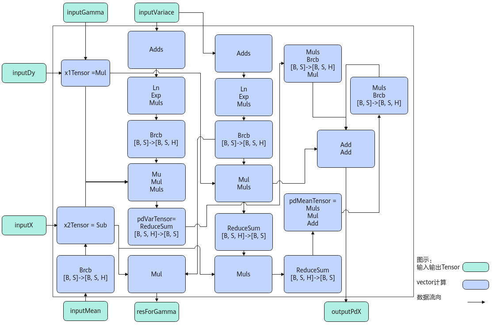

# LayerNormGrad-归一化操作-高阶API-Ascend C算子开发接口-API-CANN社区版8.5.0开发文档-昇腾社区

**页面ID:** atlasascendc_api_07_0798
**来源：** https://www.hiascend.com/document/detail/zh/CANNCommunityEdition/850/API/ascendcopapi/atlasascendc_api_07_0798.html
---

# LayerNormGrad

#### 产品支持情况

| 产品                                        | 是否支持 |
| ------------------------------------------- | -------- |
| Atlas A3 训练系列产品/Atlas A3 推理系列产品 | √        |
| Atlas A2 训练系列产品/Atlas A2 推理系列产品 | √        |
| Atlas 200I/500 A2 推理产品                  | x        |
| Atlas推理系列产品AI Core                    | √        |
| Atlas推理系列产品Vector Core                | x        |
| Atlas训练系列产品                           | x        |

#### 功能说明

LayerNormGrad是一个函数，用于计算LayerNorm的反向传播梯度。该接口单独使用会输出x、resForGamma；也可以和LayerNormGradBeta配合使用，输出的resForGamma传递给LayerNormGradBeta，LayerNormGradBeta接口会输出gamma和beta，配合使用时就可以同时得到x、Gamma、beta。

算法公式为：

| 12345 | pd_xl(BSH)=data_dy*data_gammapd_var(H)=np.sum(((-0.5)*pd_xl*(data_x-data_mean)*np.power((data_variance+EPSILON),(-1.5))),reduce_axis,keepdims=True)pd_mean(BS1)=np.sum(((-1.0)*pd_xl*np.power((data_variance+EPSILON),(-0.5))),reduce_axis,keepdims=True)+pd_var*(1.0/H)*np.sum(((-2.0)*(data_x-data_mean)),reduce_axis,keepdims=True)pd_x(BSH)=pd_xl*np.power((data_variance+EPSILON),(-0.5))+pd_var*(2.0/H)*(data_x-data_mean)+pd_mean*(1.0/H)res_for_gamma(BSH)=(data_x-data_mean)*np.power((data_variance+EPSILON),(-0.5)) |
| ----- | ------------------------------------------------------------------------------------------------------------------------------------------------------------------------------------------------------------------------------------------------------------------------------------------------------------------------------------------------------------------------------------------------------------------------------------------------------------------------------------------------------------------------------ |

#### 实现原理

以float类型，ND格式，输入为inputDy[B, S, H], inputX[B, S, H], inputVariance[B, S], inputMean[B, S], inputGamma[H]为例，描述LayerNormGrad高阶API内部算法框图，如下图所示。

计算过程分为如下几步，均在Vector上进行：

1. ComputePdX1步骤：计算inputDy*inputGamma，结果存储至x1Tensor；
1. ComputePdX2步骤：inputMean先通过Brcb将shape扩充到[B, S, H]，再计算inputX-inputMean，结果存储至x2Tensor；
1. ComputePdVar步骤：实现公式np.sum(((-0.5) * x1Tensor * x2Tensor * np.power((inputVariance + EPSILON), (-1.5))))的计算，power方法的实现通过Sqrt, Div, Mul三条基础API组合实现，结果存储至pdVarTensor；
1. ComputePdMean：实现公式np.sum(((-1.0) * x1Tensor * np.power((inputVariance + EPSILON), (-0.5)))) + pd_var * (1.0 / H) * np.sum(((-2.0) * (x2Tensor)))的计算，power方法通过Sqrt, Div两条基础API组合实现，结果存储至pdMeanTensor。同时，利用中间计算结果，根据公式x2Tensor * np.power((inputVariance + EPSILON), (-0.5))，计算出resForGamma的结果；
1. ComputePdX步骤：实现公式x1Tensor * np.power((inputVariance + EPSILON), (-0.5)) + pd_var*(2.0 / H)*(x2Tensor) + pd_mean*(1.0 / H)的计算，结果存入outputPdX。

#### 函数原型

由于该接口的内部实现中涉及复杂的计算，需要额外的临时空间来存储计算过程中的中间变量。临时空间大小BufferSize的获取方法：通过LayerNormGrad Tiling中提供的GetLayerNormGradMaxMinTmpSize接口获取所需最大和最小临时空间大小，最小空间可以保证功能正确，最大空间用于提升性能。

临时空间支持接口框架申请和开发者通过sharedTmpBuffer入参传入两种方式，因此LayerNormGrad接口的函数原型有两种：

- 通过sharedTmpBuffer入参传入临时空间12template<typenameT,boolisReuseSource=false>__aicore__inlinevoidLayerNormGrad(constLocalTensor<T>&outputPdX,constLocalTensor<T>&resForGamma,constLocalTensor<T>&inputDy,constLocalTensor<T>&inputX,constLocalTensor<T>&inputVariance,constLocalTensor<T>&inputMean,constLocalTensor<T>&inputGamma,LocalTensor<uint8_t>&sharedTmpBuffer,Tepsilon,LayerNormGradTiling&tiling,constLayerNormGradShapeInfo&shapeInfo={})该方式下开发者需自行申请并管理临时内存空间，并在接口调用完成后，复用该部分内存，内存不会反复申请释放，灵活性较高，内存利用率也较高。

- 接口框架申请临时空间12template<typenameT,boolisReuseSource=false>__aicore__inlinevoidLayerNormGrad(constLocalTensor<T>&outputPdX,constLocalTensor<T>&resForGamma,constLocalTensor<T>&inputDy,constLocalTensor<T>&inputX,constLocalTensor<T>&inputVariance,constLocalTensor<T>&inputMean,constLocalTensor<T>&inputGamma,Tepsilon,LayerNormGradTiling&tiling,constLayerNormGradShapeInfo&shapeInfo={})该方式下开发者无需申请，但是需要预留临时空间的大小。

#### 参数说明

| 参数名        | 描述                                                                                                                                                                                                                                                                                                                                                   |
| ------------- | ------------------------------------------------------------------------------------------------------------------------------------------------------------------------------------------------------------------------------------------------------------------------------------------------------------------------------------------------------ |
| T             | 操作数的数据类型。Atlas A3 训练系列产品/Atlas A3 推理系列产品，支持的数据类型为：half、float。Atlas A2 训练系列产品/Atlas A2 推理系列产品，支持的数据类型为：half、float。Atlas推理系列产品AI Core，支持的数据类型为：half、float。                                                                                                                    |
| isReuseSource | 是否允许修改源操作数，默认值为false。如果开发者允许源操作数被改写，可以使能该参数，使能后能够节省部分内存空间。设置为true，则本接口内部计算时复用inputX的内存空间，节省内存空间；设置为false，则本接口内部计算时不复用inputX的内存空间。对于float数据类型输入支持开启该参数，half数据类型输入不支持开启该参数。isReuseSource的使用样例请参考更多样例。 |

| 参数名称        | 输入/输出                                                          | 含义                                                                                                                                                                                                                                                                                                   |     |                                                                    |
| --------------- | ------------------------------------------------------------------ | ------------------------------------------------------------------------------------------------------------------------------------------------------------------------------------------------------------------------------------------------------------------------------------------------------ | --- | ------------------------------------------------------------------ |
| outputPdX       | 输出                                                               | 目的操作数，shape为[B, S, H]，LocalTensor数据结构的定义请参考LocalTensor。尾轴长度需要32B对齐。类型为LocalTensor，支持的TPosition为VECIN/VECCALC/VECOUT。                                                                                                                                              |     |                                                                    |
| resForGamma     | 输出                                                               | 目的操作数，shape为[B, S, H]，LocalTensor数据结构的定义请参考LocalTensor。尾轴长度需要32B对齐。类型为LocalTensor，支持的TPosition为VECIN/VECCALC/VECOUT。                                                                                                                                              |     |                                                                    |
| inputDy         | 输入                                                               | 源操作数，shape为[B, S, H]，LocalTensor数据结构的定义请参考LocalTensor。inputDy的数据类型需要与目的操作数保持一致，尾轴长度需要32B对齐。类型为LocalTensor，支持的TPosition为VECIN/VECCALC/VECOUT。                                                                                                     |     |                                                                    |
| inputX          | 输入                                                               | 源操作数，shape为[B, S, H]，LocalTensor数据结构的定义请参考LocalTensor。inputX的数据类型需要与目的操作数保持一致，尾轴长度需要32B对齐。类型为LocalTensor，支持的TPosition为VECIN/VECCALC/VECOUT。                                                                                                      |     |                                                                    |
| inputVariance   | 输入                                                               | 方差，shape为[B, S]，LocalTensor数据结构的定义请参考LocalTensor。inputVariance的数据类型需要与目的操作数保持一致，尾轴长度需要32B对齐。需提前调用LayerNorm接口获取方差。类型为LocalTensor，支持的TPosition为VECIN/VECCALC/VECOUT。                                                                     |     |                                                                    |
| inputMean       | 输入                                                               | 均值，shape为[B, S]，LocalTensor数据结构的定义请参考LocalTensor。inputMean的数据类型需要与目的操作数保持一致，尾轴长度需要32B对齐。需提前调用LayerNorm接口获取均值。类型为LocalTensor，支持的TPosition为VECIN/VECCALC/VECOUT。                                                                         |     |                                                                    |
| inputGamma      | 输入                                                               | 源操作数，shape为[H]，LocalTensor数据结构的定义请参考LocalTensor。inputGamma的数据类型需要与目的操作数保持一致，尾轴长度需要32B对齐。类型为LocalTensor，支持的TPosition为VECIN/VECCALC/VECOUT。                                                                                                        |     |                                                                    |
| sharedTmpBuffer | 输入                                                               | 共享缓冲区，用于存放API内部计算产生的临时数据。该方式开发者可以自行管理sharedTmpBuffer内存空间，并在接口调用完成后，复用该部分内存，内存不会反复申请释放，灵活性较高，内存利用率也较高。共享缓冲区大小的获取方式请参考LayerNormGrad Tiling。类型为LocalTensor，支持的TPosition为VECIN/VECCALC/VECOUT。 |     |                                                                    |
| epsilon         | 输入                                                               | 防除零的权重系数。                                                                                                                                                                                                                                                                                     |     |                                                                    |
| tiling          | 输入                                                               | LayerNormGrad计算所需Tiling信息。                                                                                                                                                                                                                                                                      |     |                                                                    |
| shapeInfo       | 输入                                                               | 表示LayerNormGrad各个输入的数据排布格式Format。默认值表示输入的Format为ND。支持的取值为DataFormat:ND。LayerNormGradShapeInfo类型，具体定义如下。123structLayerNormGradShapeInfo{DataFormatdataFormat=DataFormat:ND;};                                                                                  | 123 | structLayerNormGradShapeInfo{DataFormatdataFormat=DataFormat:ND;}; |
| 123             | structLayerNormGradShapeInfo{DataFormatdataFormat=DataFormat:ND;}; |                                                                                                                                                                                                                                                                                                        |     |                                                                    |

#### 返回值说明

无

#### 约束说明

- 操作数地址对齐要求请参见通用地址对齐约束。
- 源操作数和目的操作数的Tensor空间可以复用。
- 仅支持输入shape为ND格式。
- 输入数据不满足对齐要求时，开发者需要进行补齐，补齐的数据应设置为0，防止出现异常值从而影响网络计算。
- 不支持对尾轴H轴的切分。

#### 调用示例

本样例中，输入inputX和inputDy的shape为[2, 32, 16]，inputVariance和inputMean的shape为[2, 32]，inputGamma的shape为[16]。输出outputPdX和resForGamma的shape为[2, 32, 16]。数据排布均为ND格式，数据类型均为float，不复用源操作数的内存空间。

完整调用样例请参考layernorm_grad。

| 123456789101112131415161718192021222324252627282930313233343536373839404142434445464748495051525354555657585960616263646566676869707172737475767778798081828384858687888990919293949596979899100101102103104105106107108109110111112113114115116117118119120121122123124125126127128129130 | #include"kernel_operator.h"namespaceMyCustomKernel{structVecTiling{LayerNormGradTilinglayernormGradTilingData;floatepsilon=0;};template<boolisReuseSource=false>classKernelLayernormGrad{public:__aicore__inlineKernelLayernormGrad(){}__aicore__inlinevoidInit(GM_ADDRinputXGm,GM_ADDRinputDyGm,GM_ADDRinputVarianceGm,GM_ADDRinputMeanGm,GM_ADDRinputGammaGm,GM_ADDRoutputPdXGm,GM_ADDRresForGammaGm,VecTilingtilingData){this->epsilon=tilingData.epsilon;tiling_=tilingData.layernormGradTilingData;this->bLength=tiling_.bLength;this->sLength=tiling_.sLength;this->hLength=tiling_.hLength;bshLength=bLength*sLength*hLength;bsLength=bLength*sLength;inputXGlobal.SetGlobalBuffer(reinterpret_cast<__gm__float*>(inputXGm),bshLength);inputDyGlobal.SetGlobalBuffer(reinterpret_cast<__gm__float*>(inputDyGm),bshLength);inputVarianceGlobal.SetGlobalBuffer(reinterpret_cast<__gm__float*>(inputVarianceGm),bsLength);inputMeanGlobal.SetGlobalBuffer(reinterpret_cast<__gm__float*>(inputMeanGm),bsLength);inputGammaGlobal.SetGlobalBuffer(reinterpret_cast<__gm__float*>(inputGammaGm),hLength);outputPdXGlobal.SetGlobalBuffer(reinterpret_cast<__gm__float*>(outputPdXGm),bshLength);outputResForGammaGlobal.SetGlobalBuffer(reinterpret_cast<__gm__float*>(resForGammaGm),bshLength);pipe.InitBuffer(inQueueX,1,sizeof(float)*bshLength);pipe.InitBuffer(inQueueDy,1,sizeof(float)*bshLength);pipe.InitBuffer(inQueueVariance,1,sizeof(float)*bsLength);pipe.InitBuffer(inQueueMean,1,sizeof(float)*bsLength);pipe.InitBuffer(inQueueGamma,1,sizeof(float)*hLength);pipe.InitBuffer(outQueuePdX,1,sizeof(float)*bshLength);pipe.InitBuffer(outQueueResForGamma,1,sizeof(float)*bshLength);}__aicore__inlinevoidProcess(){CopyIn();Compute();CopyOut();}private:__aicore__inlinevoidCopyIn(){AscendC:LocalTensor<float>inputXLocal=inQueueX.AllocTensor<float>();AscendC:LocalTensor<float>inputDyLocal=inQueueDy.AllocTensor<float>();AscendC:LocalTensor<float>inputVarianceLocal=inQueueVariance.AllocTensor<float>();AscendC:LocalTensor<float>inputMeanLocal=inQueueMean.AllocTensor<float>();AscendC:LocalTensor<float>inputGammaLocal=inQueueGamma.AllocTensor<float>();AscendC:DataCopy(inputXLocal,inputXGlobal,bshLength);AscendC:DataCopy(inputDyLocal,inputDyGlobal,bshLength);AscendC:DataCopy(inputVarianceLocal,inputVarianceGlobal,bsLength);AscendC:DataCopy(inputMeanLocal,inputMeanGlobal,bsLength);AscendC:DataCopy(inputGammaLocal,inputGammaGlobal,hLength);inQueueX.EnQue(inputXLocal);inQueueDy.EnQue(inputDyLocal);inQueueVariance.EnQue(inputVarianceLocal);inQueueMean.EnQue(inputMeanLocal);inQueueGamma.EnQue(inputGammaLocal);}__aicore__inlinevoidCompute(){AscendC:LocalTensor<float>inputXLocal=inQueueX.DeQue<float>();AscendC:LocalTensor<float>inputDyLocal=inQueueDy.DeQue<float>();AscendC:LocalTensor<float>inputVarianceLocal=inQueueVariance.DeQue<float>();AscendC:LocalTensor<float>inputMeanLocal=inQueueMean.DeQue<float>();AscendC:LocalTensor<float>inputGammaLocal=inQueueGamma.DeQue<float>();AscendC:LocalTensor<float>outputPdXLocal=outQueuePdX.AllocTensor<float>();AscendC:LocalTensor<float>outputResForGammaLocal=outQueueResForGamma.AllocTensor<float>();AscendC:LayerNormGrad<float,isReuseSource>(outputPdXLocal,outputResForGammaLocal,inputDyLocal,inputXLocal,inputVarianceLocal,inputMeanLocal,inputGammaLocal,(float)epsilon,tiling_,{DataFormat:ND});outQueuePdX.EnQue(outputPdXLocal);outQueueResForGamma.EnQue(outputResForGammaLocal);inQueueX.FreeTensor(inputXLocal);inQueueDy.FreeTensor(inputDyLocal);inQueueVariance.FreeTensor(inputVarianceLocal);inQueueMean.FreeTensor(inputMeanLocal);inQueueGamma.FreeTensor(inputGammaLocal);}__aicore__inlinevoidCopyOut(){AscendC:LocalTensor<float>outputPdXLocal=outQueuePdX.DeQue<float>();AscendC:LocalTensor<float>outputResForGammaLocal=outQueueResForGamma.DeQue<float>();AscendC:DataCopy(outputPdXGlobal,outputPdXLocal,bshLength);AscendC:DataCopy(outputResForGammaGlobal,outputResForGammaLocal,bshLength);outQueuePdX.FreeTensor(outputPdXLocal);outQueueResForGamma.FreeTensor(outputResForGammaLocal);}private:AscendC:GlobalTensor<float>inputXGlobal;AscendC:GlobalTensor<float>inputDyGlobal;AscendC:GlobalTensor<float>inputVarianceGlobal;AscendC:GlobalTensor<float>inputMeanGlobal;AscendC:GlobalTensor<float>inputGammaGlobal;AscendC:GlobalTensor<float>outputPdXGlobal;AscendC:GlobalTensor<float>outputResForGammaGlobal;AscendC:TPipepipe;AscendC:TQue<AscendC:TPosition:VECIN,1>inQueueX;AscendC:TQue<AscendC:TPosition:VECIN,1>inQueueDy;AscendC:TQue<AscendC:TPosition:VECIN,1>inQueueVariance;AscendC:TQue<AscendC:TPosition:VECIN,1>inQueueMean;AscendC:TQue<AscendC:TPosition:VECIN,1>inQueueGamma;AscendC:TQue<AscendC:TPosition:VECOUT,1>outQueuePdX;AscendC:TQue<AscendC:TPosition:VECOUT,1>outQueueResForGamma;uint32_tbLength;uint32_tsLength;uint32_thLength;floatepsilon;LayerNormGradTilingtiling_;uint32_tbshLength;uint32_tbsLength;};}extern"C"__global____aicore__voidlayernorm_grad_custom(GM_ADDRinputXGm,GM_ADDRinputDyGm,GM_ADDRinputVarianceGm,GM_ADDRinputMeanGm,GM_ADDRinputGammaGm,GM_ADDRoutputPdXGm,GM_ADDRresForGammaGm,GM_ADDRworkspace,GM_ADDRtiling){ifASCEND_IS_AIC{return;}MyCustomKernel:VecTilingtilingData;CopyTiling(&tilingData,tiling);MyCustomKernel:KernelLayernormGrad<false>op;op.Init(inputXGm,inputDyGm,inputVarianceGm,inputMeanGm,inputGammaGm,outputPdXGm,resForGammaGm,tilingData);op.Process();} |
| ------------------------------------------------------------------------------------------------------------------------------------------------------------------------------------------------------------------------------------------------------------------------------------------ | ---------------------------------------------------------------------------------------------------------------------------------------------------------------------------------------------------------------------------------------------------------------------------------------------------------------------------------------------------------------------------------------------------------------------------------------------------------------------------------------------------------------------------------------------------------------------------------------------------------------------------------------------------------------------------------------------------------------------------------------------------------------------------------------------------------------------------------------------------------------------------------------------------------------------------------------------------------------------------------------------------------------------------------------------------------------------------------------------------------------------------------------------------------------------------------------------------------------------------------------------------------------------------------------------------------------------------------------------------------------------------------------------------------------------------------------------------------------------------------------------------------------------------------------------------------------------------------------------------------------------------------------------------------------------------------------------------------------------------------------------------------------------------------------------------------------------------------------------------------------------------------------------------------------------------------------------------------------------------------------------------------------------------------------------------------------------------------------------------------------------------------------------------------------------------------------------------------------------------------------------------------------------------------------------------------------------------------------------------------------------------------------------------------------------------------------------------------------------------------------------------------------------------------------------------------------------------------------------------------------------------------------------------------------------------------------------------------------------------------------------------------------------------------------------------------------------------------------------------------------------------------------------------------------------------------------------------------------------------------------------------------------------------------------------------------------------------------------------------------------------------------------------------------------------------------------------------------------------------------------------------------------------------------------------------------------------------------------------------------------------------------------------------------------------------------------------------------------------------------------------------------------------------------------------------------------------------------------------------------------------------------------------------------------------------------------------------------------------------------------------------------------------------------------------------------------------------------------------------------------------------------------------------------------------------------------------------------------------------------------------------------------------------------------------------------------------------------------------------------------------------------------------------------------------------------------------------------------------------------------------------------------------------------------------------------------------------------------------------------------------------------------------------------------------------------------------------------------------------------------------------------------------------------------------------------------------------------------------------------------------------------------------------------------------------------------------------------------------------------------------------------------------------------------------------------------------------------------------------------------------------------------------------------------------------------------------------------------------------------------------------------------------------------------------------------------------------------------------------------------------------------------------------------------------------------------------------------------------------------------------------------------------------------------------------------------------------------------------------------------------------------------------------------------------------------------------------------------------------------------------------------------- |
