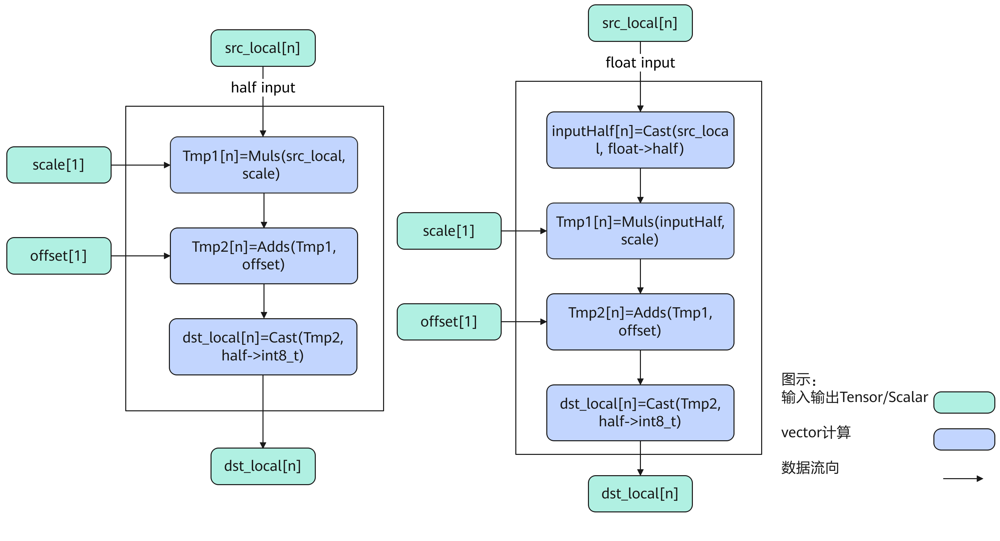
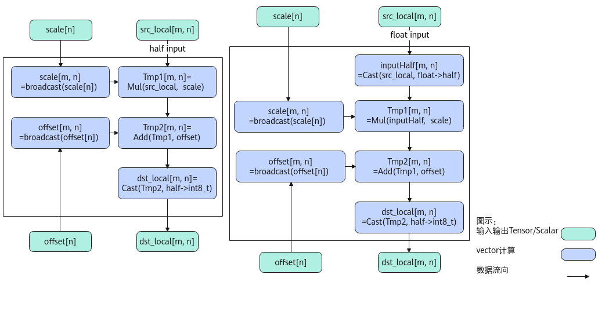
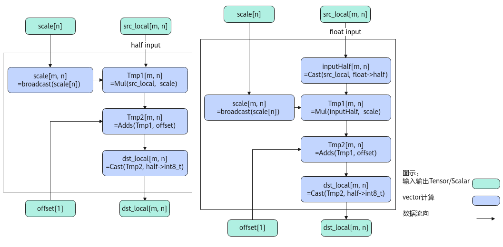

# AscendQuant-量化操作-高阶API-Ascend C算子开发接口-API-CANN社区版8.5.0开发文档-昇腾社区

**页面ID:** atlasascendc_api_07_0817
**来源：** https://www.hiascend.com/document/detail/zh/CANNCommunityEdition/850/API/ascendcopapi/atlasascendc_api_07_0817.html
---

# AscendQuant

#### 产品支持情况

| 产品                                        | 是否支持 |
| ------------------------------------------- | -------- |
| Atlas A3 训练系列产品/Atlas A3 推理系列产品 | √        |
| Atlas A2 训练系列产品/Atlas A2 推理系列产品 | √        |
| Atlas 200I/500 A2 推理产品                  | x        |
| Atlas推理系列产品AI Core                    | √        |
| Atlas推理系列产品Vector Core                | x        |
| Atlas训练系列产品                           | √        |

#### 功能说明

按元素做量化计算，比如将half/float数据类型量化为int8_t数据类型。计算公式如下，round表示四舍六入五成双取整：

- PER_TENSOR量化：整个srcTensor对应一个量化参数，量化参数的shape为[1]。
- PER_CHANNEL量化：srcTensor的shape为[m, n], 每个channel维度对应一个量化参数，量化参数的shape为[n]。

#### 实现原理

如上图所示是AscendQuant内部算法框图，计算过程大致描述为如下几步，均在Vector上进行：

1. 精度转换：当输入的src，scale或者offset是float类型时，将其转换为half类型；
1. broadcast：当输入的scale或者offset是向量时，将其broadcast成和src相同维度；
1. 计算scale：当src和scale为向量时做Mul计算，当scale是scalar时做Muls计算，得到Tmp1；
1. 计算offset：当Tmp1和offset为向量时做Add计算，当offset是scalar时做Adds计算，得到Tmp2；
1. 精度转换：将Tmp2从half转换成int8_t类型，得到output。

#### 函数原型

- dstTensor为int8_t数据类型PER_TENSOR量化：通过sharedTmpBuffer入参传入临时空间源操作数Tensor全部/部分参与计算12template<typenameT,boolisReuseSource=false,constAscendQuantConfig&config=ASCEND_QUANT_DEFAULT_CFG>__aicore__inlinevoidAscendQuant(constLocalTensor<int8_t>&dstTensor,constLocalTensor<T>&srcTensor,constLocalTensor<uint8_t>&sharedTmpBuffer,constfloatscale,constfloatoffset,constuint32_tcalCount)源操作数Tensor全部参与计算12template<typenameT,boolisReuseSource=false,constAscendQuantConfig&config=ASCEND_QUANT_DEFAULT_CFG>__aicore__inlinevoidAscendQuant(constLocalTensor<int8_t>&dstTensor,constLocalTensor<T>&srcTensor,constLocalTensor<uint8_t>&sharedTmpBuffer,constfloatscale,constfloatoffset)接口框架申请临时空间源操作数Tensor全部/部分参与计算12template<typenameT,boolisReuseSource=false,constAscendQuantConfig&config=ASCEND_QUANT_DEFAULT_CFG>__aicore__inlinevoidAscendQuant(constLocalTensor<int8_t>&dstTensor,constLocalTensor<T>&srcTensor,constfloatscale,constfloatoffset,constuint32_tcalCount)源操作数Tensor全部参与计算12template<typenameT,boolisReuseSource=false,constAscendQuantConfig&config=ASCEND_QUANT_DEFAULT_CFG>__aicore__inlinevoidAscendQuant(constLocalTensor<int8_t>&dstTensor,constLocalTensor<T>&srcTensor,constfloatscale,constfloatoffset)PER_CHANNEL量化：通过sharedTmpBuffer入参传入临时空间源操作数Tensor全部/部分参与计算12template<typenameT,boolisReuseSource=false,constAscendQuantConfig&config=ASCEND_QUANT_DEFAULT_CFG>__aicore__inlinevoidAscendQuant(constLocalTensor<int8_t>&dstTensor,constLocalTensor<T>&srcTensor,constLocalTensor<uint8_t>&sharedTmpBuffer,constLocalTensor<T>&scaleTensor,constToffset,constuint32_tscaleCount,constuint32_tcalCount)12template<typenameT,boolisReuseSource=false,constAscendQuantConfig&config=ASCEND_QUANT_DEFAULT_CFG>__aicore__inlinevoidAscendQuant(constLocalTensor<int8_t>&dstTensor,constLocalTensor<T>&srcTensor,constLocalTensor<uint8_t>&sharedTmpBuffer,constLocalTensor<T>&scaleTensor,constLocalTensor<T>&offsetTensor,constuint32_tscaleCount,constuint32_toffsetCount,constuint32_tcalCount)源操作数Tensor全部参与计算12template<typenameT,boolisReuseSource=false,constAscendQuantConfig&config=ASCEND_QUANT_DEFAULT_CFG>__aicore__inlinevoidAscendQuant(constLocalTensor<int8_t>&dstTensor,constLocalTensor<T>&srcTensor,constLocalTensor<uint8_t>&sharedTmpBuffer,constLocalTensor<T>&scaleTensor,constToffset)12template<typenameT,boolisReuseSource=false,constAscendQuantConfig&config=ASCEND_QUANT_DEFAULT_CFG>__aicore__inlinevoidAscendQuant(constLocalTensor<int8_t>&dstTensor,constLocalTensor<T>&srcTensor,constLocalTensor<uint8_t>&sharedTmpBuffer,constLocalTensor<T>&scaleTensor,constLocalTensor<T>&offsetTensor)接口框架申请临时空间源操作数Tensor全部/部分参与计算12template<typenameT,boolisReuseSource=false,constAscendQuantConfig&config=ASCEND_QUANT_DEFAULT_CFG>__aicore__inlinevoidAscendQuant(constLocalTensor<int8_t>&dstTensor,constLocalTensor<T>&srcTensor,constLocalTensor<T>&scaleTensor,constToffset,constuint32_tscaleCount,constuint32_tcalCount)12template<typenameT,boolisReuseSource=false,constAscendQuantConfig&config=ASCEND_QUANT_DEFAULT_CFG>__aicore__inlinevoidAscendQuant(constLocalTensor<int8_t>&dstTensor,constLocalTensor<T>&srcTensor,constLocalTensor<T>&scaleTensor,constLocalTensor<T>&offsetTensor,constuint32_tscaleCount,constuint32_toffsetCount,constuint32_tcalCount)源操作数Tensor全部参与计算12template<typenameT,boolisReuseSource=false,constAscendQuantConfig&config=ASCEND_QUANT_DEFAULT_CFG>__aicore__inlinevoidAscendQuant(constLocalTensor<int8_t>&dstTensor,constLocalTensor<T>&srcTensor,constLocalTensor<T>&scaleTensor,constToffset)12template<typenameT,boolisReuseSource=false,constAscendQuantConfig&config=ASCEND_QUANT_DEFAULT_CFG>__aicore__inlinevoidAscendQuant(constLocalTensor<int8_t>&dstTensor,constLocalTensor<T>&srcTensor,constLocalTensor<T>&scaleTensor,constLocalTensor<T>&offsetTensor)

由于该接口的内部实现中涉及复杂的数学计算，需要额外的临时空间来存储计算过程中的中间变量。临时空间支持接口框架申请和开发者通过sharedTmpBuffer入参传入两种方式。

- 接口框架申请临时空间，开发者无需申请，但是需要预留临时空间的大小。

- 通过sharedTmpBuffer入参传入，使用该tensor作为临时空间进行处理，接口框架不再申请。该方式开发者可以自行管理sharedTmpBuffer内存空间，并在接口调用完成后，复用该部分内存，内存不会反复申请释放，灵活性较高，内存利用率也较高。

接口框架申请的方式，开发者需要预留临时空间；通过sharedTmpBuffer传入的情况，开发者需要为sharedTmpBuffer申请空间。临时空间大小BufferSize的获取方式如下：通过GetAscendQuantMaxMinTmpSize中提供的GetAscendQuantMaxMinTmpSize接口获取需要预留空间的范围大小。

#### 参数说明

| 参数名        | 描述                                                                                                                                                                                                                                                                                                                                                                                                                                                                                                                                                                                                                                                                                                                                                                                                                                                                                                                                                                                                                                                                                                                                                                                                                                                                                         |        |                                                                                                                   |     |                                                               |
| ------------- | -------------------------------------------------------------------------------------------------------------------------------------------------------------------------------------------------------------------------------------------------------------------------------------------------------------------------------------------------------------------------------------------------------------------------------------------------------------------------------------------------------------------------------------------------------------------------------------------------------------------------------------------------------------------------------------------------------------------------------------------------------------------------------------------------------------------------------------------------------------------------------------------------------------------------------------------------------------------------------------------------------------------------------------------------------------------------------------------------------------------------------------------------------------------------------------------------------------------------------------------------------------------------------------------- | ------ | ----------------------------------------------------------------------------------------------------------------- | --- | ------------------------------------------------------------- |
| T             | 操作数的数据类型。Atlas训练系列产品，支持的数据类型为：half、float。Atlas A3 训练系列产品/Atlas A3 推理系列产品，支持的数据类型为：half、float。Atlas A2 训练系列产品/Atlas A2 推理系列产品，支持的数据类型为：half、float。Atlas推理系列产品AI Core，支持的数据类型为：half、float。                                                                                                                                                                                                                                                                                                                                                                                                                                                                                                                                                                                                                                                                                                                                                                                                                                                                                                                                                                                                        |        |                                                                                                                   |     |                                                               |
| isReuseSource | 是否允许修改源操作数。该参数预留，传入默认值false即可。                                                                                                                                                                                                                                                                                                                                                                                                                                                                                                                                                                                                                                                                                                                                                                                                                                                                                                                                                                                                                                                                                                                                                                                                                                      |        |                                                                                                                   |     |                                                               |
| config        | 结构体模板参数，此参数可选配，AscendQuantConfig类型，具体定义如下。123456structAscendQuantConfig{uint32_tcalcCount=0;uint32_toffsetCount=0;uint32_tscaleCount=0;uint32_tworkLocalSize=0;};calcCount：实际计算数据元素个数。calcCount∈[0, srcTensor.GetSize()]，在调用带有scaleCount入参的接口时，calcCount若取非零值则必须是scaleCount的整数倍。offsetCount：实际量化参数元素个数。offsetCount∈[0, offsetTensor.GetSize()]，offsetCount与scaleCount的取值必须相等，要求是32的整数倍。若调用的接口不含offsetCount入参，取值为0即可。scaleCount：实际量化参数元素个数。scaleCount∈[0, scaleTensor.GetSize()]，要求是32的整数倍。若调用的接口不含scaleCount入参，取值为0即可。workLocalSize：临时缓存sharedTmpBuffer的大小，sharedTmpBuffer的大小/workLocalSize的获取方式请参考GetAscendQuantMaxMinTmpSize。该参数取值不能大于sharedTmpBuffer的大小。若调用的接口不含sharedTmpBuffer入参，取值为0即可。当上述参数的取值满足如下任一种场景，将使能参数常量化，即编译过程中使用常量化的相关参数，从而减少Scalar计算。若调用的接口不含scaleCount入参，calcCount和workLocalSize取值为非0时，使能参数常量化。若调用的接口带有scaleCount入参，scaleCount、calcCount和workLocalSize取值为非0时，使能参数常量化。默认参数的配置示例如下。1constexprAscendQuantConfigASCEND_QUANT_DEFAULT_CFG={0,0,0,0}; | 123456 | structAscendQuantConfig{uint32_tcalcCount=0;uint32_toffsetCount=0;uint32_tscaleCount=0;uint32_tworkLocalSize=0;}; | 1   | constexprAscendQuantConfigASCEND_QUANT_DEFAULT_CFG={0,0,0,0}; |
| 123456        | structAscendQuantConfig{uint32_tcalcCount=0;uint32_toffsetCount=0;uint32_tscaleCount=0;uint32_tworkLocalSize=0;};                                                                                                                                                                                                                                                                                                                                                                                                                                                                                                                                                                                                                                                                                                                                                                                                                                                                                                                                                                                                                                                                                                                                                                            |        |                                                                                                                   |     |                                                               |
| 1             | constexprAscendQuantConfigASCEND_QUANT_DEFAULT_CFG={0,0,0,0};                                                                                                                                                                                                                                                                                                                                                                                                                                                                                                                                                                                                                                                                                                                                                                                                                                                                                                                                                                                                                                                                                                                                                                                                                                |        |                                                                                                                   |     |                                                               |

| 参数名          | 输入/输出 | 描述                                                                                                                                    |
| --------------- | --------- | --------------------------------------------------------------------------------------------------------------------------------------- |
| dstTensor       | 输出      | 目的操作数。类型为LocalTensor，支持的TPosition为VECIN/VECCALC/VECOUT。                                                                  |
| srcTensor       | 输入      | 源操作数。类型为LocalTensor，支持的TPosition为VECIN/VECCALC/VECOUT。                                                                    |
| sharedTmpBuffer | 输入      | 临时缓存。类型为LocalTensor，支持的TPosition为VECIN/VECCALC/VECOUT。临时空间大小BufferSize的获取方式请参考GetAscendQuantMaxMinTmpSize。 |
| scale           | 输入      | 量化参数。类型为Scalar，支持的数据类型为float。                                                                                         |
| offset          | 输入      | 量化参数。类型为Scalar，支持的数据类型为float。                                                                                         |
| calCount        | 输入      | 参与计算的元素个数。                                                                                                                    |

| 参数名          | 输入/输出 | 描述                                                                                                                                    |
| --------------- | --------- | --------------------------------------------------------------------------------------------------------------------------------------- |
| dstTensor       | 输出      | 目的操作数。类型为LocalTensor，支持的TPosition为VECIN/VECCALC/VECOUT。                                                                  |
| srcTensor       | 输入      | 源操作数。类型为LocalTensor，支持的TPosition为VECIN/VECCALC/VECOUT。                                                                    |
| sharedTmpBuffer | 输入      | 临时缓存。类型为LocalTensor，支持的TPosition为VECIN/VECCALC/VECOUT。临时空间大小BufferSize的获取方式请参考GetAscendQuantMaxMinTmpSize。 |
| scaleTensor     | 输入      | 量化参数。类型为LocalTensor，支持的TPosition为VECIN/VECCALC/VECOUT。                                                                    |
| offsetTensor    | 输入      | 量化参数。类型为LocalTensor，支持的TPosition为VECIN/VECCALC/VECOUT。                                                                    |
| scaleCount      | 输入      | 实际量化参数元素个数，且scaleCount∈[0, min(scaleTensor.GetSize(),dstTensor.GetSize())]，要求是32的整数倍。                              |
| offsetCount     | 输入      | 实际量化参数元素个数，且offsetCount∈[0, min(offsetTensor.GetSize(),dstTensor.GetSize())]，并且和scaleCount必须相等，要求是32的整数倍。  |
| calCount        | 输入      | 参与计算的元素个数。calCount必须是scaleCount的整数倍。                                                                                  |

#### 返回值说明

无

#### 约束说明

- 源操作数与目的操作数可以复用。
- 操作数地址对齐要求请参见通用地址对齐约束。
- 输入输出操作数参与计算的数据长度要求32B对齐。
- 当Scale为float类型时，其取值范围仍为half类型的取值范围。
- Atlas训练系列产品仅支持PER_TENSOR量化，不支持PER_CHANNEL量化。

#### 调用示例

完整的算子样例请参考quant算子样例。

| 12345678 | // 输入shape为1024uint32_tdataSize=1024;// 输入类型为float/half, scale=2.0, offset=0.9，预留临时空间AscendC:AscendQuant<srcType>(dstLocal,srcLocal,2.0f,0.9f,dataSize);// 使用模板参数使能参数常量化的示例// static constexpr AscendC:AscendQuantConfig static_config = {1024, 0, 0, 0};// 使用AscendQuantConfig类型的参数static_config，传入模板参数将参数常量化// AscendC:AscendQuant<srcType, false, static_config>(dstLocal, srcLocal, 2.0f, 0.9f, dataSize); |
| -------- | ----------------------------------------------------------------------------------------------------------------------------------------------------------------------------------------------------------------------------------------------------------------------------------------------------------------------------------------------------------------------------------------------------------------------------------------------------------------- |

结果示例如下：

| 1234567891011121314151617181920212223242526272829303132333435363738394041424344454647484950515253545556575859606162636465666768697071727374757677787980818283848586878889909192939495969798 | 输入数据(srcLocal):[-3.222.09-2.025-2.895-1.349-3.3361.3762.4533.8611.085-2.2730.39230.3645-2.127-3.09-0.002726-2.7830.2615-0.9041.507-1.0173.5682.2190.86430.9221.144-1.8532.002-1.7051.675-3.4821.5190.41720.4307-1.228-2.620.3354-3.5862.6041.688-3.646-3.389-3.9183.9550.7954-2.562-1.0852.91-0.3983.771-2.9141.7263.3673.4823.491.3823.5120.1938-0.4087-3.752.873-2.541.8263.7383.1882.6760.724-1.108-2.682-0.47832.082-0.462-2.955-2.5433.98-1.853.018-2.6883.596-0.7991.2221.686-0.79253.295-3.568-0.03836-2.002-1.2121.927-1.111.0463.793-0.6226-3.494-3.371-2.354-1.7-0.9482.682-3.3442.5662.533-1.3351.4053.8673.6741.3593.145-1.221.054-2.492-1.2143.8792.0142.664-2.863-3.882.8571.6952.8522.8932.367-0.1832-3.254-1.491.130.672-1.863-3.5473.281-1.573-1.349-3.547-3.766-2.99-3.203-2.703-2.793-1.5010.4785-1.216-1.2050.9097-3.4380.781-1.505-1.9820.20370.45950.7590.844-3.3960.4778-0.899-2.342-0.961-2.531-0.10913-3.516-3.661.337-3.440.74951.9582.7750.0968-3.-2.13-1.8182.6642.066-1.9232.97-2.047-3.5980.1661-0.1793.186-1.2472.777-3.344-3.1482.2752.916-1.081-3.2132.87-3.12-3.066-0.6-3.78-3.012-3.86-0.707-0.2203-3.338-2.2732.062-2.422-0.443-1.333-2.2-1.478-2.8161.1340.2115-2.4593.842-2.7682.8221.3125-2.1431.971-3.543-0.07794-0.12650.763-3.263.5143.6290.19021.277-0.1652-0.006435-1.252.258-2.8873.662.729-3.27-0.5615-3.176-1.22951.556-0.6626-2.7771.946-0.338-2.977-0.8135-2.370.77643.525-0.61962.4362.38-1.7080.8140.4688-1.2551.04-1.0773.1761.8590.91942.7031.4361.7622.21.794-1.234-2.148-2.3932.8461.8540.3428-2.3790.2429-1.5612.5820.68361.811-2.53-3.951-2.096-2.6392.022.799-0.8936-1.295-3.914-1.822.541-2.7731.7333.955-3.0920.040950.82-1.0713.93-3.158-2.5-0.5415-1.98-0.16263.092-1.31253.387-2.4962.355-3.033-3.814-3.1912.6861.3771.381-3.0472.127-0.4927-1.7182.371-0.16481.885-0.6826-3.121-2.379-3.959-2.1642.262-2.9733.0922.111-0.037322.836-2.7253.4361.0172.877-2.9262.5470.85742.6432.646-0.8893.363-0.3147-0.095460.0551-3.947-1.434-0.6104-3.41-2.176-1.8663.975-3.031-1.253.9183.6973.21-2.436-3.281-3.2250.78562.0431.415-2.252-1.6480.03824-3.4320.32711.458-0.02289-0.6431.441-0.18471.0623.5450.3671.796-1.6872.060.23733.748-2.7522.73-2.693-3.54-2.275-3.033-1.622-3.9361.2952.586-2.926-2.3142.527-1.619-0.04037-3.2251.7713.064-1.173-2.3243.332-0.82571.075-3.2871.075-2.2621.419-0.344-0.49881.1133.068-1.1042.5312.6450.63330.3677-3.186-0.37262.549-0.33472.227-3.963-2.5643.6561.069-3.684-1.388-0.2568-0.7260.48831.946-1.579-0.8438-2.0142.3320.306-3.305-3.588-1.0383.2990.8320.8594-1.1631.27052.018-3.3522.5372.111-3.610.645-2.459-2.4691.002-3.9141.079-0.9214-2.111-3.88-0.5254-1.908-1.193.559-3.285-2.2663.6720.001524-1.964-1.7421.8953.8871.7370.9090.50442.550.89362.139-3.6581.828-3.688-3.261.436-1.321-3.192.764-3.305-2.52-2.441-0.32-2.4022.252-1.5270.7190.23280.1766-2.0883.7290.844-1.174-0.74270.8296-0.1885-0.03792.922.5023.8461.657-3.58-3.352-3.904-2.431.159-1.7072.212.367-0.5864-1.6471.952]输出数据(dstLocal):[-65-3-5-2-64693-422-3-51-51-14-185333-35-34-6422-2-42-664-6-6-792-4-1708-548884810-77-458762-1-4050-5-49-37-48-134-17-61-3-25-1380-6-6-4-2-16-666-249847-23-4-2956-5-7747761-6-232-3-67-2-2-6-7-5-6-5-5-22-2-23-62-2-31223-62-1-4-1-41-6-64-62561-5-3-365-37-3-6117-26-6-557-1-67-5-50-7-5-7-10-6-45-40-2-3-2-531-49-574-35-6112-6881311-25-586-60-5-240-550-5-1-428066-332-23-175364454-2-3-4752-41-2625-4-7-3-456-1-2-7-36-549-513-19-5-40-317-28-46-5-7-5644-550-36150-5-4-7-35-57517-5837-56366-18011-7-20-6-3-39-5-2987-4-6-6254-4-21-62410413824-2518-56-4-6-4-5-2-736-5-46-21-647-1-48-13-63-440037-16622-50605-7-483-6-20-125-2-1-362-6-6-1733-135-665-62-4-43-73-1-3-70-3-18-6-481-3-359432635-65-6-64-2-56-6-4-40-45-2211-383-1-13117694-6-6-7-43-3560-25] |
| ------------------------------------------------------------------------------------------------------------------------------------------------------------------------------------------- | ----------------------------------------------------------------------------------------------------------------------------------------------------------------------------------------------------------------------------------------------------------------------------------------------------------------------------------------------------------------------------------------------------------------------------------------------------------------------------------------------------------------------------------------------------------------------------------------------------------------------------------------------------------------------------------------------------------------------------------------------------------------------------------------------------------------------------------------------------------------------------------------------------------------------------------------------------------------------------------------------------------------------------------------------------------------------------------------------------------------------------------------------------------------------------------------------------------------------------------------------------------------------------------------------------------------------------------------------------------------------------------------------------------------------------------------------------------------------------------------------------------------------------------------------------------------------------------------------------------------------------------------------------------------------------------------------------------------------------------------------------------------------------------------------------------------------------------------------------------------------------------------------------------------------------------------------------------------------------------------------------------------------------------------------------------------------------------------------------------------------------------------------------------------------------------------------------------------------------------------------------------------------------------------------------------------------------------------------------------------------------------------------------------------------------------------------------------------------------------------------------------------------------------------------------------------------------------------------------------------------------------------------------------------------------------------------------------------------------------------------------------------------------------------------------------------------------------------------------------------------------------------------------------------------------------------------------------------------------------------------------------------------------------------------------------------------------------------------------------------------------------------------------------------------------------------------------------------------------------------------------------------------------------------------------------------------------------------------------------------------------------------------------------------------------------------------------------------------------------------------------------------------------------------------------------------------------------------------------------------------------------------------------------------------------------------------------------------------------------------------------------------------------------------------- |
