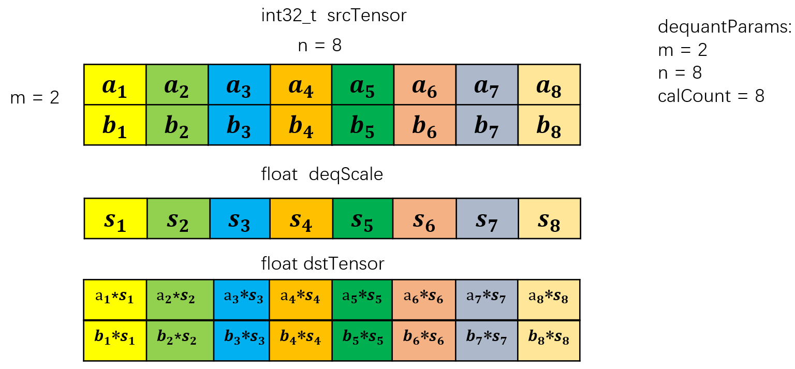
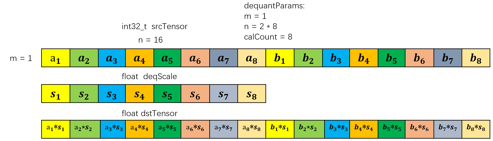
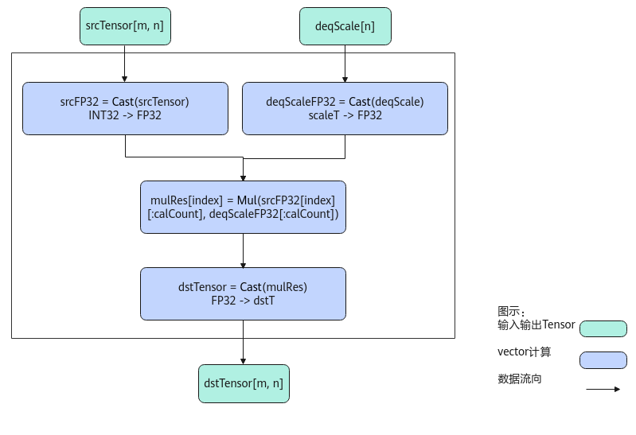

# AscendDequant-量化操作-高阶API-Ascend C算子开发接口-API-CANN社区版8.5.0开发文档-昇腾社区

**页面ID:** atlasascendc_api_07_0820
**来源：** https://www.hiascend.com/document/detail/zh/CANNCommunityEdition/850/API/ascendcopapi/atlasascendc_api_07_0820.html
---

# AscendDequant

#### 产品支持情况

| 产品                                        | 是否支持 |
| ------------------------------------------- | -------- |
| Atlas A3 训练系列产品/Atlas A3 推理系列产品 | √        |
| Atlas A2 训练系列产品/Atlas A2 推理系列产品 | √        |
| Atlas 200I/500 A2 推理产品                  | x        |
| Atlas推理系列产品AI Core                    | √        |
| Atlas推理系列产品Vector Core                | x        |
| Atlas训练系列产品                           | x        |

#### 功能说明

按元素做反量化计算，比如将int32_t数据类型反量化为half/float等数据类型。本接口最多支持输入为二维数据，不支持更高维度的输入。

- 假设输入srcTensor的shape为(m, n)，每行数据（即n个输入数据）所占字节数要求32字节对齐，每行中进行反量化的元素个数为calCount；
- 反量化系数deqScale可以为标量或者向量，为向量的情况下，calCount <= deqScale的元素个数，只有前CalCount个反量化系数生效；
- 输出dstTensor的shape为(m, n_dst)，n * sizeof(dstT)不满足32字节对齐时，需要向上补齐为32字节，n_dst为向上补齐后的列数。

下面通过两个具体的示例来解释参数的配置和计算逻辑（下文中DequantParams类型为存储shape信息的结构体{m, n, calCount}）：

- 如下图示例中，srcTensor的数据类型为int32_t，m = 4，n = 8，calCount = 4，表明srcTensor中每行进行反量化的元素个数为4，deqScale中的前4个数生效，后12个数不参与反量化计算；dstTensor的数据类型为bfloat16_t，m = 4，n_dst = 16 (16 * sizeof(bfloat16_t) % 32 = 0)。计算逻辑是srcTensor的每n个数为一行，对于每行中的前calCount个元素，该行srcTensor的第i个元素与deqScale的第i个元素进行相乘写入dstTensor对应行的第i个元素，dstTensor对应行的第calCount + 1个元素~第n_dst个元素均为不确定的值。
- 如下示例中，srcTensor的数据类型为int32_t，m = 4，n = 8，calCount = 4，表明srcTensor中每行进行反量化的元素个数为4；dstTensor的数据类型为float，m = 4，n_dst = 8 (8 * sizeof(float) % 32 = 0)。对于srcTensor每行中的前4个元素都和标量deqScale相乘并写入dstTensor中每行的对应位置。

当用户将模板参数中的mode配置为DEQUANT_WITH_SINGLE_ROW时：

针对DequantParams {m, n, calCount}，若同时满足以下3个条件：

1. m = 1
1. calCount为32 / sizeof(dstT)的倍数
1. n % calCount = 0

此时 {1, n, calCount}会被视作为{n / calCount, calCount, calCount}进行反量化的计算。

具体效果可看下图所示，传入的DequantParams为 {1, 16, 8}。因为dstT为float，所以calCount满足为8的倍数，在DEQUANT_WITH_SINGLE_ROW模式下会将{1, 2 * 8, 8}转换为 {2, 8, 8}进行计算。

#### 实现原理

以数据类型int32_t，shape为[m, n]的输入srcTensor，数据类型scaleT，shape为[n]的输入deqScale和数据类型dstT，shape为[m, n]的输出dstTensor为例，描述AscendDequant高阶API内部算法框图，如下图所示。

计算过程分为如下几步，均在Vector上进行：

1. 精度转换：将srcTensor和deqScale都转换成FP32精度的tensor，分别得到srcFP32和deqScaleFP32；
1. Mul计算：srcFP32一共有m行，每行长度为n；通过m次循环，将srcFP32的每行与deqScaleFP32相乘，通过mask控制仅对前dequantParams.calcount个数进行mul计算，图中index的取值范围为[0, m)，对应srcFP32的每一行；计算所得结果为mulRes，shape为[m, n]；
1. 结果数据精度转换：mulRes从FP32转换成dstT类型的tensor，所得结果为dstTensor，shape为[m, n]。

#### 函数原型

- 反量化参数deqScale为矢量通过sharedTmpBuffer入参传入临时空间12template<typenamedstT,typenamescaleT,DeQuantModemode=DeQuantMode:DEQUANT_WITH_SINGLE_ROW>__aicore__inlinevoidAscendDequant(constLocalTensor<dstT>&dstTensor,constLocalTensor<int32_t>&srcTensor,constLocalTensor<scaleT>&deqScale,constLocalTensor<uint8_t>&sharedTmpBuffer,DequantParamsparams)接口框架申请临时空间12template<typenamedstT,typenamescaleT,DeQuantModemode=DeQuantMode:DEQUANT_WITH_SINGLE_ROW>__aicore__inlinevoidAscendDequant(constLocalTensor<dstT>&dstTensor,constLocalTensor<int32_t>&srcTensor,constLocalTensor<scaleT>&deqScale,DequantParamsparams)
- 反量化参数deqScale为标量通过sharedTmpBuffer入参传入临时空间12template<typenamedstT,typenamescaleT,DeQuantModemode=DeQuantMode:DEQUANT_WITH_SINGLE_ROW>__aicore__inlinevoidAscendDequant(constLocalTensor<dstT>&dstTensor,constLocalTensor<int32_t>&srcTensor,constscaleTdeqScale,constLocalTensor<uint8_t>&sharedTmpBuffer,DequantParamsparams)接口框架申请临时空间12template<typenamedstT,typenamescaleT,DeQuantModemode=DeQuantMode:DEQUANT_WITH_SINGLE_ROW>__aicore__inlinevoidAscendDequant(constLocalTensor<dstT>&dstTensor,constLocalTensor<int32_t>&srcTensor,constscaleTdeqScale,DequantParamsparams)

由于该接口的内部实现中涉及复杂的数学计算，需要额外的临时空间来存储计算过程中的中间变量。临时空间支持接口框架申请和开发者通过sharedTmpBuffer入参传入两种方式。

- 接口框架申请临时空间，开发者无需申请，但是需要预留临时空间的大小。

- 通过sharedTmpBuffer入参传入，使用该tensor作为临时空间进行处理，接口框架不再申请。该方式开发者可以自行管理sharedTmpBuffer内存空间，并在接口调用完成后，复用该部分内存，内存不会反复申请释放，灵活性较高，内存利用率也较高。

接口框架申请的方式，开发者需要预留临时空间；通过sharedTmpBuffer传入的情况，开发者需要为sharedTmpBuffer申请空间。临时空间大小BufferSize的获取方式如下：通过GetAscendDequantMaxMinTmpSize中提供的GetAscendDequantMaxMinTmpSize接口获取需要预留空间的范围大小。

以下接口不推荐使用，新开发内容不要使用如下接口：

| 12  | template<typenamedstT,typenamescaleT,DeQuantModemode=DeQuantMode:DEQUANT_WITH_SINGLE_ROW>__aicore__inlinevoidAscendDequant(constLocalTensor<dstT>&dstTensor,constLocalTensor<int32_t>&srcTensor,constLocalTensor<scaleT>&deqScale,constLocalTensor<uint8_t>&sharedTmpBuffer,constuint32_tcalCount) |
| --- | -------------------------------------------------------------------------------------------------------------------------------------------------------------------------------------------------------------------------------------------------------------------------------------------------- |

| 12  | template<typenamedstT,typenamescaleT,DeQuantModemode=DeQuantMode:DEQUANT_WITH_SINGLE_ROW>__aicore__inlinevoidAscendDequant(constLocalTensor<dstT>&dstTensor,constLocalTensor<int32_t>&srcTensor,constLocalTensor<scaleT>&deqScale,constLocalTensor<uint8_t>&sharedTmpBuffer) |
| --- | ---------------------------------------------------------------------------------------------------------------------------------------------------------------------------------------------------------------------------------------------------------------------------- |

| 12  | template<typenamedstT,typenamescaleT,DeQuantModemode=DeQuantMode:DEQUANT_WITH_SINGLE_ROW>__aicore__inlinevoidAscendDequant(constLocalTensor<dstT>&dstTensor,constLocalTensor<int32_t>&srcTensor,constLocalTensor<scaleT>&deqScale,constuint32_tcalCount) |
| --- | -------------------------------------------------------------------------------------------------------------------------------------------------------------------------------------------------------------------------------------------------------- |

| 12  | template<typenamedstT,typenamescaleT,DeQuantModemode=DeQuantMode:DEQUANT_WITH_SINGLE_ROW>__aicore__inlinevoidAscendDequant(constLocalTensor<dstT>&dstTensor,constLocalTensor<int32_t>&srcTensor,constLocalTensor<scaleT>&deqScale) |
| --- | ---------------------------------------------------------------------------------------------------------------------------------------------------------------------------------------------------------------------------------- |

#### 参数说明

| 参数名 | 描述                                                                                                                                                                                                                                                                                                                                                                                                                                                                      |
| ------ | ------------------------------------------------------------------------------------------------------------------------------------------------------------------------------------------------------------------------------------------------------------------------------------------------------------------------------------------------------------------------------------------------------------------------------------------------------------------------- |
| dstT   | 目的操作数的数据类型。                                                                                                                                                                                                                                                                                                                                                                                                                                                    |
| scaleT | deqScale的数据类型。                                                                                                                                                                                                                                                                                                                                                                                                                                                      |
| mode   | 决定当DequantParams为{1, n, calCount}时的计算逻辑，传入enum DeQuantMode，支持以下2种配置：DEQUANT_WITH_SINGLE_ROW：当DequantParams {m, n, calCount} 同时满足以下条件：1、m = 1；2、calCount为32 / sizeof(dstT)的倍数；3、n % calCount = 0时，即 {1, n, calCount} 会当作 {n / calCount, calCount, calCount} 进行计算。DEQUANT_WITH_MULTI_ROW：即使满足上述所有条件，{1, n, calCount} 依然只会当作 {1, n, calCount} 进行计算，即总共n个数，前calCount个数进行反量化的计算。 |

| 参数名          | 输入/输出                                                                                                                                                                                               | 描述                                                                                                                                                                                                                                                                                                                                                                                                                                                                                                                                                                                                                                                         |        |                                                                                                                                                                                                         |
| --------------- | ------------------------------------------------------------------------------------------------------------------------------------------------------------------------------------------------------- | ------------------------------------------------------------------------------------------------------------------------------------------------------------------------------------------------------------------------------------------------------------------------------------------------------------------------------------------------------------------------------------------------------------------------------------------------------------------------------------------------------------------------------------------------------------------------------------------------------------------------------------------------------------ | ------ | ------------------------------------------------------------------------------------------------------------------------------------------------------------------------------------------------------- |
| dstTensor       | 输出                                                                                                                                                                                                    | 目的操作数。类型为LocalTensor，支持的TPosition为VECIN/VECCALC/VECOUT。Atlas A3 训练系列产品/Atlas A3 推理系列产品，支持的数据类型为：half、bfloat16_t、float。Atlas A2 训练系列产品/Atlas A2 推理系列产品，支持的数据类型为：half、bfloat16_t、float。Atlas推理系列产品AI Core，支持的数据类型为：half、float。dstTensor的行数和srcTensor的行数保持一致。n * sizeof(dstT)不满足32字节对齐时，需要向上补齐为32字节，n_dst为向上补齐后的列数。如srcTensor数据类型为int32_t，shape为(4, 8)，dstTensor为bfloat16_t，则n_dst应从8补齐为16，dstTensor shape为(4, 16)。补齐的计算过程为：n_dst = (8 * sizeof(bfloat16_t) + 32 - 1) / 32 * 32 / sizeof(bfloat16_t)。 |        |                                                                                                                                                                                                         |
| srcTensor       | 输入                                                                                                                                                                                                    | 源操作数。类型为LocalTensor，支持的TPosition为VECIN/VECCALC/VECOUT。Atlas A3 训练系列产品/Atlas A3 推理系列产品，支持的数据类型为：int32_t。Atlas A2 训练系列产品/Atlas A2 推理系列产品，支持的数据类型为：int32_t。Atlas推理系列产品AI Core，支持的数据类型为：int32_t。shape为[m, n]，n个输入数据所占字节数要求32字节对齐。                                                                                                                                                                                                                                                                                                                                |        |                                                                                                                                                                                                         |
| deqScale        | 输入                                                                                                                                                                                                    | 源操作数。类型为标量或者LocalTensor。类型为LocalTensor时，支持的TPosition为VECIN/VECCALC/VECOUT。Atlas A3 训练系列产品/Atlas A3 推理系列产品，当deqScale为矢量时，支持的数据类型为：uint64_t、float、bfloat16_t；当deqScale为标量时，支持的数据类型为bfloat16_t、float。Atlas A2 训练系列产品/Atlas A2 推理系列产品，当deqScale为矢量时，支持的数据类型为：uint64_t、float、bfloat16_t；当deqScale为标量时，支持的数据类型为bfloat16_t、float。Atlas推理系列产品AI Core，当deqScale为矢量时，支持的数据类型为：uint64_t、float；当deqScale为标量时，支持的数据类型为float。dstTensor、srcTensor、deqScale支持的数据类型组合请参考表3和表4。                  |        |                                                                                                                                                                                                         |
| sharedTmpBuffer | 输入                                                                                                                                                                                                    | 临时缓存。类型为LocalTensor，支持的TPosition为VECIN/VECCALC/VECOUT。临时空间大小BufferSize的获取方式请参考GetAscendDequantMaxMinTmpSize。Atlas A3 训练系列产品/Atlas A3 推理系列产品，支持的数据类型为：uint8_t。Atlas A2 训练系列产品/Atlas A2 推理系列产品，支持的数据类型为：uint8_t。Atlas推理系列产品AI Core，支持的数据类型为：uint8_t。                                                                                                                                                                                                                                                                                                               |        |                                                                                                                                                                                                         |
| params          | 输入                                                                                                                                                                                                    | srcTensor的shape信息。DequantParams类型，具体定义如下：123456structDequantParams{uint32_tm;// srcTensor的行数uint32_tn;// srcTensor的列数uint32_tcalCount;// 针对srcTensor每一行，前calCount个数为有效数据，与deqScale的前calCount个数或者deqScale标量进行乘法计算};DequantParams.n * sizeof(T)必须是32字节的整数倍，T为srcTensor中元素的数据类型。因为是每n个数中的前calCount个数进行乘法运算，因此DequantParams.n和calCount需要满足以下关系1 <= DequantParams.calCount <= DequantParams.n。deqScale为矢量时，DequantParams.calCount <= deqScale的元素个数。                                                                                                | 123456 | structDequantParams{uint32_tm;// srcTensor的行数uint32_tn;// srcTensor的列数uint32_tcalCount;// 针对srcTensor每一行，前calCount个数为有效数据，与deqScale的前calCount个数或者deqScale标量进行乘法计算}; |
| 123456          | structDequantParams{uint32_tm;// srcTensor的行数uint32_tn;// srcTensor的列数uint32_tcalCount;// 针对srcTensor每一行，前calCount个数为有效数据，与deqScale的前calCount个数或者deqScale标量进行乘法计算}; |                                                                                                                                                                                                                                                                                                                                                                                                                                                                                                                                                                                                                                                              |        |                                                                                                                                                                                                         |

| dstTensor  | srcTensor | deqScale                                                                                                                              |
| ---------- | --------- | ------------------------------------------------------------------------------------------------------------------------------------- |
| half       | int32_t   | uint64_t注意：当deqScale的数据类型是uint64_t时，数值低32位是参与计算的数据，数据类型是float，数值高32位是一些控制参数，本接口不使用。 |
| float      | int32_t   | float                                                                                                                                 |
| float      | int32_t   | bfloat16_t                                                                                                                            |
| bfloat16_t | int32_t   | bfloat16_t                                                                                                                            |
| bfloat16_t | int32_t   | float                                                                                                                                 |

| dstTensor  | srcTensor | deqScale   |
| ---------- | --------- | ---------- |
| bfloat16_t | int32_t   | bfloat16_t |
| bfloat16_t | int32_t   | float      |
| float      | int32_t   | bfloat16_t |
| float      | int32_t   | float      |

#### 返回值说明

无

#### 约束说明

- 不支持源操作数与目的操作数地址重叠。
- 操作数地址对齐要求请参见通用地址对齐约束。

#### 调用示例

| 1234 | rowLen=m;// m = 4colLen=n;// n = 8//输入srcLocal的shape为4*8，类型为int32_t，deqScaleLocal的shape为8，类型为float，预留临时空间AscendC:AscendDequant(dstLocal,srcLocal,deqScaleLocal,{rowLen,colLen,deqScaleLocal.GetSize()}); |
| ---- | ------------------------------------------------------------------------------------------------------------------------------------------------------------------------------------------------------------------------------ |

结果示例如下：

| 1234567891011121314 | 输入数据(srcLocal)int32_t数据类型：[-85-5-7-3-83692-500-5-70-60-23-285222-45-44-83]反量化参数deqScalefloat数据类型：[10.43356710.765296-30.694275-65.477418.386527-89.64619465.1115342.213394]输出数据(dstLocal)float数据类型：[-83.4685453.82648153.47137458.34186-25.15958717.16956195.33458253.2803693.902121.530592153.47137-0.0.448.23096-455.78070.-62.6014020.61.38855-196.43222-16.773054-717.16956325.5576284.4267920.86713421.530592122.7771-327.38705-33.54611-358.58478-520.8922126.64018] |
| ------------------- | ------------------------------------------------------------------------------------------------------------------------------------------------------------------------------------------------------------------------------------------------------------------------------------------------------------------------------------------------------------------------------------------------------------------------------------------------------------------------------------------------------ |
