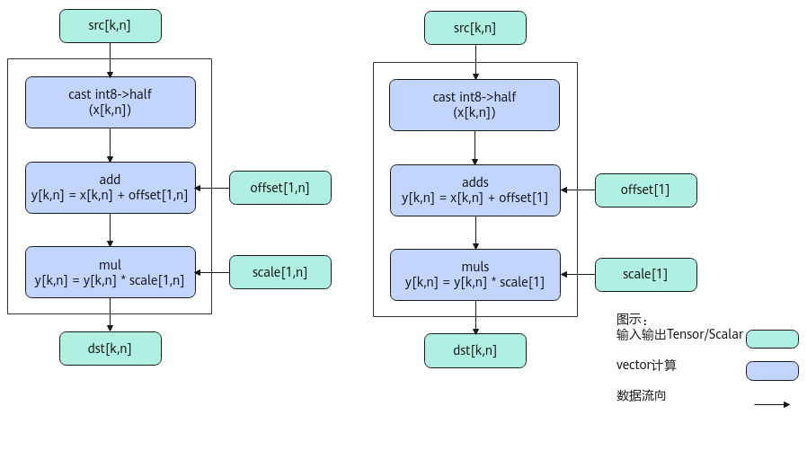
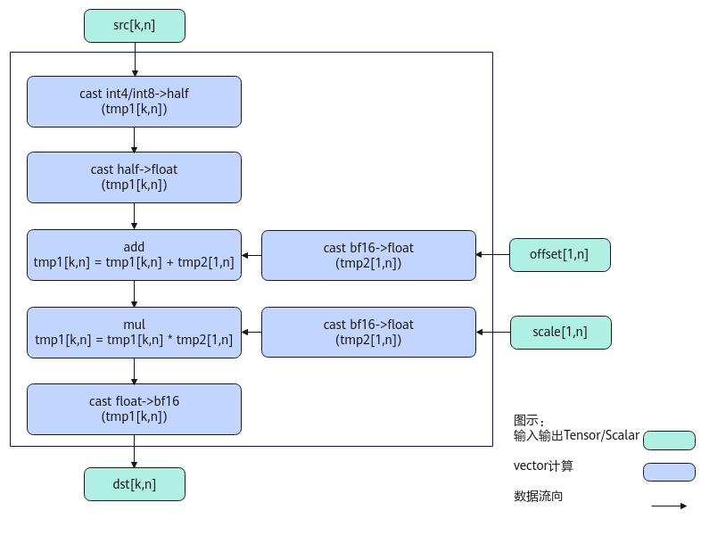

# AscendAntiQuant-量化操作-高阶API-Ascend C算子开发接口-API-CANN社区版8.5.0开发文档-昇腾社区

**页面ID:** atlasascendc_api_07_0822
**来源：** https://www.hiascend.com/document/detail/zh/CANNCommunityEdition/850/API/ascendcopapi/atlasascendc_api_07_0822.html
---

# AscendAntiQuant

#### 产品支持情况

| 产品                                        | 是否支持 |
| ------------------------------------------- | -------- |
| Atlas A3 训练系列产品/Atlas A3 推理系列产品 | √        |
| Atlas A2 训练系列产品/Atlas A2 推理系列产品 | √        |
| Atlas 200I/500 A2 推理产品                  | x        |
| Atlas推理系列产品AI Core                    | √        |
| Atlas推理系列产品Vector Core                | x        |
| Atlas训练系列产品                           | x        |

#### 功能说明

按元素做伪量化计算，比如将int8_t数据类型伪量化为half数据类型，计算公式如下：

- PER_CHANNEL场景（按通道量化）不使能输入转置groupSize = src.shape[0] / offset.shape[0]dst[i][j] = scale[i / groupSize][j] * (src[i][j] + offset[i / groupSize][j])使能输入转置groupSize = src.shape[1] / offset.shape[1]dst[i][j] = scale[i][j / groupSize] * (src[i][j] + offset[i][j / groupSize])

- PER_TENSOR场景（按张量量化）dst[i][j] = scale * (src[i][j] + offset)l

#### 实现原理

如上图所示，为AscendAntiQuant的典型场景算法框图，计算过程分为如下几步，均在Vector上进行：

1. 精度转换：将输入src转换为half类型；
1. 计算offset：当offset为向量时做Add计算，当offset为scalar时做Adds计算；
1. 计算scale：当scale为向量时做Mul计算，当scale为scalar时做Muls计算。

在Atlas A2 训练系列产品/Atlas A2 推理系列产品上，当输出为bfloat16时，计算过程分为如下几步：

1. src精度转换：将输入的src转换为half类型，再转换为float类型，存放到tmp1；
1. offset精度转换：当输入的offset为向量时转换为float类型，存放到tmp2，为scalar时做ToFloat转换为float类型；
1. 计算offset：当输入的offset为向量时与tmp2做Add计算，为scalar时做Adds计算；
1. scale精度转换：当输入的scale为向量时转换为float类型，存放到tmp2，为scalar时做ToFloat转换为float类型；
1. 计算scale：当输入的scale为向量时用tmp2做Mul计算，为scalar时做Muls计算；
1. dst精度转换：将tmp1转换为bf16类型。

#### 函数原型

- 通过sharedTmpBuffer入参传入临时空间PER_CHANNEL场景（按通道量化）12template<typenameInputDataType,typenameOutputDataType,boolisTranspose>__aicore__inlinevoidAscendAntiQuant(constLocalTensor<OutputDataType>&dst,constLocalTensor<InputDataType>&src,constLocalTensor<OutputDataType>&offset,constLocalTensor<OutputDataType>&scale,constLocalTensor<uint8_t>&sharedTmpBuffer,constuint32_tk,constAntiQuantShapeInfo&shapeInfo={})PER_CHANNEL场景（按通道量化，不带offset）12template<typenameInputDataType,typenameOutputDataType,boolisTranspose>__aicore__inlinevoidAscendAntiQuant(constLocalTensor<OutputDataType>&dst,constLocalTensor<InputDataType>&src,constLocalTensor<OutputDataType>&scale,constLocalTensor<uint8_t>&sharedTmpBuffer,constuint32_tk,constAntiQuantShapeInfo&shapeInfo={})PER_TENSOR场景（按张量量化）12template<typenameInputDataType,typenameOutputDataType,boolisTranspose>__aicore__inlinevoidAscendAntiQuant(constLocalTensor<OutputDataType>&dst,constLocalTensor<InputDataType>&src,constOutputDataTypeoffset,constOutputDataTypescale,constLocalTensor<uint8_t>&sharedTmpBuffer,constuint32_tk,constAntiQuantShapeInfo&shapeInfo={})PER_TENSOR场景（按张量量化，不带offset）12template<typenameInputDataType,typenameOutputDataType,boolisTranspose>__aicore__inlinevoidAscendAntiQuant(constLocalTensor<OutputDataType>&dst,constLocalTensor<InputDataType>&src,constOutputDataTypescale,constLocalTensor<uint8_t>&sharedTmpBuffer,constuint32_tk,constAntiQuantShapeInfo&shapeInfo={})

- 接口框架申请临时空间PER_CHANNEL场景12template<typenameInputDataType,typenameOutputDataType,boolisTranspose>__aicore__inlinevoidAscendAntiQuant(constLocalTensor<OutputDataType>&dst,constLocalTensor<InputDataType>&src,constLocalTensor<OutputDataType>&offset,constLocalTensor<OutputDataType>&scale,constuint32_tk,constAntiQuantShapeInfo&shapeInfo={})PER_TENSOR场景12template<typenameInputDataType,typenameOutputDataType,boolisTranspose>__aicore__inlinevoidAscendAntiQuant(constLocalTensor<OutputDataType>&dst,constLocalTensor<InputDataType>&src,constOutputDataTypeoffset,constOutputDataTypescale,constuint32_tk,constAntiQuantShapeInfo&shapeInfo={})

由于该接口的内部实现中涉及复杂的数学计算，需要额外的临时空间来存储计算过程中的中间变量。临时空间支持接口框架申请和开发者通过sharedTmpBuffer入参传入两种方式。

- 接口框架申请临时空间，开发者无需申请，但是需要预留临时空间的大小。

- 通过sharedTmpBuffer入参传入，使用该tensor作为临时空间进行处理，接口框架不再申请。该方式开发者可以自行管理sharedTmpBuffer内存空间，并在接口调用完成后，复用该部分内存，内存不会反复申请释放，灵活性较高，内存利用率也较高。

接口框架申请的方式，开发者需要预留临时空间；通过sharedTmpBuffer传入的情况，开发者需要为sharedTmpBuffer申请空间。临时空间大小BufferSize的获取方式如下：通过GetAscendAntiQuantMaxMinTmpSize中提供的接口获取需要预留空间的范围大小。

#### 参数说明

| 参数名         | 描述                   |
| -------------- | ---------------------- |
| InputDataType  | 输入的数据类型。       |
| OutputDataType | 输出的数据类型。       |
| isTranspose    | 是否使能输入数据转置。 |

| 参数名          | 输入/输出                                                                                                                                                                 | 描述                                                                                                                                                                                                                                                                                                                                                                                                                           |        |                                                                                                                                                                           |
| --------------- | ------------------------------------------------------------------------------------------------------------------------------------------------------------------------- | ------------------------------------------------------------------------------------------------------------------------------------------------------------------------------------------------------------------------------------------------------------------------------------------------------------------------------------------------------------------------------------------------------------------------------ | ------ | ------------------------------------------------------------------------------------------------------------------------------------------------------------------------- |
| dst             | 输出                                                                                                                                                                      | 目的操作数。类型为LocalTensor，支持的TPosition为VECIN/VECCALC/VECOUT。Atlas A3 训练系列产品/Atlas A3 推理系列产品，支持的数据类型为：half、bfloat16_t。Atlas A2 训练系列产品/Atlas A2 推理系列产品，支持的数据类型为：half、bfloat16_t。Atlas推理系列产品AI Core，支持的数据类型为：half。                                                                                                                                     |        |                                                                                                                                                                           |
| src             | 输入                                                                                                                                                                      | 源操作数。类型为LocalTensor，支持的TPosition为VECIN/VECCALC/VECOUT。Atlas A3 训练系列产品/Atlas A3 推理系列产品，支持的数据类型为：int8_t、int4b_t。Atlas A2 训练系列产品/Atlas A2 推理系列产品，支持的数据类型为：int8_t、int4b_t。Atlas推理系列产品AI Core，支持的数据类型为：int8_t。                                                                                                                                       |        |                                                                                                                                                                           |
| offset          | 输入                                                                                                                                                                      | 输入数据反量化时的偏移量。类型为LocalTensor，支持的TPosition为VECIN/VECCALC/VECOUT。Atlas A3 训练系列产品/Atlas A3 推理系列产品，支持的数据类型为：half、bfloat16_t。Atlas A2 训练系列产品/Atlas A2 推理系列产品，支持的数据类型为：half、bfloat16_t。Atlas推理系列产品AI Core，支持的数据类型为：half。                                                                                                                       |        |                                                                                                                                                                           |
| scale           | 输入                                                                                                                                                                      | 输入数据反量化时的缩放因子。类型为LocalTensor，支持的TPosition为VECIN/VECCALC/VECOUT。Atlas A3 训练系列产品/Atlas A3 推理系列产品，支持的数据类型为：half、bfloat16_t。Atlas A2 训练系列产品/Atlas A2 推理系列产品，支持的数据类型为：half、bfloat16_t。Atlas推理系列产品AI Core，支持的数据类型为：half。                                                                                                                     |        |                                                                                                                                                                           |
| sharedTmpBuffer | 输入                                                                                                                                                                      | 临时缓存。类型为LocalTensor，支持的TPosition为VECIN/VECCALC/VECOUT。临时空间大小BufferSize的获取方式请参考GetAscendAntiQuantMaxMinTmpSize。                                                                                                                                                                                                                                                                                    |        |                                                                                                                                                                           |
| k               | 输入                                                                                                                                                                      | isTranspose为true时，src的shape为[N,K]；isTranspose为false时，src的shape为[K,N]。参数k对应其中的K值。                                                                                                                                                                                                                                                                                                                          |        |                                                                                                                                                                           |
| shapeInfo       | 输入                                                                                                                                                                      | 设置参数offset和scale的shape信息，仅PER_CHANNEL场景（按通道量化）需要配置。可选参数。在PER_CHANNEL场景，如果未传入该参数或者结构体中数据设置为0，将从offset和scale的ShapeInfo中获取offset和scale的shape信息。AntiQuantShapeInfo类型，定义如下：123456structAntiQuantShapeInfo{uint32_toffsetHeight{0};// offset的高uint32_toffsetWidth{0};// offset的宽uint32_tscaleHeight{0};// scale的高uint32_tscaleWidth{0};// scale的宽}; | 123456 | structAntiQuantShapeInfo{uint32_toffsetHeight{0};// offset的高uint32_toffsetWidth{0};// offset的宽uint32_tscaleHeight{0};// scale的高uint32_tscaleWidth{0};// scale的宽}; |
| 123456          | structAntiQuantShapeInfo{uint32_toffsetHeight{0};// offset的高uint32_toffsetWidth{0};// offset的宽uint32_tscaleHeight{0};// scale的高uint32_tscaleWidth{0};// scale的宽}; |                                                                                                                                                                                                                                                                                                                                                                                                                                |        |                                                                                                                                                                           |

#### 返回值说明

无

#### 约束说明

- 不支持源操作数与目的操作数地址重叠。
- 操作数地址对齐要求请参见通用地址对齐约束。
- 输入输出操作数参与计算的数据长度要求32B对齐。
- 输入带转置场景，k需要32B对齐。
- 调用接口前，确保输入数据的size正确，offset和scale的size和shape正确。

#### 调用示例

| 123456789101112131415161718192021222324252627282930313233343536373839404142434445464748495051525354555657585960616263646566676869707172737475767778798081828384858687888990919293 | #include"kernel_operator.h"template<typenameInputType,typenameOutType>classAntiQuantTest{public:__aicore__inlineAntiQuantTest(){}__aicore__inlinevoidInit(GM_ADDRdstGm,GM_ADDRsrcGm,GM_ADDRoffsetGm,GM_ADDRscaleGm,uint32_telementCountOfInput,uint32_telementCountOfOffset,uint32_tK){elementCountOfInput=elementCountOfInput;elementCountOfOffset=elementCountOfOffset;k=K;dstGlobal.SetGlobalBuffer((__gm__OutType*)dstGm);srcGlobal.SetGlobalBuffer((__gm__InputType*)srcGm);offsetGlobal.SetGlobalBuffer((__gm__OutType*)offsetGm);scaleGlobal.SetGlobalBuffer((__gm__OutType*)scaleGm);pipe.InitBuffer(queInSrc,1,elementCountOfInput*sizeof(InputType));pipe.InitBuffer(queInOffset,1,elementCountOfOffset*sizeof(OutType));pipe.InitBuffer(queInScale,1,elementCountOfOffset*sizeof(OutType));pipe.InitBuffer(queOut,1,elementCountOfInput*sizeof(OutType));pipe.InitBuffer(queTmp,1,67584);}__aicore__inlinevoidProcess(){CopyIn();Compute();CopyOut();}private:__aicore__inlinevoidCopyIn(){AscendC:LocalTensor<InputType>srcLocal=queInSrc.AllocTensor<InputType>();AscendC:DataCopy(srcLocal,srcGlobal,elementCountOfInput);queInSrc.EnQue(srcLocal);AscendC:LocalTensor<OutType>offsetLocal=queInOffset.AllocTensor<OutType>();AscendC:DataCopy(offsetLocal,offsetGlobal,elementCountOfOffset);queInOffset.EnQue(offsetLocal);AscendC:LocalTensor<OutType>scaleLocal=queInScale.AllocTensor<OutType>();AscendC:DataCopy(scaleLocal,scaleGlobal,elementCountOfOffset);queInScale.EnQue(scaleLocal);}__aicore__inlinevoidCompute(){AscendC:LocalTensor<InputType>srcLocal=queInSrc.DeQue<InputType>();AscendC:LocalTensor<OutType>offsetLocal=queInOffset.DeQue<OutType>();AscendC:LocalTensor<OutType>scaleLocal=queInScale.DeQue<OutType>();AscendC:LocalTensor<OutType>dstLocal=queOut.AllocTensor<OutType>();AscendC:LocalTensor<uint8_t>sharedTmpBuffer=queTmp.AllocTensor<uint8_t>();AscendC:AntiQuantShapeInfoshapeInfo={1,elementCountOfOffset,1,elementCountOfOffset};AscendC:AscendAntiQuant<InputType,OutType,false>(dstLocal,srcLocal,offsetLocal,scaleLocal,sharedTmpBuffer,k,shapeInfo);queInSrc.FreeTensor(srcLocal);queInOffset.FreeTensor(offsetLocal);queInScale.FreeTensor(scaleLocal);queTmp.FreeTensor(sharedTmpBuffer);queOut.EnQue(dstLocal);}__aicore__inlinevoidCopyOut(){AscendC:LocalTensor<OutType>dstLocal=queOut.DeQue<OutType>();AscendC:DataCopy(dstGlobal,dstLocal,elementCountOfInput);queOut.FreeTensor(dstLocal);}private:AscendC:TPipepipe;AscendC:TQue<AscendC:TPosition:VECIN,1>queInSrc;AscendC:TQue<AscendC:TPosition:VECIN,1>queInOffset;AscendC:TQue<AscendC:TPosition:VECIN,1>queInScale;AscendC:TQue<AscendC:TPosition:VECOUT,1>queTmp;AscendC:TQue<AscendC:TPosition:VECOUT,1>queOut;AscendC:GlobalTensor<OutType>dstGlobal;AscendC:GlobalTensor<InputType>srcGlobal;AscendC:GlobalTensor<OutType>offsetGlobal;AscendC:GlobalTensor<OutType>scaleGlobal;uint32_telementCountOfInput;uint32_telementCountOfOffset;uint32_tk;};// class AntiQuantTestextern"C"__global____aicore__voidkernel_anti_quant(GM_ADDRdst,GM_ADDRsrc,GM_ADDRoffset,GM_ADDRscale,uint32_telementCountOfInput,uint32_telementCountOfOffset,uint32_tK){AscendC:AntiQuantTest<InputType,OutType>op;op.Init(dst,src,offset,scale,elementCountOfInput,elementCountOfOffset,K);op.Process();} |
| --------------------------------------------------------------------------------------------------------------------------------------------------------------------------------- | ---------------------------------------------------------------------------------------------------------------------------------------------------------------------------------------------------------------------------------------------------------------------------------------------------------------------------------------------------------------------------------------------------------------------------------------------------------------------------------------------------------------------------------------------------------------------------------------------------------------------------------------------------------------------------------------------------------------------------------------------------------------------------------------------------------------------------------------------------------------------------------------------------------------------------------------------------------------------------------------------------------------------------------------------------------------------------------------------------------------------------------------------------------------------------------------------------------------------------------------------------------------------------------------------------------------------------------------------------------------------------------------------------------------------------------------------------------------------------------------------------------------------------------------------------------------------------------------------------------------------------------------------------------------------------------------------------------------------------------------------------------------------------------------------------------------------------------------------------------------------------------------------------------------------------------------------------------------------------------------------------------------------------------------------------------------------------------------------------------------------------------------------------------------------------------------------------------------------------------------------------------------------------------------------------------------------------------------------------------------------------------------------------------------------------------------------------------------------------------------------------------------------------------------------------------------------------------------------------------------------------------------------------------------------------------------------------------------------------------------------------------------------------------------------------------------------------------------------------------------------------------------------------------------------------------------------------------------------------------------------------------------------------------------------------------------------------------------------------------------------------------------------------------------------------------------------------------------------------------------------------------------------------------------------------------------------- |

| 1234567891011121314151617181920 | 输入数据src（shape为[2,64]，非转置场景）：[11111111111111111111111111111111111111111111111111111111111111111111111111111111111111111111111111111111111111111111111111111111]offset（shape为[1,64]）：[2.2.2.2.2.2.2.2.2.2.2.2.2.2.2.2.2.2.2.2.2.2.2.2.2.2.2.2.2.2.2.2.2.2.2.2.2.2.2.2.2.2.2.2.2.2.2.2.2.2.2.2.2.2.2.2.2.2.2.2.2.2.2.2.]scale（shape为[1,64]）：[3.3.3.3.3.3.3.3.3.3.3.3.3.3.3.3.3.3.3.3.3.3.3.3.3.3.3.3.3.3.3.3.3.3.3.3.3.3.3.3.3.3.3.3.3.3.3.3.3.3.3.3.3.3.3.3.3.3.3.3.3.3.3.3.]输出数据dstLocal（shape为[2,64]）：[9.9.9.9.9.9.9.9.9.9.9.9.9.9.9.9.9.9.9.9.9.9.9.9.9.9.9.9.9.9.9.9.9.9.9.9.9.9.9.9.9.9.9.9.9.9.9.9.9.9.9.9.9.9.9.9.9.9.9.9.9.9.9.9.9.9.9.9.9.9.9.9.9.9.9.9.9.9.9.9.9.9.9.9.9.9.9.9.9.9.9.9.9.9.9.9.9.9.9.9.9.9.9.9.9.9.9.9.9.9.9.9.9.9.9.9.9.9.9.9.9.9.9.9.9.9.9.9.] |
| ------------------------------- | ------------------------------------------------------------------------------------------------------------------------------------------------------------------------------------------------------------------------------------------------------------------------------------------------------------------------------------------------------------------------------------------------------------------------------------------------------------------------------------------------------------------------------------------------------------------------------------------------------------------------------------------------------------------------------------------------------------------------------------------------------------------------------------------------------ |
