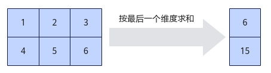
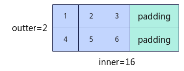

# Sum-Sum接口-归约操作-高阶API-Ascend C算子开发接口-API-CANN社区版8.5.0开发文档-昇腾社区

**页面ID:** atlasascendc_api_07_0825
**来源：** https://www.hiascend.com/document/detail/zh/CANNCommunityEdition/850/API/ascendcopapi/atlasascendc_api_07_0825.html
---

# Sum

#### 产品支持情况

| 产品                                        | 是否支持 |
| ------------------------------------------- | -------- |
| Atlas A3 训练系列产品/Atlas A3 推理系列产品 | √        |
| Atlas A2 训练系列产品/Atlas A2 推理系列产品 | √        |
| Atlas 200I/500 A2 推理产品                  | x        |
| Atlas推理系列产品AI Core                    | √        |
| Atlas推理系列产品Vector Core                | x        |
| Atlas训练系列产品                           | x        |

#### 功能说明

获取最后一个维度的元素总和。

如果输入是向量，则在向量中对各元素相加；如果输入是矩阵，则沿最后一个维度对每行中元素求和。本接口最多支持输入为二维数据，不支持更高维度的输入。

如下图所示，对shape为(2, 3)的二维矩阵进行运算，输出结果为[6, 15]。

为计算如上过程，引入一些必备概念：行数称之为外轴长度(outter)，每行实际的元素个数称之为内轴的实际元素个数(n)，存储n个元素所需的字节长度向上补齐到32整数倍后转换的元素个数称之为补齐后的内轴元素个数(inner)。本接口要求输入的内轴长度为32字节的整数倍，所以当n占据的字节长度不是32的整数倍时，需要开发者将其向上补齐到32的整数倍。比如，如下的样例中，元素类型为half，每行的实际元素个数n为3，占据字节长度为6字节，不是32字节的整数倍，向上补齐后得到32字节，转换为元素个数为16。故outter = 2，n =3，inner=16。图中的padding代表补齐操作。n和inner的关系如下：inner = (n *sizeof(T) + 32 - 1) / 32 * 32 / sizeof(T)。

#### 函数原型

- 通过sharedTmpBuffer入参传入临时空间12template<typenameT,int32_treduceDim=-1,boolisReuseSource=false,boolisBasicBlock=false>__aicore__inlinevoidSum(constLocalTensor<T>&dstTensor,constLocalTensor<T>&srcTensor,constLocalTensor<uint8_t>&sharedTmpBuffer,constSumParams&sumParams)

- 接口框架申请临时空间12template<typenameT,int32_treduceDim=-1,boolisReuseSource=false,boolisBasicBlock=false>__aicore__inlinevoidSum(constLocalTensor<T>&dstTensor,constLocalTensor<T>&srcTensor,constSumParams&sumParams)

由于该接口的内部实现中涉及复杂的数学计算，需要额外的临时空间来存储计算过程中的中间变量。临时空间支持开发者通过sharedTmpBuffer入参传入和接口框架申请两种方式。

- 通过sharedTmpBuffer入参传入，使用该tensor作为临时空间进行处理，接口框架不再申请。该方式开发者可以自行管理sharedTmpBuffer内存空间，并在接口调用完成后，复用该部分内存，内存不会反复申请释放，灵活性较高，内存利用率也较高。
- 接口框架申请临时空间，开发者无需申请，但是需要预留临时空间的大小。

通过sharedTmpBuffer传入的情况，开发者需要为tensor申请空间；接口框架申请的方式，开发者需要预留临时空间。临时空间大小BufferSize的获取方式如下：通过GetSumMaxMinTmpSize中提供的接口获取需要预留空间范围的大小。

#### 参数说明

| 参数名        | 描述                                                                                                                                                                                                                                |
| ------------- | ----------------------------------------------------------------------------------------------------------------------------------------------------------------------------------------------------------------------------------- |
| T             | 操作数的数据类型。Atlas A3 训练系列产品/Atlas A3 推理系列产品，支持的数据类型为：half、float。Atlas A2 训练系列产品/Atlas A2 推理系列产品，支持的数据类型为：half、float。Atlas推理系列产品AI Core，支持的数据类型为：half、float。 |
| reduceDim     | 用于指定按数据的哪一维度进行求和。本接口按最后一个维度实现，不支持reduceDim参数，传入默认值-1即可。                                                                                                                                 |
| isReuseSource | 是否允许修改源操作数。该参数预留，传入默认值false即可。                                                                                                                                                                             |
| isBasicBlock  | 预留参数，暂不支持。                                                                                                                                                                                                                |

| 参数名          | 输入/输出                                                                                                                                                                                     | 描述                                                                                                                                                                                                                                                                                                                                                                                                                                                                                                    |       |                                                                                                                                                                                               |
| --------------- | --------------------------------------------------------------------------------------------------------------------------------------------------------------------------------------------- | ------------------------------------------------------------------------------------------------------------------------------------------------------------------------------------------------------------------------------------------------------------------------------------------------------------------------------------------------------------------------------------------------------------------------------------------------------------------------------------------------------- | ----- | --------------------------------------------------------------------------------------------------------------------------------------------------------------------------------------------- |
| dstTensor       | 输出                                                                                                                                                                                          | 目的操作数。类型为LocalTensor，支持的TPosition为VECIN/VECCALC/VECOUT。输出值需要outter * sizeof(T)大小的空间进行保存。开发者要根据该大小和框架的对齐要求来为dstTensor分配实际内存空间。说明：注意：遵循框架对内存开辟的要求（开辟内存的大小满足32Byte对齐），即outter * sizeof(T)不是32Byte对齐时，需要向上进行32Byte对齐。为了对齐而多开辟的内存空间不填值，为一些随机值。                                                                                                                             |       |                                                                                                                                                                                               |
| srcTensor       | 输入                                                                                                                                                                                          | 源操作数。类型为LocalTensor，支持的TPosition为VECIN/VECCALC/VECOUT。源操作数的数据类型需要与目的操作数保持一致。                                                                                                                                                                                                                                                                                                                                                                                        |       |                                                                                                                                                                                               |
| sharedTmpBuffer | 输入                                                                                                                                                                                          | 临时缓存。类型为LocalTensor，支持的TPosition为VECIN/VECCALC/VECOUT。用于Sum内部复杂计算时存储中间变量，由开发者提供。临时空间大小BufferSize的获取方式请参考GetSumMaxMinTmpSize。                                                                                                                                                                                                                                                                                                                        |       |                                                                                                                                                                                               |
| sumParams       | 输入                                                                                                                                                                                          | srcTensor的shape信息。SumParams类型，具体定义如下：12345structSumParams{uint32_toutter=1;// 表示输入数据的外轴长度uint32_tinner;// 表示输入数据内轴的补齐后元素个数，inner*sizeof(T)必须是32字节的整数倍uint32_tn;// 表示输入数据内轴的实际元素个数};sumParams.inner*sizeof(T)必须是32字节的整数倍。sumParams.inner是sumParams.n字节数转换后进而进行32的整数倍向上补齐的值，inner = (n *sizeof(T) + 32 - 1) / 32 * 32 / sizeof(T)，因此sumParams.n的大小应该满足：1 <= sumParams.n <= sumParams.inner。 | 12345 | structSumParams{uint32_toutter=1;// 表示输入数据的外轴长度uint32_tinner;// 表示输入数据内轴的补齐后元素个数，inner*sizeof(T)必须是32字节的整数倍uint32_tn;// 表示输入数据内轴的实际元素个数}; |
| 12345           | structSumParams{uint32_toutter=1;// 表示输入数据的外轴长度uint32_tinner;// 表示输入数据内轴的补齐后元素个数，inner*sizeof(T)必须是32字节的整数倍uint32_tn;// 表示输入数据内轴的实际元素个数}; |                                                                                                                                                                                                                                                                                                                                                                                                                                                                                                         |       |                                                                                                                                                                                               |

#### 返回值说明

无

#### 约束说明

- 操作数地址对齐要求请参见通用地址对齐约束。
- 不支持源操作数与目的操作数地址重叠。
- 不支持sharedTmpBuffer与源操作数和目的操作数地址重叠。
- 当前仅支持ND格式的输入，不支持其他格式。
- 一维输入的outter值填为1；二维输入按实际情况填写outter和n，inner计算请按如上公式计算，否则功能不正确。
- srcTensor需要能够容纳内轴对齐后的数据占用空间大小，dstTensor需要能够容纳outter个结果对齐后的数据占用空间大小。
- 对于Sum，其内部使用的底层相加方式和ReduceSum以及WholeReduceSum的内部的相加方式一致，采用二叉树方式，两两相加：假设源操作数为128个half类型的数据[data0,data1,data2...data127]，一个repeat可以计算完，计算过程如下。data0和data1相加得到data00，data2和data3相加得到data01...data124和data125相加得到data62，data126和data127相加得到data63；data00和data01相加得到data000，data02和data03相加得到data001...data62和data63相加得到data031；以此类推，得到目的操作数为1个half类型的数据[data]。

#### 调用示例

完整的算子样例请参考Sum算子样例。

| 1234567 | AscendC:SumParamsparams;params.inner=inner;params.outter=outter;params.n=n;Tscalar(0);AscendC:Duplicate<T>(yLocal,scalar,out_inner);AscendC:Sum(yLocal,xLocal,sharedTmpBuffer,params); |
| ------- | -------------------------------------------------------------------------------------------------------------------------------------------------------------------------------------- |

| 123 | 输入数据srcLocal:[[1230000000000000],[4560000000000000]]输出数据dstLocal:[61500000000000000] |
| --- | -------------------------------------------------------------------------------------------- |
