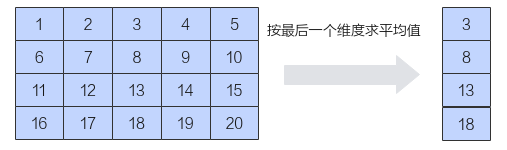
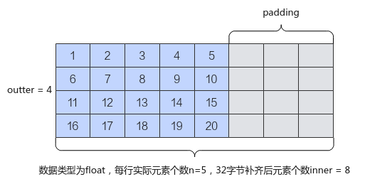

# Mean-Mean接口-归约操作-高阶API-Ascend C算子开发接口-API-CANN社区版8.5.0开发文档-昇腾社区

**页面ID:** atlasascendc_api_07_0828
**来源：** https://www.hiascend.com/document/detail/zh/CANNCommunityEdition/850/API/ascendcopapi/atlasascendc_api_07_0828.html
---

# Mean

#### 产品支持情况

| 产品                                        | 是否支持 |
| ------------------------------------------- | -------- |
| Atlas A3 训练系列产品/Atlas A3 推理系列产品 | √        |
| Atlas A2 训练系列产品/Atlas A2 推理系列产品 | √        |
| Atlas 200I/500 A2 推理产品                  | x        |
| Atlas推理系列产品AI Core                    | √        |
| Atlas推理系列产品Vector Core                | x        |
| Atlas训练系列产品                           | x        |

#### 功能说明

根据最后一轴的方向对各元素求平均值。

如果输入是向量，则在向量中对各元素相加求平均；如果输入是矩阵，则沿最后一个维度对元素求平均。本接口最多支持输入为二维数据，不支持更高维度的输入。

如下图所示，对shape为(4, 5)的二维矩阵进行求平均操作，输出结果为[3，8，13，18]。

在了解接口具体功能之前，需要了解一些必备概念：数据的行数称之为外轴长度(outter)，每行实际的元素个数称之为内轴的实际元素个数(n)，内轴实际元素个数n向上32字节对齐后的元素个数称之为补齐后的内轴元素个数(inner)。本接口要求输入的内轴长度满足32字节对齐，所以当n占据的字节长度不是32字节的整数倍时，需要开发者将其向上补齐到32字节的整数倍。如下样例中，元素类型为float，每行的实际元素个数n为5，占据字节长度为20字节，不是32字节的整数倍，向上补齐后得到32字节，对应的元素个数为8。图中的padding代表补齐操作。n和inner的关系如下：inner = (n *sizeof(T) + 32 - 1) / 32 * 32 / sizeof(T)。

#### 函数原型

- 通过sharedTmpBuffer入参传入临时空间12template<typenameT,typenameaccType=T,boolisReuseSource=false,boolisBasicBlock=false,int32_treduceDim=-1>__aicore__inlinevoidMean(constLocalTensor<T>&dstTensor,constLocalTensor<T>&srcTensor,constLocalTensor<uint8_t>&sharedTmpBuffer,constMeanParams&meanParams)

- 接口框架申请临时空间12template<typenameT,typenameaccType=T,boolisReuseSource=false,boolisBasicBlock=false,int32_treduceDim=-1>__aicore__inlinevoidMean(constLocalTensor<T>&dstTensor,constLocalTensor<T>&srcTensor,constMeanParams&meanParams)

由于该接口的内部实现中涉及复杂的数学计算，需要额外的临时空间来存储计算过程中的中间变量。临时空间支持开发者通过sharedTmpBuffer入参传入和接口框架申请两种方式。

- 通过sharedTmpBuffer入参传入，使用该tensor作为临时空间进行处理，接口框架不再申请。该方式开发者可以自行管理sharedTmpBuffer内存空间，并在接口调用完成后，复用该部分内存，内存不会反复申请释放，灵活性较高，内存利用率也较高。
- 接口框架申请临时空间，开发者无需申请，但是需要预留临时空间的大小。

通过sharedTmpBuffer传入的情况，开发者需要为tensor申请空间；接口框架申请的方式，开发者需要预留临时空间。临时空间大小BufferSize的获取方式如下：通过GetMeanMaxMinTmpSize中提供的接口获取需要预留空间范围的大小。

#### 参数说明

| 参数名        | 描述                                                                                                                                                                                                                                                                                                            |
| ------------- | --------------------------------------------------------------------------------------------------------------------------------------------------------------------------------------------------------------------------------------------------------------------------------------------------------------- |
| T             | 操作数的数据类型。Atlas A3 训练系列产品/Atlas A3 推理系列产品，支持的数据类型为：half、float。Atlas A2 训练系列产品/Atlas A2 推理系列产品，支持的数据类型为：half、float。Atlas推理系列产品AI Core，支持的数据类型为：half、float。                                                                             |
| accType       | 实际参与计算的数据类型，设置的accType精度高于输入T的情况下，在计算之前会将输入转换为accType，使用accType类型计算，计算完成后再转换为原来的数据类型。设置accType值升精度可以防止数据类型溢出。T为half时，您可以将accType设置为float，表示为输入half类型升精度至float进行计算。不支持accType精度低于输入T的情况。 |
| isReuseSource | 是否允许修改源操作数。该参数预留，传入默认值false即可。                                                                                                                                                                                                                                                         |
| isBasicBlock  | 预留参数，暂不支持。                                                                                                                                                                                                                                                                                            |
| reduceDim     | 用于指定按数据的哪一维度进行求和。本接口按最后一个维度实现，不支持reduceDim参数，传入默认值-1即可。                                                                                                                                                                                                             |

| 参数名          | 输入/输出                                                                                                                                                                                                        | 描述                                                                                                                                                                                                                                                                                                                                                                                                                                                                                                        |       |                                                                                                                                                                                                                  |
| --------------- | ---------------------------------------------------------------------------------------------------------------------------------------------------------------------------------------------------------------- | ----------------------------------------------------------------------------------------------------------------------------------------------------------------------------------------------------------------------------------------------------------------------------------------------------------------------------------------------------------------------------------------------------------------------------------------------------------------------------------------------------------- | ----- | ---------------------------------------------------------------------------------------------------------------------------------------------------------------------------------------------------------------- |
| dstTensor       | 输出                                                                                                                                                                                                             | 目的操作数。类型为LocalTensor，支持的TPosition为VECIN/VECCALC/VECOUT。输出值需要outter * sizeof(T)大小的空间进行保存。开发者要根据该大小和框架的对齐要求来为dstTensor分配实际内存空间。                                                                                                                                                                                                                                                                                                                     |       |                                                                                                                                                                                                                  |
| srcTensor       | 输入                                                                                                                                                                                                             | 源操作数。类型为LocalTensor，支持的TPosition为VECIN/VECCALC/VECOUT。源操作数的数据类型需要与目的操作数保持一致。输入数据shape为outter * inner。开发者需要为其开辟大小为outter * inner * sizeof(T)的空间。                                                                                                                                                                                                                                                                                                   |       |                                                                                                                                                                                                                  |
| sharedTmpBuffer | 输入                                                                                                                                                                                                             | 临时缓存。类型为LocalTensor，支持的TPosition为VECIN/VECCALC/VECOUT。用于Mean内部复杂计算时存储中间变量，由开发者提供。临时空间大小BufferSize的获取方式请参考GetMeanMaxMinTmpSize。                                                                                                                                                                                                                                                                                                                          |       |                                                                                                                                                                                                                  |
| MeanParams      | 输入                                                                                                                                                                                                             | srcTensor的shape信息。MeanParams类型，具体定义如下：12345structMeanParams{uint32_toutter=1;// 表示输入数据的外轴长度uint32_tinner;// 表示输入数据内轴实际元素个数32字节补齐后的元素个数，inner*sizeof(T)必须是32字节的整数倍uint32_tn;// 表示输入数据内轴的实际元素个数};MeanParams.inner*sizeof(T)必须是32字节的整数倍。MeanParams.inner是MeanParams.n向上32字节对齐后的值，inner = (n *sizeof(T) + 32 - 1) / 32 * 32 / sizeof(T)，因此MeanParams.n的大小应该满足：1 <= MeanParams.n <= MeanParams.inner。 | 12345 | structMeanParams{uint32_toutter=1;// 表示输入数据的外轴长度uint32_tinner;// 表示输入数据内轴实际元素个数32字节补齐后的元素个数，inner*sizeof(T)必须是32字节的整数倍uint32_tn;// 表示输入数据内轴的实际元素个数}; |
| 12345           | structMeanParams{uint32_toutter=1;// 表示输入数据的外轴长度uint32_tinner;// 表示输入数据内轴实际元素个数32字节补齐后的元素个数，inner*sizeof(T)必须是32字节的整数倍uint32_tn;// 表示输入数据内轴的实际元素个数}; |                                                                                                                                                                                                                                                                                                                                                                                                                                                                                                             |       |                                                                                                                                                                                                                  |

#### 返回值说明

无

#### 约束说明

- 操作数地址对齐要求请参见通用地址对齐约束。
- 不支持源操作数与目的操作数地址重叠。
- 不支持sharedTmpBuffer与源操作数和目的操作数地址重叠。
- 当前仅支持ND格式的输入，不支持其他格式。
- 对于mean，采用的方式为先求和再做除法，其求和时内部使用的底层相加方式与Sum、ReduceSum以及WholeReduceSum的内部的相加方式一致，采用二叉树方式，两两相加，可参考Sum。

#### 调用示例

- kernel侧调用示例12345678910111213141516171819202122232425262728293031323334353637383940414243444546474849505152535455565758596061626364656667686970717273747576777879#include"kernel_operator.h"template<typenameT,typenameaccType>classKernelMean{public:__aicore__inlineKernelMean(){}__aicore__inlinevoidInit(__gm__uint8_t*srcGm,__gm__uint8_t*dstGm,uint32_toutter,uint32_tinner,uint32_tn,uint32_tSize){meanParams.outter=outter;meanParams.inner=inner;meanParams.n=n;tmpSize=Size;srcGlobal.SetGlobalBuffer((__gm__T*)srcGm);dstGlobal.SetGlobalBuffer((__gm__T*)dstGm);pipe.InitBuffer(inQueueX,1,meanParams.outter*meanParams.inner*sizeof(T));pipe.InitBuffer(outQueueY,1,(meanParams.outter*sizeof(T)+AscendC:ONE_BLK_SIZE-1)/AscendC:ONE_BLK_SIZE*AscendC:ONE_BLK_SIZE);}__aicore__inlinevoidProcess(){CopyIn();Compute();CopyOut();}private:__aicore__inlinevoidCopyIn(){AscendC:LocalTensor<T>srcLocal=inQueueX.AllocTensor<T>();AscendC:DataCopy(srcLocal,srcGlobal,meanParams.outter*meanParams.inner);inQueueX.EnQue(srcLocal);}__aicore__inlinevoidCompute(){AscendC:LocalTensor<T>srcLocal=inQueueX.DeQue<T>();AscendC:LocalTensor<T>dstLocal=outQueueY.AllocTensor<T>();if(tmpSize!=0){pipe.InitBuffer(tmplocalBuf,tmpSize);AscendC:LocalTensor<uint8_t>tmplocalTensor=tmplocalBuf.Get<uint8_t>();AscendC:Mean<T,accType>(dstLocal,srcLocal,tmplocalTensor,meanParams);}else{AscendC:Mean<T,accType>(dstLocal,srcLocal,meanParams);}outQueueY.EnQue<T>(dstLocal);}__aicore__inlinevoidCopyOut(){AscendC:LocalTensor<T>dstLocal=outQueueY.DeQue<T>();AscendC:DataCopy(dstGlobal,dstLocal,(meanParams.outter*sizeof(T)+AscendC:ONE_BLK_SIZE-1)/AscendC:ONE_BLK_SIZE*AscendC:ONE_BLK_SIZE/sizeof(T));outQueueY.FreeTensor(dstLocal);}private:AscendC:GlobalTensor<T>srcGlobal;AscendC:GlobalTensor<T>dstGlobal;AscendC:TPipepipe;AscendC:TQue<AscendC:TPosition:VECIN,1>inQueueX;AscendC:TQue<AscendC:TPosition:VECOUT,1>outQueueY;AscendC:TBuf<AscendC:TPosition:VECCALC>tmplocalBuf;AscendC:MeanParamsmeanParams;uint32_ttmpSize;};extern"C"__global____aicore__voidmean_custom(GM_ADDRx,GM_ADDRy,GM_ADDRworkspace,GM_ADDRtiling){GET_TILING_DATA(tiling_data,tiling);if(TILING_KEY_IS(1)){KernelMean<half,half>op;op.Init(x,y,tiling_data.outter,tiling_data.inner,tiling_data.n,tiling_data.tmpSize);op.Process();}elseif(TILING_KEY_IS(2)){KernelMean<float,float>op;op.Init(x,y,tiling_data.outter,tiling_data.inner,tiling_data.n,tiling_data.tmpSize);op.Process();}elseif(TILING_KEY_IS(3)){KernelMean<half,float>op;op.Init(x,y,tiling_data.outter,tiling_data.inner,tiling_data.n,tiling_data.tmpSize);op.Process();}}

- host侧tiling定义如下：12345678910#include"register/tilingdata_base.h"namespaceoptiling{BEGIN_TILING_DATA_DEF(MeanCustomTilingData)TILING_DATA_FIELD_DEF(uint32_t,outter);TILING_DATA_FIELD_DEF(uint32_t,inner);TILING_DATA_FIELD_DEF(uint32_t,n);TILING_DATA_FIELD_DEF(uint32_t,tmpSize);END_TILING_DATA_DEF;REGISTER_TILING_DATA_CLASS(MeanCustom,MeanCustomTilingData)}

- host侧tiling实现如下：1234567891011121314151617181920212223242526272829303132333435363738394041424344454647484950#include"mean_custom_tiling.h"#include"register/op_def_registry.h"#include"tiling/tiling_api.h"namespaceoptiling{staticge:graphStatusTilingFunc(gert:TilingContext*context){MeanCustomTilingDatatiling;constgert:StorageShape*src_shape=context->GetInputShape(0);// src_shape给两维uint32_toutter=src_shape->GetStorageShape().GetDim(0);uint32_tinner=src_shape->GetStorageShape().GetDim(1);constgert:RuntimeAttrs*meanattrs=context->GetAttrs();constuint32_tn=*(meanattrs->GetAttrPointer<uint32_t>(0));constuint32_tiscast=*(meanattrs->GetAttrPointer<uint32_t>(1));// iscast为1表示accType升精度constuint32_tsizeflag=*(meanattrs->GetAttrPointer<uint32_t>(2));// sizeflag为0表示框架申请tmpbuffer，为1表示通过sharedTmpBuffer入参传入临时空间autodt=context->GetInputTensor(0)->GetDataType();uint32_ttypeSize=0;if(iscast==1){typeSize=2;context->SetTilingKey(3);}elseif(dt==ge:DT_FLOAT16){typeSize=2;context->SetTilingKey(1);}elseif(dt==ge:DT_FLOAT){typeSize=4;context->SetTilingKey(2);}uint32_tmaxValue=0;uint32_tminValue=0;if(iscast==1){AscendC:GetMeanMaxMinTmpSize(n,typeSize,4,false,maxValue,minValue);}else{AscendC:GetMeanMaxMinTmpSize(n,typeSize,typeSize,false,maxValue,minValue);}if(sizeflag==0){tiling.set_tmpSize(0);}else{tiling.set_tmpSize(minValue);}tiling.set_outter(outter);tiling.set_inner(inner);tiling.set_n(n);context->SetBlockDim(1);tiling.SaveToBuffer(context->GetRawTilingData()->GetData(),context->GetRawTilingData()->GetCapacity());context->GetRawTilingData()->SetDataSize(tiling.GetDataSize());size_t*currentWorkspace=context->GetWorkspaceSizes(1);currentWorkspace[0]=0;returnge:GRAPH_SUCCESS;}}

结果示例如下：

| 123 | 输入数据(srcLocal):[[1230000000000000],[4560000000000000]]输出数据(dstLocal):[2500000000000000] |
| --- | ----------------------------------------------------------------------------------------------- |
