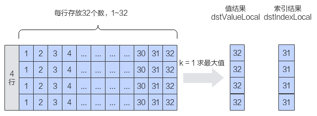

# TopK-排序操作-高阶API-Ascend C算子开发接口-API-CANN社区版8.5.0开发文档-昇腾社区

**页面ID:** atlasascendc_api_07_0835
**来源：** https://www.hiascend.com/document/detail/zh/CANNCommunityEdition/850/API/ascendcopapi/atlasascendc_api_07_0835.html
---

# TopK

#### 产品支持情况

| 产品                                        | 是否支持 |
| ------------------------------------------- | -------- |
| Atlas A3 训练系列产品/Atlas A3 推理系列产品 | √        |
| Atlas A2 训练系列产品/Atlas A2 推理系列产品 | √        |
| Atlas 200I/500 A2 推理产品                  | x        |
| Atlas推理系列产品AI Core                    | √        |
| Atlas推理系列产品Vector Core                | x        |
| Atlas训练系列产品                           | x        |

#### 功能说明

获取最后一个维度的前k个最大值或最小值及其对应的索引。

如果输入是向量，则在向量中找到前k个最大值或最小值及其对应的索引；如果输入是矩阵，则沿最后一个维度计算每行中前k个最大值或最小值及其对应的索引。本接口最多支持输入为二维数据，不支持更高维度的输入。

如下图所示，对shape为(4, 32)的二维矩阵进行排序，k设置为1，输出结果为[[32] [32] [32] [32]]。

- 必备概念基于如上样例，我们引入一些必备概念：行数称之为外轴长度(outter)，每行实际的元素个数称之为内轴的实际长度(n)。本接口要求输入的内轴长度为32的整数倍，所以当n不是32的整数倍时，需要开发者将其向上补齐到32的整数倍，补齐后的长度称之为内轴长度(inner)。比如，如下的样例中，每行的实际长度n为31，不是32的整数倍，向上补齐后得到inner为32，图中的padding代表补齐操作。n和inner的关系如下：当n是32的整数倍时，inner=n；否则，inner > n。
- 接口模式本接口支持两种模式：Normal模式和Small模式。Normal模式是通用模式；Small模式是为内轴长度固定为32（单位：元素个数）的场景提供的高性能模式。因为Small模式inner固定为32，可以进行更有针对性的处理，所以相关的约束较少，性能较高。内轴长度inner为32时建议使用Small模式。
- 附加功能：本接口支持开发者指定某些行的排序是无效排序。通过传入finishLocal参数值来控制，finishLocal对应行的值为true时，表示该行排序无效，此时排序后输出的dstIndexLocal的k个索引值会全部被置为无效索引n。

#### 实现原理

- MERGE_SORT算法以float类型，ND格式，shape为[outter, inner]的输入Tensor为例，描述TopK高阶API内部算法框图，如下图所示。图1TopK算法框图根据TopKMode不同的模式选择，可分为两个分支。计算TopK NORMAL模式，过程如下：模板参数isInitIndex为false，需生成0到inner - 1的索引；Atlas A3 训练系列产品/Atlas A3 推理系列产品采用方式二。Atlas A2 训练系列产品/Atlas A2 推理系列产品采用方式二。Atlas推理系列产品采用方式二。方式一：使用CreateVecIndex生成0到inner - 1的索引。方式二：使用Arange生成0到inner - 1的索引。isLargest参数为false，由于Sort32指令默认为降序排序，则给数据乘以-1；对输入数据完成全排序。Atlas A3 训练系列产品/Atlas A3 推理系列产品采用方式二。Atlas A2 训练系列产品/Atlas A2 推理系列产品采用方式二。Atlas推理系列产品采用方式二。方式一：使用高阶API Sort对数据完成全排序。方式二：使用Sort32对数据排序，保证每32个数据是有序的。使用MrgSort指令对所有的已排序数据块归并排序。使用GatherMask指令提取前k个数据和索引；finishLocal[i]为true时，则更新该行对应的排序结果为无效索引n；isLargest参数为false，则给数据乘以-1还原数据。注意：Atlas推理系列产品上使用ProposalConcat基础API将data和index组合起来后，再使用RpSort16基础API对数据排序；使用MrgSort4进行归并；使用ProposalExtract基础API提取data和index。计算TopK SMALL模式，过程如下：模板参数isInitIndex为false，需生成0到inner - 1的索引，并使用Copy指令将数据复制为outter条；Atlas A3 训练系列产品/Atlas A3 推理系列产品采用方式二。Atlas A2 训练系列产品/Atlas A2 推理系列产品采用方式二。Atlas推理系列产品采用方式二。方式一：使用CreateVecIndex生成0到inner - 1的索引。方式二：使用Arange生成0到inner - 1的索引。isLargest参数为false，由于Sort32指令默认为降序排序，则给输入数据乘以-1；使用Sort32对数据排序；使用GatherMask指令提取前k个数据和索引；isLargest参数为false，则给输入数据乘以-1还原数据。注意：Atlas推理系列产品上使用ProposalConcat基础API将data和index组合起来后，再使用RpSort16基础API对数据排序；由于small模式下inner为32，RpSort16排序后为每16个数据有序，因此在步骤3和步骤4之间，使用MrgSort4基础API进行一次归并排序。

#### 函数原型

- API内部申请临时空间12template<typenameT,boolisInitIndex=false,boolisHasfinish=false,boolisReuseSrc=false,enumTopKModetopkMode=TopKMode:TOPK_NORMAL>__aicore__inlinevoidTopK(constLocalTensor<T>&dstValueLocal,constLocalTensor<int32_t>&dstIndexLocal,constLocalTensor<T>&srcLocal,constLocalTensor<int32_t>&srcIndexLocal,constLocalTensor<bool>&finishLocal,constint32_tk,constTopkTiling&tilling,constTopKInfo&topKInfo,constboolisLargest=true)

- 通过tmpLocal入参传入临时空间12template<typenameT,boolisInitIndex=false,boolisHasfinish=false,boolisReuseSrc=false,enumTopKModetopkMode=TopKMode:TOPK_NORMAL>__aicore__inlinevoidTopK(constLocalTensor<T>&dstValueLocal,constLocalTensor<int32_t>&dstIndexLocal,constLocalTensor<T>&srcLocal,constLocalTensor<int32_t>&srcIndexLocal,constLocalTensor<bool>&finishLocal,constLocalTensor<uint8_t>&tmpLocal,constint32_tk,constTopkTiling&tilling,constTopKInfo&topKInfo,constboolisLargest=true)

由于该接口的内部实现中涉及复杂的逻辑计算，需要额外的临时空间来存储计算过程中的中间变量。临时空间支持API接口申请和开发者通过tmpLocal入参传入两种方式。

- API接口内部申请临时空间，开发者无需申请，但是需要预留临时空间的大小。

- 通过tmpLocal入参传入，使用该tensor作为临时空间进行处理，API接口内部不再申请。该方式开发者可以自行管理tmpLocal内存空间，并在接口调用完成后，复用该部分内存，内存不会反复申请释放，灵活性较高，内存利用率也较高。临时空间大小tmpLocal的BufferSize的获取方式如下：通过TopK Tiling中提供的GetTopKMaxMinTmpSize接口获取所需最大和最小临时空间大小。

#### 参数说明

| 参数名      | 描述                                                                                                                                                                                                                                                                               |      |                                                                       |
| ----------- | ---------------------------------------------------------------------------------------------------------------------------------------------------------------------------------------------------------------------------------------------------------------------------------- | ---- | --------------------------------------------------------------------- |
| T           | 待排序数据的数据类型。Atlas A3 训练系列产品/Atlas A3 推理系列产品，支持的数据类型为：half、float。Atlas A2 训练系列产品/Atlas A2 推理系列产品，支持的数据类型为：half、float。Atlas推理系列产品AI Core，支持的数据类型为：half、float。                                            |      |                                                                       |
| isInitIndex | 是否传入输入数据的索引。true表示传入，设置为true时，需要通过srcIndexLocal参数传入输入数据的索引，具体规则请参考表2中的srcIndexLocal参数说明。false表示不传入，TopK API输出的索引不可用。                                                                                           |      |                                                                       |
| isHasfinish | Topk接口支持开发者通过finishLocal参数来指定某些行的排序是无效排序。该模板参数用于控制是否启用上述功能，true表示启用，false表示不启用。Normal模式支持的取值：true / false。Small模式支持的取值：false。isHasfinish参数和finishLocal的配套使用方法请参考表2中的finishLocal参数说明。 |      |                                                                       |
| isReuseSrc  | 是否允许修改源操作数。该参数预留，传入默认值false即可。                                                                                                                                                                                                                            |      |                                                                       |
| topkMode    | Topk的模式选择，数据结构如下：1234enumclassTopKMode{TOPK_NORMAL,// Normal模式TOPK_NSMALL,// Small模式};                                                                                                                                                                            | 1234 | enumclassTopKMode{TOPK_NORMAL,// Normal模式TOPK_NSMALL,// Small模式}; |
| 1234        | enumclassTopKMode{TOPK_NORMAL,// Normal模式TOPK_NSMALL,// Small模式};                                                                                                                                                                                                              |      |                                                                       |

| 参数名        | 输入/输出                                                                                                                                                                                                                                                                                                          | 描述                                                                                                                                                                                                                                                                                                                                                                                                                                                                                                                                                                                                                                                                                                                                                                                                                                                                                                                                                                                                                                                                                                                                                     |         |                                                                                                                                                                                                                                                                                                                    |
| ------------- | ------------------------------------------------------------------------------------------------------------------------------------------------------------------------------------------------------------------------------------------------------------------------------------------------------------------ | -------------------------------------------------------------------------------------------------------------------------------------------------------------------------------------------------------------------------------------------------------------------------------------------------------------------------------------------------------------------------------------------------------------------------------------------------------------------------------------------------------------------------------------------------------------------------------------------------------------------------------------------------------------------------------------------------------------------------------------------------------------------------------------------------------------------------------------------------------------------------------------------------------------------------------------------------------------------------------------------------------------------------------------------------------------------------------------------------------------------------------------------------------- | ------- | ------------------------------------------------------------------------------------------------------------------------------------------------------------------------------------------------------------------------------------------------------------------------------------------------------------------ |
| dstValueLocal | 输出                                                                                                                                                                                                                                                                                                               | 目的操作数。用于保存排序出的k个值。类型为LocalTensor，支持的TPosition为VECIN/VECCALC/VECOUT。Normal模式：输出shape为outter * k_pad，即输出outter条数据，每条数据的长度是k_pad。k_pad是根据输入的数据类型将k向上32Byte对齐后的值。开发者需要为dstValueLocal开辟k_pad * outter * sizeof(T)大小的空间。输出每条数据的前k个值就是该条的前k个最大值/最小值。每条数据的k+1~k_pad个元素不填值，是一些随机值。k_pad计算方式如下：1234567if(sizeof(T)==sizeof(float)){// 当输入的srcLocal和dstValueLocal的类型是float时，float是4字节，因此将k向上取整设置为8的倍数k_pad，即可满足32Byte对齐k_pad=(k+7)/8*8;}else{// 当输入的srcLocal和dstValueLocal的类型是half时，half是2字节，因此将k向上取整设置为16的倍数k_pad，即可满足32Byte对齐k_pad=(k+15)/16*16;}Small模式：输出shape为outter * k，即输出outter条数据，每条数据的长度是k。输出值需要k * outter * sizeof(T)大小的空间来进行保存。开发者要根据该大小和框架的对齐要求来为dstValueLocal分配实际的内存空间。说明：此处需要注意：遵循框架对内存申请的要求（开辟内存的大小满足32Byte对齐），即k * outter * sizeof(T)不是32Byte对齐时，需要向上进行32Byte对齐。为了对齐而多开辟的内存空间不填值，为一些随机值。 | 1234567 | if(sizeof(T)==sizeof(float)){// 当输入的srcLocal和dstValueLocal的类型是float时，float是4字节，因此将k向上取整设置为8的倍数k_pad，即可满足32Byte对齐k_pad=(k+7)/8*8;}else{// 当输入的srcLocal和dstValueLocal的类型是half时，half是2字节，因此将k向上取整设置为16的倍数k_pad，即可满足32Byte对齐k_pad=(k+15)/16*16;} |
| 1234567       | if(sizeof(T)==sizeof(float)){// 当输入的srcLocal和dstValueLocal的类型是float时，float是4字节，因此将k向上取整设置为8的倍数k_pad，即可满足32Byte对齐k_pad=(k+7)/8*8;}else{// 当输入的srcLocal和dstValueLocal的类型是half时，half是2字节，因此将k向上取整设置为16的倍数k_pad，即可满足32Byte对齐k_pad=(k+15)/16*16;} |                                                                                                                                                                                                                                                                                                                                                                                                                                                                                                                                                                                                                                                                                                                                                                                                                                                                                                                                                                                                                                                                                                                                                          |         |                                                                                                                                                                                                                                                                                                                    |
| dstIndexLocal | 输出                                                                                                                                                                                                                                                                                                               | 目的操作数。用于保存排序出的k个值对应的索引。类型为LocalTensor，支持的TPosition为VECIN/VECCALC/VECOUT。Normal模式：输出shape为outter *kpad_index，即输出outter条数据，每条数据的长度是kpad_index。kpad_index是根据输入的索引类型将k向上32Byte对齐后的值。开发者需要为dstIndexLocal开辟kpad_index * outter * sizeof(int32_t)大小的空间。其中每条数据的前k个值就是该条的前k个最大值/最小值对应的索引。每条数据的k+1~kpad_index个索引不填值，是一些随机值。k_pad计算方式如下：12// 由于dstIndexLocal是int32_t类型，是4字节。因此将k向上取整设置为8的倍数kpad_index，即可满足32Byte对齐kpad_index=(k+7)/8*8;Small模式：输出shape为outter *k，即输出outter条数据，每条数据的长度是k。输出索引需要k * outter * sizeof(int32_t)大小的空间来进行保存。开发者要根据该大小和框架的对齐要求来为dstIndexLocal分配实际的内存空间。说明：注意：遵循框架对内存开辟的要求（开辟内存的大小满足32Byte对齐），即k * outter * sizeof(int32_t)不是32Byte对齐时，需要向上进行32Byte对齐。为了对齐而多开辟的内存空间不填值，为一些随机值。                                                                                                                                      | 12      | // 由于dstIndexLocal是int32_t类型，是4字节。因此将k向上取整设置为8的倍数kpad_index，即可满足32Byte对齐kpad_index=(k+7)/8*8;                                                                                                                                                                                        |
| 12            | // 由于dstIndexLocal是int32_t类型，是4字节。因此将k向上取整设置为8的倍数kpad_index，即可满足32Byte对齐kpad_index=(k+7)/8*8;                                                                                                                                                                                        |                                                                                                                                                                                                                                                                                                                                                                                                                                                                                                                                                                                                                                                                                                                                                                                                                                                                                                                                                                                                                                                                                                                                                          |         |                                                                                                                                                                                                                                                                                                                    |
| srcLocal      | 输入                                                                                                                                                                                                                                                                                                               | 源操作数。用于保存待排序的值。类型为LocalTensor，支持的TPosition为VECIN/VECCALC/VECOUT。Atlas推理系列产品AI Core上：输入数据的shape为outter * inner。开发者需要为其开辟outter * inner * sizeof(T)大小的空间。当n < inner时，开发者需要对srcLocal里outter条数据进行补齐操作，每条数据都需要从n补齐到inner长度。补齐的规则：要求填充的数据不能影响整体排序。建议使用如下的填充方法：在取前k个最大值的时候，填充的值需要是输入数据类型的最小值；在取前k个最小值的时候，填充的值需要是输入数据类型的最大值。                                                                                                                                                                                                                                                                                                                                                                                                                                                                                                                                                                                                                                                 |         |                                                                                                                                                                                                                                                                                                                    |
| srcIndexLocal | 输入                                                                                                                                                                                                                                                                                                               | 源操作数。用于保存待排序的值对应的索引。类型为LocalTensor，支持的TPosition为VECIN/VECCALC/VECOUT。该参数和模板参数isInitIndex配合使用，isInitIndex为false时，srcIndexLocal只需进行定义，不需要赋值，将定义后的srcIndexLocal传入接口即可；isInitIndex为true时，开发者需要通过srcIndexLocal参数传入索引值。srcIndexLocal参数设置的规则如下：Normal模式：输入索引数据的shape为1 * inner，此处outter条数据都使用相同的索引。开发者需要为其开辟inner * sizeof(int32_t)大小的空间。当n < inner时，开发者需要对索引数据进行补齐操作，将该条数据从n补齐到inner长度。补齐的规则：要求填充的索引不能影响整体排序。建议使用如下的填充方法：填充的值在原始索引的基础上递增。例如，原始索引为0，1，2，...，n-1，填充后的索引为0，1，2，...，n，n + 1，...，inner-1。Small模式：输入索引数据的shape为outter * inner。开发者需要为其开辟outter * inner * sizeof(int32_t)大小的空间。当n < 32时，开发者需要对outter条数据进行补齐操作，每条数据都需要从n补齐到32的长度。补齐的规则：要求填充的数据不能影响整体排序。建议使用如下的填充方法：填充的值在原始索引的基础上递增例如，原始索引为0，1，2，...，n-1，填充后的索引为0，1，2，...，n，n + 1，...，inner-1。        |         |                                                                                                                                                                                                                                                                                                                    |
| finishLocal   | 输入                                                                                                                                                                                                                                                                                                               | 源操作数。用于指定某些行的排序是无效排序，其shape为(outter, 1)。类型为LocalTensor，支持的TPosition为VECIN/VECCALC/VECOUT。该参数和模板参数isHasfinish配合使用，Normal模式下支持isHasfinish配置为true/false，Small模式下仅支持isHasfinish配置为false。isHasfinish配置为truefinishLocal对应的outter行的值为true时，该行排序无效，排序后输出的dstIndexLocal的k个索引值会全部被置为n。finishLocal对应的outter行的值为false时，该行排序有效。isHasfinish配置为false时，finishLocal只需进行定义，不需要赋值，将定义后的finishLocal传入接口即可。定义样例如下：1LocalTensor<bool>finishLocal;                                                                                                                                                                                                                                                                                                                                                                                                                                                                                                                                                                   | 1       | LocalTensor<bool>finishLocal;                                                                                                                                                                                                                                                                                      |
| 1             | LocalTensor<bool>finishLocal;                                                                                                                                                                                                                                                                                      |                                                                                                                                                                                                                                                                                                                                                                                                                                                                                                                                                                                                                                                                                                                                                                                                                                                                                                                                                                                                                                                                                                                                                          |         |                                                                                                                                                                                                                                                                                                                    |
| tmpLocal      | 输入                                                                                                                                                                                                                                                                                                               | 临时空间。接口内部复杂计算时用于存储中间变量，由开发者提供，临时空间大小的获取方式请参考TopK Tiling。数据类型固定uint8_t。类型为LocalTensor，逻辑位置仅支持VECCALC，不支持其他逻辑位置。                                                                                                                                                                                                                                                                                                                                                                                                                                                                                                                                                                                                                                                                                                                                                                                                                                                                                                                                                                 |         |                                                                                                                                                                                                                                                                                                                    |
| k             | 输入                                                                                                                                                                                                                                                                                                               | 获取前k个最大值或最小值及其对应的索引。数据类型为int32_t。k的大小应该满足：1 <= k <= n。                                                                                                                                                                                                                                                                                                                                                                                                                                                                                                                                                                                                                                                                                                                                                                                                                                                                                                                                                                                                                                                                 |         |                                                                                                                                                                                                                                                                                                                    |
| tilling       | 输入                                                                                                                                                                                                                                                                                                               | Topk计算所需Tiling信息，Tiling信息的获取请参考TopK Tiling。                                                                                                                                                                                                                                                                                                                                                                                                                                                                                                                                                                                                                                                                                                                                                                                                                                                                                                                                                                                                                                                                                              |         |                                                                                                                                                                                                                                                                                                                    |
| topKInfo      | 输入                                                                                                                                                                                                                                                                                                               | srcLocal的shape信息。TopKInfo类型，具体定义如下：12345structTopKInfo{int32_toutter=1;// 表示输入待排序数据的外轴长度int32_tinner;// 表示输入待排序数据的内轴长度，inner必须是32的整数倍int32_tn;// 表示输入待排序数据的内轴的实际长度};topKInfo.inner必须是32的整数倍。topKInfo.inner是topKInfo.n进行32的整数倍向上补齐的值，因此topKInfo.n的大小应该满足：1 <= topKInfo.n <= topKInfo.inner。Small模式下，topKInfo.inner必须设置为32。Normal模式下，topKInfo.inner最大值为4096。                                                                                                                                                                                                                                                                                                                                                                                                                                                                                                                                                                                                                                                                        | 12345   | structTopKInfo{int32_toutter=1;// 表示输入待排序数据的外轴长度int32_tinner;// 表示输入待排序数据的内轴长度，inner必须是32的整数倍int32_tn;// 表示输入待排序数据的内轴的实际长度};                                                                                                                                  |
| 12345         | structTopKInfo{int32_toutter=1;// 表示输入待排序数据的外轴长度int32_tinner;// 表示输入待排序数据的内轴长度，inner必须是32的整数倍int32_tn;// 表示输入待排序数据的内轴的实际长度};                                                                                                                                  |                                                                                                                                                                                                                                                                                                                                                                                                                                                                                                                                                                                                                                                                                                                                                                                                                                                                                                                                                                                                                                                                                                                                                          |         |                                                                                                                                                                                                                                                                                                                    |
| isLargest     | 输入                                                                                                                                                                                                                                                                                                               | 类型为bool。取值为true时默认降序排列，获取前k个最大值；取值为false时进行升序排列，获取前k个最小值。                                                                                                                                                                                                                                                                                                                                                                                                                                                                                                                                                                                                                                                                                                                                                                                                                                                                                                                                                                                                                                                      |         |                                                                                                                                                                                                                                                                                                                    |

#### 返回值说明

无

#### 约束说明

- 操作数地址偏移对齐要求请参见通用说明和约束。
- 不支持源操作数与目的操作数地址重叠。
- 当存在srcLocal[i]与srcLocal[j]相同时，如果i>j，则srcLocal[j]将首先被选出来，排在前面。
- inf在Topk中被认为是极大值。
- nan在topk中排序时无论是降序还是升序，均被排在前面。
- 对于Atlas推理系列产品AI Core：输入srcLocal类型是half，模板参数isInitIndex值为false时，传入的topKInfo.inner不能大于2048。输入srcLocal类型是half，模板参数isInitIndex值为true时，传入的srcIndexLocal中的索引值不能大于2048。

#### 调用示例

本样例实现了Normal模式和Small模式的代码逻辑。算子样例工程请通过topk链接获取。

| 12345678910111213141516171819202122 | if(!tmpLocal){// 是否通过tmpLocal入参传入临时空间if(isSmallMode){// Small模式AscendC:TopK<T,isInitIndex,isHasfinish,isReuseSrc,AscendC:TopKMode:TOPK_NSMALL>(dstLocalValue,dstLocalIndex,srcLocalValue,srcLocalIndex,srcLocalFinish,k,topKTilingData,topKInfo,isLargest);}else{AscendC:TopK<T,isInitIndex,isHasfinish,isReuseSrc,AscendC:TopKMode:TOPK_NORMAL>(dstLocalValue,dstLocalIndex,srcLocalValue,srcLocalIndex,srcLocalFinish,k,topKTilingData,topKInfo,isLargest);}}else{if(tmplocalBytes%32!=0){tmplocalBytes=(tmplocalBytes+31)/32*32;}pipe.InitBuffer(tmplocalBuf,tmplocalBytes);AscendC:LocalTensor<uint8_t>tmplocalTensor=tmplocalBuf.Get<uint8_t>();if(isSmallMode){AscendC:TopK<T,isInitIndex,isHasfinish,isReuseSrc,AscendC:TopKMode:TOPK_NSMALL>(dstLocalValue,dstLocalIndex,srcLocalValue,srcLocalIndex,srcLocalFinish,tmplocalTensor,k,topKTilingData,topKInfo,isLargest);}else{AscendC:TopK<T,isInitIndex,isHasfinish,isReuseSrc,AscendC:TopKMode:TOPK_NORMAL>(dstLocalValue,dstLocalIndex,srcLocalValue,srcLocalIndex,srcLocalFinish,tmplocalTensor,k,topKTilingData,topKInfo,isLargest);}} |
| ----------------------------------- | ----------------------------------------------------------------------------------------------------------------------------------------------------------------------------------------------------------------------------------------------------------------------------------------------------------------------------------------------------------------------------------------------------------------------------------------------------------------------------------------------------------------------------------------------------------------------------------------------------------------------------------------------------------------------------------------------------------------------------------------------------------------------------------------------------------------------------------------------------------------------------------------------------------------------------------------------------------------------------------------------------------------------------------------------------------------------------------------------------------------- |

| 样例描述            | 本样例为对shape为(2，32)、数据类型为float的矩阵进行排序的示例，分别求取每行数据的前5个最小值。使用Normal模式的接口，开发者自行传入输入数据索引，传入finishLocal来指定某些行的排序是无效排序。                                                                                                                                                                                                                                                                                                                                                                                                                                                                                                                                                                                                                                                                                                                                                                                                                                                                                                                                                                                                                                                                                                                      |     |                                                                                                                                                                   |       |                                                               |                     |                                                                                                                                                                                                                                                                                                                                                                                                                                                                                                                                                                                                              |     |                                                          |
| ------------------- | ------------------------------------------------------------------------------------------------------------------------------------------------------------------------------------------------------------------------------------------------------------------------------------------------------------------------------------------------------------------------------------------------------------------------------------------------------------------------------------------------------------------------------------------------------------------------------------------------------------------------------------------------------------------------------------------------------------------------------------------------------------------------------------------------------------------------------------------------------------------------------------------------------------------------------------------------------------------------------------------------------------------------------------------------------------------------------------------------------------------------------------------------------------------------------------------------------------------------------------------------------------------------------------------------------------------ | --- | ----------------------------------------------------------------------------------------------------------------------------------------------------------------- | ----- | ------------------------------------------------------------- | ------------------- | ------------------------------------------------------------------------------------------------------------------------------------------------------------------------------------------------------------------------------------------------------------------------------------------------------------------------------------------------------------------------------------------------------------------------------------------------------------------------------------------------------------------------------------------------------------------------------------------------------------ | --- | -------------------------------------------------------- |
| 输入                | 模板参数T：float模板参数isInitIndex：true模板参数isHasfinish：true模板参数topkMode：TopKMode:TOPK_NORMAL输入数据finishLocal：123[FalseTrueFalseFalseFalseFalseFalseFalseFalseFalseFalseFalseFalseFalseFalseFalseFalseFalseFalseFalseFalseFalseFalseFalseFalseFalseFalseFalseFalseFalseFalseFalse]注意：DataCopy的搬运量要求为32byte的倍数，因此此处finishLocal的实际有效输入是前两位False，True，剩余的值都是进行32bytes向上补齐的值，并不实际参与计算。输入数据k：5输入数据topKInfo：12345structTopKInfo{int32_toutter=2;int32_tinner=32;int32_tn=32;};输入数据isLargest：false输入数据srcLocal：1234567891011121314[[-18096.555-11389.83-43112.895-21344.7757755.91850911.14524912.621-12683.08945088.004-39351.043-30153.29311478.32912069.15-9215.7145716.44-21472.398-37372.16-17460.41422498.0321194.838-51229.17-51721.918-47510.3847899.1143008.1765495.8975-24176.97-14308.2753950.6957652.6035-45169.168-26275.518][-9196.681-31549.51818589.23-12427.92750491.81-20078.11-25606.107-34466.773-42512.80550584.4835919.934-17283.56488.137-12885.1341942.2147-50611.9652671.47723179.66225814.875-69.7349233906.797-34662.6146168.71-52391.25857435.33250269.41440935.0521164.1764028.458-29022.918-46391.1331971.2042]]输入数据srcIndexLocal：12[012345678910111213141516171819202122232425262728293031] | 123 | [FalseTrueFalseFalseFalseFalseFalseFalseFalseFalseFalseFalseFalseFalseFalseFalseFalseFalseFalseFalseFalseFalseFalseFalseFalseFalseFalseFalseFalseFalseFalseFalse] | 12345 | structTopKInfo{int32_toutter=2;int32_tinner=32;int32_tn=32;}; | 1234567891011121314 | [[-18096.555-11389.83-43112.895-21344.7757755.91850911.14524912.621-12683.08945088.004-39351.043-30153.29311478.32912069.15-9215.7145716.44-21472.398-37372.16-17460.41422498.0321194.838-51229.17-51721.918-47510.3847899.1143008.1765495.8975-24176.97-14308.2753950.6957652.6035-45169.168-26275.518][-9196.681-31549.51818589.23-12427.92750491.81-20078.11-25606.107-34466.773-42512.80550584.4835919.934-17283.56488.137-12885.1341942.2147-50611.9652671.47723179.66225814.875-69.7349233906.797-34662.6146168.71-52391.25857435.33250269.41440935.0521164.1764028.458-29022.918-46391.1331971.2042]] | 12  | [012345678910111213141516171819202122232425262728293031] |
| 123                 | [FalseTrueFalseFalseFalseFalseFalseFalseFalseFalseFalseFalseFalseFalseFalseFalseFalseFalseFalseFalseFalseFalseFalseFalseFalseFalseFalseFalseFalseFalseFalseFalse]                                                                                                                                                                                                                                                                                                                                                                                                                                                                                                                                                                                                                                                                                                                                                                                                                                                                                                                                                                                                                                                                                                                                                  |     |                                                                                                                                                                   |       |                                                               |                     |                                                                                                                                                                                                                                                                                                                                                                                                                                                                                                                                                                                                              |     |                                                          |
| 12345               | structTopKInfo{int32_toutter=2;int32_tinner=32;int32_tn=32;};                                                                                                                                                                                                                                                                                                                                                                                                                                                                                                                                                                                                                                                                                                                                                                                                                                                                                                                                                                                                                                                                                                                                                                                                                                                      |     |                                                                                                                                                                   |       |                                                               |                     |                                                                                                                                                                                                                                                                                                                                                                                                                                                                                                                                                                                                              |     |                                                          |
| 1234567891011121314 | [[-18096.555-11389.83-43112.895-21344.7757755.91850911.14524912.621-12683.08945088.004-39351.043-30153.29311478.32912069.15-9215.7145716.44-21472.398-37372.16-17460.41422498.0321194.838-51229.17-51721.918-47510.3847899.1143008.1765495.8975-24176.97-14308.2753950.6957652.6035-45169.168-26275.518][-9196.681-31549.51818589.23-12427.92750491.81-20078.11-25606.107-34466.773-42512.80550584.4835919.934-17283.56488.137-12885.1341942.2147-50611.9652671.47723179.66225814.875-69.7349233906.797-34662.6146168.71-52391.25857435.33250269.41440935.0521164.1764028.458-29022.918-46391.1331971.2042]]                                                                                                                                                                                                                                                                                                                                                                                                                                                                                                                                                                                                                                                                                                       |     |                                                                                                                                                                   |       |                                                               |                     |                                                                                                                                                                                                                                                                                                                                                                                                                                                                                                                                                                                                              |     |                                                          |
| 12                  | [012345678910111213141516171819202122232425262728293031]                                                                                                                                                                                                                                                                                                                                                                                                                                                                                                                                                                                                                                                                                                                                                                                                                                                                                                                                                                                                                                                                                                                                                                                                                                                           |     |                                                                                                                                                                   |       |                                                               |                     |                                                                                                                                                                                                                                                                                                                                                                                                                                                                                                                                                                                                              |     |                                                          |
| 输出数据            | 输出数据dstValueLocal如下，每行长度是k_pad，其中每条数据的前5个值就是该条的前5个最小值。后面的三个值是随机值。12[[-51721.918-51229.17-47510.38-45169.168-43112.8950.0.0.][-52391.258-50611.96-46391.133-42512.805-34662.610.0.0.]]输出数据dstIndexLocal如下每行长度是kpad_index，其中每条数据的前5个值就是该条的前5个最小值对应的索引。后面的三个值是随机值。由于第二行数据对应的finishLocal为true，说明第二行数据的排序是无效的，所以其输出的索引值均为内轴实际长度32。12[[212022302000][3232323232000]]                                                                                                                                                                                                                                                                                                                                                                                                                                                                                                                                                                                                                                                                                                                                                                                                          | 12  | [[-51721.918-51229.17-47510.38-45169.168-43112.8950.0.0.][-52391.258-50611.96-46391.133-42512.805-34662.610.0.0.]]                                                | 12    | [[212022302000][3232323232000]]                               |                     |                                                                                                                                                                                                                                                                                                                                                                                                                                                                                                                                                                                                              |     |                                                          |
| 12                  | [[-51721.918-51229.17-47510.38-45169.168-43112.8950.0.0.][-52391.258-50611.96-46391.133-42512.805-34662.610.0.0.]]                                                                                                                                                                                                                                                                                                                                                                                                                                                                                                                                                                                                                                                                                                                                                                                                                                                                                                                                                                                                                                                                                                                                                                                                 |     |                                                                                                                                                                   |       |                                                               |                     |                                                                                                                                                                                                                                                                                                                                                                                                                                                                                                                                                                                                              |     |                                                          |
| 12                  | [[212022302000][3232323232000]]                                                                                                                                                                                                                                                                                                                                                                                                                                                                                                                                                                                                                                                                                                                                                                                                                                                                                                                                                                                                                                                                                                                                                                                                                                                                                    |     |                                                                                                                                                                   |       |                                                               |                     |                                                                                                                                                                                                                                                                                                                                                                                                                                                                                                                                                                                                              |     |                                                          |

| 样例描述                                        | 本样例为对shape为(4，17)、类型为float的输入数据进行排序的示例，求取每行数据的前8个最大值。使用Small模式的接口，开发者自行传入输入数据索引。                                                                                                                                                                                                                                                                                                                                                                                                                                                                                                                                                                                                                                                                                                                                                                                                                                                                                                                                                                                                                                                                                                                                                                                                                                                                                                                                                                                                                                                           |          |                                                                                                                                                                                                                                                                                                  |                                                 |                                                                                                                                                                                                                                                                                                                                                                                                                                                                                                                                                                                                                                                                                                                                                                                                                                                                                                         |          |                                                                                                                                                                                                                                    |
| ----------------------------------------------- | ----------------------------------------------------------------------------------------------------------------------------------------------------------------------------------------------------------------------------------------------------------------------------------------------------------------------------------------------------------------------------------------------------------------------------------------------------------------------------------------------------------------------------------------------------------------------------------------------------------------------------------------------------------------------------------------------------------------------------------------------------------------------------------------------------------------------------------------------------------------------------------------------------------------------------------------------------------------------------------------------------------------------------------------------------------------------------------------------------------------------------------------------------------------------------------------------------------------------------------------------------------------------------------------------------------------------------------------------------------------------------------------------------------------------------------------------------------------------------------------------------------------------------------------------------------------------------------------------------- | -------- | ------------------------------------------------------------------------------------------------------------------------------------------------------------------------------------------------------------------------------------------------------------------------------------------------ | ----------------------------------------------- | ------------------------------------------------------------------------------------------------------------------------------------------------------------------------------------------------------------------------------------------------------------------------------------------------------------------------------------------------------------------------------------------------------------------------------------------------------------------------------------------------------------------------------------------------------------------------------------------------------------------------------------------------------------------------------------------------------------------------------------------------------------------------------------------------------------------------------------------------------------------------------------------------------- | -------- | ---------------------------------------------------------------------------------------------------------------------------------------------------------------------------------------------------------------------------------- |
| 输入                                            | 模板参数T：float模板参数isInitIndex：true模板参数isHasfinish：false模板参数topkMode：TopKMode:TOPK_NSMALL输入数据finishLocal: LocalTensor<bool> finishLocal，不需要赋值输入数据k：8输入数据topKInfo：12345structTopKInfo{int32_toutter=4;int32_tinner=32;int32_tn=17;};输入数据isLargest：true输入数据srcLocal：此处n=17，不是32的整数倍时，将其向上补齐到32，填充内容为-inf。12345678910111213141516171819202122232425262728[[55492.1827748.229-51100.1119276.92614828.149-20771.82457553.4-21504.092-57423.414142.36443-5223.25454669.47354519.18410165.924-658.45642264.2397-52942.883-inf-inf-inf-inf-inf-inf-inf-inf-inf-inf-inf-inf-inf-inf-inf][-52849.07457778.7237069.49616273.109-25150.637-35680.5-15823.0974327.308-35853.86-7052.262744148.117-17515.457-18926.059-1650.673721753.582-2589.282239390.4-inf-inf-inf-inf-inf-inf-inf-inf-inf-inf-inf-inf-inf-inf-inf][-17539.186-15220.92329945.332-4088.151428482.52529750.484-46082.0331141.1623140.0478461.17439955.84429401.3553757.54333584.566-3543.6284-38318.34422212.41-inf-inf-inf-inf-inf-inf-inf-inf-inf-inf-inf-inf-inf-inf-inf][-9970.768-9191.963-17903.0452211.491247037.562-41114.82413305.98559926.07-24316.797-6462.88965699.733-5873.501515695.861-38492.00419581.654-36877.6827090.158-inf-inf-inf-inf-inf-inf-inf-inf-inf-inf-inf-inf-inf-inf-inf]]输入数据srcIndexLocal：12345678[[012345678910111213141516171819202122232425262728293031][012345678910111213141516171819202122232425262728293031][012345678910111213141516171819202122232425262728293031][012345678910111213141516171819202122232425262728293031]] | 12345    | structTopKInfo{int32_toutter=4;int32_tinner=32;int32_tn=17;};                                                                                                                                                                                                                                    | 12345678910111213141516171819202122232425262728 | [[55492.1827748.229-51100.1119276.92614828.149-20771.82457553.4-21504.092-57423.414142.36443-5223.25454669.47354519.18410165.924-658.45642264.2397-52942.883-inf-inf-inf-inf-inf-inf-inf-inf-inf-inf-inf-inf-inf-inf-inf][-52849.07457778.7237069.49616273.109-25150.637-35680.5-15823.0974327.308-35853.86-7052.262744148.117-17515.457-18926.059-1650.673721753.582-2589.282239390.4-inf-inf-inf-inf-inf-inf-inf-inf-inf-inf-inf-inf-inf-inf-inf][-17539.186-15220.92329945.332-4088.151428482.52529750.484-46082.0331141.1623140.0478461.17439955.84429401.3553757.54333584.566-3543.6284-38318.34422212.41-inf-inf-inf-inf-inf-inf-inf-inf-inf-inf-inf-inf-inf-inf-inf][-9970.768-9191.963-17903.0452211.491247037.562-41114.82413305.98559926.07-24316.797-6462.88965699.733-5873.501515695.861-38492.00419581.654-36877.6827090.158-inf-inf-inf-inf-inf-inf-inf-inf-inf-inf-inf-inf-inf-inf-inf]] | 12345678 | [[012345678910111213141516171819202122232425262728293031][012345678910111213141516171819202122232425262728293031][012345678910111213141516171819202122232425262728293031][012345678910111213141516171819202122232425262728293031]] |
| 12345                                           | structTopKInfo{int32_toutter=4;int32_tinner=32;int32_tn=17;};                                                                                                                                                                                                                                                                                                                                                                                                                                                                                                                                                                                                                                                                                                                                                                                                                                                                                                                                                                                                                                                                                                                                                                                                                                                                                                                                                                                                                                                                                                                                         |          |                                                                                                                                                                                                                                                                                                  |                                                 |                                                                                                                                                                                                                                                                                                                                                                                                                                                                                                                                                                                                                                                                                                                                                                                                                                                                                                         |          |                                                                                                                                                                                                                                    |
| 12345678910111213141516171819202122232425262728 | [[55492.1827748.229-51100.1119276.92614828.149-20771.82457553.4-21504.092-57423.414142.36443-5223.25454669.47354519.18410165.924-658.45642264.2397-52942.883-inf-inf-inf-inf-inf-inf-inf-inf-inf-inf-inf-inf-inf-inf-inf][-52849.07457778.7237069.49616273.109-25150.637-35680.5-15823.0974327.308-35853.86-7052.262744148.117-17515.457-18926.059-1650.673721753.582-2589.282239390.4-inf-inf-inf-inf-inf-inf-inf-inf-inf-inf-inf-inf-inf-inf-inf][-17539.186-15220.92329945.332-4088.151428482.52529750.484-46082.0331141.1623140.0478461.17439955.84429401.3553757.54333584.566-3543.6284-38318.34422212.41-inf-inf-inf-inf-inf-inf-inf-inf-inf-inf-inf-inf-inf-inf-inf][-9970.768-9191.963-17903.0452211.491247037.562-41114.82413305.98559926.07-24316.797-6462.88965699.733-5873.501515695.861-38492.00419581.654-36877.6827090.158-inf-inf-inf-inf-inf-inf-inf-inf-inf-inf-inf-inf-inf-inf-inf]]                                                                                                                                                                                                                                                                                                                                                                                                                                                                                                                                                                                                                                                                                               |          |                                                                                                                                                                                                                                                                                                  |                                                 |                                                                                                                                                                                                                                                                                                                                                                                                                                                                                                                                                                                                                                                                                                                                                                                                                                                                                                         |          |                                                                                                                                                                                                                                    |
| 12345678                                        | [[012345678910111213141516171819202122232425262728293031][012345678910111213141516171819202122232425262728293031][012345678910111213141516171819202122232425262728293031][012345678910111213141516171819202122232425262728293031]]                                                                                                                                                                                                                                                                                                                                                                                                                                                                                                                                                                                                                                                                                                                                                                                                                                                                                                                                                                                                                                                                                                                                                                                                                                                                                                                                                                    |          |                                                                                                                                                                                                                                                                                                  |                                                 |                                                                                                                                                                                                                                                                                                                                                                                                                                                                                                                                                                                                                                                                                                                                                                                                                                                                                                         |          |                                                                                                                                                                                                                                    |
| 输出数据                                        | 输出数据dstValueLocal：输出每行数据的前8个最大值。12345678[[57553.455492.1854669.47354519.18427748.22919276.92614828.14910165.924][57778.7244148.11739390.437069.49621753.58216273.1094327.308-1650.6737][53757.54339955.84433584.56631141.1629945.33229750.48429401.3528482.525][59926.0747037.56227090.15819581.65415695.86113305.9855699.7332211.4912]]输出数据dstIndexLocal：输出每行数据的前8个最大值索引。1234[[60111213413][110162143713][121013725114][741614126103]]                                                                                                                                                                                                                                                                                                                                                                                                                                                                                                                                                                                                                                                                                                                                                                                                                                                                                                                                                                                                                                                                                                                         | 12345678 | [[57553.455492.1854669.47354519.18427748.22919276.92614828.14910165.924][57778.7244148.11739390.437069.49621753.58216273.1094327.308-1650.6737][53757.54339955.84433584.56631141.1629945.33229750.48429401.3528482.525][59926.0747037.56227090.15819581.65415695.86113305.9855699.7332211.4912]] | 1234                                            | [[60111213413][110162143713][121013725114][741614126103]]                                                                                                                                                                                                                                                                                                                                                                                                                                                                                                                                                                                                                                                                                                                                                                                                                                               |          |                                                                                                                                                                                                                                    |
| 12345678                                        | [[57553.455492.1854669.47354519.18427748.22919276.92614828.14910165.924][57778.7244148.11739390.437069.49621753.58216273.1094327.308-1650.6737][53757.54339955.84433584.56631141.1629945.33229750.48429401.3528482.525][59926.0747037.56227090.15819581.65415695.86113305.9855699.7332211.4912]]                                                                                                                                                                                                                                                                                                                                                                                                                                                                                                                                                                                                                                                                                                                                                                                                                                                                                                                                                                                                                                                                                                                                                                                                                                                                                                      |          |                                                                                                                                                                                                                                                                                                  |                                                 |                                                                                                                                                                                                                                                                                                                                                                                                                                                                                                                                                                                                                                                                                                                                                                                                                                                                                                         |          |                                                                                                                                                                                                                                    |
| 1234                                            | [[60111213413][110162143713][121013725114][741614126103]]                                                                                                                                                                                                                                                                                                                                                                                                                                                                                                                                                                                                                                                                                                                                                                                                                                                                                                                                                                                                                                                                                                                                                                                                                                                                                                                                                                                                                                                                                                                                             |          |                                                                                                                                                                                                                                                                                                  |                                                 |                                                                                                                                                                                                                                                                                                                                                                                                                                                                                                                                                                                                                                                                                                                                                                                                                                                                                                         |          |                                                                                                                                                                                                                                    |
