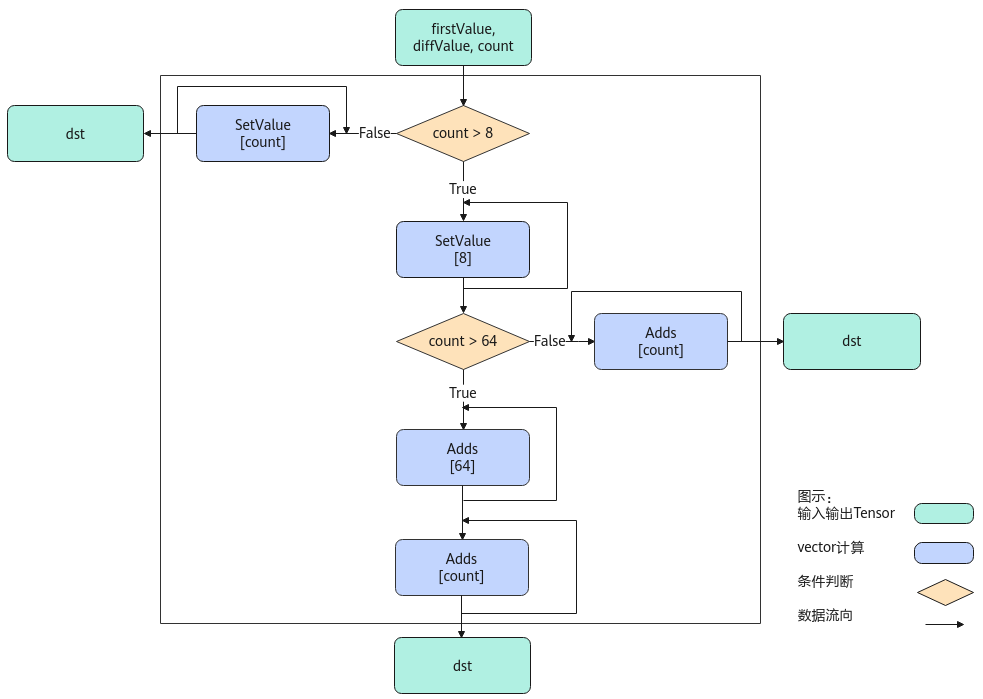

# Arange-索引计算-高阶API-Ascend C算子开发接口-API-CANN社区版8.5.0开发文档-昇腾社区

**页面ID:** atlasascendc_api_07_0855
**来源：** https://www.hiascend.com/document/detail/zh/CANNCommunityEdition/850/API/ascendcopapi/atlasascendc_api_07_0855.html
---

# Arange

#### 产品支持情况

| 产品                                        | 是否支持 |
| ------------------------------------------- | -------- |
| Atlas A3 训练系列产品/Atlas A3 推理系列产品 | √        |
| Atlas A2 训练系列产品/Atlas A2 推理系列产品 | √        |
| Atlas 200I/500 A2 推理产品                  | x        |
| Atlas推理系列产品AI Core                    | √        |
| Atlas推理系列产品Vector Core                | x        |
| Atlas训练系列产品                           | x        |

#### 功能说明

给定起始值，等差值和长度，返回一个等差数列。

#### 实现原理

以float类型，ND格式，firstValue和diffValue输入Scalar为例，描述Arange高阶API内部算法框图，如下图所示。

计算过程分为如下几步，均在Vector上进行：

1. 等差数列长度8以内步骤：按照firstValue和diffValue的值，使用SetValue实现等差数列扩充，扩充长度最大为8，如果等差数列长度小于8，算法结束；
1. 等差数列长度8至64的步骤：对第一步中的等差数列结果使用Adds进行扩充，最大循环7次扩充至64，如果等差数列长度小于64，算法结束；
1. 等差数列长度64以上的步骤：对第二步中的等差数列结果使用Adds进行扩充，不断循环直至达到等差数列长度为止。

#### 函数原型

| 12  | template<typenameT>__aicore__inlinevoidArange(constLocalTensor<T>&dst,constTfirstValue,constTdiffValue,constint32_tcount) |
| --- | ------------------------------------------------------------------------------------------------------------------------- |

#### 参数说明

| 参数名 | 描述                                                                                                                                                                                                                                                                                      |
| ------ | ----------------------------------------------------------------------------------------------------------------------------------------------------------------------------------------------------------------------------------------------------------------------------------------- |
| T      | 操作数的数据类型。Atlas A3 训练系列产品/Atlas A3 推理系列产品，支持的数据类型为：int16_t、half、int32_t、float。Atlas A2 训练系列产品/Atlas A2 推理系列产品，支持的数据类型为：int16_t、half、int32_t、float。Atlas推理系列产品AI Core，支持的数据类型为：int16_t、half、int32_t、float。 |

| 参数名     | 输入/输出 | 描述                                                                                                         |
| ---------- | --------- | ------------------------------------------------------------------------------------------------------------ |
| dst        | 输出      | 目的操作数。dst的大小应大于等于count * sizeof(T)。类型为LocalTensor，支持的TPosition为VECIN/VECCALC/VECOUT。 |
| firstValue | 输入      | 等差数列的首个元素值。                                                                                       |
| diffValue  | 输入      | 等差数列元素之间的差值，应大于等于0。                                                                        |
| count      | 输入      | 等差数列的长度。count>0。                                                                                    |

#### 返回值说明

无

#### 约束说明

当前仅支持ND格式的输入，不支持其他格式。

#### 调用示例

| 123 | AscendC:LocalTensor<T>dst=outDst.AllocTensor<T>();AscendC:Arange<T>(dst,static_cast<T>(firstValue_),static_cast<T>(diffValue_),count_);outDst.EnQue<T>(dst); |
| --- | ------------------------------------------------------------------------------------------------------------------------------------------------------------ |
