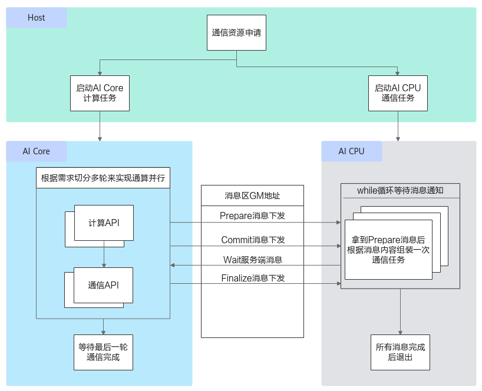
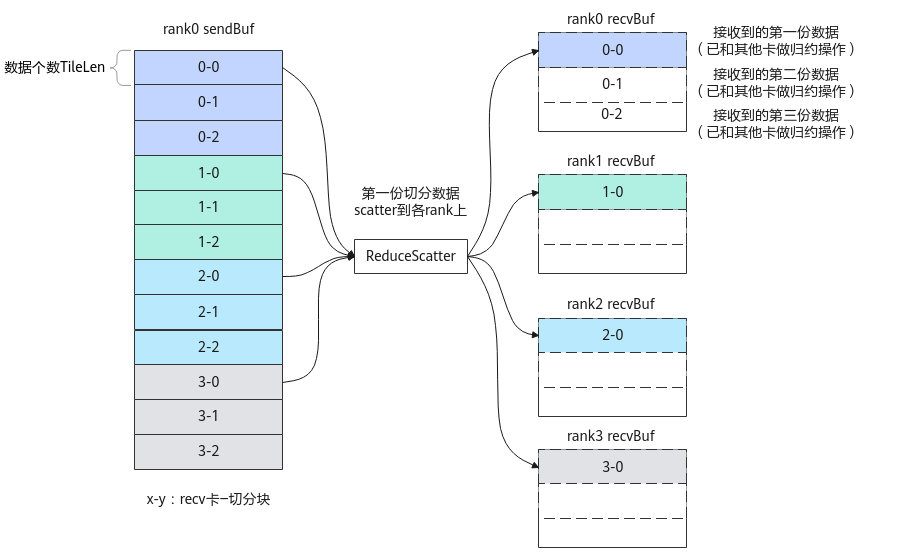

# HCCL使用说明-HCCL Kernel侧接口-HCCL通信类-高阶API-Ascend C算子开发接口-API-CANN社区版8.5.0开发文档-昇腾社区

**页面ID:** atlasascendc_api_07_0867
**来源：** https://www.hiascend.com/document/detail/zh/CANNCommunityEdition/850/API/ascendcopapi/atlasascendc_api_07_0867.html
---

# HCCL使用说明

Ascend C提供一组HCCL通信类高阶API，方便算子Kernel开发用户在AI Core侧灵活管理通算融合算子中计算与通信任务的执行顺序。使用HCCL通信类高阶API进行算子开发前，请参考通算融合章节了解必要的背景知识。

HCCL为集合通信任务客户端，主要对外提供了集合通信原语接口（以下统称为Prepare接口），对标集合通信C++接口，详细可参见HCCL接口参考，当前支持AllReduce、AllGather、ReduceScatter、AlltoAll接口等。本章的所有接口运行在AI Core上，且不执行通信任务，而是由用户调用Prepare接口将对应类型的通信任务信息发送给AI CPU服务端，并在合适的时机通过Commit接口通知AI CPU上的服务端执行对应的通信任务。

所谓合适的时机，取决于用户编排的是先通信后计算的任务，还是先计算后通信的任务。对于这两种场景，简述如下：

- 先通信后计算的任务：典型的如AllGather通信+Matmul计算任务编排。此场景下，用户在调用AllGather接口下发通信任务之后，通过AllGather接口返回的该通信任务标识handleId，可立即调用Commit接口通知服务端执行该handleId对应的任务，同时用户调用Wait阻塞接口等待服务端通知handleId对应的通信任务执行结束，待该通信任务结束后，再执行计算任务。
- 先计算后通信的任务：典型的如Matmul计算+AllReduce通信任务编排。此场景下，用户可以先调用AllReduce接口通知服务端先下发通信任务，再调用Matmul计算接口进行计算，这样AllReduce任务的组装和任务下发及执行过程可以被Matmul的计算流水所掩盖，待计算任务完成后，调用Commit接口通知服务端执行AllReduce任务，无须调用Wait接口等待通信任务执行结束。

当后续无通信任务时，调用Finalize接口，通知服务端后续无通信任务，执行结束后退出，客户端检测并等待最后一个通信任务执行结束。以上介绍的AI Core下发HCCL通信任务的机制如下图所示。

对于Atlas A3 训练系列产品/Atlas A3 推理系列产品，在AI CPU作为服务端的场景中，HCCL通信API的功能依赖开放AI CPU用户态下发调度任务，存在一定的安全风险，用户需要自行确保AI Core自定义算子的安全可靠，防止恶意攻击行为。

实现AI Core下发一个通信任务的具体步骤如下：

1. 创建HCCL对象，并调用初始化接口InitV2。1234567// 传initTiling地址的调用方式，推荐使用该方式GET_TILING_DATA_WITH_STRUCT(AllGatherCustomTilingData,tilingData,tilingGM);// AllGatherCustomTilingData为对应算子头文件定义的结构体Hcclhccl;GM_ADDRcontextGM=GetHcclContext<0>();// AscendC自定义算子kernel中，通过此方式获取HCCL contexthccl.InitV2(contextGM,&tilingData);当调用InitV2接口时，必须使用标准C++语法定义TilingData结构体的开发方式，具体请参考使用标准C++语法定义Tiling结构体。如上示例代码中的tilingGM为host侧传入的、作为核函数入参的算子TilingData的GM地址，通过GET_TILING_DATA_WITH_STRUCT获取TilingData。调用InitV2初始化接口时，需要传入通信上下文信息，可以通过框架提供的获取通信上下文的接口GetHcclContext获取。
1. 设置对应通信算法的Tiling地址。通过SetCcTilingV2接口设置对应通信算法的Tiling地址，调用Commit接口后，该地址被发送到服务端由服务端解析。SetCcTilingV2接口必须与InitV2接口配合使用。示例如下。12345678910// 传initTiling地址的调用方式GET_TILING_DATA_WITH_STRUCT(AllGatherCustomTilingData,tilingData,tilingGM);Hcclhccl;GM_ADDRcontextGM=GetHcclContext<0>();// AscendC自定义算子kernel中，通过此方式获取HCCL contexthccl.InitV2(contextGM,&tilingData);if(SetCcTilingV2(offsetof(AllGatherCustomTilingData,mc2CcTiling))!=HCCL_SUCCESS){return;}
1. 用户通过对应的Prepare接口异步下发对应类型的通信任务，并获取到该任务的标识handleId，服务端接收到后开始通信任务的展开和下发，示例如下。12345678autohandleId=hccl.ReduceScatter<false>(aGM,cGM,recvCount,AscendC:HCCL_DATA_TYPE_FP16,HCCL_REDUCE_SUM,strideCount,1);// 对于Prepare接口，在调试时可增加异常值校验和PRINTF打印// if (handleId == INVALID_HANDLE_ID) {// 	PRINTF("[ERROR] call ReduceScatter failed, handleId is -1.");//	return;// }示例的Prepare接口为ReduceScatter，其他接口可参考后续章节的内容。其中的参数AscendC:HCCL_DATA_TYPE_FP16是HCCL任务的数据类型，其数据结构为HcclDataType，对应的参数说明参考表1；参数HCCL_REDUCE_SUM是一种Reduce操作，AllReduce和ReduceScatter归约操作支持的Reduce操作类型参见表2。表1HcclDataType参数说明数据类型说明HcclDataTypeHCCL任务的数据类型。1234567891011121314151617181920enumHcclDataType{HCCL_DATA_TYPE_INT8=0,/* int8 */HCCL_DATA_TYPE_INT16=1,/* int16 */HCCL_DATA_TYPE_INT32=2,/* int32 */HCCL_DATA_TYPE_FP16=3,/* half或float16 */HCCL_DATA_TYPE_FP32=4,/* float */HCCL_DATA_TYPE_INT64=5,/* int64 */HCCL_DATA_TYPE_UINT64=6,/* uint64 */HCCL_DATA_TYPE_UINT8=7,/* uint8 */HCCL_DATA_TYPE_UINT16=8,/* uint16 */HCCL_DATA_TYPE_UINT32=9,/* uint32 */HCCL_DATA_TYPE_FP64=10,/* float64 */HCCL_DATA_TYPE_BFP16=11,/* bfloat16 */HCCL_DATA_TYPE_INT128=12,/* *< int128 */HCCL_DATA_TYPE_HIF8=14,/* *< hif8 */HCCL_DATA_TYPE_FP8E4M3=15,/* *< fp8e4m3 */HCCL_DATA_TYPE_FP8E5M2=16,/* *< fp8e5m2 */HCCL_DATA_TYPE_FP8E8M0=17,/* *< fp8e8m0 */HCCL_DATA_TYPE_RESERVED/* *< reserved */}表2HcclReduceOp参数说明数据类型说明HcclReduceOpReduce操作类型。1234567enumHcclReduceOp{HCCL_REDUCE_SUM=0,/* sum */HCCL_REDUCE_PROD=1,/* prod */HCCL_REDUCE_MAX=2,/* max */HCCL_REDUCE_MIN=3,/* min */HCCL_REDUCE_RESERVED/* reserved */}
1. 用户调用Commit接口通知服务端执行handleId对应的通信任务。12// 等待通信任务执行时机成熟，调用Commit接口通知服务端执行hccl.Commit(handleId);
1. 用户调用Wait阻塞接口，等待服务端执行完对应的通信任务。123456789autoret=hccl.Wait(handleId);// 对于Wait和Query接口，在调试时可增加异常值校验和PRINTF打印// if (ret == HCCL_FAILED) {//	PRINTF("[ERROR] call Wait for handleId[%d] failed.", handleId);//	return;// }// 调用核间同步接口，防止部分核执行较快退出，触发Hccl析构，影响执行较慢的核// 开发者可根据实际的业务场景，选择调用、、接口，保证全部核的任务完成后再退出执行
1. 用户调用Finalize接口，通知服务端后续无通信任务，执行结束后退出；客户端检测并等待最后一个通信任务执行结束。1hccl.Finalize();

注意：若HCCL对象的模板参数未指定下发通信任务的核，则Prepare接口仅能在AIC或AIV之一上运行，调用步骤2到步骤5的接口前，必须指定接口代码运行在AIC或AIV核上，实现时如下代码所示。

| 12345 | // 通过内置常量g_coreType来判断AIC核或者AIV核if(g_coreType==AIV){// if (g_coreType == AIC) {调用HCCL接口} |
| ----- | --------------------------------------------------------------------------------------------------------- |

基于以上对单个通信任务下发的了解，介绍Prepare接口中repeat参数的灵活使用方式。一次Prepare接口的调用对应一个handleId，Prepare接口中的参数repeat代表这次Prepare的通信任务次数，该值必须和针对该handleId调用Commit接口的次数、Wait接口的次数一致。以图2 ReduceScatter通信示例进行说明，假设共4张卡，每张卡上源数据首先按照rankId均匀分成4份，每份数据被切分成3份，最终被切分后的每份数据的个数为TileLen，每次ReduceScatter通信仅通信一组切分数据（如图中数据0-0、1-0、2-0、3-0为一组切分数据），因此需要做3次ReduceScatter操作，全部数据才能通信完。

| 12345678910111213141516171819202122232425262728293031323334 | extern"C"__global____aicore__voidreduce_scatter_custom(GM_ADDRxGM,GM_ADDRyGM,GM_ADDRworkspaceGM,GM_ADDRtilingGM){autosendBuf=xGM;// xGM为ReduceScatter的输入GM地址autorecvBuf=yGM;// yGM为ReduceScatter的输出GM地址constexprsize_trankSize=4U;// 4张卡constexprsize_ttileCnt=3U;// 卡上的数据均匀分成rankSize份，且每份又被切分成3份constexprsize_ttileLen=100U;// 被切分后的每份数据个数uint64_tstrideCount=tileLen*tileCnt;// 表示sendBuf上相邻数据块间的起始地址的偏移量REGISTER_TILING_DEFAULT(ReduceScatterCustomTilingData);//ReduceScatterCustomTilingData为对应算子头文件定义的结构体GET_TILING_DATA_WITH_STRUCT(ReduceScatterCustomTilingData,tilingData,tilingGM);Hcclhccl;GM_ADDRcontextGM=AscendC:GetHcclContext<0>();// AscendC自定义算子kernel中，通过此方式获取HCCL contextif(AscendC:g_coreType==AIV){// 指定AIV核通信hccl.InitV2(contextGM,&tilingData);autoret=hccl.SetCcTilingV2(offsetof(ReduceScatterCustomTilingData,reduceScatterCcTiling));if(ret!=HCCL_SUCCESS){return;}// for循环中生成了3个handleId，每个handleId只调用了repeat=1次Commit和Wait接口for(inti=0;i<tileCnt;++i){autohandleId=hccl.ReduceScatter(sendBuf,recvBuf,tileLen,HcclDataType:HCCL_DATA_TYPE_FP32,HcclReduceOp:HCCL_REDUCE_SUM,strideCount,1);//具体参数参见ReduceScatter接口说明hccl.Commit(handleId);autoret=hccl.Wait(handleId);// 执行其他计算逻辑 ....// 更新ReduceScatter的收发地址sendBuf+=tileLen*sizeOf(float32);recvBuf+=tileLen*sizeOf(float32);}AscendC:SyncAll<true>();// 全AIV核同步，防止0核执行过快，提前调用hccl.Finalize()接口，导致其他核Wait卡死hccl.Finalize();}} |
| ----------------------------------------------------------- | ------------------------------------------------------------------------------------------------------------------------------------------------------------------------------------------------------------------------------------------------------------------------------------------------------------------------------------------------------------------------------------------------------------------------------------------------------------------------------------------------------------------------------------------------------------------------------------------------------------------------------------------------------------------------------------------------------------------------------------------------------------------------------------------------------------------------------------------------------------------------------------------------------------------------------------------------------------------------------------------------------------------------------------------------------------------------------------------------------------------------------------------------------------------------------------------------------------------------------------------------------------------------------------------------------------------------------------------------------------------------------------------------------------------------------------------------------------------------------------------------------------------------------------------------------------------------------------- |

由于每张卡上3份数据的源地址SendBuf是连续的，且每张卡中目的地址recvBuf用来存储3份通信结果数据的内存也是连续的，因此以上代码可以优化，将ReduceScatter接口中的repeat参数设置为3，从而调用1次ReduceScatter接口，达到下发3个通信任务的效果。此时，只有1个handleId的任务，但是需要调用3次Commit和Wait接口，对应代码片段如下。

| 123456789101112131415161718192021222324252627282930 | extern"C"__global____aicore__voidreduce_scatter_custom(GM_ADDRxGM,GM_ADDRyGM,GM_ADDRworkspaceGM,GM_ADDRtilingGM){autosendBuf=xGM;// xGM为ReduceScatter的输入GM地址autorecvBuf=yGM;// yGM为ReduceScatter的输出GM地址constexprsize_trankSize=4U;// 4张卡constexprsize_ttileCnt=3U;// 卡上的数据均匀分成rankSize份，且每份又被切分成3份constexprsize_ttileLen=100U;// 被切分后的每份数据个数uint64_tstrideCount=tileLen*tileCnt;// 表示sendBuf上相邻数据块间的起始地址的偏移量REGISTER_TILING_DEFAULT(ReduceScatterCustomTilingData);//ReduceScatterCustomTilingData为对应算子头文件定义的结构体GET_TILING_DATA_WITH_STRUCT(ReduceScatterCustomTilingData,tilingData,tilingGM);Hcclhccl;GM_ADDRcontextGM=AscendC:GetHcclContext<0>();// AscendC自定义算子kernel中，通过此方式获取HCCL contextif(AscendC:g_coreType==AIV){// 指定AIV核通信hccl.InitV2(contextGM,&tilingData);autoret=hccl.SetCcTilingV2(offsetof(ReduceScatterCustomTilingData,reduceScatterCcTiling));if(ret!=HCCL_SUCCESS){return;}autohandleId=hccl.ReduceScatter(sendBuf,recvBuf,tileLen,HcclDataType:HCCL_DATA_TYPE_FP32,HcclReduceOp:HCCL_REDUCE_SUM,strideCount,tileCnt);//具体参数参见ReduceScatter接口说明for(inti=0;i<tileCnt;++i){hccl.Commit(handleId);autoret=hccl.Wait(handleId);// 执行其他计算逻辑 ....}AscendC:SyncAll<true>();// 全AIV核同步，防止0核执行过快，提前调用hccl.Finalize()接口，导致其他核Wait卡死hccl.Finalize();}} |
| --------------------------------------------------- | -------------------------------------------------------------------------------------------------------------------------------------------------------------------------------------------------------------------------------------------------------------------------------------------------------------------------------------------------------------------------------------------------------------------------------------------------------------------------------------------------------------------------------------------------------------------------------------------------------------------------------------------------------------------------------------------------------------------------------------------------------------------------------------------------------------------------------------------------------------------------------------------------------------------------------------------------------------------------------------------------------------------------------------------------------------------------------------------------------------------------------------------------------------------------------------------------------------------------------------------------------------------------------------------------------------------------------------------------------------------------------------------------------------- |

| 数据类型            | 说明                                                                       |
| ------------------- | -------------------------------------------------------------------------- |
| MC2_BUFFER_LOCATION | 预留参数。计算和通信中间结果的Buffer存放位置。用户在Tiling侧可设置该字段。 |

提示：调试含有HCCL高阶API的算子时，在算子编译工程中增加编译选项-DASCENDC_DEBUG，可以使能异常场景拦截的能力，具体内容请参考并使用assert接口。
