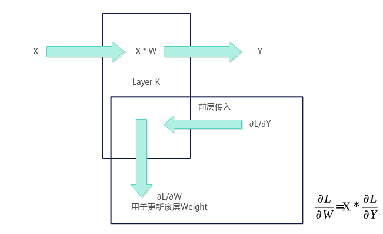
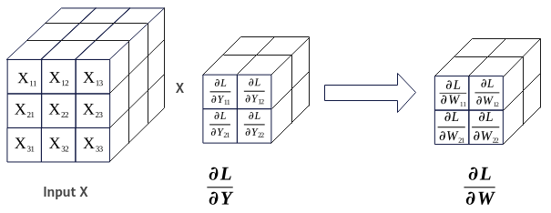

# Conv3DBackpropFilter使用说明-Conv3DBackpropFilter Kernel侧接口-Conv3DBackpropFilter-卷积计算-高阶API-Ascend C算子开发接口-API-CANN社区版8.5.0开发文档-昇腾社区

**页面ID:** atlasascendc_api_07_0893
**来源：** https://www.hiascend.com/document/detail/zh/CANNCommunityEdition/850/API/ascendcopapi/atlasascendc_api_07_0893.html
---

# Conv3DBackpropFilter使用说明

Ascend C提供一组Conv3DBackpropFilter高阶API，便于用户快速实现卷积的反向运算，求解反向传播的误差。

卷积反向的权重传播如图1，卷积反向权重计算如图2。

Conv3dBackpropFilter的计算公式为：

- X为卷积的特征矩阵Input。
- ∂L/∂Y为卷积正向损失函数对输出Y的梯度GradOutput，作为求反向传播误差∂L/∂W的输入，即卷积的输出反向GradOutput。
- ∂L/∂W为Weight权重的反向传播误差GradWeight。

Kernel侧实现Conv3DBackpropFilter求解反向传播误差运算的步骤概括为：

1. 创建Conv3DBackpropFilter对象。
1. 初始化操作。
1. 设置卷积的特征矩阵Input、卷积的输出反向GradOutput。
1. 完成卷积反向操作。
1. 结束卷积反向操作。

使用Conv3DBackpropFilter高阶API求解反向传播误差运算的具体步骤如下：

1. 创建Conv3DBackpropFilter对象。1234567#include"lib/conv_backprop/conv3d_bp_filter_api.h"usinginputType=ConvBackpropApi:ConvType<ConvCommonApi:TPosition:GM,ConvCommonApi:ConvFormat:NDC1HWC0,inputType>;usingweightSizeType=ConvBackpropApi:ConvType<ConvCommonApi:TPosition:GM,ConvCommonApi:ConvFormat:ND,int32_t>;usinggradOutputType=ConvBackpropApi:ConvType<ConvCommonApi:TPosition:GM,ConvCommonApi:ConvFormat:NDC1HWC0,gradOutputType>;usinggradWeightType=ConvBackpropApi:ConvType<ConvCommonApi:TPosition:GM,ConvCommonApi:ConvFormat:FRACTAL_Z_3D,gradWeightType>;ConvBackpropApi:Conv3DBackpropFilter<inputType,weightSizeType,gradOutputType,gradWeightType>gradWeight_;创建对象时需要传入特征矩阵Input、权重矩阵Weight的shape信息WeightSize、GradOutput和GradWeight的参数类型信息，类型信息通过ConvType来定义，包括：内存逻辑位置、数据格式、数据类型。123456template<TPositionPOSITION,ConvFormatFORMAT,typenameT>structConvType{constexprstaticTPositionpos=POSITION;// Convolution输入或输出的逻辑位置constexprstaticConvFormatformat=FORMAT;// Convolution输入或输出的数据格式usingType=T;// Convolution输入或输出的数据类型};下面简要介绍在创建对象时使用到的相关数据结构，开发者可选择性地了解这些内容。用于创建Conv3DBackpropFilter对象的数据结构定义如下：1usingConv3DBackpropFilter=Conv3DBpFilterIntf<Conv3DBpFilterCfg<INPUT_TYPE,WEIGHT_TYPE,GRAD_OUTPUT_TYPE,GRAD_WEIGHT_TYPE>,Conv3DBpFilterImpl>;其中，Conv3DBpFilterIntf、Conv3DBpFilterCfg数据结构定义如下：123template<classConfig_,template<typename,class>classImpl>structConv3DBpFilterIntf{}123template<classA,classB,classC,classD>structConv3DBpFilterCfg:publicConvBpContext<A,B,C,D>{}表1ConvType说明参数说明POSITION内存逻辑位置。Input X矩阵可设置为TPosition:GMWeightSize可设置为TPosition:GMGradOutput矩阵可设置为TPosition:GMGradWeight矩阵可设置为TPosition:GMConvFormat数据格式。Input矩阵可设置为ConvFormat:NDC1HWC0WeightSize矩阵可设置为ConvFormat:NDGradOutput矩阵可设置为ConvFormat:NDC1HWC0GradWeight矩阵可设置为ConvFormat:FRACTAL_Z_3DTYPE数据类型。Input矩阵可设置为half、bfloat16_tWeightSize可设置为int32_tGradOutput矩阵可设置为half、bfloat16_tGradWeight矩阵可设置为float注意：Input、GradOutput数据类型需要一致，具体数据类型组合关系请参考表2。表2Conv3DBackpropFilter输入输出数据类型的组合说明InputWeightSizeGradOutputGradWeight支持平台halfint32_thalffloatAtlas A3 训练系列产品/Atlas A3 推理系列产品Atlas A2 训练系列产品/Atlas A2 推理系列产品bfloat16_tint32_tbfloat16_tfloatAtlas A3 训练系列产品/Atlas A3 推理系列产品Atlas A2 训练系列产品/Atlas A2 推理系列产品
1. 初始化操作。1gradWeight_.Init(&(tilingData->dwTiling));// 初始化gradWeight_相关参数
1. 设置卷积的特征矩阵Input、卷积的输出反向GradOutput。1234gradWeight_.SetGradOutput(gradOutputGm_[offsetA_]);// 设置矩阵gradOutputgradWeight_.SetInput(inputGm_[offsetB_]);// 设置矩阵InputgradWeight_.SetSingleShape(singleShapeM,singleShapeN,singleShapeK);// 设置需要计算的形状gradWeight_.SetStartPosition(hoStartIdx_);// 设置初始位置
1. 完成卷积反向操作。调用Iterate完成单次迭代计算，叠加while循环完成单核全量数据的计算。Iterate方式，可以自行控制迭代次数，完成所需数据量的计算。123while(gradWeight_.Iterate()){gradWeight_.GetTensorC(gradWeightGm_[offsetC_]);}
1. 结束卷积反向操作。1gradWeight_.End();

#### 需要包含的头文件

| 1   | #include"lib/conv_backprop/conv3d_bp_filter_api.h" |
| --- | -------------------------------------------------- |
