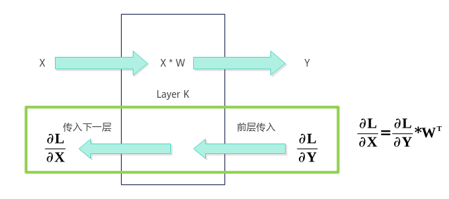
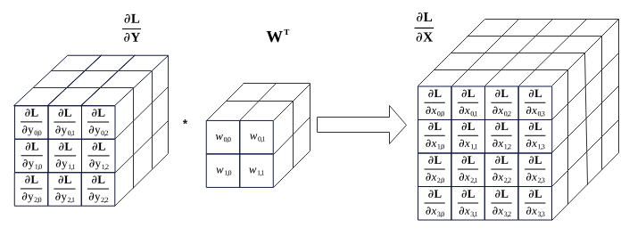

# Conv3DBackpropInput使用说明-Conv3DBackpropInput Kernel侧接口-Conv3DBackpropInput-卷积计算-高阶API-Ascend C算子开发接口-API-CANN社区版8.5.0开发文档-昇腾社区

**页面ID:** atlasascendc_api_07_0919
**来源：** https://www.hiascend.com/document/detail/zh/CANNCommunityEdition/850/API/ascendcopapi/atlasascendc_api_07_0919.html
---

# Conv3DBackpropInput使用说明

Ascend C提供一组Conv3DBackpropInput高阶API，便于用户快速实现卷积的反向运算，求解反向传播的误差。转置卷积Conv3DTranspose与Conv3DBackpropInput具有相同的数学过程，因此用户也可以使用Conv3DBackpropInput高阶API实现转置卷积算子。卷积的正反向传播如图1卷积层的前后向传播示意图，反向传播误差计算如图2反向传播误差计算示意图。

Conv3DBackpropInput的计算公式为：

- ∂L/∂Y为卷积正向损失函数对输出Y的梯度GradOutput，作为求反向传播误差∂L/∂X的输入。
- W为卷积正向Weight权重，即矩阵核Kernel，也是滤波器Filter，作为求反向传播误差∂L/∂X的输入，WT表示W的转置。
- ∂L/∂X为特征矩阵的反向传播误差GradInput。

Kernel侧实现Conv3DBackpropInput求解反向传播误差运算的步骤概括为：

1. 创建Conv3DBackpropInput对象。
1. 初始化操作。
1. 设置卷积的输出反向GradOutput、卷积的输入Weight。
1. 完成卷积反向操作。
1. 结束卷积反向操作。下文中提及的M轴方向，即为GradOutput矩阵纵向；K轴方向，即为GradOutput矩阵横向或Weight矩阵纵向；N轴方向，即为Weight矩阵横向。

使用Conv3DBackpropInput高阶API求解反向传播误差运算的具体步骤如下：

1. 创建Conv3DBackpropInput对象。1234567#include"lib/conv_backprop/conv3d_bp_input_api.h"usingweightDxType=ConvBackpropApi:ConvType<ConvCommonApi:TPosition:GM,ConvCommonApi:ConvFormat:FRACTAL_Z_3D,weightType>;usinginputSizeDxType=ConvBackpropApi:ConvType<ConvCommonApi:TPosition:GM,ConvCommonApi:ConvFormat:ND,int32_t>;usinggradOutputDxType=ConvBackpropApi:ConvType<ConvCommonApi:TPosition:GM,ConvCommonApi:ConvFormat:NDC1HWC0,gradOutputType>;usinggradInputDxType=ConvBackpropApi:ConvType<ConvCommonApi:TPosition:GM,ConvCommonApi:ConvFormat:NCDHW,gradInputType>;ConvBackpropApi:Conv3DBackpropInput<weightDxType,inputSizeDxType,gradOutputDxType,gradInputDxType>gradInput_;创建对象时需要传入权重矩阵Weight、卷积正向特征矩阵Input的shape信息InputSize、GradOutput和GradInput的参数类型信息，类型信息通过ConvType来定义，包括：内存逻辑位置、数据格式、数据类型。123456template<TPositionPOSITION,ConvFormatFORMAT,typenameT>structConvType{constexprstaticTPositionpos=POSITION;// Convolution输入或输出的逻辑位置constexprstaticConvFormatformat=FORMAT;// Convolution输入或输出的数据格式usingType=T;// Convolution输入或输出的数据类型};下面简要介绍在创建对象时使用到的相关数据结构，开发者可选择性地了解这些内容。用于创建Conv3DBackpropInput对象的数据结构定义如下：1usingConv3DBackpropInput=Conv3DBpInputIntf<Conv3DBpInputCfg<WEIGHT_TYPE,INPUT_TYPE,GRAD_OUTPUT_TYPE,GRAD_INPUT_TYPE,CONV3D_CFG_DEFAULT>,Conv3DBpInputImpl>;其中，Conv3DBpInputIntf、Conv3DBpInputCfg数据结构定义如下：123template<classConfig_,template<typename,class>classImpl>structConv3DBpInputIntf{}123template<classWEIGHT_TYPE,classINPUT_TYPE,classGRAD_OUTPUT_TYPE,classGRAD_INPUT_TYPE,constConv3dConfig&CONV3D_CONFIG=CONV3D_CFG_DEFAULT>structConv3DBpInputCfg:publicConvBpContext<WEIGHT_TYPE,INPUT_TYPE,GRAD_OUTPUT_TYPE,GRAD_INPUT_TYPE>{}表1ConvType说明参数说明POSITION内存逻辑位置。Weight矩阵可设置为TPosition:GMGradOutput矩阵可设置为TPosition:GMInputSize可设置为TPosition:GMGradInput矩阵可设置为TPosition:GMConvFormat数据格式。Weight矩阵可设置为ConvFormat:FRACTAL_Z_3DGradOutput矩阵可设置为ConvFormat:NDC1HWC0InputSize矩阵可设置为ConvFormat:NDGradInput矩阵可设置为ConvFormat:NDC1HWC0TYPE数据类型。Weight矩阵可设置为half、bfloat16_tGradOutput矩阵可设置为half、bfloat16_tInputSize矩阵可设置为int32_tGradInput矩阵可设置为half、bfloat16_t注意：GradOutput矩阵和Weight矩阵数据类型需要一致，具体数据类型组合关系请参考表2。表2Conv3DBackpropInput输入输出数据类型的组合说明WeightGradOutputInputSizeGradInput支持平台halfhalfint32_thalfAtlas A3 训练系列产品/Atlas A3 推理系列产品Atlas A2 训练系列产品/Atlas A2 推理系列产品bfloat16_tbfloat16_tint32_tbfloat16_tAtlas A3 训练系列产品/Atlas A3 推理系列产品Atlas A2 训练系列产品/Atlas A2 推理系列产品
1. 初始化操作。123// 注册后进行初始化ConvBackpropApi:Conv3DBackpropInput<weightDxType,inputSizeDxType,gradOutputDxType,gradInputDxType>gradInput_;gradInput_.Init(&(tilingData->conv3DDxTiling));
1. 设置3D卷积的输出反向GradOutput、3D卷积的输入Weight。1234gradInput_.SetSingleShape(singleShapeM_,singleShapeK_,singleShapeN_);// 设置单核计算的形状gradInput_.SetStartPosition(dinStartIdx_,curHoStartIdx_);// 设置单核上gradOutput载入的起始位置gradInput_.SetGradOutput(gradOutputGm_[offsetA_]);gradInput_.SetWeight(weightGm_[offsetB_]);
1. 完成卷积反向操作。调用Iterate完成单次迭代计算，叠加while循环完成单核全量数据的计算。Iterate方式，可以自行控制迭代次数，完成所需数据量的计算。123while(gradInput_.Iterate()){gradInput_.GetTensorC(gradInputGm_[offsetC_]);}
1. 结束卷积反向操作。1gradInput_.End();

#### 需要包含的头文件

| 1   | #include"lib/conv_backprop/conv3d_bp_input_api.h" |
| --- | ------------------------------------------------- |
