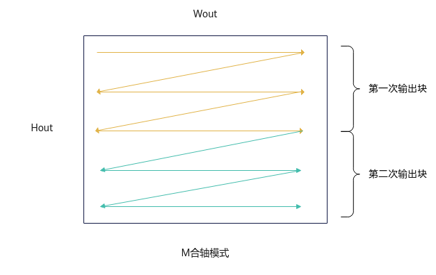

# SetSingleOutputShape-Conv3D Kernel侧接口-Conv3D-卷积计算-高阶API-Ascend C算子开发接口-API-CANN社区版8.5.0开发文档-昇腾社区

**页面ID:** atlasascendc_api_07_10075
**来源：** https://www.hiascend.com/document/detail/zh/CANNCommunityEdition/850/API/ascendcopapi/atlasascendc_api_07_10075.html
---

# SetSingleOutputShape

#### 产品支持情况

| 产品                                        | 是否支持 |
| ------------------------------------------- | -------- |
| Atlas A3 训练系列产品/Atlas A3 推理系列产品 | √        |
| Atlas A2 训练系列产品/Atlas A2 推理系列产品 | √        |
| Atlas 200I/500 A2 推理产品                  | x        |
| Atlas推理系列产品AI Core                    | x        |
| Atlas推理系列产品Vector Core                | x        |
| Atlas训练系列产品                           | x        |

#### 功能说明

设置单核上结果矩阵Output的形状。

Conv3D高阶API目前支持M合轴模式的输出方式。在M合轴模式下，Conv3D API内部将Wout和Hout视为同一轴处理，输出时先沿Wout方向输出，完成一整行Wout输出后，再进行下一行的Wout输出。

#### 函数原型

| 1   | __aicore__inlinevoidSetSingleOutputShape(uint64_tsingleCo,uint64_tsingleDo,uint64_tsingleM) |
| --- | ------------------------------------------------------------------------------------------- |

#### 参数说明

| 参数名   | 输入/输出 | 描述                                                    |
| -------- | --------- | ------------------------------------------------------- |
| singleCo | 输入      | 单核上Output的C维度大小。                               |
| singleDo | 输入      | 单核上Output的D维度大小。                               |
| singleM  | 输入      | 单核上Output的M维度大小，即H维度大小与W维度大小的乘积。 |

#### 返回值说明

无

#### 约束说明

本接口当前仅支持设置Output的C维度、D维度和M维度（即H轴、W轴合并后的维度），不支持设置原始Output的大小。

#### 调用示例

| 1   | conv3dApi.SetSingleOutputShape(singleCoreCout,singleCoreDout,singleCoreM); |
| --- | -------------------------------------------------------------------------- |
