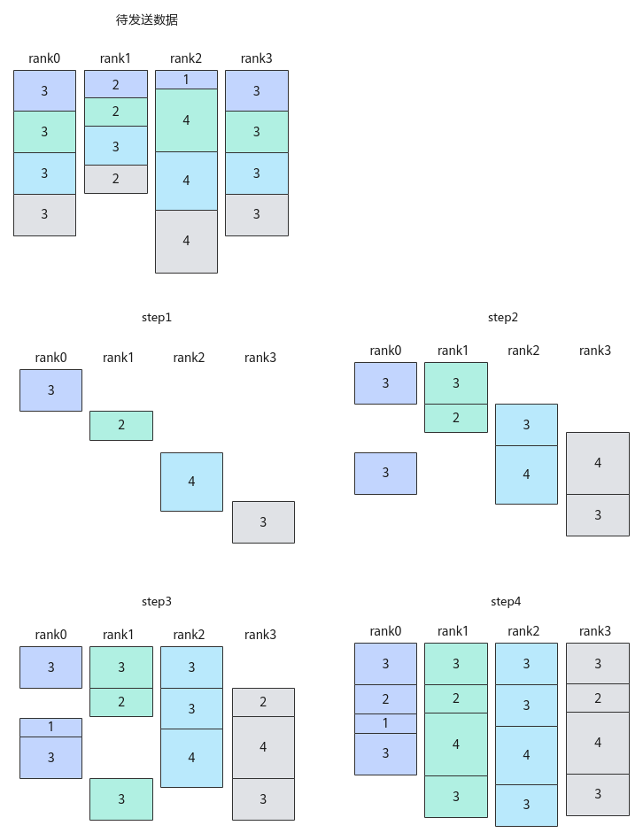

# Iterate-HCCL Kernel侧接口-HCCL通信类-高阶API-Ascend C算子开发接口-API-CANN社区版8.5.0开发文档-昇腾社区

**页面ID:** atlasascendc_api_07_10162
**来源：** https://www.hiascend.com/document/detail/zh/CANNCommunityEdition/850/API/ascendcopapi/atlasascendc_api_07_10162.html
---

# Iterate

#### 产品支持情况

| 产品                                        | 是否支持 |
| ------------------------------------------- | -------- |
| Atlas A3 训练系列产品/Atlas A3 推理系列产品 | √        |
| Atlas A2 训练系列产品/Atlas A2 推理系列产品 | √        |
| Atlas 200I/500 A2 推理产品                  | x        |
| Atlas推理系列产品AI Core                    | x        |
| Atlas推理系列产品Vector Core                | x        |
| Atlas训练系列产品                           | x        |

#### 功能说明

在某些算法下，一次完整的集合通信任务可以细分为多个步骤，对每个步骤的数据完成点对点的通信任务，称为细粒度通信。以通信算法"AlltoAll=level0:fullmesh;level1:pairwise"、通信步长为1的AlltoAllV通信任务为例，这里参数level0代表配置Server（昇腾AI Server，通常是8卡或16卡的昇腾NPU设备组成的服务器形态的统称）内通信算法，参数level1代表配置Server间通信算法，fullmesh为全连接通信算法，pairwise为逐对通信算法，详细的算法内容可参见集合通信算法介绍；如下图所示，该示例展示了AlltoAllV通信的所有待发送数据、每一步通信完成后各卡收到的数据。

在通算融合算子中，通过调用本接口，结合对应的Prepare原语，获取通信算法每一步的输入或输出，让计算、通信实现更精细粒度的流水排布，从而获得更好的性能收益。

#### 函数原型

| 12  | template<boolsync=true>__aicore__inlineint32_tIterate(HcclHandlehandleId,uint16_t*seqSlices,uint16_tseqSliceLen) |
| --- | ---------------------------------------------------------------------------------------------------------------- |

#### 参数说明

| 参数名 | 输入/输出 | 描述                                                                                                                                                                                                                    |
| ------ | --------- | ----------------------------------------------------------------------------------------------------------------------------------------------------------------------------------------------------------------------- |
| sync   | 输入      | bool类型。是否需要等待当前通信步骤完成再进行后续计算或通信任务，参数取值如下：true：默认值，表示阻塞并等待当前通信步骤完成。该参数取值为true时，无需再调用Wait接口等待通信任务完成。false：表示不等待当前通信步骤完成。 |

| 参数名      | 输入/输出               | 描述                                                                                                                                                                                               |     |                         |
| ----------- | ----------------------- | -------------------------------------------------------------------------------------------------------------------------------------------------------------------------------------------------- | --- | ----------------------- |
| handleId    | 输入                    | 对应通信任务的标识ID，只能使用Prepare原语接口的返回值。1usingHcclHandle=int8_t;                                                                                                                    | 1   | usingHcclHandle=int8_t; |
| 1           | usingHcclHandle=int8_t; |                                                                                                                                                                                                    |     |                         |
| seqSlices   | 输出                    | 由用户申请的栈空间，用于保存当前通信步骤的输入或输出数据块的索引下标。在先计算后通信场景，该参数返回当前通信步骤需要的输入数据块索引；在先通信后计算场景，该参数返回当前通信步骤的输出数据块索引。 |     |                         |
| seqSliceLen | 输入                    | seqSlices数组的长度。根据算法的通信步长及算法逻辑，取每一步通信需要保存的数据块索引个数为该数组长度。                                                                                              |     |                         |

#### 返回值说明

- 当通信任务未结束时：在先计算后通信场景，返回值为当前通信步骤需要的输入数据块数量，与参数seqSliceLen数值相同。在先通信后计算场景，返回值为当前通信步骤产生的输出数据块数量，与参数seqSliceLen数值相同。
- 当通信任务结束后，返回值为0。

#### 约束说明

- 调用本接口前确保已调用过InitV2和SetCcTilingV2接口。
- 入参handleId只能使用Prepare原语对应接口的返回值。
- 本接口当前支持的通信算法为"AlltoAll=level0:fullmesh;level1:pairwise"。

#### 调用示例

| 1234567891011121314151617181920212223242526272829303132333435363738394041424344454647484950515253545556575859606162636465666768697071727374 | extern"C"__global____aicore__voidalltoallv_custom(GM_ADDRsendBuf,GM_ADDRrecvBuf,GM_ADDRworkspaceGM,GM_ADDRtilingGM){// 指定AIV核通信if(AscendC:g_coreType!=AIV){return;}constexpruint32_tRANK_NUM=4U;constexpruint32_tSTEP_SIZE=1U;// 细粒度通信步长，通常使用SetStepSize接口设置，示例代码简化成1constexpruint64_tsendCounts[RANK_NUM][RANK_NUM]={{3,3,3,3},{2,2,3,2},{1,4,4,4},{3,3,3,3}};constexpruint64_tsDisplacements[RANK_NUM][RANK_NUM]={{0,3,6,9},{0,2,4,7},{0,1,5,9},{0,3,6,9}};constexpruint64_trecvCounts[RANK_NUM][RANK_NUM]={{3,2,1,3},{3,2,4,3},{3,3,4,3},{3,2,4,3}};constexpruint64_trDisplacements[RANK_NUM][RANK_NUM]={{0,3,5,6},{0,3,5,9},{0,3,6,10},{0,3,5,9}};HcclDataTypedtype=HcclDataType:HCCL_DATA_TYPE_FP16;REGISTER_TILING_DEFAULT(AllToAllVCustomTilingData);// AllToAllVCustomTilingData为对应算子头文件定义的结构体GET_TILING_DATA_WITH_STRUCT(AllToAllVCustomTilingData,tilingData,tilingGM);GM_ADDRcontextGM=AscendC:GetHcclContext<0>();// AscendC自定义算子kernel中，通过此方式获取HCCL contextHcclhccl;hccl.InitV2(contextGM,&tilingData);autoret=hccl.SetCcTilingV2(offsetof(AllToAllVCustomTilingData,alltoallvCcTiling));if(ret!=HCCL_SUCCESS){return;}constuint32_tselfRankId=hccl.GetRankId();// 当通信任务为"AlltoAll=level0:fullmesh;level1:pairwise"时// 1. 每步通信产生的数据块数量等于STEP_SIZE// 2. 总的通信步数为RANK_NUM/STEP_SIZE*repeatuint16_tsliceInfo[STEP_SIZE];if(TILING_KEY_IS(1000UL)){// 通算融合中的“先通信后计算”场景，即每一步都是先通信，再将通信的输出作为计算的输入并执行计算constautohandleId=hccl.AlltoAllV<true>(sendBuf,sendCounts[selfRankId],sDisplacements[selfRankId],dtype,recvBuf,recvCounts[selfRankId],rDisplacements[selfRankId],dtype);// 模板参数sync = true，表示该接口会阻塞等待每一步通信结果，并将输出数据块的下标索引填入sliceInfo中while(hccl.Iterate<true>(handleId,sliceInfo,sizeof(sliceInfo)/sizeof(sliceInfo[0]))){// 每一步通信的输出数据块的下标索引保存在sliceInfo中，可以插入相应的计算流程，实现细粒度的通算融合}// Iterate已经会阻塞等待，因此不再需要Wait// hccl.Wait(handleId);}elseif(TILING_KEY_IS(1001UL)){// 通算融合中的“先计算后通信”场景，即每一步都是先计算，再将计算的结果作为通信的输入并提交通信事务constuint8_ttileNum=2U;constautohandleId=hccl.AlltoAllV<false>(sendBuf,sendCounts[selfRankId],sDisplacements[selfRankId],dtype,recvBuf,recvCounts[selfRankId],rDisplacements[selfRankId],dtype,tileNum);for(uint8_ti=0;i<tileNum;++i){for(uint8_tj=0;j<RANK_NUM;++j){// 模板参数sync = false，表示该接口不会阻塞等待，只会将当前这一步通信的输入数据块填入sliceInfo中if(hccl.Iterate<false>(handleId,sliceInfo,sizeof(sliceInfo)/sizeof(sliceInfo[0]))<=0){break;}// sliceInfo表示相对地址偏移，需要结合sDisplacements进行GM地址的运算，保证通信的输入正确// 计算完之后需要核间同步，再通过Commit接口通知服务端进行集合通信hccl.Commit(handleId);}}for(uint8_ti=0;i<tileNum*RANK_NUM;++i){hccl.Wait(handleId);}}AscendC:SyncAll<true>();hccl.Finalize();} |
| ------------------------------------------------------------------------------------------------------------------------------------------- | -------------------------------------------------------------------------------------------------------------------------------------------------------------------------------------------------------------------------------------------------------------------------------------------------------------------------------------------------------------------------------------------------------------------------------------------------------------------------------------------------------------------------------------------------------------------------------------------------------------------------------------------------------------------------------------------------------------------------------------------------------------------------------------------------------------------------------------------------------------------------------------------------------------------------------------------------------------------------------------------------------------------------------------------------------------------------------------------------------------------------------------------------------------------------------------------------------------------------------------------------------------------------------------------------------------------------------------------------------------------------------------------------------------------------------------------------------------------------------------------------------------------------------------------------------------------------------------------------------------------------------------------------------------------------------------------------------------------------------------------------------------------------------------------------------------------------------------------------------------------------------------------------------------------------------------------------------------------------------------------------------------------------------------------------------------------------------------------------------------------------------------------------------------------------------------------------------------------------------------------------------------------------------------------------------------------------------------------------------------------------------------------------------------------------------------------------------------------------------------------------------------------------------------------------------------------------------------------------------------------------------------------------------------------------------------------------------------------------------------------------------------------------------------------------------------------------------------------------------------------------------------------------------------------------------------------------------------------------- |
