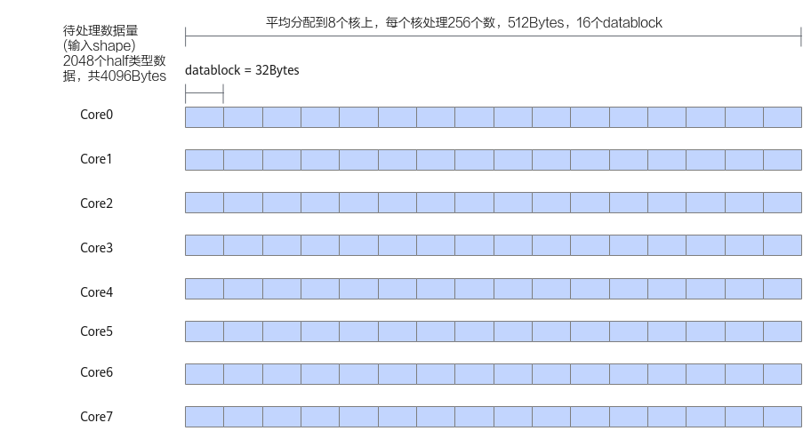
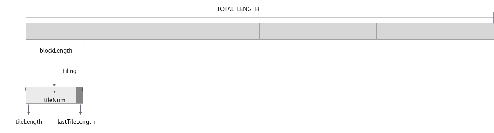

# 尾块Tiling-多核&Tiling切分-矢量编程-SIMD算子实现-算子实践参考-Ascend C算子开发-算子开发-CANN社区版8.5.0开发文档-昇腾社区

**页面ID:** atlas_ascendc_10_00009
**来源：** https://www.hiascend.com/document/detail/zh/CANNCommunityEdition/850/opdevg/Ascendcopdevg/atlas_ascendc_10_00009.html
---

# 尾块Tiling

如下图中的示例，算子的输入shape为(1，2048)，支持的数据类型为half类型，输入数据可以对齐到一个datablock的大小（32字节），输入数据为2048 * 2 / 32 = 128个datablock，因此可以平均分配到每个核上（假设使用8个核），每个核上处理256个数，16个datablock。此时不需要进行尾块处理。

针对一些shape，比如算子的输入shape为(1，1904)，支持的数据类型为half类型，输入数据可以对齐到一个datablock的大小（32字节），可以平均分配到每个核上（假设使用8个核），每个核上处理238个数，238个数无法均分到datablock上，分满14个datablock后，剩余14个数（28字节），多核切分后需要进行尾块处理。

对于不同shape的输入进行数据切分时，可能会发生Tiling后的数据平均分配到多核上，但每个核内的数据无法均分的情况。针对此种场景，在Tiling参数中增加变量lastTileLength，用来表示最后一个分块，即尾块的大小。因此，在定义算子的Tiling结构体时包含以下四个成员：

- blockLength：每个核上计算的数据长度；
- tileNum：每个核上切分的主块数据块的个数；
- tileLength：每个核上主块数据块的长度；
- lastTileLength：每个核上尾块的长度。

#### Tiling实现

算子的Tiling结构体定义如下：

| 123456 | structAddCustomTilingData{uint32_tblockLength;uint32_ttileNum;uint32_ttileLength;uint32_tlastTileLength;}; |
| ------ | ---------------------------------------------------------------------------------------------------------- |

Host侧Tiling实现的主要内容为计算以上四个成员变量。步骤如下：

1. 判断数据总长度totalLength是否满足32字节对齐，如不满足，则计算totalLength向上32字节对齐后的长度totalLengthAligned。123456constexpruint32_tBLOCK_SIZE=32;// 为方便计算，这里根据数据类型定义变量alignNum作为对齐数uint32_talignNum=BLOCK_SIZE/dataTypeSize;// totalLength为数据总量uint32_ttotalLengthAligned=(totalLength%alignNum==0)?totalLength:((totalLength+alignNum-1)/alignNum)*alignNum;
1. 判断totalLengthAligned是否能被使用的核数BlockDim均分，如果可以，则计算每个核上计算数据长度blockLength。123456constexpruint32_tBLOCK_DIM=8;constexpruint32_tUB_BLOCK_NUM=20;// 此处为方便验证，使用UB_BLOCK_NUM作为Unified Buffer可用的Block数量，因此可得出可用UB空间的大小为UB_BLOCK_NUM * BLOCK_SIZEuint32_tblockLength,tileNum;if(totalLengthAligned%BLOCK_DIM==0){blockLength=totalLengthAligned/BLOCK_DIM;}
1. 计算tileNum。为了减少数据搬运开销，应尽量使用核内的Unified Buffer空间。基于每个核上的计算量以及可用Unified Buffer空间的大小，计算tileNum。1tileNum=blockLength/alignNum/UB_BLOCK_NUM;
1. 根据计算出的tileNum，计算tileLength和lastTileLength。如果每个核的计算量能够被当前可用Unified Buffer空间均分，则按照无尾块场景处理。12345if((blockLength/alignNum)%UB_BLOCK_NUM==0){// 单核的计算量能被当前可用UB空间均分，仅有主块，无尾块tileLength=UB_BLOCK_NUM*alignNum;lastTileLength=0;}反之，按照尾块场景处理，尾块长度为单核计算数据长度 - tileNum * tileLength。123456789if(tileNum==0){// 单核需要计算的长度小于UB可用空间，按照仅有尾块处理tileLength=0;lastTileLength=((blockLength+alignNum-1)/alignNum)*alignNum;}else{// 同时有主块和尾块tileLength=UB_BLOCK_NUM*alignNum;lastTileLength=blockLength-tileNum*tileLength;}

Host侧Tiling实现的代码如下：

| 1234567891011121314151617181920212223242526272829 | constexpruint32_tBLOCK_SIZE=32;constexpruint32_tBLOCK_DIM=8;constexpruint32_tUB_BLOCK_NUM=20;// 此处为方便验证，使用UB_BLOCK_NUM作为UB可用的Block数量，因此可得出可用UB空间的大小为UB_BLOCK_NUM * BLOCK_SIZE...uint32_talignNum=BLOCK_SIZE/dataTypeSize;// 为方便计算，这里根据数据类型定义变量alignNum作为对齐数，dataTypeSize为运算数据的数据类型对应的字节数// totalLength为数据总量uint32_ttotalLengthAligned=(totalLength%alignNum==0)?totalLength:((totalLength+alignNum-1)/alignNum)*alignNum;uint32_tblockLength,tileNum;if(totalLengthAligned%BLOCK_DIM==0){blockLength=totalLengthAligned/BLOCK_DIM;tileNum=blockLength/alignNum/UB_BLOCK_NUM;if(tileNum==0){// 单核需要计算的长度小于UB可用空间，按照仅有尾块处理tileLength=0;lastTileLength=((blockLength+alignNum-1)/alignNum)*alignNum;}elseif((blockLength/alignNum)%UB_BLOCK_NUM==0){// 单核的计算量能被当前可用UB空间均分，仅有主块，无尾块tileLength=UB_BLOCK_NUM*alignNum;lastTileLength=0;}else{// 同时有主块和尾块tileLength=UB_BLOCK_NUM*alignNum;lastTileLength=blockLength-tileNum*tileLength;}...} |
| ------------------------------------------------- | --------------------------------------------------------------------------------------------------------------------------------------------------------------------------------------------------------------------------------------------------------------------------------------------------------------------------------------------------------------------------------------------------------------------------------------------------------------------------------------------------------------------------------------------------------------------------------------------------------------------------------------------------------------------------------------------------------------------------------------------------------------------------------------------------------------------------------------------------------------------------------------------------------------------------------------------------------------------------------------------------------------------------------------------------------------------------- |

(1，1904)形状的输入数据计算后，tiling结构体内各个变量的值如下：

| 123456 | structAddCustomTilingData{uint32_tblockLength=238;// 每个核计算238个half，8个核共计算1904个halfuint32_ttileNum=0;// 可用的UB空间足够，为仅有尾块的场景uint32_ttileLength=0;// 没有主块，主块长度为0uint32_tlastTileLength=240;// 238个half未32B对齐，对齐到240个half搬运}; |
| ------ | -------------------------------------------------------------------------------------------------------------------------------------------------------------------------------------------------------------------------------------------------------------------------- |

#### 算子类实现

与多核Tiling相比，在Init函数中通过Pipe内存管理对象为输入输出Queue分配内存时，取tileLength与lastTileLength中的最大值作为分配内存的长度。例如，当单核需要计算的长度小于UB可用空间时，按照仅有尾块处理，此时tileLength为0，而lastTileLength为数据块长度。因此，需要取两者中的较大值来分配内存。

| 12  | uint32_tinitBufferLength=AscendC:Std:max(this->tileLength,this->lastTileLength);pipe.InitBuffer(inQueueX,1,initBufferLength*sizeof(dataType)); |
| --- | ---------------------------------------------------------------------------------------------------------------------------------------------- |

由于尾块长度为lastTileLength，与主块数据块的长度不同，因此在CopyIn函数、Compute函数、CopyOut函数中传入本次循环待处理的数据块长度参数tileLength，即待处理的主块或尾块的数据长度。

| 123456789101112131415 | __aicore__inlinevoidProcess(){// 计算主块数据，对应数据块长度为tileLengthfor(uint32_ti=0;i<this->tileNum;i++){CopyIn(i,this->tileLength);Compute(i,this->tileLength);CopyOut(i,this->tileLength);}// 计算尾块数据，对应数据块长度为lastTileLengthif(this->lastTileLength>0){CopyIn(this->tileNum,this->lastTileLength);Compute(this->tileNum,this->lastTileLength);CopyOut(this->tileNum,this->lastTileLength);}} |
| --------------------- | ----------------------------------------------------------------------------------------------------------------------------------------------------------------------------------------------------------------------------------------------------------------------------------------------------------------------------------------------------------------------------------------------------------------- |

| 123456789 | __aicore__inlinevoidCopyIn(int32_tprogress,uint32_ttileLength){AscendC:LocalTensor<dataType>xLocal=inQueueX.AllocTensor<dataType>();AscendC:LocalTensor<dataType>yLocal=inQueueY.AllocTensor<dataType>();AscendC:DataCopy(xLocal,xGm[progress*this->tileLength],tileLength);AscendC:DataCopy(yLocal,yGm[progress*this->tileLength],tileLength);inQueueX.EnQue(xLocal);inQueueY.EnQue(yLocal);} |
| --------- | ---------------------------------------------------------------------------------------------------------------------------------------------------------------------------------------------------------------------------------------------------------------------------------------------------------------------------------------------------------------------------------------------- |

| 12345678910 | __aicore__inlinevoidCompute(int32_tprogress,uint32_ttileLength){AscendC:LocalTensor<dataType>xLocal=inQueueX.DeQue<dataType>();AscendC:LocalTensor<dataType>yLocal=inQueueY.DeQue<dataType>();AscendC:LocalTensor<dataType>zLocal=outQueueZ.AllocTensor<dataType>();AscendC:Add(zLocal,xLocal,yLocal,tileLength);outQueueZ.EnQue<dataType>(zLocal);inQueueX.FreeTensor(xLocal);inQueueY.FreeTensor(yLocal);} |
| ----------- | ------------------------------------------------------------------------------------------------------------------------------------------------------------------------------------------------------------------------------------------------------------------------------------------------------------------------------------------------------------------------------------------------------------ |

| 123456 | __aicore__inlinevoidCopyOut(int32_tprogress,uint32_ttileLength){AscendC:LocalTensor<dataType>zLocal=outQueueZ.DeQue<dataType>();AscendC:DataCopy(zGm[progress*this->tileLength],zLocal,tileLength);outQueueZ.FreeTensor(zLocal);} |
| ------ | --------------------------------------------------------------------------------------------------------------------------------------------------------------------------------------------------------------------------------- |
