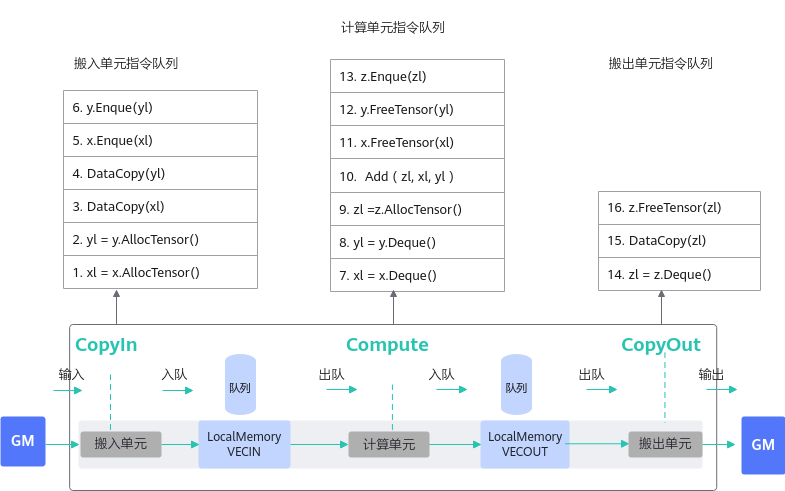

# 编程模型设计原理-概念原理和术语-编程指南-Ascend C算子开发-算子开发-CANN社区版8.5.0开发文档-昇腾社区

**页面ID:** atlas_ascendc_10_00015
**来源：** https://www.hiascend.com/document/detail/zh/CANNCommunityEdition/850/opdevg/Ascendcopdevg/atlas_ascendc_10_00015.html
---

# 编程模型设计原理

Ascend C编程模型中，并行编程范式核心要素是：一组并行计算任务、通过队列实现任务之间的同步、开发者自主表达对并行计算任务和资源的调度。本节介绍编程模型的设计原理，作为扩展阅读，便于开发者更好的理解编程模型的设计思路和优势，对于后续的深度开发也会有所帮助。

每个并行任务Stage的编程范式如下：

1. 获取Local Memory的内存：调用AllocTensor申请内存，或者从上游队列DeQue一块内存数据。
1. 完成计算或者数据搬运。
1. 把上一步处理好的数据调用EnQue入队。
1. 调用FreeTensor释放不再需要的内存。

以最简单的矢量编程范式为例，在调用上述接口时，实际上会给各执行单元下发一些指令，如下图所示：

- EnQue/DeQue的具体处理流程：标量执行单元读取算子指令序列把这些指令发射到对应的执行单元的指令队列各个执行单元并行执行这些指令序列EnQue/DeQue解决对内存的写后读问题EnQue调用会发射同步指令set，发送信号激活waitDeQue调用会发射同步指令wait，等待数据写入完成wait需要等到set指令执行完成后才能执行否则阻塞由此可以看出，EnQue/DeQue主要解决了存在数据依赖时，并行执行单元的写后读同步控制问题。

- AllocTensor/FreeTensor的具体处理流程标量执行单元读取算子指令序列把这些指令发射到对应的执行单元的指令队列各个执行单元并行执行这些指令序列AllocTensor/FreeTensor，解决对内存的读后写问题AllocTensor调用会发射同步指令wait等待内存被读完成FreeTensor调用会发射同步指令set，通知内存释放，可以重复写wait需要等到set指令执行完成后才能执行否则阻塞由此可以看出，AllocTensor/FreeTensor主要解决了存在数据依赖时，并行执行单元的读后写同步控制问题。

通过上文的详细说明，可以看出异步并行程序需要考虑复杂的同步控制，而Ascend C编程模型将这些流程进行了封装，通过EnQue/DeQue/AllocTensor/FreeTensor这种开发者熟悉的资源控制方式来体现，达到简化编程和易于理解的目的。
