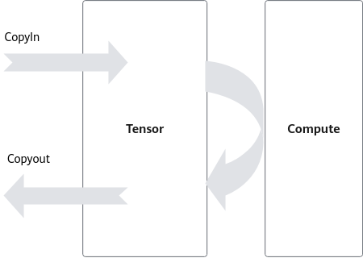
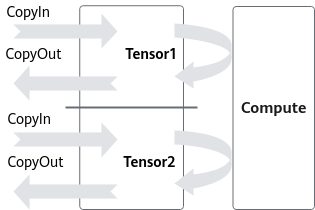

# DoubleBuffer-性能优化技术原理-概念原理和术语-编程指南-Ascend C算子开发-算子开发-CANN社区版8.5.0开发文档-昇腾社区

**页面ID:** atlas_ascendc_10_00016
**来源：** https://www.hiascend.com/document/detail/zh/CANNCommunityEdition/850/opdevg/Ascendcopdevg/atlas_ascendc_10_00016.html
---

# DoubleBuffer

执行于AI Core上的指令队列主要包括如下几类，即Vector指令队列、Cube指令队列和MTE指令队列。不同指令队列间的相互独立性和可并行执行性，是DoubleBuffer优化机制的基石。

矢量计算CopyIn、CopyOut过程使用MTE指令队列(MTE2、MTE3)，Compute过程使用Vector指令队列(V)，意味着CopyIn、CopyOut过程和Compute过程是可以并行的。

如图1所示，考虑一个完整的数据搬运和计算过程，CopyIn过程将数据从Global Memory搬运到Local Memory，Vector计算单元完成计算后，经过CopyOut过程将计算结果搬回Global Memory。

在此过程中，数据搬运与Vector计算串行执行，Vector计算单元无可避免存在资源闲置问题。举例而言，若CopyIn、Compute、CopyOut三阶段分别耗时t，则Vector的时间利用率仅为1/3，等待时间过长，Vector利用率严重不足。

为减少Vector等待时间，DoubleBuffer机制将待处理的数据一分为二，比如Tensor1、Tensor2。如图2所示，当Vector对Tensor1中数据进行Compute时，Tensor2可以执行CopyIn的过程；而当Vector切换到计算Tensor2时，Tensor1可以执行CopyOut的过程。由此，数据的进出搬运和Vector计算实现并行执行，Vector闲置问题得以有效缓解。

总体来说，DoubleBuffer是基于MTE指令队列与Vector指令队列的独立性和可并行性，通过将数据搬运与Vector计算并行执行以隐藏数据搬运时间并降低Vector指令的等待时间，最终提高Vector单元的利用效率，您可以通过为队列申请内存时设置内存块的个数来实现数据并行，简单代码示例如下：

| 1   | pipe.InitBuffer(inQueueX,2,256); |
| --- | -------------------------------- |

需要注意：

多数情况下，采用DoubleBuffer能有效提升Vector的时间利用率，缩减算子执行时间。然而，DoubleBuffer机制缓解Vector闲置问题并不代表它总能带来整体的性能提升。例如：

- 当数据搬运时间较短，而Vector计算时间显著较长时，由于数据搬运在整个计算过程中的时间占比较低，DoubleBuffer机制带来的性能收益会偏小。
- 又如，当原始数据较小且Vector可一次性完成所有计算时，强行使用DoubleBuffer会降低Vector计算资源的利用率，最终效果可能适得其反。

因此，DoubleBuffer的性能收益需综合考虑Vector算力、数据量大小、搬运与计算时间占比等多种因素。
