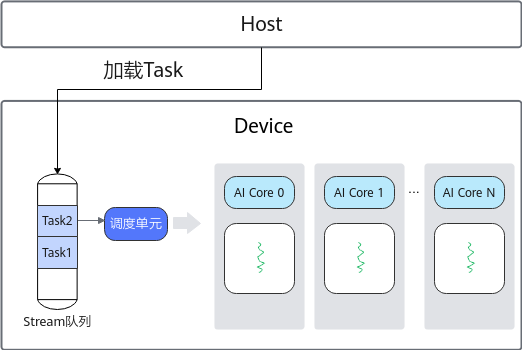
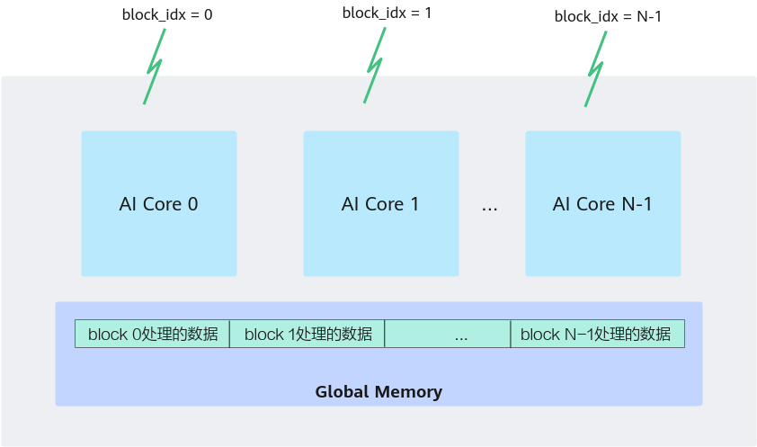

# 异构并行编程模型-编程模型-编程指南-Ascend C算子开发-算子开发-CANN社区版8.5.0开发文档-昇腾社区

**页面ID:** atlas_ascendc_10_00028
**来源：** https://www.hiascend.com/document/detail/zh/CANNCommunityEdition/850/opdevg/Ascendcopdevg/atlas_ascendc_10_00028.html
---

# 异构并行编程模型

#### Host-Device异构协同机制

Ascend C异构并行编程模型是为应对异构计算架构的挑战而设计的，旨在解决传统编程模型在处理复杂计算任务时的效率和可扩展性问题。

异构计算架构分为Host侧和Device侧（Device侧对应昇腾AI处理器），两者协同完成计算任务。Host侧主要负责运行时管理，包括存储管理、设备管理以及Stream管理等，确保任务的高效调度与资源的合理分配；Device侧，会执行开发者基于Ascend C语法编写的Kernel核函数，主要完成批量数据的矩阵运算、向量运算等计算密集型的任务，用于计算加速。

如下图所示，当一个Kernel下发到AI Core（昇腾AI处理器的计算核心）上执行时，运行时管理模块根据开发者设置的核数和任务类型启动对应的Task，该Task从Host加载到Device的Stream运行队列，调度单元会把就绪的Task分配到空闲AI Core上执行。这里将需要处理的数据拆分并同时在多个计算核心上运行的方式（也就是下文介绍的SPMD并行计算），可以获取更高的性能。

Host和Device拥有不同的内存空间，Host无法直接访问Device内存，反之亦然。所以，输入数据需要从Host侧拷贝至Device侧内存空间，供Device侧进行计算，输出结果需要从Device侧内存拷贝回Host侧，便于在Host侧继续使用。

#### SPMD并行计算

Ascend C算子编程是SPMD(Single-Program Multiple-Data)编程，通俗来讲就是“一份代码，多处执行，处理的数据不同”。SPMD是一种常用的并行计算的方法，是提高计算速度的有效手段。

具体到Ascend C编程模型中的应用，是将需要处理的数据拆分并同时在多个计算核心（类比于上文介绍中的多个进程）上运行，从而获取更高的性能。多个AI Core共享相同的指令代码，每个核上的运行实例唯一的区别是block_idx不同，每个核通过不同的block_idx来识别自己的身份。block的概念类似于上文中进程的概念，block_idx就是标识进程唯一性的进程ID。并行计算过程如下图所示。

下面的代码片段取自于Ascend CAdd算子的实现代码，算子被调用时，所有的计算核心都执行相同的实现代码，入口函数的入参也是相同的。每个核上处理的数据地址需要在起始地址上增加GetBlockIdx()*BLOCK_LENGTH（每个核处理的数据长度）的偏移来获取。这样也就实现了多核并行计算的数据切分。代码中GetBlockIdx接口用于获取每个核的block_idx。

| 12345678910111213141516171819202122232425262728 | classKernelAdd{public:__aicore__inlineKernelAdd(){}__aicore__inlinevoidInit(GM_ADDRx,GM_ADDRy,GM_ADDRz){// 不同核根据各自的block_idx设置数据地址xGm.SetGlobalBuffer((__gm__half*)x+BLOCK_LENGTH*AscendC:GetBlockIdx(),BLOCK_LENGTH);yGm.SetGlobalBuffer((__gm__half*)y+BLOCK_LENGTH*AscendC:GetBlockIdx(),BLOCK_LENGTH);zGm.SetGlobalBuffer((__gm__half*)z+BLOCK_LENGTH*AscendC:GetBlockIdx(),BLOCK_LENGTH);// Queue初始化，单位为字节pipe.InitBuffer(inQueueX,BUFFER_NUM,TILE_LENGTH*sizeof(half));pipe.InitBuffer(inQueueY,BUFFER_NUM,TILE_LENGTH*sizeof(half));pipe.InitBuffer(outQueueZ,BUFFER_NUM,TILE_LENGTH*sizeof(half));}...}// 实现核函数__global____aicore__voidadd_custom(GM_ADDRx,GM_ADDRy,GM_ADDRz){// 初始化算子类，算子类提供算子初始化和核心处理等方法KernelAddop;// 初始化函数，获取该核函数需要处理的输入输出地址，同时完成必要的内存初始化工作op.Init(x,y,z);// 核心处理函数，完成算子的数据搬运与计算等核心逻辑op.Process();} |
| ----------------------------------------------- | -------------------------------------------------------------------------------------------------------------------------------------------------------------------------------------------------------------------------------------------------------------------------------------------------------------------------------------------------------------------------------------------------------------------------------------------------------------------------------------------------------------------------------------------------------------------------------------------------------------------------------------------------------------------------------------------------------------------------------------------------------------------------------------------------------------------------------------------------------------------------------------------------------------------------------------------------- |
