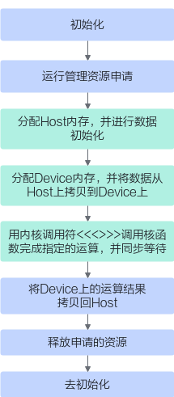

# 算子运行-编译与运行-编程指南-Ascend C算子开发-算子开发-CANN社区版8.5.0开发文档-昇腾社区

**页面ID:** atlas_ascendc_10_00043
**来源：** https://www.hiascend.com/document/detail/zh/CANNCommunityEdition/850/opdevg/Ascendcopdevg/atlas_ascendc_10_00043.html
---

# 算子运行

算子的计算算法实现通过Ascend C API来完成，而算子的加载调用则使用Runtime API来完成。本章节将结合核函数调用介绍CANN软件栈中Ascend C算子运行时常用的Runtime接口。Runtime接口更多信息与细节可以参考“acl API(C&C++)”章节。

#### 加载和运行代码

1. 初始化：aclInit。
1. 运行时资源申请：通过aclrtSetDevice和aclrtCreateStream分别申请Device、Stream运行管理资源。
1. 使用aclrtMallocHost分配Host内存，并进行数据初始化。
1. 使用aclrtMalloc分配Device内存，并通过aclrtMemcpy将数据从Host上拷贝到Device上，参与核函数计算。
1. 使用<<<>>>调用算子核函数。
1. 执行核函数后，将Device上的运算结果拷贝回Host。
1. 异步等待核函数执行完成：aclrtSynchronizeStream。
1. 资源释放：通过aclrtDestroyStream和aclrtResetDevice分别释放Stream、Device运行管理资源。
1. 去初始化：aclFinalize。

#### Kernel加载与执行的更多方式

Kernel的加载与执行也可以通过二进制加载方式实现，这是最底层的接口实现方式。内核调用符<<<...>>>为对底层接口的封装实现。使用时需要bisheng命令行编译将算子源文件编译为二进制。o文件，再通过aclrtLaunchKernelWithConfig等Kernel加载与执行接口完成算子调用。

- Kernel加载与执行接口的具体说明请参考“Kernel加载与执行”章节。
- bisheng命令行编译选项的使用介绍请参考常用的编译选项。
- 完整样例请参考Kernel加载与执行（加载二进制）样例。

