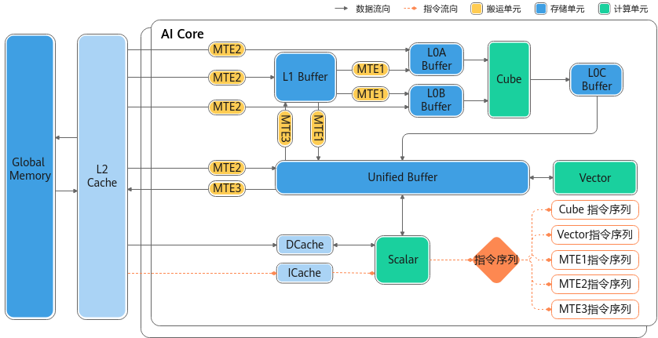
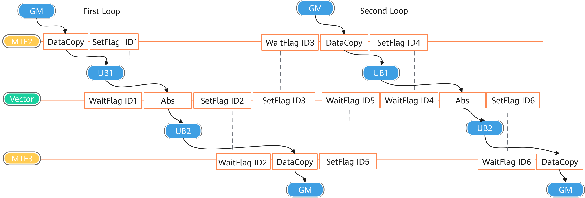

# NPU架构版本200x-架构规格-硬件实现-编程指南-Ascend C算子开发-算子开发-CANN社区版8.5.0开发文档-昇腾社区

**页面ID:** atlas_ascendc_10_0009
**来源：** https://www.hiascend.com/document/detail/zh/CANNCommunityEdition/850/opdevg/Ascendcopdevg/atlas_ascendc_10_0009.html
---

# NPU架构版本200x

本节介绍__NPU_ARCH__版本号为200x的硬件架构和其功能说明，其中200代表IP核编号，x表示同一个IP核的配置版本号。对应的产品型号为Atlas推理系列产品。

#### 硬件架构图

#### 计算单元

Cube计算单元和Vector计算单元同核部署

本架构中，Cube计算单元和Vector计算单元同核部署，共享同一个Scalar计算单元。

Vector计算单元

- Vector计算单元的数据来源来自于Unified Buffer，要求32字节对齐。
- 数据从L0C Buffer传输至Unified Buffer需要以Vector计算单元作为中转。

Cube计算单元

- Cube计算单元可以访问的存储单元有L0A Buffer、L0B Buffer、L0C Buffer，其中L0A Buffer存储左矩阵，L0B Buffer存储右矩阵，L0C Buffer存储矩阵乘的结果和中间结果。

#### 存储单元

获取存储单元的内存空间大小

开发者可以通过平台信息获取接口查询各存储单元的内存空间大小。

各存储单元的最小访问粒度（对齐要求）

| 存储单元       | 对齐要求      |
| -------------- | ------------- |
| Unified Buffer | 32Byte对齐。  |
| L1 Buffer      | 32Byte对齐。  |
| L0A Buffer     | 512Byte对齐。 |
| L0B Buffer     | 512Byte对齐。 |
| L0C Buffer     | 64Byte对齐。  |

各存储单元推荐使用的数据排布格式

- L0A Buffer、L0B Buffer和L0C Buffer推荐分别采用以下分形格式：L0A Buffer：FRACTAL_ZZL0B Buffer：FRACTAL_ZNL0C Buffer：FRACTAL_NZ这些格式针对矩阵乘法等计算密集型任务进行优化，可显著提升计算效率。
- L1 Buffer缓存推荐使用FRACTAL_NZ格式。当L1采用NZ格式时，数据搬运到L0A/L0B Buffer（需分别转换为ZZ和ZN格式）时，可降低格式转换开销。
- Unified Buffer对数据格式没有要求。

解决存储单元的访问冲突，提升读写性能

当多个操作尝试同时访问Unified Buffer同一个bank或者bank group时，可能会发生bank冲突，包括读写冲突、写写冲突、读读冲突，这种冲突会导致访问排队，降低性能。可以通过优化bank分配的方式来提升读写性能，具体信息请参考避免Unified Buffer的bank冲突章节。

#### 搬运单元

搬运时的对齐要求

由于搬运后的数据用于参与数据计算，因此对搬运数据大小有要求，搬运到Unified Buffer的数据大小需要按照DataBlock对齐，其余存储单元的数据搬运必须按分形要求进行搬运。例如，数据从L1 Buffer搬运到L0A Buffer时，数据格式需要从NZ转换为ZZ格式，搬运数据的大小要按分形大小对齐，如果L1 Buffer的剩余大小不足1个分形，则硬件执行中会出现异常。

#### 同步控制

核内同步

由于AI Core内部的执行单元（如MTE2搬运单元、Vector计算单元等）以异步并行的方式运行，在读写Local Memory（如Unified Buffer）时可能存在数据依赖关系。为确保数据一致性及计算正确性，需通过同步控制协调操作时序。

以MTE2从GM搬运数据至UB，进行Vector计算单元的Abs计算，再搬运回GM的流程为例，需满足以下同步条件：

1. 数据搬运与计算顺序GM→UB搬运完成后再启动Vector单元的Abs计算（避免计算时未完成搬运导致的数据缺失）；Vector计算完成后再执行UB→GM的数据搬运（确保结果数据已就绪）。
1. 循环搬运计算场景的同步规则前序计算完成后再启动新搬运：上一次计算未完成时，不得触发新数据搬运（防止UB中旧数据被覆盖）；前序数据搬出完成后再启动新计算：上一次数据未完全从UB搬出时，不得触发新计算任务（避免目标内存区域的覆盖冲突）。

同步控制流程如下图所示：

上图中，ID1、ID2、ID3、ID4、ID5、ID6表示事件ID(EventID)，每个EventID对应一块存储数据的搬运状态，确保数据操作的正确性和一致性。

- 建议通过AllocEventID或者FetchEventID接口获取EventID，以确保其合法性和有效性。
- EventID的数量有限，使用后应立即调用ReleaseEventID释放资源，避免EventID耗尽，影响系统正常运行。
- SetFlag和WaitFlag必须成对使用，且SetFlag和WaitFlag的参数必须完全一致（包括模板参数和事件ID）。如果不匹配，可能导致当前核的计算异常，或影响下一个核的算子执行，引发timeout问题。例如，SetFlag<HardEvent:S_MTE3>(1)和SetFlag<HardEvent:MTE3_MTE1>(1)设置的不是同一个EventID，因为其模板参数不同。只有当模板参数和事件ID完全一致时，才表示同一个EventID。
- 不允许连续设置同一个EventID，因为这可能导致事件状态混乱或未被正确处理。

核间同步

该硬件架构不支持核间同步。
