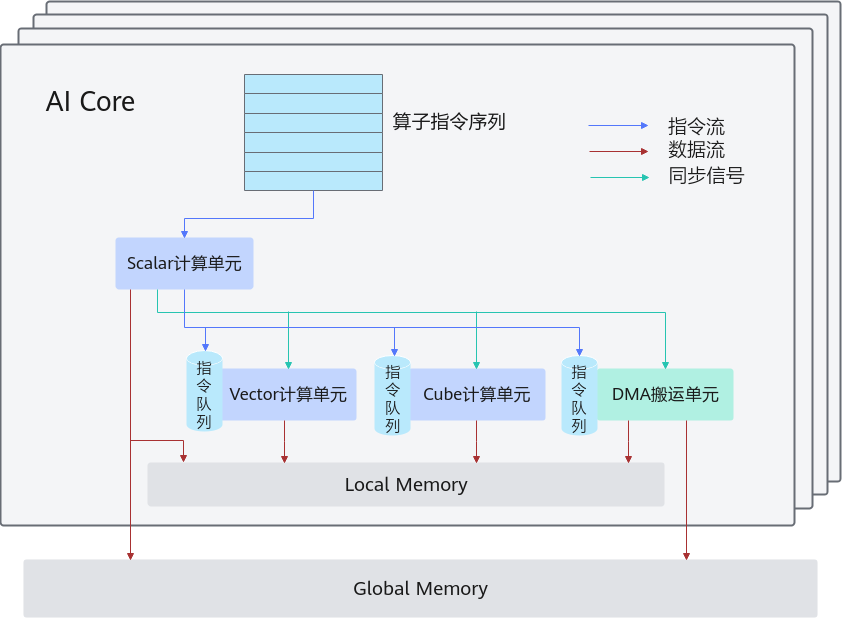

# 抽象硬件架构-编程模型-编程指南-Ascend C算子开发-算子开发-CANN社区版8.5.0开发文档-昇腾社区

**页面ID:** atlas_ascendc_10_0015
**来源：** https://www.hiascend.com/document/detail/zh/CANNCommunityEdition/850/opdevg/Ascendcopdevg/atlas_ascendc_10_0015.html
---

# 抽象硬件架构

AI Core是昇腾AI处理器的计算核心，昇腾AI处理器内部有多个AI Core。本章节将介绍AI Core的并行计算架构抽象，该抽象架构屏蔽了不同硬件之间的差异。使用Ascend C进行编程时，基于抽象硬件架构，可以简化硬件细节，显著降低开发门槛。如需了解更详细的硬件架构信息或者原理，请参考硬件实现。

AI Core中包含计算单元、存储单元、搬运单元等核心组件。

- 计算单元包括了三种基础计算资源：Cube计算单元、Vector计算单元和Scalar计算单元。
- 存储单元包括内部存储和外部存储：AI Core的内部存储，统称为Local Memory，对应的数据类型为LocalTensor。AI Core能够访问的外部存储称之为Global Memory，对应的数据类型为GlobalTensor。
- DMA(Direct Memory Access)搬运单元：负责数据搬运，包括Global Memory和Local Memory之间的数据搬运，以及不同层级Local Memory之间的数据搬运。

| 组件分类 | 组件名称                  | 组件功能                                                                                             |
| -------- | ------------------------- | ---------------------------------------------------------------------------------------------------- |
| 计算单元 | Scalar                    | 执行地址计算、循环控制等标量计算工作，并把向量计算、矩阵计算、数据搬运、同步指令发射给对应单元执行。 |
| Vector   | 负责执行向量运算。        |                                                                                                      |
| Cube     | 负责执行矩阵运算。        |                                                                                                      |
| 存储单元 | Local Memory              | AI Core的内部存储。                                                                                  |
| 搬运单元 | DMA(Direct Memory Access) | 负责数据搬运，包括Global Memory和Local Memory之间的数据搬运以及不同层级Local Memory之间的数据搬运。  |

开发者在理解硬件架构的抽象时，需要重点关注如下异步指令流、同步信号流、计算数据流三个过程：

- AI Core内部的异步并行计算过程：Scalar计算单元读取指令序列，并把向量计算、矩阵计算、数据搬运指令发射给对应单元的指令队列，向量计算单元、矩阵计算单元、数据搬运单元异步的并行执行接收到的指令。该过程可以参考图1中蓝色箭头所示的指令流。
- 不同的指令间有可能存在依赖关系，为了保证不同指令队列间的指令按照正确的逻辑关系执行，Scalar计算单元也会给对应单元下发同步指令。各单元之间的同步过程可以参考图1中的绿色箭头所示的同步信号流。
- AI Core内部数据处理的基本过程：DMA搬入单元将数据从Global Memory搬运到Local Memory，Vector/Cube计算单元完成数据计算，并把计算结果写回Local Memory，DMA搬出单元把处理好的数据从Local Memory搬运回Global Memory。该过程可以参考图1中的红色箭头所示的数据流。
