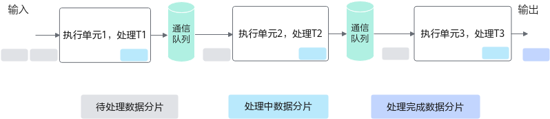
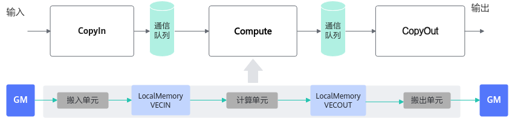
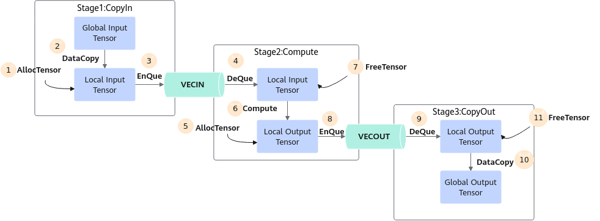
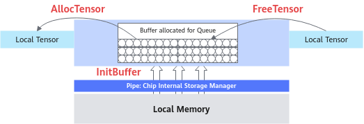
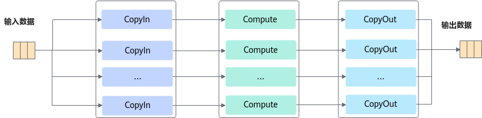
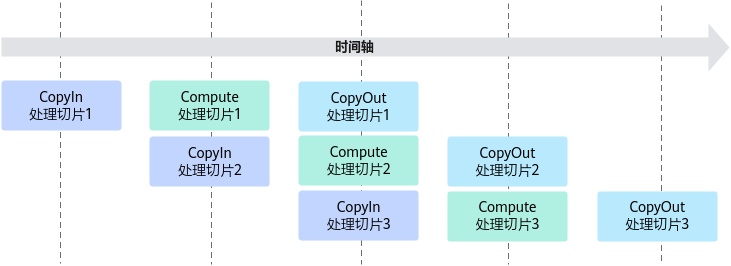
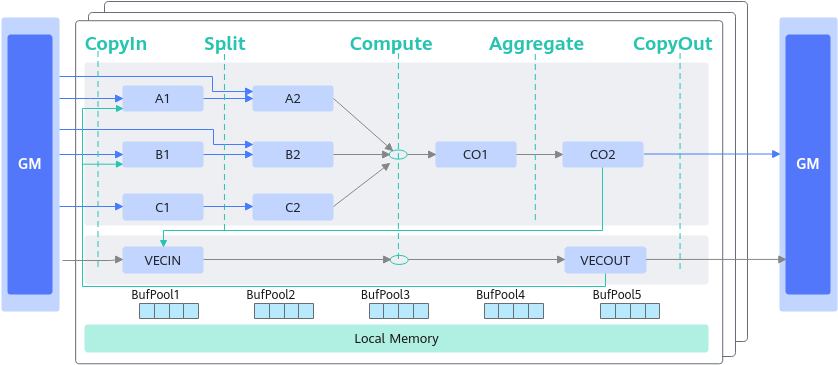
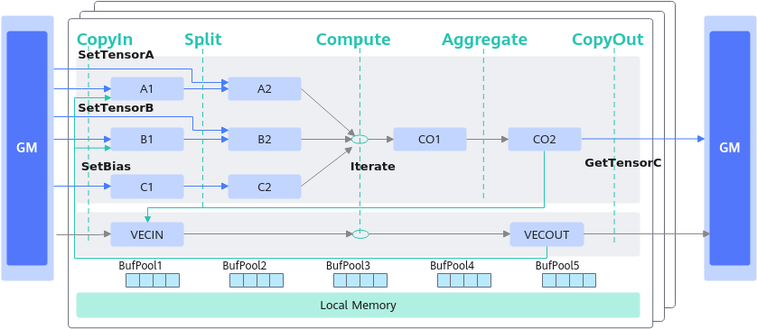
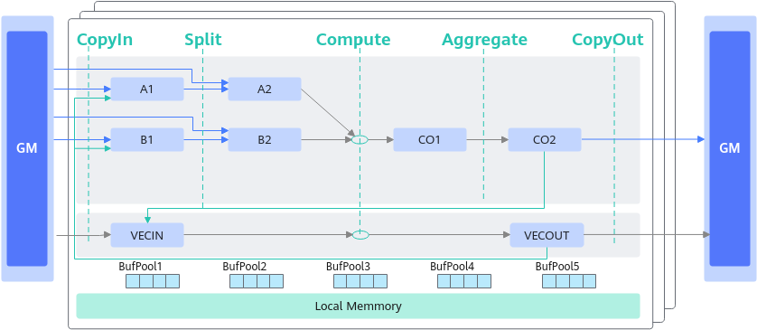
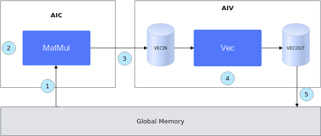

# 典型算子的编程范式-基于TPipe和TQue编程-AI Core SIMD编程-编程范式-编程模型-编程指南-Ascend C算子开发-算子开发-CANN社区版8.5.0开发文档-昇腾社区

**页面ID:** atlas_ascendc_10_0016
**来源：** https://www.hiascend.com/document/detail/zh/CANNCommunityEdition/850/opdevg/Ascendcopdevg/atlas_ascendc_10_0016.html
---

# 典型算子的编程范式

编程范式描述了算子核函数实现的固定流程，基于编程范式进行编程，可以快速搭建算子实现的代码框架。

根据抽象硬件架构，AI Core内部的执行单元异步并行地执行接收到的指令，各执行单元配合，以一种流水线的方式完成完整的算子执行过程。

Ascend C编程范式正是这样一种流水线式的编程范式，把算子核内的处理程序，分成多个流水任务，通过队列(TQue)完成任务间通信和同步，并通过统一的资源管理模块(TPipe)来统一管理内存、事件等资源。

下文将从三种典型的算子类型出发，对这种基于TPipe和TQue的编程范式进行详细介绍。

- 矢量编程范式
- 矩阵编程范式
- 融合算子编程范式

#### 矢量编程范式

如上图所示，矢量编程范式把算子的实现流程分为3个基本任务：CopyIn，Compute，CopyOut。

- CopyIn负责搬入操作：将输入数据从Global Memory搬运到Local Memory（VECIN用于表达矢量计算搬入数据的存放位置），完成搬运后执行入队列操作；
- Compute负责矢量指令计算操作：完成队列出队后，从Local Memory获取数据并计算，计算完成后执行入队操作；
- CopyOut负责搬出操作：完成队列出队后，将计算结果从Local Memory（VECOUT用于表达矢量计算搬出数据的存放位置）搬运到Global Memory。

上文中提到的VECIN/VECOUT是TPosition的概念。Ascend C管理不同层级的物理内存时，用一种抽象的逻辑位置(TPosition)来表达各级别的存储，代替了片上物理存储的概念，达到隐藏硬件架构的目的。除了VECIN/VECOUT，矢量编程中还会使用到VECCALC，一般在定义临时变量时使用此位置。TPosition与物理内存的映射关系请参考表1。

从编程的角度来讲，具体流程（如下文的伪代码）和流程图如下：

| 12345678910111213141516171819202122232425262728 | AscendC:TPipepipe;// 创建全局的资源管理AscendC:TQue<AscendC:TPosition:VecIn,1>queIn;// 创建CopyIn阶段的队列AscendC:TQue<AscendC:TPosition:VecOut,1>queOut;// 创建CopyOut阶段的队列// Init阶段pipe.InitBuffer(queIn,2,1024);// 开启DoubleBuffer，将待处理的数据一分为二，实现流水并行pipe.InitBuffer(queOut,2,1024);for-loop{// CopyIn阶段{autotensor=queIn.AllocTensor<half>();// 从Que上申请资源，长度1024AscendC:DataCopy(tensor,gm,1024);// 搬运数据从GM到VECINqueIn.EnQue(tensor);}// Compute阶段{autotensor=queIn.DeQue<half>();autotensorOut=queOut.AllocTensor<half>();AscendC:Abs(tensorOut,tensor,1024);// 计算queIn.FreeTensor(tensor);queOut.EnQue(tensorOut);}// CopyOut阶段{autotensor=queOut.DeQue<half>();AscendC:DataCopy(gmOut,tensor,1024);// 搬运数据从VECOUT到GMqueOut.FreeTensor(tensor);// 释放资源}} |
| ----------------------------------------------- | --------------------------------------------------------------------------------------------------------------------------------------------------------------------------------------------------------------------------------------------------------------------------------------------------------------------------------------------------------------------------------------------------------------------------------------------------------------------------------------------------------------------------------------------------------------------------------------------------------------------------------------------------------------------------------------------------------------------------------------------------------------------------------------------------------------------------- |

任务间数据传递使用到的内存、事件等资源统一由管理模块Pipe进行管理。如下所示的内存管理示意图，TPipe通过InitBuffer接口对外提供队列内存初始化功能，开发者可以通过该接口为指定的队列分配内存。

队列内存初始化完成后，需要使用内存时，通过调用AllocTensor来为LocalTensor分配内存，当创建的LocalTensor完成相关计算无需再使用时，再调用FreeTensor来回收LocalTensor的内存。

编程过程中使用到的临时变量内存同样通过Pipe进行管理。临时变量可以使用TBuf数据结构来申请指定TPosition上的存储空间。使用TBuf申请的内存空间只能参与计算，无法执行队列的入队出队操作。具体的接口使用说明请参考TBuf。

按照上述编程范式进行编程即可实现单核上数据的并行处理。需要处理的数据被切分成n片，每个并行任务需要依次完成n个数据切片的处理。任务间的箭头表达数据间的依赖关系，比如CopyIn处理完第一个数据切片之后，Compute才能对该切片进行处理。

上图中的流水任务运行起来的示意图如下，从运行图中可以看出，对于同一片数据，CopyIn、Compute、CopyOut之间的处理具有依赖关系，需要串行处理；不同的数据切片，同一时间点，可以有多个任务在并行处理，由此达到任务并行、提升性能的目的。

#### 矩阵编程范式

Cube计算的典型数据流图如下所示：

和矢量编程范式一样，同样也使用逻辑位置(TPosition)来表达数据流，Cube编程范式中主要使用的逻辑位置定义如下：

- A1：代表设备上用于矩阵计算的逻辑内存，用于存放左矩阵，物理存储对应AI Core的L1 Buffer。
- B1：代表设备上用于矩阵计算的逻辑内存，用于存放右矩阵，物理存储对应AI Core的L1 Buffer。
- C1：代表设备上用于矩阵计算的逻辑内存，用于存放Bias（偏置）数据，物理存储对应AI Core的L1 Buffer或Unified Buffer。
- A2：代表设备上用于矩阵计算的逻辑内存，用于存放小块左矩阵（如经过分割、适配L0A Buffer容量的分块），物理存储对应AI Core的L0A Buffer。
- B2：代表设备上用于矩阵计算的逻辑内存，用于存放小块右矩阵（如经过分割、适配L0B Buffer容量的分块），物理存储对应AI Core的L0B Buffer。
- C2：代表设备上用于矩阵计算的逻辑内存，用于存放小块Bias（偏置）数据（如经过分割、适配BT Buffer容量的分块），物理存储对应AI Core的BT Buffer或L0C Buffer。
- CO1：代表设备上用于矩阵计算的逻辑内存，用于存放小块矩阵计算结果（如经过分割的矩阵计算结果分块），物理存储对应AI Core的L0C Buffer。
- CO2：代表设备上用于矩阵计算的逻辑内存，用于存放矩阵计算结果（如原始矩阵的最终计算结果），物理存储对应Global Memory或AI Core的Unified Buffer。
- VECIN：代表设备上用于矢量计算的逻辑内存，用于存放矢量计算的输入数据，物理存储对应AI Core的Unified Buffer。
- VECCALC：代表设备上用于矢量计算的逻辑内存，用于存放临时变量，物理存储对应AI Core的Unified Buffer。
- VECOUT：代表设备上用于矢量计算的逻辑内存，用于存放矢量计算的输出数据，物理存储对应AI Core的Unified Buffer。

TPosition与物理内存的映射关系请参考表1。

Cube计算流程同样也可以理解为CopyIn、Compute、CopyOut这几个阶段，因为流程相对复杂，Matmul高阶API提供对此的高阶封装，简化了编程范式。

如上图所示：CopyIn阶段对应SetTensorA、SetTensorB、SetBias接口；Compute阶段对应Iterate接口；CopyOut阶段对应GetTensorC接口。具体流程可参考如下示例：

| 12345678910111213141516171819 | // 创建Matmul对象 创建对象时需要传入A、B、C、Bias的参数类型信息，类型信息通过MatmulType来定义，包括：内存逻辑位置、数据格式、数据类型。typedefMatmulType<TPosition:GM,CubeFormat:ND,half>aType;typedefMatmulType<TPosition:GM,CubeFormat:ND,half>bType;typedefMatmulType<TPosition:GM,CubeFormat:ND,float>cType;typedefMatmulType<TPosition:GM,CubeFormat:ND,float>biasType;Matmul<aType,bType,cType,biasType>mm;REGIST_MATMUL_OBJ(&pipe,GetSysWorkSpacePtr(),mm,&tiling);// 初始化// CopyIn阶段：完成从GM到LocalMemory的搬运mm.SetTensorA(gm_a);// 设置左矩阵Amm.SetTensorB(gm_b);// 设置右矩阵Bmm.SetBias(gm_bias);// 设置Bias// Compute阶段：完成矩阵乘计算while(mm.Iterate()){// CopyOut阶段：完成从LocalMemory到GM的搬运mm.GetTensorC(gm_c);}// 结束矩阵乘操作mm.End(); |
| ----------------------------- | ---------------------------------------------------------------------------------------------------------------------------------------------------------------------------------------------------------------------------------------------------------------------------------------------------------------------------------------------------------------------------------------------------------------------------------------------------------------------------------------------------------------------------------------------------------------------------------------------------------------------------------------------------------------------------------------------------------------------------------------------------------------------------- |

#### 融合算子编程范式

支持Vector与Cube混合计算的算子称之为融合算子。Ascend C提供融合算子的编程范式，方便开发者基于该范式表达融合算子的数据流，快速实现自己的融合算子。

融合算子数据流指融合算子的输入输出在各存储位置间的流向。以一个典型的Cube和Vector融合算子为例，逻辑位置间的数据流向如下图所示（为了简化描述，没有列出bias）：

- Cube的输出可以作为Vector的输入：CO2->VECIN
- Vector的输出可以作为Cube的输入：VECOUT->A1->A2、VECOUT->B1->B2

1. 初始化一个MatMul对象，将输入数据从Global Memory搬运到Cube核上。
1. 进行MatMul内部的计算。
1. 将MatMul的计算结果搬运到Vector核上。
1. 进行Vector矢量计算。
1. 将输出结果搬运到Global Memory上。

整个过程的示例代码如下（伪代码）：

| 12345678910111213141516171819202122232425262728 | template<typenameaType,typenamebType,typenamecType,typenamebiasType>__aicore__inlinevoidMatmulLeakyKernel<aType,bType,cType,biasType>:Process(){// 步骤1：初始化一个MatMul对象，将输入数据从Global Memory搬运到Cube核上。uint32_tcomputeRound=0;REGIST_MATMUL_OBJ(&pipe,GetSysWorkSpacePtr(),matmulObj);matmulObj.Init(&tiling);matmulObj.SetTensorA(aGlobal);matmulObj.SetTensorB(bGlobal);matmulObj.SetBias(biasGlobal);while(matmulObj.templateIterate<true>()){// 步骤2：进行MatMul内部的计算。// 步骤3：将MatMul的计算结果搬运到Vector核上。reluOutLocal=reluOutQueue_.AllocTensor<cType>();matmulObj.templateGetTensorC<true>(reluOutLocal,false,true);// 步骤4：进行Vector矢量计算。AscendC:LeakyRelu(reluOutLocal,reluOutLocal,(cType)alpha,tiling.baseM*tiling.baseN);reluOutQueue_.EnQue(reluOutLocal);// 步骤5：将输出结果搬运到Global Memory上reluOutQueue_.DeQue<cType>();...AscendC:DataCopy(cGlobal[startOffset],reluOutLocal,copyParam);reluOutQueue_.FreeTensor(reluOutLocal);computeRound++;}matmulObj.End();} |
| ----------------------------------------------- | -------------------------------------------------------------------------------------------------------------------------------------------------------------------------------------------------------------------------------------------------------------------------------------------------------------------------------------------------------------------------------------------------------------------------------------------------------------------------------------------------------------------------------------------------------------------------------------------------------------------------------------------------------------------------------------------------------------------------------------------------------------------------------------------------------------------------------------------------------------------------------------------------------------------------------------------------------------------------------------------------------------------------------- |
