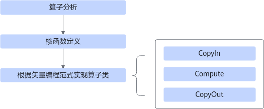
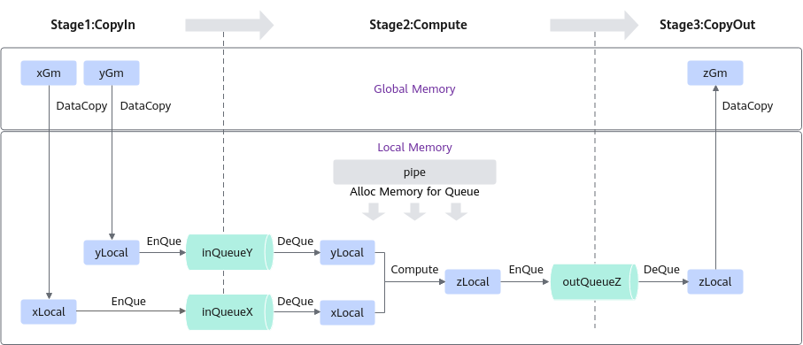

# 基础矢量算子-矢量编程-SIMD算子实现-算子实践参考-Ascend C算子开发-算子开发-CANN社区版8.5.0开发文档-昇腾社区

**页面ID:** atlas_ascendc_10_0033
**来源：** https://www.hiascend.com/document/detail/zh/CANNCommunityEdition/850/opdevg/Ascendcopdevg/atlas_ascendc_10_0033.html
---

# 基础矢量算子

基于Ascend C方式实现基础矢量算子核函数的流程如下图所示。

- 算子分析：分析算子的数学表达式、输入、输出以及计算逻辑的实现，明确需要调用的Ascend C接口。
- 核函数定义：定义Ascend C算子入口函数。
- 根据矢量编程范式实现算子类：完成核函数的内部实现，包括3个基本任务：CopyIn，Compute，CopyOut。

下文以输入为half数据类型且shape的最后一维为32Bytes对齐、在单核上运行的、一次完成计算的Add算子为例，对上述步骤进行详细介绍。本样例中介绍的算子完整代码请参见基础Add算子样例。

#### 算子分析

算子分析具体步骤如下：

1. 明确算子的数学表达式及计算逻辑。Add算子的数学表达式为：z = x + y计算逻辑是：Ascend C提供的矢量计算接口的操作元素都为LocalTensor，输入数据需要先从外部存储(Global Memory)搬运进片上存储(Unified Buffer)，然后使用计算接口完成两个输入参数相加，得到最终结果，再搬出到外部存储上。Ascend CAdd算子的计算逻辑如下图所示。图2算子计算逻辑
1. 明确输入和输出。Add算子有两个输入：x与y；输出为z。本样例中算子的输入支持的数据类型为half(float16)，算子输出的数据类型与输入的数据类型相同。算子输入支持的shape为(1，2048)，输出shape与输入shape相同。算子输入支持的format为：ND。
1. 确定核函数名称和参数。您可以自定义核函数名称，本样例中核函数命名为add_custom。根据对算子输入输出的分析，确定核函数有3个参数x，y，z；x，y为输入在Global Memory上的内存地址，z为输出在Global Memory上的内存地址。
1. 确定算子实现所需接口。实现涉及外部存储和内部存储间的数据搬运，查看Ascend CAPI参考中的数据搬运接口，需要使用DataCopy来实现数据搬运。本样例只涉及矢量计算的加法操作，查看Ascend CAPI参考中的矢量计算接口，初步分析可使用基础算术Add接口Add实现x+y。使用Queue队列管理计算中使用的Tensor数据结构，具体使用EnQue、DeQue等接口。

通过以上分析，得到Ascend CAdd算子的设计规格如下：

| 算子类型(OpType)                      | Add                    |       |           |        |
| ------------------------------------- | ---------------------- | ----- | --------- | ------ |
| 算子输入输出                          | name                   | shape | data type | format |
| x（输入）                             | (1, 2048)              | half  | ND        |        |
| y（输入）                             | (1, 2048)              | half  | ND        |        |
| z（输出）                             | (1, 2048)              | half  | ND        |        |
| 核函数名称                            | add_custom             |       |           |        |
| 使用的主要接口                        | DataCopy：数据搬移接口 |       |           |        |
| Add：矢量基础算术接口                 |                        |       |           |        |
| EnQue、DeQue等接口：Queue队列管理接口 |                        |       |           |        |
| 算子实现文件名称                      | add_custom.cpp         |       |           |        |

#### 核函数定义

根据核函数中介绍的规则进行核函数的定义。

1. 函数原型定义本样例中，函数名为add_custom（核函数名称可自定义），根据算子分析中对算子输入输出的分析，确定有3个参数x，y，z，其中x，y为输入内存，z为输出内存。根据核函数的规则介绍，函数原型定义如下所示：使用__global__函数类型限定符标识它是一个核函数，可以被<<<>>>调用；使用__aicore__函数类型限定符标识该核函数在设备端aicore上执行；为方便起见，统一使用GM_ADDR宏修饰入参，GM_ADDR宏定义请参考核函数。123extern"C"__global____aicore__voidadd_custom(GM_ADDRx,GM_ADDRy,GM_ADDRz){}
1. 调用算子类的Init和Process函数。算子类的Init函数，完成内存初始化相关工作，Process函数完成算子实现的核心逻辑，具体介绍参见算子类实现。123456extern"C"__global____aicore__voidadd_custom(GM_ADDRx,GM_ADDRy,GM_ADDRz){KernelAddop;op.Init(x,y,z);op.Process();}
1. 对核函数的调用进行封装，得到add_custom_do函数，便于主程序调用。#ifndef ASCENDC_CPU_DEBUG表示该封装函数仅在编译运行NPU侧的算子时会用到，编译运行CPU侧的算子时，可以直接调用add_custom函数。根据核函数定义和调用章节，调用核函数时，除了需要传入参数x，y，z，还需要传入blockDim（核函数执行的核数），l2ctrl（保留参数，设置为nullptr），stream（应用程序中维护异步操作执行顺序的stream）来规定核函数的执行配置。1234567#ifndef ASCENDC_CPU_DEBUG// call of kernel functionvoidadd_custom_do(uint32_tblockDim,void*l2ctrl,void*stream,uint8_t*x,uint8_t*y,uint8_t*z){add_custom<<<blockDim,l2ctrl,stream>>>(x,y,z);}#endif

#### 算子类实现

根据上一节介绍，核函数中会调用算子类的Init和Process函数，本节具体讲解如何基于编程范式实现算子类。

根据矢量编程范式对Add算子的实现流程进行设计的思路如下，矢量编程范式请参考矢量编程范式，设计完成后得到的Add算子实现流程图参见图3 Add算子实现流程：

- Add算子的实现流程分为3个基本任务：CopyIn，Compute，CopyOut。CopyIn任务负责将Global Memory上的输入Tensor xGm和yGm搬运至Local Memory，分别存储在xLocal，yLocal，Compute任务负责对xLocal，yLocal执行加法操作，计算结果存储在zLocal中，CopyOut任务负责将输出数据从zLocal搬运至Global Memory上的输出Tensor zGm中。
- CopyIn，Compute任务间通过VECIN队列inQueueX，inQueueY进行同步，Compute，CopyOut任务间通过VECOUT队列outQueueZ进行同步。
- 任务间交互使用到的内存、临时变量的内存统一使用Pipe内存管理对象进行管理。

算子类中主要实现上述流程，包含对外开放的初始化Init函数和核心处理函数Process，Process函数中会对上图中的三个基本任务进行调用；同时包括一些算子实现中会用到的私有成员，比如上图中的GlobalTensor(xGm、yGm、zGm)和VECIN、VECOUT队列等。KernelAdd算子类具体成员如下：

| 12345678910111213141516171819202122232425 | classKernelAdd{public:__aicore__inlineKernelAdd(){}// 初始化函数，完成内存初始化相关操作__aicore__inlinevoidInit(GM_ADDRx,GM_ADDRy,GM_ADDRz){}// 核心处理函数，实现算子逻辑，调用私有成员函数CopyIn、Compute、CopyOut完成矢量算子的三级流水操作__aicore__inlinevoidProcess(){}private:// 搬入函数，完成CopyIn阶段的处理，被核心Process函数调用__aicore__inlinevoidCopyIn(){}// 计算函数，完成Compute阶段的处理，被核心Process函数调用__aicore__inlinevoidCompute(){}// 搬出函数，完成CopyOut阶段的处理，被核心Process函数调用__aicore__inlinevoidCopyOut(){}private:AscendC:TPipepipe;// Pipe内存管理对象AscendC:TQue<AscendC:TPosition:VECIN,1>inQueueX;// 输入数据Queue队列管理对象，TPosition为VECINAscendC:TQue<AscendC:TPosition:VECIN,1>inQueueY;// 输入数据Queue队列管理对象，TPosition为VECINAscendC:TQue<AscendC:TPosition:VECOUT,1>outQueueZ;// 输出数据Queue队列管理对象，TPosition为VECOUTAscendC:GlobalTensor<half>xGm;// 管理输入输出Global Memory内存地址的对象，其中xGm, yGm为输入，zGm为输出AscendC:GlobalTensor<half>yGm;AscendC:GlobalTensor<half>zGm;}; |
| ----------------------------------------- | --------------------------------------------------------------------------------------------------------------------------------------------------------------------------------------------------------------------------------------------------------------------------------------------------------------------------------------------------------------------------------------------------------------------------------------------------------------------------------------------------------------------------------------------------------------------------------------------------------------------------------------------------------------------------------------------------------------------------------------------------------------------------------------------------------------------------------------------------------------------------------------------------------------------------------------------------------------------------------------------------------------------------------------------------------------------------- |

初始化函数主要完成以下内容：

- 设置输入输出Global Tensor的Global Memory内存地址。本样例中的分配方案是：数据整体长度TOTAL_LENGTH为1 * 2048，使用GlobalTensor类的SetGlobalBuffer接口设定该核上Global Memory的起始地址以及长度。1xGm.SetGlobalBuffer((__gm__half*)x,TOTAL_LENGTH);

- 通过Pipe内存管理对象为输入输出Queue分配内存。比如，为输入x的Queue分配内存，可以通过如下代码段实现：1pipe.InitBuffer(inQueueX,1,TOTAL_LENGTH*sizeof(half))

具体的初始化函数代码如下：

| 12345678910111213 | constexprint32_tTOTAL_LENGTH=1*2048;// 数据总长__aicore__inlinevoidInit(GM_ADDRx,GM_ADDRy,GM_ADDRz){// 设置Global Memory的起始地址以及长度xGm.SetGlobalBuffer((__gm__half*)x,TOTAL_LENGTH);yGm.SetGlobalBuffer((__gm__half*)y,TOTAL_LENGTH);zGm.SetGlobalBuffer((__gm__half*)z,TOTAL_LENGTH);// 通过Pipe内存管理对象为输入输出Queue分配内存pipe.InitBuffer(inQueueX,1,TOTAL_LENGTH*sizeof(half));pipe.InitBuffer(inQueueY,1,TOTAL_LENGTH*sizeof(half));pipe.InitBuffer(outQueueZ,1,TOTAL_LENGTH*sizeof(half));} |
| ----------------- | --------------------------------------------------------------------------------------------------------------------------------------------------------------------------------------------------------------------------------------------------------------------------------------------------------------------------------------------------------------------------------------------------------------------------------------------------------------------------------------------------------------- |

基于矢量编程范式，将核函数的实现分为3个基本任务：CopyIn，Compute，CopyOut。Process函数中通过如下方式调用这三个函数。

| 123456 | __aicore__inlinevoidProcess(){CopyIn();Compute();CopyOut();} |
| ------ | ------------------------------------------------------------ |

根据编程范式上面的算法分析，将整个计算拆分成三个Stage，用户单独编写每个Stage的代码，三阶段流程示意图参见图3，具体流程如下：

1. Stage1：CopyIn函数实现。使用DataCopy接口将GlobalTensor数据拷贝到LocalTensor。使用EnQue将LocalTensor放入VECIN的Queue中。123456789101112__aicore__inlinevoidCopyIn(){// 从Que中为LocalTensor分配内存AscendC:LocalTensor<half>xLocal=inQueueX.AllocTensor<half>();AscendC:LocalTensor<half>yLocal=inQueueY.AllocTensor<half>();// 将GlobalTensor数据拷贝到LocalTensorAscendC:DataCopy(xLocal,xGm,TOTAL_LENGTH);AscendC:DataCopy(yLocal,yGm,TOTAL_LENGTH);// LocalTensor放入VECIN的Queue中inQueueX.EnQue(xLocal);inQueueY.EnQue(yLocal);}
1. Stage2：Compute函数实现。使用DeQue从VECIN中取出LocalTensor。使用Ascend C接口Add完成矢量计算。使用EnQue将计算结果LocalTensor放入到VECOUT的Queue中。使用FreeTensor释放不再使用的LocalTensor。1234567891011121314__aicore__inlinevoidCompute(){// 将Input从VECIN的Queue中取出AscendC:LocalTensor<half>xLocal=inQueueX.DeQue<half>();AscendC:LocalTensor<half>yLocal=inQueueY.DeQue<half>();AscendC:LocalTensor<half>zLocal=outQueueZ.AllocTensor<half>();// 调用Add算子进行计算AscendC:Add(zLocal,xLocal,yLocal,TOTAL_LENGTH);// 将计算结果LocalTensor放入到VECOUT的Queue中outQueueZ.EnQue<half>(zLocal);// 释放LocalTensorinQueueX.FreeTensor(xLocal);inQueueY.FreeTensor(yLocal);}
1. Stage3：CopyOut函数实现。使用DeQue接口从VECOUT的Queue中取出LocalTensor。使用DataCopy接口将LocalTensor拷贝到GlobalTensor上。使用FreeTensor将不再使用的LocalTensor进行回收。123456789__aicore__inlinevoidCopyOut(){// 将计算结果从VECOUT的Queue中取出AscendC:LocalTensor<half>zLocal=outQueueZ.DeQue<half>();// 将计算结果从LocalTensor数据拷贝到GlobalTensorAscendC:DataCopy(zGm,zLocal,TOTAL_LENGTH);// 释放LocalTensoroutQueueZ.FreeTensor(zLocal);}
