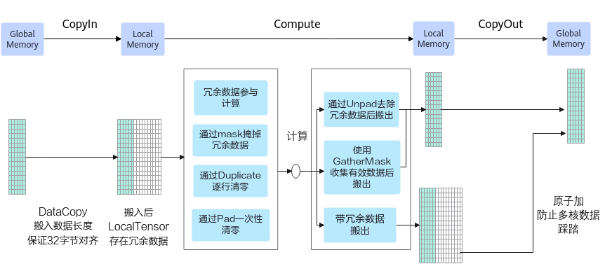

# 非对齐场景-矢量编程-SIMD算子实现-算子实践参考-Ascend C算子开发-算子开发-CANN社区版8.5.0开发文档-昇腾社区

**页面ID:** atlas_ascendc_10_0034
**来源：** https://www.hiascend.com/document/detail/zh/CANNCommunityEdition/850/opdevg/Ascendcopdevg/atlas_ascendc_10_0034.html
---

# 非对齐场景

本节介绍非32字节对齐数据的更多处理方式，包括数据搬入、计算和搬出的处理。用户在实际算子开发中，可以参考如下方案介绍和算子样例灵活地处理非对齐场景。

#### 数据搬运和Vector计算的对齐要求

进行数据搬运和Vector计算时，对于搬运的数据长度和操作数的起始地址有如下的对齐要求：

- 使用DataCopy接口进行数据搬运，搬运的数据长度和操作数的起始地址（UB上）必须保证32字节对齐。
- 通常情况下，进行Vector计算时，操作数的起始地址必须保证32字节对齐。具体对齐要求需要查阅对应的API参考进行确认。

下文描述中的Global指Global Memory上的tensor，Local指Local Memory上的tensor。

下面是一些非对齐搬运和计算的例子。

- 非对齐搬入当需要从Global拷贝11个half数值到Local时，为保证搬运的数据长度32字节对齐，使用DataCopy拷贝16个half(32B)数据到Local上，Local[11]~Local[15]被写成无效数据-1。图1非对齐搬入
- 非对齐搬出当需要从Local拷贝11个half数值到Global时，为保证搬运的数据长度32字节对齐，使用DataCopy拷贝16个half(32B)数据到Global上，Global[11]~Global[15]被写成无效数据-1。图2非对齐搬出
- 矢量计算起始地址非32字节对齐的错误示例矢量计算时需要保证起始地址32字节对齐，如下的示例中，从Local1[7]，即LocalTensor的第8个数开始计算，起始地址不满足32字节对齐，是错误示例。图3矢量计算起始地址非32字节对齐的错误示例

#### 非对齐处理方案

DataCopyPad接口提供非对齐搬运的功能，如果基于该接口支持的产品开发算子（参见产品支持情况），则可以直接使用该接口解决非对齐场景下的搬运问题。使用DataCopyPad的完整示例请参考DataCopyPad样例（工程化算子开发）和DataCopyPad样例（kernel直调）。

部分型号不支持DataCopyPad接口，需要参考如下的方案处理。

由于搬入时搬运的数据长度必须保证32字节对齐。数据长度非对齐的情况下，从Global逐行搬运Tensor数据到Local中，Local中每行都存在冗余数据。

- 冗余数据参与计算。一般用于elewise计算场景。
- 通过mask参数掩掉冗余数据。一般用于轴归约计算等场景。
- 通过Duplicate逐行清零。计算前，针对每一行数据，调用基础API Duplicate对冗余数据位置填充0值。
- 通过Pad一次性清零。计算前，针对多行数据，可以采用高阶API Pad接口对冗余数据一次性清零。

- 使用UnPad接口去除冗余数据后搬出。待搬出的有效数据总长度满足32字节对齐时，可使用高阶API UnPad接口去除冗余数据并完整搬出。
- 使用GatherMask收集有效数据后搬出。待搬出的有效数据总长度大于等于32字节时，可使用GatherMask重新收集有效数据，保证搬出的有效数据起始地址和数据长度32字节对齐。
- 带冗余数据搬出。注意多核处理时开启原子加（使用SetAtomicAdd接口），防止数据踩踏。

- 冗余数据参与计算如下图所示，对前11个half数据进行Abs计算，冗余数据可以参与计算，不影响最终结果。步骤为：使用DataCopy从GLobal搬运16个half数据到Local1中，包含冗余数据-11~-15；直接使用Abs做整块计算，不用计算尾块大小，冗余数据参与计算。图5冗余数据参与计算
- 使用mask掩掉冗余数据如下图所示，假设输入数据的shape为16 * 4，将输入数据搬入到UB后每行数据前4个half数据为有效数据，其余为冗余数据。为只对前4个half数据进行ReduceMin计算，可以通过设置mask参数的方法掩掉冗余数据。针对每行数据的处理步骤为：使用DataCopy从Global搬运16个half数据到Local1中；对归约计算的目的操作数Local2清零，如使用Duplicate等；进行归约操作，将ReduceMin的mask模式设置为前4个数据有效，从而掩掉冗余数据。图6使用mask掩掉脏数据
- 通过Duplicate逐行清零。如下图所示，对于搬入后的非对齐数据，逐行进行Duplicate清零处理，步骤为：使用DataCopy从Global搬运16个half数据到Local中；使用基础API Duplicate，按照如下方式设置mask值，控制仅后5个元素位置有效，将冗余数据填充为0。12uint64_tmask0=((uint64_t)1<<16)-((uint64_t)1<<11);uint64_tmask[2]={mask0,0};图7通过Duplicate逐行清零

- 通过Pad一次性清零。如下图所示，假设输入数据的shape为16 * 6，搬入Local后大小为16 * 16，每行都包含冗余数据，逐行清零性能较差，可以使用Pad一次性清零，步骤为：将16 * 6的数据从GM上逐行搬入UB后，每行有6个有效数据；使用Pad接口将冗余数据位置填充为0。（对应Pad接口使用场景为：tensor的width已32B对齐，但是有部分冗余数据）。图8通过Pad一次性清零
- 使用UnPad接口去除冗余数据后搬出。如下图所示，Local内存大小为16*16，每行中只有前6个数为有效数据，要搬出的有效数据16 * 6满足32B对齐，可以使用UnPad接口去除冗余数据并完整搬出。步骤如下：使用UnPad高阶API去除冗余值；使用DataCopy搬运出连续的16 * 6个half数据到Global中。图9使用UnPad接口去除冗余数据后搬出
- 使用GatherMask收集有效数据后搬出。如下图所示，为搬出19个half数据到Global中，有16-18这3个数据的搬运无法满足对齐要求，使用GatherMask对有效数据进行重新收集，收集3-18这16个数据并搬出。步骤如下：完整拷贝前16个half(32B)数据到Global中；使用GatherMask接口，将Local1[3]~[18]的数Gather到Local2中，Local2从对齐地址开始；从Local2中搬运Gather的数据（32B整数倍）到Global中。图10使用GatherMask收集有效数据后搬出。
- 带冗余数据搬出如下图所示，有4个核参与计算，每个核拷贝出4个数，每个核上拷贝的数据长度不满足32字节对齐，采用将冗余数据一起搬出的方式，步骤如下：将目标Global完整清零，可以通过在host清零或者在kernel侧用UB覆盖的方式处理；将本核内的Local数据，除了要搬出的4个有效数据，其余冗余部分清零（使用Duplicate接口）；使用原子累加的方式拷贝到Global，原子累加结合冗余数据清零，确保不会出现数据踩踏。图11带冗余数据搬出

#### 样例介绍

- 样例一：冗余数据参与计算+使用GatherMask收集有效数据后搬出。本样例中展示了shape为128 * 18的tensor进行Abs计算的算子实现。针对每行数据的处理方案如下：搬入后，每行数据的后14个数为冗余数据。Abs接口入参BLOCKLEN_CEIL为32个数，是18个数进行32字节对齐后的结果，有14个冗余数据参与计算。1AscendC:Abs(outputLocal,inputLocal,BLOCKLEN_CEIL);// main calculation计算完成后，通过GatherMask的bufPattern入参控制收集18个数中的后16个数。12345678uint16_ttmpValue=0;AscendC:Duplicate<uint16_t>(bufPattern,tmpValue,16);bufPattern.SetValue(0,0b1111111111111100);// select the last 14 elements of the first 16 positionsbufPattern.SetValue(1,0b0000000000000011);// select the first 2 elements of the next 16 positionsuint32_tmask=32;uint64_trsvdCnt=0;AscendC:LocalTensor<half>tailLocal=outQueueTail.AllocTensor<half>();AscendC:GatherMask(tailLocal,outputLocal,bufPattern,true,mask,{1,1,8,8},rsvdCnt);首先使用DataCopy搬运前16个数，然后搬运后16个数，中间的14个数存在重复搬运。注意：因为DataCopy的目的地址存在重叠所以需要通过PipeBarrier添加流水同步。1234567uint32_tcopyLenMain=TILE_LENGTH*sizeof(half)/32*32/sizeof(half);uint32_toffsetMain=progress*TILE_LENGTH;AscendC:DataCopy(dstGlobal[offsetMain],outputLocal,copyLenMain);AscendC:PipeBarrier<PIPE_MTE3>();uint32_ttailLen=32/sizeof(half);uint32_toffsetTail=offsetMain+(TILE_LENGTH-tailLen);AscendC:DataCopy(dstGlobal[offsetTail],tailLocal,tailLen);搬入时要保证32字节对齐，所以要将输入的最后一行补齐到32字节对齐，防止访问非法数据，main.cpp中对GM上输入的长度的定义如下：12size_tinputByteSize=2318*sizeof(int16_t);// 2318 = 2304 + 32 - 18size_toutputByteSize=2304*sizeof(int16_t);

- 样例二：通过Duplicate逐行清零+带冗余数据搬出。本样例中展示了shape为64 * 11的tensor进行Abs计算的算子实现。共使用4个核，每个核处理16 * 11个数据。搬入后，每行数据的后5个数为冗余数据。通过Duplicate接口对每行数据中的后5个数据进行清零。1234567// mask mode controls only the last 5 elements doing Duplicateuint64_tmask0=(1ul<<16)-(1ul<<BLOCK_ELEMENT_NUM);uint64_tmask[2]={mask0,0};for(int32_ti=0;i<BLOCK_GROUP_NUM;i++){AscendC:Duplicate<half>(inputLocal[i*BLOCKLEN_CEIL],0,mask,1,1,1);// clear dummy data on inputLocal}AscendC:Abs(outputLocal,inputLocal,BLOCKLEN_CEIL*BLOCK_GROUP_NUM);搬出时，带冗余数据搬出并开启原子累加，BLOCKLEN_CEIL中包含冗余数据。12345AscendC:SetAtomicAdd<half>();for(int32_ti=0;i<BLOCK_GROUP_NUM;i++){AscendC:DataCopy<half>(dstGlobal[i*BLOCK_ELEMENT_NUM],outputLocal[i*BLOCKLEN_CEIL],BLOCKLEN_CEIL);}AscendC:SetAtomicNone();所以在初始化时，需要对GM数据进行清零，清零代码如下，示例中多个核都调用Fill接口进行清零，需要调用SyncAll进行核间同步。1234567AscendC:Fill<half>(dstGlobal,blockLength,0);pipe.InitBuffer(inQueue,BUFFER_NUM,BLOCK_GROUP_NUM*BLOCKLEN_CEIL*sizeof(half));pipe.InitBuffer(outQueue,BUFFER_NUM,BLOCK_GROUP_NUM*BLOCKLEN_CEIL*sizeof(half));pipe.InitBuffer(syncLocalTbuf,USE_CORE_NUM*DEFAULT_SYNCALL_NEED_SIZE*sizeof(int32_t));AscendC:LocalTensor<int32_t>SyncLocal=syncLocalTbuf.Get<int32_t>();AscendC:SyncAll(syncGlobal,SyncLocal,USE_CORE_NUM);搬入时要保证32字节对齐，需要将输入的最后一行补齐到32字节对齐，防止访问非法数据；搬出时带冗余数据搬出，输出的最后一行也需要补齐到32字节对齐。main.cpp中对GM上输入输出的长度的定义如下：1234// copy in borrow the next (BLOCKLEN_CEIL - BLOCK_ELEMENT_NUM) elements of srcGMsize_tinputByteSize=709*sizeof(int16_t);// copy out atomic add extra (BLOCKLEN_CEIL - BLOCK_ELEMENT_NUM) zeros to dstGMsize_toutputByteSize=709*sizeof(int16_t);
- 样例三：冗余数据参与计算+使用UnPad接口去除冗余数据后搬出。本样例中展示了shape为2048 * 14的tensor进行Abs计算的算子实现。共使用8个核，每个核处理256 * 14个数据。搬入后，每行数据的后2个数为冗余数据。Abs接口入参BLOCK_GROUP_NUM * BLOCKLEN_CEIL为连续的16行数据，每行16个数，每行的冗余数据参与计算。1AscendC:Abs(inputLocal,inputLocal,BLOCK_GROUP_NUM*BLOCKLEN_CEIL);// main calculation计算后，使用UnPad接口去除冗余数据后再搬出，通过unPadParams.rightPad参数控制去除每行最后的2个冗余数据。12unPadParams.rightPad=BLOCKLEN_CEIL-BLOCK_ELEMENT_NUM;// delete 2 dummy half each rowAscendC:UnPad<half>(outputLocal,inputLocal,unPadParams,this->tiling);注意：UnPad接口需要传入tiling参数。abs_unpad_tiling.cpp中关键计算过程如下：123AscendC:GetUnPadMaxMinTmpSize(*ascendcPlatform,srcShape,sizeof(int16_t),tmpMaxSize,tmpMinSize);optiling:UnPadTilingtilingData;AscendC:UnPadTilingFunc(srcShape,tmpMaxSize,sizeof(int16_t),tilingData);main.cpp中tiling参数需要通过核函数的入参传入到kernel侧，供UnPad高阶API使用。1ACLRT_LAUNCH_KERNEL(abs_unpad_custom)(blockDim,stream,xDevice,zDevice,workspaceDevice,tilingDevice);搬入时要保证32字节对齐，所以要将输入的最后一行补齐到32字节对齐，防止访问非法数据，main.cpp中对GM上输入的长度的定义如下。123456789// 28674 is TOTAL_LENGTH + (BLOCKLEN_CEIL - BLOCK_ELEMENT_NUM)// 28672 is TOTAL_LENGTH// copy in borrow the next (BLOCKLEN_CEIL - BLOCK_ELEMENT_NUM) elements of srcGMuint32_toriLength=28672;uint32_tcolNum=14;uint32_tmaxColNum=32/sizeof(uint16_t);uint32_tpadLength=oriLength+maxColNum-colNum;size_tinputByteSize=padLength*sizeof(int16_t);size_toutputByteSize=oriLength*sizeof(int16_t);
- 示例四：通过Pad一次性清零+带冗余数据搬出。本样例中展示了shape为2048 * 7的tensor进行Abs计算的算子实现。共使用8个核，每个核处理256 * 7个数据。搬入后，每行数据的后9个数为冗余数据。每个核上通过Pad接口将256 * 9的冗余数据块整体清零后参与Abs计算。123AscendC:PadParamspadParams={0,BLOCKLEN_CEIL-BLOCK_ELEMENT_NUM,0};AscendC:Pad(outputLocal,inputLocal,padParams,this->tiling);AscendC:Abs(outputLocal,outputLocal,BLOCK_GROUP_NUM*BLOCKLEN_CEIL);// main calculation计算后带冗余数据搬出的代码解释和样例二一致。注意：Pad接口需要传入tiling参数。abs_pad_tiling.cpp中关键计算过程如下：123AscendC:GetPadMaxMinTmpSize(srcShape,sizeof(int16_t),tmpMaxSize,tmpMinSize);optiling:PadTilingtilingData;AscendC:PadTilingFunc(srcShape,oriSrcShape,tmpMaxSize,sizeof(int16_t),tilingData);main.cpp中tiling参数需要通过核函数的入参传入到kernel侧，供Pad高阶API使用。1ACLRT_LAUNCH_KERNEL(abs_pad_custom)(blockDim,stream,xDevice,zDevice,workspaceDevice,tilingDevice);搬入时要保证32字节对齐，需要将输入的最后一行补齐到32字节对齐，防止访问非法数据；搬出时带冗余数据搬出，输出的最后一行也需要补齐到32字节对齐。main.cpp中对GM上输入输出的长度的定义如下：12345678// 14336 is the length of input datauint32_toriLength=14336;// we must allocate more space to prevent invalid address accessuint32_tpadLength=oriLength+shapePad[1]-shapeUsed[1];size_tinputByteSize=padLength*sizeof(int16_t);size_toutputByteSize=padLength*sizeof(int16_t);// however, original length must be used when output to filesize_toutputFileSize=oriLength*sizeof(int16_t);
- 样例五：使用mask掩掉冗余数据+带冗余数据搬出。本样例中展示了shape为16 * 4的tensor每行数据进行ReduceMin计算的算子实现。共使用4个核，每个核处理4 * 4个数据。搬入后，每行数据的后12个数为冗余数据。通过ReduceMin的入参Mask控制只有前4个数参与计算。12345678uint64_tMask0=((uint64_t)1<<BLOCK_ELEMENT_NUM)-1;// mask mode controls only the first 4 elements do ReduceMin calculationuint64_tMask[2]={Mask0,0};// main calculationfor(inti=0;i<BLOCK_GROUP_NUM;i++){AscendC:ReduceMin<half>(outputLocal[i*BLOCKLEN_CEIL],inputLocal[i*BLOCKLEN_CEIL],workLocal,Mask,1,8,false);}outQueue.EnQue<half>(outputLocal);inQueue.FreeTensor(inputLocal);计算后带冗余数据搬出的代码解释和样例二一致。搬入时要保证32字节对齐，需要将输入的最后一行补齐到32字节对齐，防止访问非法数据；搬出时带冗余数据搬出，输出的最后一行也需要补齐到32字节对齐。main.cpp中对GM上输入输出的长度的定义如下：1234// copy in borrow the next (BLOCKLEN_CEIL - BLOCK_ELEMENT_NUM) elements of srcGMsize_tinputByteSize=76*sizeof(int16_t);// copy out atomic add extra (BLOCKLEN_CEIL - BLOCK_ELEMENT_NUM) zeros to dstGMsize_toutputByteSize=76*sizeof(int16_t);
