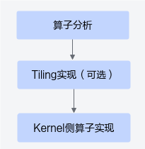
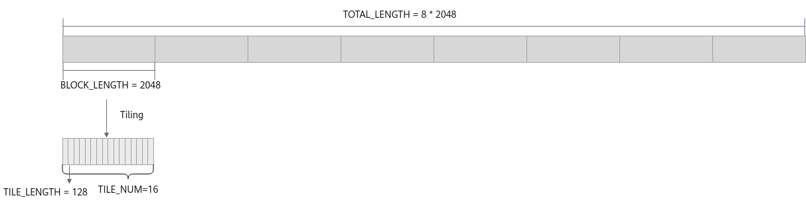

# 多核Tiling-多核&Tiling切分-矢量编程-SIMD算子实现-算子实践参考-Ascend C算子开发-算子开发-CANN社区版8.5.0开发文档-昇腾社区

**页面ID:** atlas_ascendc_10_0035
**来源：** https://www.hiascend.com/document/detail/zh/CANNCommunityEdition/850/opdevg/Ascendcopdevg/atlas_ascendc_10_0035.html
---

# 多核Tiling

基于Ascend C方式实现带有Tiling的算子的开发流程如下图所示。

#### 算子分析

本样例为输入数据在核间均分、核内均分场景。本样例的Tiling策略为：数据整体长度TOTAL_LENGTH为8 * 2048，数据平均分配到8个核上运行，每个核上计算的数据长度BLOCK_LENGTH为2048，将单核上的数据切分成16块（此处切分成16块仅用来作为Tiling的样例，并不代表性能最佳，仅供参考），每块数据的长度TILE_LENGTH为128。数据切分示意如下图所示：

| 算子类型(OpType)                      | Add                    |       |           |        |
| ------------------------------------- | ---------------------- | ----- | --------- | ------ |
| 算子输入输出                          | name                   | shape | data type | format |
| x（输入）                             | (8, 2048)              | half  | ND        |        |
| y（输入）                             | (8, 2048)              | half  | ND        |        |
| z（输出）                             | (8, 2048)              | half  | ND        |        |
| 核函数名称                            | add_custom             |       |           |        |
| 使用的主要接口                        | DataCopy：数据搬移接口 |       |           |        |
| Add：矢量基础算术接口                 |                        |       |           |        |
| EnQue、DeQue等接口：Queue队列管理接口 |                        |       |           |        |
| 算子实现文件名称                      | add_custom.cpp         |       |           |        |

#### Tiling实现

前述场景中算子的输入和输出均为固定shape，然而在实际的算子开发场景中，这些信息是支持动态变化的，场景会更加灵活和复杂。动态shape场景下，输入的shape是未知的。一些与输入shape相关的变量（比如每次搬运的块大小等），需要通过Tiling计算出来，然后传递到kernel侧，kernel侧使用该参数进行后续的计算。

具体实现方式为：分析设计Tiling参数、定义Tiling结构体，在Host侧通过上下文获取输入输出的shape信息，根据shape信息，计算Tiling参数并设置到对应的Tiling结构体中；通过核函数入口参数将Tiling信息传入核函数，在核函数内通过解析Tiling结构体，获取并使用相关参数来实现核函数内部逻辑，详细介绍请参考Host侧tiling实现。本节将以上述分析中的切分策略为例，说明如何实现Tiling。

基于本节的切分策略，Tiling需要定义如下参数：

- blockLength：每个核的计算数据长度；
- tileNum：每个核需要计算的数据块个数；
- tileLength：每个核内每个数据块的长度。

根据确定的Tiling参数，在算子TilingData结构定义头文件中，使用C++语法定义TilingData结构体，代码如下。该头文件命名为“算子名称_tiling.h”。本章节中的算子名称为add_custom，对应头文件命名应为add_custom_tiling.h。

| 12345 | structAddCustomTilingData{uint32_tblockLength;uint32_ttileNum;uint32_ttileLength;} |
| ----- | ---------------------------------------------------------------------------------- |

| 12345678910111213141516 | #include"add_custom_tiling.h"constexprint32_tCORE_NUM=8;// 使用的核数constexprint32_tTILE_NUM=16;// 核内切分数量voidGenerateTilingData(uint8_t*tilingBuf){uint32_ttotalLength;// 此处省略如何获取数据总长TOTAL_LENGTH，可以根据具体情况实现。本章节仅介绍Tiling相关内容。AddCustomTilingData*tiling=reinterpret_cast<AddCustomTilingData*>(tilingBuf);uint32_tblockLength=TOTAL_LENGTH/CORE_NUM;uint32_ttileNum=TILE_NUM;uint32_ttileLength=blockLength/tileNum;tiling->blockLength=blockLength;tiling->tileNum=tileNum;tiling->tileLength=tileLength;} |
| ----------------------- | ------------------------------------------------------------------------------------------------------------------------------------------------------------------------------------------------------------------------------------------------------------------------------------------------------------------------------------------------------------------------------------------------------------------------------------------------------------------------------------------------------------------------------------------------------- |

最后，在Host侧调用程序中，调用上述Tiling参数计算函数，计算出相关参数，然后传递到Kernel侧核函数。

| 12345678910111213141516171819202122232425 | externvoidGenerateTilingData(uint8_t*tilingBuf);constexprint32_tCORE_NUM=8;...uint8_t*tiling=nullptr;size_ttilingSize=sizeof(AddCustomTilingData);#ifdef ASCENDC_CPU_DEBUGtiling=(uint8_t*)AscendC:GmAlloc(tilingSize);// CPU Debug模式...#else...CHECK_ACL(aclrtMallocHost((void**)(&tiling),tilingSize));// NPU模式...#endifGenerateTilingData(tiling);// 调用tiling参数计算函数....#ifdef ASCENDC_CPU_DEBUG...ICPU_RUN_KF(add_custom,CORE_NUM,x,y,z,*reinterpret_cast<AddCustomTilingData*>(tiling));// CPU Debug模式下核函数调用....#else....ACLRT_LAUNCH_KERNEL(add_custom)（CORE_NUM,stream,xDevice,yDevice,zDevice,// NPU模式下核函数调用reinterpret_cast<AddCustomTilingData*>(tiling)）；.... |
| ----------------------------------------- | ------------------------------------------------------------------------------------------------------------------------------------------------------------------------------------------------------------------------------------------------------------------------------------------------------------------------------------------------------------------------------------------------------------------------------------------------------------------------------------------------------------------------------------------------------------------------------------------------------------------------------------------------------------------------------------------------------ |

#### 算子类实现

Kernel侧算子实现仍遵循矢量算子核函数实现流程，接下来重点介绍本场景中算子类实现的不同点。

- 设置输入输出Global Tensor的Global Memory内存地址。由于本样例中将数据分配到了多个核上进行处理，每个核处理不同的数据，因此不同核要处理的数据在Global Memory上的地址不同，在初始化函数Init中，需要获取单核所需处理的输入输出在Global Memory上的内存偏移地址，并将该偏移地址设置到GlobalTensor中。以获取输入x在Global Memory上的内存偏移地址为例，数据整体长度TOTAL_LENGTH为8 * 2048，平均分配到8个核上运行，每个核上处理的数据长度blockLength为2048，调用GetBlockIdx接口获取当前核的index，x + blockLength * GetBlockIdx()即为单核处理程序中x在Global Memory上的内存偏移地址，获取偏移地址后，使用GlobalTensor类的SetGlobalBuffer接口设定该核上Global Memory的起始地址以及长度，具体示意图请参考图3。代码如下所示：1xGm.SetGlobalBuffer((__gm__half*)x+this->blockLength*AscendC:GetBlockIdx(),this->blockLength);图3多核并行处理示意图
- 通过Pipe内存管理对象为输入输出Queue分配内存。对于单核上的处理数据，可以进行数据切块(Tiling)，在本示例中，仅作为参考，将单核上的数据（2048个数）切分成16块（并不意味着16块就是性能最优），每块tileLength(128)个数据。数据切分示意图如图4所示。图4单核数据切分示意图与基础矢量算子相比，在通过Pipe内存管理对象为输入输出Queue分配内存时，需使用单核内每个数据块的长度tileLength作为分配内存的长度。比如，为输入x的Queue分配内存，可以通过如下代码段实现，Pipe为inQueueX分配了一块大小为tileLength * sizeof(half)个字节的内存块，每个内存块能容纳tileLength(128)个half类型数据。1pipe.InitBuffer(inQueueX,1,this->tileLength*sizeof(half))

| 1234567891011121314 | __aicore__inlinevoidInit(GM_ADDRx,GM_ADDRy,GM_ADDRz,AddCustomTilingDatatiling){this->blockLength=tiling.blockLength;this->tileNum=tiling.tileNum;this->tileLength=tiling.tileLength;// 计算每个核上的地址偏移xGm.SetGlobalBuffer((__gm__half*)x+this->blockLength*AscendC:GetBlockIdx(),this->blockLength);yGm.SetGlobalBuffer((__gm__half*)y+this->blockLength*AscendC:GetBlockIdx(),this->blockLength);zGm.SetGlobalBuffer((__gm__half*)z+this->blockLength*AscendC:GetBlockIdx(),this->blockLength);// pipe alloc memory to queue, the unit is Bytespipe.InitBuffer(inQueueX,1,this->tileLength*sizeof(half));pipe.InitBuffer(inQueueY,1,this->tileLength*sizeof(half));pipe.InitBuffer(outQueueZ,1,this->tileLength*sizeof(half));} |
| ------------------- | --------------------------------------------------------------------------------------------------------------------------------------------------------------------------------------------------------------------------------------------------------------------------------------------------------------------------------------------------------------------------------------------------------------------------------------------------------------------------------------------------------------------------------------------------------------------------------------------------------------------------------------------------------------------------------------------------------------------------------------- |

| 12345678910 | __aicore__inlinevoidProcess(){int32_tloopCount=this->tileNum;// tiling strategy, pipeline parallelfor(int32_ti=0;i<loopCount;i++){CopyIn(i);Compute(i);CopyOut(i);}} |
| ----------- | -------------------------------------------------------------------------------------------------------------------------------------------------------------------- |

对应的，每个核内搬入、搬出每个数据块时，需定位到每个数据块所在Global Memory上的内存偏移地址，因此在CopyIn和CopyOut函数内部使用DataCopy接口时，需增加每个数据块的地址偏移。Compute函数没有变化，与基础矢量算子相同。

| 12345678 | __aicore__inlinevoidCopyIn(int32_tprogress){...// copy progress_th tile from global tensor to local tensorAscendC:DataCopy(xLocal,xGm[progress*this->tileLength],this->tileLength);AscendC:DataCopy(yLocal,yGm[progress*this->tileLength],this->tileLength);...} |
| -------- | ---------------------------------------------------------------------------------------------------------------------------------------------------------------------------------------------------------------------------------------------------------------- |

| 1234567 | __aicore__inlinevoidCopyOut(int32_tprogress){...// copy progress_th tile from local tensor to global tensorAscendC:DataCopy(zGm[progress*this->tileLength],zLocal,this->tileLength);...} |
| ------- | ---------------------------------------------------------------------------------------------------------------------------------------------------------------------------------------- |
