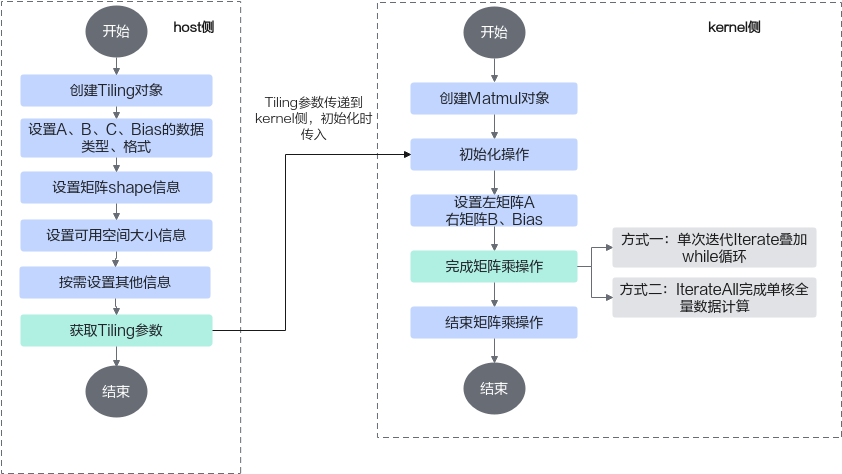
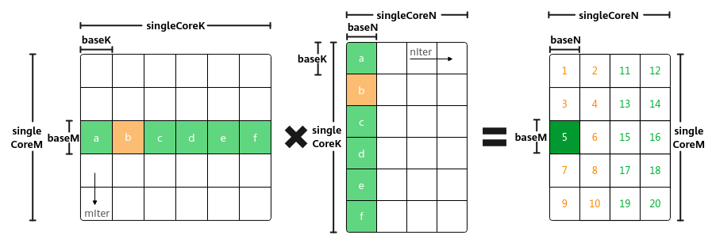
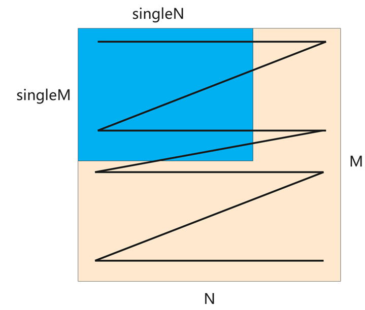

# 算子实现-矩阵编程（高阶API）-SIMD算子实现-算子实践参考-Ascend C算子开发-算子开发-CANN社区版8.5.0开发文档-昇腾社区

**页面ID:** atlas_ascendc_10_0038
**来源：** https://www.hiascend.com/document/detail/zh/CANNCommunityEdition/850/opdevg/Ascendcopdevg/atlas_ascendc_10_0038.html
---

# 算子实现

#### 实现流程

上文介绍了Matmul矩阵乘的数据切分方案和数据流。Ascend C提供一组Matmul高阶API，封装了这些常用的切分和数据搬运、计算的算法逻辑，方便用户快速实现Matmul矩阵乘法的运算操作。开发者在host侧通过调用API自动获取Tiling参数，该参数传递到kernel侧后，在初始化操作时传入，通过几个简单的API即可完成矩阵乘操作。完整样例请参考LINK。

host侧自动获取Tiling参数的关键步骤介绍如下：

1. 创建Tiling对象。12autoascendcPlatform=platform_ascendc:PlatformAscendC(context->GetPlatformInfo());matmul_tiling:MatmulApiTilingcubeTiling(ascendcPlatform);传入硬件平台信息创建PlatformAscendC对象，然后创建Tiling对象，硬件平台信息可以通过GetPlatformInfo获取。
1. 设置A、B、Bias的内存逻辑位置、格式和数据类型。1234cubeTiling.SetAType(AscendC:TPosition:GM,CubeFormat:ND,matmul_tiling:DataType:DT_FLOAT16);cubeTiling.SetBType(AscendC:TPosition:GM,CubeFormat:ND,matmul_tiling:DataType:DT_FLOAT16);cubeTiling.SetCType(AscendC:TPosition:GM,CubeFormat:ND,matmul_tiling:DataType:DT_FLOAT);cubeTiling.SetBiasType(AscendC:TPosition:GM,CubeFormat:ND,matmul_tiling:DataType:DT_FLOAT);
1. 设置矩阵shape信息。12cubeTiling.SetShape(M,N,K);cubeTiling.SetOrgShape(M,N,K);// 设置原始完整的形状M、N、K
1. 设置可用空间大小信息。设置Matmul计算时可用的L1 Buffer/L0C Buffer/Unified Buffer空间大小，-1表示AI处理器对应Buffer的大小。1cubeTiling.SetBufferSpace(-1,-1,-1);
1. 按需设置其他参数，比如设置bias参与计算。1cubeTiling.EnableBias(true);
1. 获取Tiling参数。1234MatmulCustomTilingDatatiling;if(cubeTiling.GetTiling(tiling.cubeTilingData)==-1){returnge:GRAPH_FAILED;}
1. Tiling参数的序列化保存等其他操作。

kernel侧使用Matmul API矩阵乘运算的具体步骤如下：

1. 创建Matmul对象创建Matmul对象的示例如下：纯Cube模式（只有矩阵计算）场景下，建议在代码中定义ASCENDC_CUBE_ONLY宏，避免额外的性能开销。本节内容以纯Cube模式举例。默认为MIX模式（包含矩阵计算和矢量计算），该场景下通常不定义ASCENDC_CUBE_ONLY宏，如果在程序中使用了ASCENDC_CUBE_ONLY宏，则必须使用ASCEND_IS_AIC宏和ASCEND_IS_AIV宏将Cube计算和Vector计算隔离开，更多内容请参考融合算子编程。12345678// 纯Cube模式（只有矩阵计算）场景下，需要设置该代码宏，并且必须在#include "lib/matmul_intf.h"之前设置#define ASCENDC_CUBE_ONLY#include"lib/matmul_intf.h"typedefAscendC:MatmulType<AscendC:TPosition:GM,CubeFormat:ND,half>aType;typedefAscendC:MatmulType<AscendC:TPosition:GM,CubeFormat:ND,half>bType;typedefAscendC:MatmulType<AscendC:TPosition:GM,CubeFormat:ND,float>cType;typedefAscendC:MatmulType<AscendC:TPosition:GM,CubeFormat:ND,float>biasType;AscendC:Matmul<aType,bType,cType,biasType>mm;创建对象时需要传入A、B、C、Bias的参数类型信息，类型信息通过MatmulType来定义，包括：内存逻辑位置、数据格式、数据类型。
1. 初始化操作。1REGIST_MATMUL_OBJ(&pipe,GetSysWorkSpacePtr(),mm,&tiling);// 初始化Matmul高阶API内部实现时需要使用系统workspace（即对应本步骤中的GetSysWorkSpacePtr接口），开发者需要自行申请系统workspace的空间：在host侧Tiling实现时，设置总的workspace的数值大小（包含用户workspace和系统workspace），workspace空间由框架来申请并管理。系统workspace的空间大小通过GetLibApiWorkSpaceSize获取。1234size_tuserWorkspaceSize=0;size_tsystemWorkspaceSize=static_cast<size_t>(ascendcPlatform.GetLibApiWorkSpaceSize());size_t*currentWorkspace=context->GetWorkspaceSizes(1);currentWorkspace[0]=userWorkspaceSize+systemWorkspaceSize;若算子工程不是自定义算子工程，也不是带有HAVE_WORKSPACE编译宏的Kernel直调算子工程，框架不会自动设置workspace，需要在kernel侧的Matmul初始化前，通过SetSysWorkSpace设置系统workspace。12345// 使用Matmul时必须设置workspace空间SetSysWorkspace(workspace);if(GetSysWorkSpacePtr()==nullptr){return;}
1. 设置左矩阵A、右矩阵B、Bias。123mm.SetTensorA(gm_a);// 设置左矩阵Amm.SetTensorB(gm_b);// 设置右矩阵Bmm.SetBias(gm_bias);// 设置Bias
1. 完成矩阵乘操作。调用Iterate完成单次迭代计算，叠加while循环完成单核全量数据的计算。Iterate方式，可以自行控制迭代次数，完成所需数据量的计算，方式比较灵活。123while(mm.Iterate()){mm.GetTensorC(gm_c);}调用IterateAll完成单核上所有数据的计算。IterateAll方式，无需循环迭代，使用比较简单。1mm.IterateAll(gm_c);
1. 结束矩阵乘操作。1mm.End();

#### 设置Shape信息

在实现Host Tiling时可以设置Shape信息，用于Tiling计算；kernel侧运行时也可以修改部分Shape信息，用于尾块设置、Matmul复用（多个Matmul计算复用一个Matmul对象）等场景。本节对涉及到的Shape概念进行介绍，并给出host侧和kernel侧设置Tiling信息的指导。

- orgShape:M、N、K
- singleCoreShape:singleCoreM、singleCoreN、singleCoreK
- singleShape:singleM、singleN、singleK
- baseShape:baseM、baseN、baseK

通过数据分块(Tiling)的介绍我们已经了解了orgShape(M、N、K)，singleCoreShape(singleCoreM、singleCoreN、singleCoreK)，baseShape(baseM、baseN、baseK)的概念，如下图所示：

除此之外，单核的Matmul Tiling时，实际参与Matmul计算的shape可以是原始shape中的一部分，singleM, singleN, singleK用于表达实际参与Matmul计算的shape，如下图所示。在单核的情况下，singleM, singleN, singleK会透传给singleCoreM, singleCoreN, singleCoreK。

- Kernel运行时设置SetTail、SetSingleShape都是运行时修改singleCoreM、singleCoreN、singleCoreK，处理尾块时使用SetTail，Matmul复用（多个Matmul计算复用一个Matmul对象）的场景可以使用SetSingleShape重新设置。SetOrgShape是运行时修改M、N、K，Matmul复用的场景可以使用SetOrgShape重新设置。
- 单核Tiling时设置SetOrgShape（必选）：设置M、N、KSetShape（非必选）：设置singleM、singleN、singleK，等同于设置singleCoreM、singleCoreN、singleCoreKSetFixSplit（非必选）：设置baseM、baseN、baseK
- 多核Tiling时设置SetOrgShape（必选）：设置M、N、KSetShape（非必选）：设置singleM、singleN、singleKSetFixSplit（非必选）：设置baseM、baseN、baseKSetSingleShape（非必选）：设置singleCoreM、singleCoreN、singleCoreKSetSingleRange（非必选）：设置singleCoreM、singleCoreN、singleCoreK的范围

#### 设置format格式

创建Matmul对象时需要传入A、B、C、Bias的参数类型信息，类型信息通过MatmulType来定义，包括：内存逻辑位置、数据格式、数据类型。示例如下：

| 12345 | typedefAscendC:MatmulType<AscendC:TPosition:GM,CubeFormat:ND,half>aType;typedefAscendC:MatmulType<AscendC:TPosition:GM,CubeFormat:ND,half>bType;typedefAscendC:MatmulType<AscendC:TPosition:GM,CubeFormat:ND,float>cType;typedefAscendC:MatmulType<AscendC:TPosition:GM,CubeFormat:ND,float>biasType;AscendC:Matmul<aType,bType,cType,biasType>mm; |
| ----- | -------------------------------------------------------------------------------------------------------------------------------------------------------------------------------------------------------------------------------------------------------------------------------------------------------------------------------------------------- |

针对数据格式，包括CubeFormat:ND, CubeFormat:NZ, CubeFormat:ND_ALIGN三种，ND和NZ格式在数据格式章节已经介绍，ND_ALIGN格式的介绍请参考数据排布格式。
