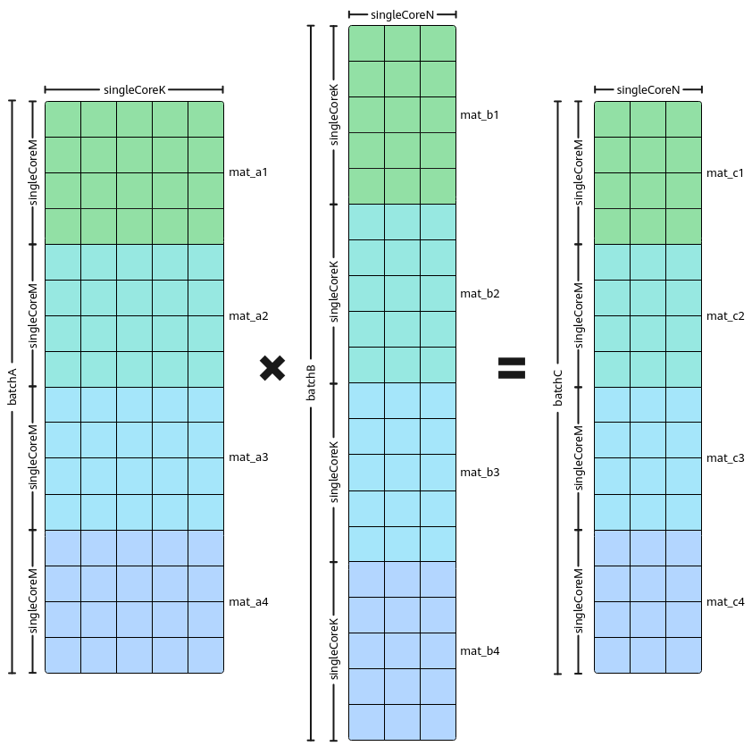

# Batch Matmul基础功能-特性场景-矩阵编程（高阶API）-SIMD算子实现-算子实践参考-Ascend C算子开发-算子开发-CANN社区版8.5.0开发文档-昇腾社区

**页面ID:** atlas_ascendc_10_0041
**来源：** https://www.hiascend.com/document/detail/zh/CANNCommunityEdition/850/opdevg/Ascendcopdevg/atlas_ascendc_10_0041.html
---

# Batch Matmul基础功能

#### 功能介绍

Batch Matmul是指批量处理Matmul计算的场景。该场景对外提供了IterateBatch的调用接口，调用一次IterateBatch，可以计算出多个singleCoreM * singleCoreN大小的C矩阵。

Matmul单次计算的过程需要搬入和搬出数据，当进行多次Matmul计算且单次Matmul计算的输入shape较小时，搬运开销在整体耗时中占比较大。通过IterateBatch接口批量处理Matmul，可以有效提升带宽利用率。

Batch Matmul当前支持4种Layout类型：BSNGD、SBNGD、BNGS1S2、NORMAL（BMNK的数据排布格式），相关数据排布格式请参考IterateBatch。

下图为NORMAL数据排布格式的Batch Matmul计算。整个Matmul计算一共包含4个矩阵乘操作：mat_a1*mat_b1、mat_a2*mat_b2、mat_a3*mat_b3、mat_a4*mat_b4，需要单核上计算四个singleCoreM *singleCoreN。在该场景下，如果shape较小，可以将其视为Batch Matmul场景进行批量处理，以提升性能。一次IterateBatch可同时计算出mat_c1 = mat_a1 * mat_b1、mat_c2 = mat_a2 * mat_b2、mat_c3 = mat_a3 * mat_b3、mat_c4 = mat_a4 * mat_b4。

#### 使用场景

Matmul计算需要计算出多个singleCoreM * singleCoreN大小的C矩阵，且单次Matmul计算处理的shape较小。

#### 约束说明

- 只支持Norm模板。
- 对于BSNGD、SBNGD、BNGS1S2 Layout格式，输入A、B矩阵按分形对齐后的多Batch数据总和应小于L1 Buffer的大小；对于NORMAL Layout格式没有这种限制，但需通过MatmulConfig配置batchMode参数，即输入A、B矩阵多Batch数据大小与L1 Buffer的大小关系；
- 对于BSNGD、SBNGD、BNGS1S2 Layout格式，称左矩阵、右矩阵的G轴分别为ALayoutInfoG、BLayoutInfoG，则ALayoutInfoG / batchA = BLayoutInfoG / batchB；对于NORMAL Layout格式，batchA 、batchB必须满足倍数关系。Bias的shape(batch, n)中的batch必须与C矩阵的batch相等。
- 如果接口输出到Unified Buffer上，输出C矩阵大小BaseM*BaseN应小于分配的Unified Buffer内存大小。
- 对于BSNGD、SBNGD Layout格式，输入输出只支持ND格式数据。对于BNGS1S2、NORMAL Layout格式，输入支持ND/NZ格式数据。
- Batch Matmul不支持量化/反量化模式，即不支持SetQuantScalar、SetQuantVector接口。
- BSNGD场景，不支持一次计算多行SD，需要算子程序中循环计算。
- 异步模式不支持IterateBatch搬运到Unified Buffer上。
- 模板参数enableMixDualMaster（默认取值为false）设置为true，即使能MixDualMaster（双主模式）场景时，不支持Batch Matmul。
- 在batch场景，A矩阵、B矩阵支持half/float/bfloat16_t/int8_t数据类型，不支持int4b_t数据类型。

#### 调用示例

以下是NORMAL数据排布格式的Batch Matmul调用示例。BSNDG数据排布格式的Batch Matmul完整示例请参考BatchMatmul样例。

- Tiling实现使用SetBatchInfoForNormal设置A/B/C的M/N/K轴信息和A/B矩阵的BatchNum。123456789101112131415161718192021autoascendcPlatform=platform_ascendc:PlatformAscendC(context->GetPlatformInfo());matmul_tiling:MultiCoreMatmulTilingtiling(ascendcPlatform);int32_tM=32;int32_tN=256;int32_tK=64;tiling->SetDim(1);tiling->SetAType(matmul_tiling:TPosition:GM,matmul_tiling:CubeFormat:ND,matmul_tiling:DataType:DT_FLOAT16);tiling->SetBType(matmul_tiling:TPosition:GM,matmul_tiling:CubeFormat:ND,matmul_tiling:DataType:DT_FLOAT16);tiling->SetCType(matmul_tiling:TPosition:GM,matmul_tiling:CubeFormat:ND,matmul_tiling:DataType:DT_FLOAT);tiling->SetBiasType(matmul_tiling:TPosition:GM,matmul_tiling:CubeFormat:ND,matmul_tiling:DataType:DT_FLOAT);tiling->SetShape(M,N,K);tiling->SetOrgShape(M,N,K);tiling->EnableBias(true);tiling->SetBufferSpace(-1,-1,-1);constexprint32_tBATCH_NUM=3;tiling->SetBatchInfoForNormal(BATCH_NUM,BATCH_NUM,M,N,K);// 设置矩阵排布tiling->SetBufferSpace(-1,-1,-1);optiling:TCubeTilingtilingData;intret=tiling.GetTiling(tilingData);
- Kernel实现创建Matmul对象。通过MatmulType设置输入输出的Layout格式为NORMAL。12345678#include"lib/matmul_intf.h"typedefAscendC:MatmulType<AscendC:TPosition:GM,CubeFormat:ND,half,false,LayoutMode:NORMAL>aType;typedefAscendC:MatmulType<AscendC:TPosition:GM,CubeFormat:ND,half,true,LayoutMode:NORMAL>bType;typedefAscendC:MatmulType<AscendC:TPosition:GM,CubeFormat:ND,float,false,LayoutMode:NORMAL>cType;typedefAscendC:MatmulType<AscendC:TPosition:GM,CubeFormat:ND,float>biasType;constexprMatmulConfigMM_CFG=GetNormalConfig(false,false,false,BatchMode:BATCH_LESS_THAN_L1);AscendC:Matmul<aType,bType,cType,biasType,MM_CFG>mm;初始化操作。1REGIST_MATMUL_OBJ(&pipe,GetSysWorkSpacePtr(),mm,&tiling);// 初始化matmul对象设置左矩阵A、右矩阵B、Bias。123mm.SetTensorA(gm_a);// 设置左矩阵Amm.SetTensorB(gm_b);// 设置右矩阵Bmm.SetBias(gm_bias);// 设置Bias完成矩阵乘操作。左矩阵每次计算batchA个MK数据，右矩阵每次计算batchB个KN数据。1mm.IterateBatch(gm_c,batchA,batchB,false);结束矩阵乘操作。mm.End();
