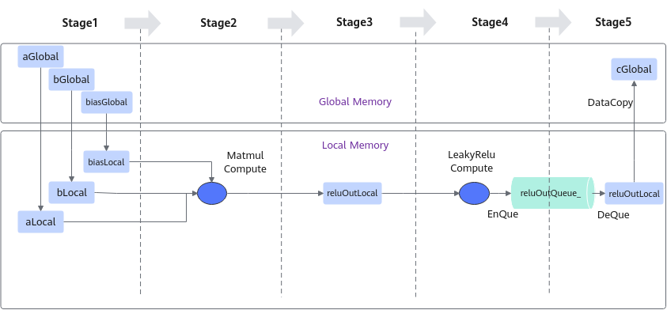
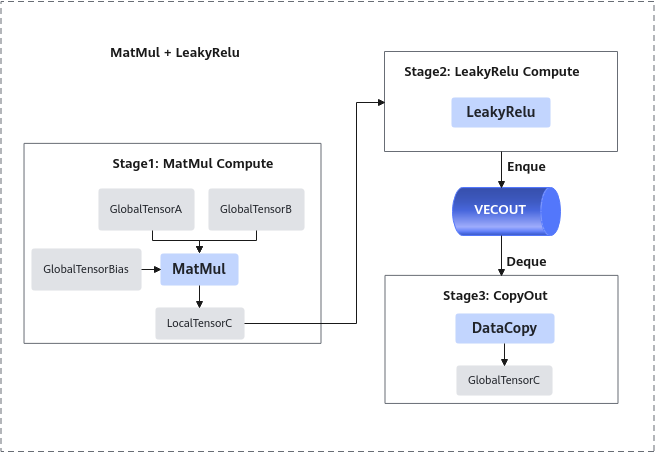
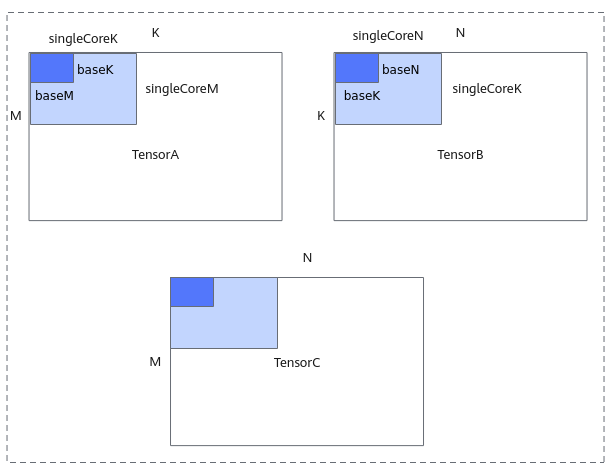
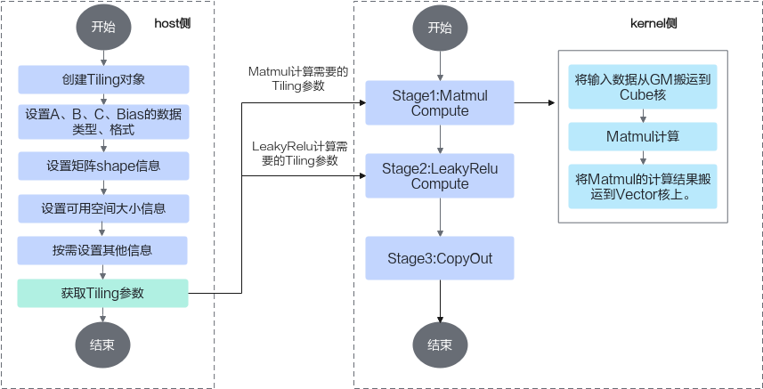

# 算子实现-CV融合-融合算子编程-SIMD算子实现-算子实践参考-Ascend C算子开发-算子开发-CANN社区版8.5.0开发文档-昇腾社区

**页面ID:** atlas_ascendc_10_0050
**来源：** https://www.hiascend.com/document/detail/zh/CANNCommunityEdition/850/opdevg/Ascendcopdevg/atlas_ascendc_10_0050.html
---

# 算子实现

下文将以Matmul+LeakyRelu融合算子的实现为例，介绍Mix融合算子的设计和实现流程。该样例仅支持在Atlas A2 训练系列产品/Atlas A2 推理系列产品上运行。

算子的设计过程分为算子分析、数据流分析、Tiling策略设计三部分。

#### 算子分析

算子分析是指明确算子的数学表达式、输入、输出，核函数的名称等信息。

1. 明确算子的数学表达式及计算逻辑。该算子的计算逻辑为，先进行一个矩阵乘操作，然后将矩阵乘的结果与一个alpha参数进行LeakyRelu操作。数学表达式如下：1c=LeakyRelu(a*b+bias,alpha);
1. 明确输入和输出。MatMul+LeakyRelu算子输入为a、b、bias，输出为c。alpha作为激活函数LeakyRelu的系数，为固定值，可以在算子实现中直接使用常数值参与计算。本样例中算子输入a、b支持的数据类型为half(float16)，算子输入bias支持的数据类型为float32，算子输出c的数据类型为float32。输入矩阵a的形状为[M，K]，输入矩阵b的形状为[K, N]，输出矩阵c的形状为[M，N]，输入bias的形状为[1, N]。算子输入输出支持的数据格式为：ND。
1. 确定核函数名称和参数。您可以自定义核函数名称，本样例中核函数命名为matmul_leakyrelu_custom。根据对算子输入输出的分析，确定核函数的参数a，b，bias，c；a，b, bias为输入在Global Memory上的内存地址，c为输出在Global Memory上的内存地址。

| 算子类型(OpType) | MATMUL_LEAKYRELU        |         |           |        |
| ---------------- | ----------------------- | ------- | --------- | ------ |
| 算子输入         | name                    | shape   | data type | format |
| a                | [M, K]                  | half    | ND        |        |
| b                | [K, N]                  | half    | ND        |        |
| bias             | [1, N]                  | float32 | -         |        |
| 算子输出         | c                       | [M, N]  | float32   | ND     |
| 核函数名称       | matmul_leakyrelu_custom |         |           |        |

#### 数据流分析

进行算子的数据流分析：数据流向为在Cube核上完成Matmul计算后将数据搬运至Vector核进行LeakyRelu计算。根据上述数据流并结合融合算子的编程范式，规划并行的流水任务。如下图所示：

1. 将输入数据从Global Memory搬运到Cube核。
1. 进行MatMul内部的计算，计算公式和计算示意图如下：注：bias的shape为[1, N]，对A*B结果矩阵的每一行都采用该bias进行偏置。图1Matmul矩阵乘示意图
1. 将MatMul的计算结果搬运到Vector核。
1. 进行Vector矢量计算，该样例中进行LeakyReLU计算。Leaky ReLU（带泄露线性整流函数）激活函数，是人工神经网络中一种常用的激活函数，其数学表达式和函数图像如下所示：
1. 将输出结果搬运到Global Memory。

前三步的内容都封装在Matmul高阶API内，本样例中可以简化为3个stage。如下图所示：

根据上述分析，明确实现过程中会使用到Matmul高阶API接口，LeakyRelu Vector计算接口、DataCopy、EnQue、DeQue接口。

#### Tiling策略设计

Tiling策略的设计主要包括多核切分和核内切分策略。

- 多核切分：根据当前核数，对输入shape的M, K, N进行多核切分，得到单核内shape大小singleCoreM, singleCoreK, singleCoreN。
- 核内切分：根据Local Memory的大小约束，对单核内的shape大小进一步切分，得到A、B、C矩阵参与一次矩阵乘指令的shape大小baseM, baseN, baseK。切分时需要注意：GetTensorC的结果如果放在LocalMemory(UB)上，需要注意，baseM * baseN的大小不能超出UB的限制。

切分策略示意图如下，更多切分策略相关原理请参考数据分块(Tiling)。

#### 算子实现

在矩阵编程章节，我们得知Ascend C提供一组Matmul高阶API，封装了常用的切分和数据搬运、计算的算法逻辑，方便用户快速实现Matmul矩阵乘法的运算操作。融合算子中矩阵编程部分的实现与之类似，开发者在host侧通过调用API自动获取Tiling参数，该参数传递到kernel侧后，在初始化操作时传入，通过几个简单的API即可完成矩阵乘操作。再结合上文的融合算子的编程范式，融合算子实现的步骤如下。完整样例请参考MatmulLeakyRelu。

kernel侧实现的代码框架如下，在完成Matmul对象的初始化、左矩阵A、右矩阵B、Bias的设置后，通过单次Iterate叠加while循环的方式完成后续的Matmul计算、LeakyRelu计算、CopyOut流程。

| 123456789101112131415161718192021 | template<typenameaType,typenamebType,typenamecType,typenamebiasType>__aicore__inlinevoidMatmulLeakyKernel<aType,bType,cType,biasType>:Process(){uint32_tcomputeRound=0;// Matmul对象初始化REGIST_MATMUL_OBJ(&pipe,GetSysWorkSpacePtr(),matmulObj);// 设置Matmul的输入（包括左矩阵、右矩阵、bias）matmulObj.Init(&tiling);matmulObj.SetTensorA(aGlobal);matmulObj.SetTensorB(bGlobal);matmulObj.SetBias(biasGlobal);// 调用matmul iterate获取一块[baseM, baseN]的计算结果while(matmulObj.templateIterate<true>()){MatmulCompute();LeakyReluCompute();CopyOut(computeRound);computeRound++;}matmulObj.End();} |
| --------------------------------- | ----------------------------------------------------------------------------------------------------------------------------------------------------------------------------------------------------------------------------------------------------------------------------------------------------------------------------------------------------------------------------------------------------------------------------------------------------------------------------------------------------------------------------------------------------------------------------------------------------------- |

Matmul计算、LeakyRelu计算、CopyOut的具体实现代码如下：

1. Matmul计算：将输入数据从Global Memory搬运到Cube核。进行MatMul内部的计算。将MatMul的计算结果搬运到Vector核。123456789101112131415161718192021template<typenameaType,typenamebType,typenamecType,typenamebiasType>__aicore__inlinevoidMatmulLeakyKernel<aType,bType,cType,biasType>:Process(){uint32_tcomputeRound=0;// ...// 调用matmul iterate获取一块[baseM, baseN]的计算结果while(matmulObj.templateIterate<true>()){MatmulCompute();// ...computeRound++;}matmulObj.End();}template<typenameaType,typenamebType,typenamecType,typenamebiasType>__aicore__inlinevoidMatmulLeakyKernel<aType,bType,cType,biasType>:MatmulCompute(){reluOutLocal=reluOutQueue_.AllocTensor<cType>();// 调用GetTensorC将Matmul的计算结果搬运到Vector核。matmulObj.templateGetTensorC<true>(reluOutLocal,false,true);}
1. LeakyRelu计算。123456// 调用LeakyRule接口进行计算template<typenameaType,typenamebType,typenamecType,typenamebiasType>__aicore__inlinevoidMatmulLeakyKernel<aType,bType,cType,biasType>:LeakyReluCompute(){AscendC:LeakyRelu(reluOutLocal,reluOutLocal,(cType)alpha,tiling.baseM*tiling.baseN);reluOutQueue_.EnQue(reluOutLocal);}
1. CopyOut，将输出结果搬运到Global Memory。12345678910111213// 将结果搬出到GMtemplate<typenameaType,typenamebType,typenamecType,typenamebiasType>__aicore__inlinevoidMatmulLeakyKernel<aType,bType,cType,biasType>:CopyOut(uint32_tcount){reluOutQueue_.DeQue<cType>();constuint32_troundM=tiling.singleCoreM/tiling.baseM;constuint32_troundN=tiling.singleCoreN/tiling.baseN;uint32_tstartOffset=(count%roundM*tiling.baseM*tiling.N+count/roundM*tiling.baseN);AscendC:DataCopyParamscopyParam={(uint16_t)tiling.baseM,(uint16_t)(tiling.baseN*sizeof(cType)/DEFAULT_C0_SIZE),0,(uint16_t)((tiling.N-tiling.baseN)*sizeof(cType)/DEFAULT_C0_SIZE)};AscendC:DataCopy(cGlobal[startOffset],reluOutLocal,copyParam);reluOutQueue_.FreeTensor(reluOutLocal);}

host侧自动获取Tiling参数的关键步骤介绍如下：

1. 创建Tiling对象。12autoascendcPlatform=platform_ascendc:PlatformAscendC(context->GetPlatformInfo());matmul_tiling:MultiCoreMatmulTilingcubeTiling(ascendcPlatform);创建对象时需要传入硬件平台信息，硬件平台信息可以通过GetPlatformInfo获取。
1. 设置A、B、Bias的数据类型和格式。设置示例如下，其中TPosition:LCM是Unified Buffer上的逻辑位置，等同于TPosition:VECCALC，关于TPosition的详细内容请参考TPosition。1234cubeTiling.SetAType(matmul_tiling:TPosition:GM,matmul_tiling:CubeFormat:ND,matmul_tiling:DataType:DT_FLOAT16);cubeTiling.SetBType(matmul_tiling:TPosition:GM,matmul_tiling:CubeFormat:ND,matmul_tiling:DataType:DT_FLOAT16);cubeTiling.SetCType(matmul_tiling:TPosition:LCM,matmul_tiling:CubeFormat:ND,matmul_tiling:DataType:DT_FLOAT);cubeTiling.SetBiasType(matmul_tiling:TPosition:GM,matmul_tiling:CubeFormat:ND,matmul_tiling:DataType:DT_FLOAT);
1. 设置矩阵shape信息。12cubeTiling.SetShape(M,N,K);cubeTiling.SetOrgShape(M,N,K);
1. 设置可用空间大小信息。设置Matmul计算时可用的L1 Buffer/L0C Buffer/Unified Buffer空间大小，-1表示AI处理器对应Buffer的大小。1cubeTiling.SetBufferSpace(-1,-1,-1);
1. 按需设置其他参数，比如设置bias参与计算。1cubeTiling.SetBias(true);
1. 获取Tiling参数。1234MatmulLeakyreluCustomTilingDatatiling;if(cubeTiling.GetTiling(tiling.cubeTilingData)==-1){returnge:GRAPH_FAILED;}
1. Tiling参数的序列化保存等其他操作。

- 特别的对于多核场景，需要通过SetDim接口设置Matmul计算所用的核数，MIX模式（包含矩阵计算和矢量计算）的设置规则如下：分离模式：Matmul API都是从AIV侧发起的，调用Iterate计算时在AIV侧只会起到通知的作用，通知AIC去做矩阵计算，计算完成后AIC告知AIV计算完成。这个架构下，SetBlockDim设置为实际计算会用到的AI Core（AIC、AIV组合）的数量，SetDim设置为实际计算会用到的AIV的数量。例如，SetBlockDim时可以设置为20，启动20个AI Core（AIC AIV的组合），SetDim设置为40，表示按照40个AIV进行切分。耦合模式：SetBlockDim加载的核数就是Matmul API实际计算会用到的核数，SetDim和SetBlockDim设置的值是一样的。
- Matmul高阶API内部实现时需要使用系统workspace，开发者需要：在host侧Tiling实现时，设置总的workspace的数值大小（包含用户workspace和系统workspace），workspace空间由框架来申请并管理。系统workspace的空间大小通过GetLibApiWorkSpaceSize获取。1234size_tuserWorkspaceSize=0;size_tsystemWorkspaceSize=ascendcPlatform.GetLibApiWorkSpaceSize();size_t*currentWorkspace=context->GetWorkspaceSizes(1);currentWorkspace[0]=userWorkspaceSize+systemWorkspaceSize;若算子工程不是自定义算子工程，也不是带有HAVE_WORKSPACE编译宏的Kernel直调算子工程，kernel侧需要在Matmul初始化前，通过SetSysWorkSpace设置系统workspace。12345// 使用Matmul时必须设置workspace空间SetSysWorkspace(workspace);if(GetSysWorkSpacePtr()==nullptr){return;}
- 上文介绍的实现方法，AIC侧和AIV侧的代码隔离和核间同步由框架来完成，开发者无需关心。除该方法外，开发者也可以选择底层编码的方式在分离模式下实现融合算子，这种方式将更加灵活。采用底层编码方式时，需要注意以下几点：通过ASCEND_IS_AIV和ASCEND_IS_AIC实现AIV和AIC代码之间的隔离。自行实现AIC和AIV核之间的同步：比如Matmul + LeakyRelu算子样例中，需要确保在AIC完成矩阵计算后，AIV再进行LeakyRelu的计算。使用高阶API Matmul时需要设置ASCENDC_CUBE_ONLY，表示仅在AIC侧调用Matmul API。使用设置Kernel类型接口设置Kernel类型为KERNEL_TYPE_MIX_xxx，同时启用AIV核和AIC核。123456789101112#define ASCENDC_CUBE_ONLY// 指定Matmul运行在AIC上KERNEL_TASK_TYPE_DEFAULT(KERNEL_TYPE_MIX_AIC_1_2);// 设置Kernel类型为KERNEL_TYPE_MIX_xxxifASCEND_IS_AIC{...// AIC核进行Matmul计算// AIC核完成计算后，通过AscendC:CrossCoreSetFlag<modeId, pipe>(flagId)发送同步flag}ifASCEND_IS_AIV{...// AIV核通过AscendC:CrossCoreWaitFlag(flagId)接收同步flag// AIV核进行LeakyRelu计算}完整样例请参考BareMix样例。
