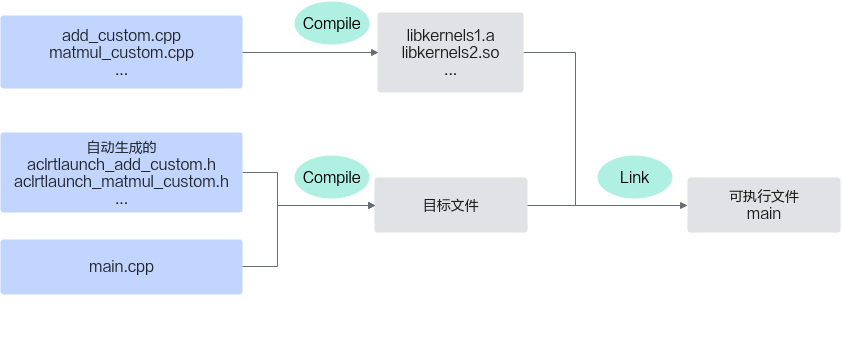
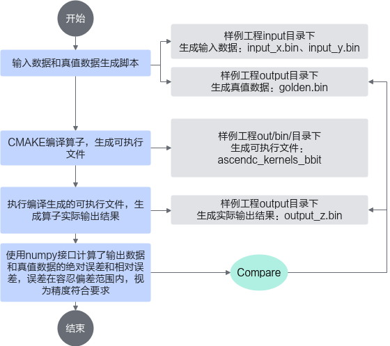

# 基于样例工程完成Kernel直调-附录-编程指南-Ascend C算子开发-算子开发-CANN社区版8.5.0开发文档-昇腾社区

**页面ID:** atlas_ascendc_10_0056
**来源：** https://www.hiascend.com/document/detail/zh/CANNCommunityEdition/850/opdevg/Ascendcopdevg/atlas_ascendc_10_0056.html
---

# 基于样例工程完成Kernel直调

下文将以Add矢量算子为例对Kernel直调算子开发流程进行详细介绍。

更多算子样例工程请通过如下链接获取：

- 矢量算子样例
- 支持Tiling的矢量算子样例
- 矩阵算子样例
- 矢量+矩阵融合算子样例

#### 环境准备

- 使用Kernel Launch算子工程之前，需要参考环境准备章节安装驱动固件和CANN软件包，完成开发环境和运行环境的准备。
- 使用该算子工程要求cmake版本为3.16及以上版本，如不符合要求，请参考如下的命令示例更新cmake版本，如下示例以更新到3.16.0版本为例。wget https://cmake.org/files/v3.16/cmake-3.16.0.tar.gz 
tar -zxvf cmake-3.16.0.tar.gz 
cd cmake-3.16.0
 ./bootstrap --prefix=/usr 
sudo make 
sudo make install

#### 工程目录

您可以单击矢量算子样例，获取核函数开发和运行验证的完整样例。样例目录结构如下所示：

基于该算子工程，开发者进行算子开发的步骤如下：

- 完成算子kernel侧实现。
- 编写算子调用应用程序main.cpp。
- 编写CMake编译配置文件CMakeLists.txt。
- 根据实际需要修改输入数据和真值数据生成脚本文件gen_data.py；验证输出数据和真值数据是否一致的验证脚本verify_result.py。
- 根据实际需要修改编译运行算子的脚本run.sh并执行该脚本，完成算子的编译运行和结果验证。

#### 算子Kernel侧实现

请参考工程目录中的矢量算子、矩阵算子、融合算子的Kernel实现完成Ascend C算子实现文件的编写。

#### 算子调用应用程序

下面代码以固定shape的add_custom算子为例，介绍算子核函数调用的应用程序main.cpp如何编写。您在实现自己的应用程序时，需要关注由于算子核函数不同带来的修改，包括算子核函数名，入参出参的不同等，合理安排相应的内存分配、内存拷贝和文件读写等，相关API的调用方式直接复用即可。

1. 按需包含头文件，通过ASCENDC_CPU_DEBUG宏区分CPU/NPU侧需要包含的头文件。需要注意的是，NPU侧需要包含对应的核函数调用接口声明所在的头文件aclrtlaunch_{kernel_name}.h（该头文件为工程框架自动生成），kernel_name为算子核函数的名称。12345678#include"data_utils.h"#ifndef ASCENDC_CPU_DEBUG#include"acl/acl.h"#include"aclrtlaunch_add_custom.h"#else#include"tikicpulib.h"extern"C"__global____aicore__voidadd_custom(GM_ADDRx,GM_ADDRy,GM_ADDRz);#endif
1. 应用程序框架编写。该应用程序通过ASCENDC_CPU_DEBUG宏区分代码逻辑运行于CPU侧还是NPU侧。12345678910111213int32_tmain(int32_targc,char*argv[]){uint32_tblockDim=8;size_tinputByteSize=8*2048*sizeof(uint16_t);size_toutputByteSize=8*2048*sizeof(uint16_t);#ifdef ASCENDC_CPU_DEBUG// 用于CPU调试的调用程序#else// NPU侧运行算子的调用程序#endifreturn0;}
1. CPU侧运行验证。完成算子核函数CPU侧运行验证的步骤如下：图1CPU侧运行验证步骤1234567891011121314151617// 使用GmAlloc分配共享内存，并进行数据初始化uint8_t*x=(uint8_t*)AscendC:GmAlloc(inputByteSize);uint8_t*y=(uint8_t*)AscendC:GmAlloc(inputByteSize);uint8_t*z=(uint8_t*)AscendC:GmAlloc(outputByteSize);ReadFile("./input/input_x.bin",inputByteSize,x,inputByteSize);ReadFile("./input/input_y.bin",inputByteSize,y,inputByteSize);// 矢量算子需要设置内核模式为AIV模式AscendC:SetKernelMode(KernelMode:AIV_MODE);// 调用ICPU_RUN_KF调测宏，完成核函数CPU侧的调用ICPU_RUN_KF(add_custom,blockDim,x,y,z);// 输出数据写出WriteFile("./output/output_z.bin",z,outputByteSize);// 调用GmFree释放申请的资源AscendC:GmFree((void*)x);AscendC:GmFree((void*)y);AscendC:GmFree((void*)z);
1. NPU侧运行验证。完成算子核函数NPU侧运行验证的步骤如下：图2NPU侧运行验证步骤12345678910111213141516171819202122232425262728293031323334353637383940414243// 初始化CHECK_ACL(aclInit(nullptr));// 运行管理资源申请int32_tdeviceId=0;CHECK_ACL(aclrtSetDevice(deviceId));aclrtStreamstream=nullptr;CHECK_ACL(aclrtCreateStream(&stream));// 分配Host内存uint8_t*xHost,*yHost,*zHost;uint8_t*xDevice,*yDevice,*zDevice;CHECK_ACL(aclrtMallocHost((void**)(&xHost),inputByteSize));CHECK_ACL(aclrtMallocHost((void**)(&yHost),inputByteSize));CHECK_ACL(aclrtMallocHost((void**)(&zHost),outputByteSize));// 分配Device内存CHECK_ACL(aclrtMalloc((void**)&xDevice,inputByteSize,ACL_MEM_MALLOC_HUGE_FIRST));CHECK_ACL(aclrtMalloc((void**)&yDevice,inputByteSize,ACL_MEM_MALLOC_HUGE_FIRST));CHECK_ACL(aclrtMalloc((void**)&zDevice,outputByteSize,ACL_MEM_MALLOC_HUGE_FIRST));// Host内存初始化ReadFile("./input/input_x.bin",inputByteSize,xHost,inputByteSize);ReadFile("./input/input_y.bin",inputByteSize,yHost,inputByteSize);// 将数据从Host上拷贝到Device上CHECK_ACL(aclrtMemcpy(xDevice,inputByteSize,xHost,inputByteSize,ACL_MEMCPY_HOST_TO_DEVICE));CHECK_ACL(aclrtMemcpy(yDevice,inputByteSize,yHost,inputByteSize,ACL_MEMCPY_HOST_TO_DEVICE));// 用内核调用符<<<>>>调用核函数完成指定的运算，add_custom_do中封装了<<<>>>调用add_custom_do(blockDim,nullptr,stream,xDevice,yDevice,zDevice);// 用ACLRT_LAUNCH_KERNEL接口调用核函数完成指定的运算// ACLRT_LAUNCH_KERNEL(add_custom)(blockDim, stream, xDevice, yDevice, zDevice);CHECK_ACL(aclrtSynchronizeStream(stream));// 将Device上的运算结果拷贝回HostCHECK_ACL(aclrtMemcpy(zHost,outputByteSize,zDevice,outputByteSize,ACL_MEMCPY_DEVICE_TO_HOST));WriteFile("./output/output_z.bin",zHost,outputByteSize);// 释放申请的资源CHECK_ACL(aclrtFree(xDevice));CHECK_ACL(aclrtFree(yDevice));CHECK_ACL(aclrtFree(zDevice));CHECK_ACL(aclrtFreeHost(xHost));CHECK_ACL(aclrtFreeHost(yHost));CHECK_ACL(aclrtFreeHost(zHost));// 去初始化CHECK_ACL(aclrtDestroyStream(stream));CHECK_ACL(aclrtResetDevice(deviceId));CHECK_ACL(aclFinalize());针对<<<>>>调用方式在核函数章节已有说明，这里仅对ACLRT_LAUNCH_KERNEL调用接口的使用方法介绍如下：1ACLRT_LAUNCH_KERNEL(kernel_name)(blockDim,stream,argumentlist);kernel_name：算子核函数的名称。blockDim：规定了核函数将会在几个核上执行。每个执行该核函数的核会被分配一个逻辑ID，即block_idx，可以在核函数的实现中调用GetBlockIdx来获取block_idx。stream，类型为aclrtStream，stream用于维护一些异步操作的执行顺序，确保按照应用程序中的代码调用顺序在Device上执行。stream创建等管理接口请参考“Stream管理”章节。argument list：参数列表，与核函数的参数列表保持一致。

#### CMake编译配置文件编写

本节会介绍CMake文件中一些关键环境变量和Cmake命令参数的说明，通常情况下不需要开发者修改，但是这些参数可以帮助开发者更好的理解编译原理，方便有能力的开发者对Cmake进行定制化处理。

| 环境变量                    | 配置说明                                                                                                                                                                                                                                                                                                                                                                                                                                                                                                                                                                                                                                                                                               |
| --------------------------- | ------------------------------------------------------------------------------------------------------------------------------------------------------------------------------------------------------------------------------------------------------------------------------------------------------------------------------------------------------------------------------------------------------------------------------------------------------------------------------------------------------------------------------------------------------------------------------------------------------------------------------------------------------------------------------------------------------ |
| SOC_VERSION                 | AI处理器的型号。针对如下产品：在安装昇腾AI处理器的服务器执行npu-smi info命令进行查询，获取Name信息。实际配置值为AscendName，例如Name取值为xxxyy，实际配置值为Ascendxxxyy。Atlas A2 训练系列产品/Atlas A2 推理系列产品Atlas 200I/500 A2 推理产品Atlas推理系列产品Atlas训练系列产品针对如下产品，在安装昇腾AI处理器的服务器执行npu-smi info -t board -iid-cchip_id命令进行查询，获取Chip Name和NPU Name信息，实际配置值为Chip Name_NPU Name。例如Chip Name取值为Ascendxxx，NPU Name取值为1234，实际配置值为Ascendxxx_1234。其中：id：设备id，通过npu-smi info -l命令查出的NPU ID即为设备id。chip_id：芯片id，通过npu-smi info -m命令查出的Chip ID即为芯片id。Atlas A3 训练系列产品/Atlas A3 推理系列产品 |
| ASCEND_CANN_PACKAGE_PATH    | CANN软件包安装后的实际路径。                                                                                                                                                                                                                                                                                                                                                                                                                                                                                                                                                                                                                                                                           |
| CMAKE_BUILD_TYPE            | 编译模式选项，可配置为：“Release”，Release版本，不包含调试信息，编译最终发布的版本。“Debug”，Debug版本，包含调试信息，便于开发者开发和调试。                                                                                                                                                                                                                                                                                                                                                                                                                                                                                                                                                           |
| CMAKE_INSTALL_PREFIX        | 用于指定CMAKE执行install时，安装的路径前缀，执行install后编译产物（ascendc_library中指定的target以及对应的头文件）会安装在该路径下。默认路径为当前目录的out目录下。                                                                                                                                                                                                                                                                                                                                                                                                                                                                                                                                    |
| CMAKE_CXX_COMPILER_LAUNCHER | 用于配置C++语言编译器（如g++）、毕昇编译器的启动器程序为ccache，配置后即可开启cache缓存编译，加速重复编译并提高构建效率。使用该功能前需要安装ccache。配置方法如下，在对应的CMakeLists.txt进行设置：set(CMAKE_CXX_COMPILER_LAUNCHER <launcher_program>)其中<launcher_program>是ccache的安装路径，比如ccache的安装路径为/usr/bin/ccache，示例如下：set(CMAKE_CXX_COMPILER_LAUNCHER /usr/bin/ccache)                                                                                                                                                                                                                                                                                                      |

| Cmake命令      | 语法说明                                                                      |
| -------------- | ----------------------------------------------------------------------------- |
| add_executable | 使用指定的源文件将可执行文件添加到项目中。和Cmake通用的命令参数使用方法一致。 |
| ascendc_library | 使用指定的核函数源文件向项目(project)添加库。语法格式如下：ascendc_library(<target_name> [STATIC | SHARED]
            [<source>...])其中<target_name>表示库文件的名字，该库文件会根据命令里列出的源文件来建立。STATIC、SHARED的作用是指定生成的库文件的类型。STATIC库是目标文件的归档文件，在连接其它目标的时候使用。SHARED库会被动态连接（动态连接库），在运行时会被加载。<source>表示核函数源文件。 |
| ascendc_fatbin_library | 使用指定的核函数源文件编译生成一个Kernel二进制文件，供Kernel加载和执行接口使用。语法格式如下：ascendc_fatbin_library(<target_name> [<source>...])<target_name>表示库文件的名字，该库文件会根据命令里列出的核函数源文件编译生成<target_name>.o文件，放置于${CMAKE_INSTALL_PREFIX}/fatbin/${target_name}/路径下。<source>表示核函数源文件。说明：Kernel加载与执行接口的调用流程和上文介绍的<<<...>>>等调用流程有所差异，具体流程请参考《应用开发指南(C&C++)》中的“Kernel加载与执行”章节。该编译选项暂不支持printf、DumpTensor、DumpAccChkPoint、assert接口。 |
| ascendc_compile_definitions | 添加编译宏。可以添加Ascend C提供的编译宏和开发者自定义的编译宏。语法格式如下：ascendc_compile_definitions(<target_name> [PRIVATE]
            [<xxx>...])Ascend C提供的编译宏介绍如下：ASCENDC_DUMP用于控制Dump开关，默认开关打开，开发者调用printf/DumpTensor/assert后会有信息打印（需要注意直调工程的kernel文件内存在host函数，如果在host函数内调用了printf接口，也会触发kernel内的printf相关初始化动作，进而影响kernel的执行性能）；设置为0后，表示开关关闭。示例如下：// 关闭所有算子的printf打印功能
ascendc_compile_definitions(ascendc_kernels_${RUN_MODE} PRIVATE
    ASCENDC_DUMP=0
)ASCENDC_DEBUG用于控制Ascend C API的调测开关，默认开关关闭；增加该编译宏后，表示开关打开，此时接口内部的assert校验生效，校验不通过会有assert日志打屏。开启该功能会对算子实际运行的性能带来一定影响，通常在调测阶段使用。示例如下：ascendc_compile_definitions(ascendc_kernels_${RUN_MODE} PRIVATE
    ASCENDC_DEBUG
)当前ASCENDC_DEBUG功能支持的产品型号为：Atlas推理系列产品Atlas A2 训练系列产品/Atlas A2 推理系列产品HAVE_WORKSPACE用于表示kernel入口是否包含workspace入参。默认情况下为不包含；增加该编译宏后，表示包含，此时框架会获取kernel入参的倒数第一个参数（未配置HAVE_TILING），或倒数第二个参数（配置HAVE_TILING），自动在kernel侧设置系统workspace，开发者在kernel侧入参处获取的workspace为偏移了系统workspace后的用户workspace。当开发者使用了Matmul Kernel侧接口等需要系统workspace的高阶API时，建议开启此参数，入参排布、系统workspace的设置逻辑与工程化算子开发保持一致，可减少算子实现在不同开发方式间切换带来的修改成本。需要注意的是，host侧开发者仍需要自行申请workspace的空间，系统workspace大小可以通过PlatformAscendCManager的GetLibApiWorkSpaceSize接口获取。HAVE_WORKSPACE的设置样例如下：ascendc_compile_definitions(ascendc_kernels_${RUN_MODE} PRIVATE
    HAVE_WORKSPACE
)HAVE_TILING用于表示kernel入口是否含有tiling入参。在配置了HAVE_WORKSPACE之后，此编译宏才会生效。默认情况下为不包含，开关关闭；增加该编译宏后，表示包含，此时框架会将kernel入参的最后一个参数当做tiling，将倒数第二个参数当做workspace。框架不会对此tiling入参做任何处理，仅通过该入参来判断workspace参数的位置，使用此编译宏可以和工程化算子开发保持入参一致，减少算子实现在不同开发方式间切换带来的修改成本。设置样例如下：ascendc_compile_definitions(ascendc_kernels_${RUN_MODE} PRIVATE
    HAVE_WORKSPACE
    HAVE_TILING
) |
| ascendc_compile_options | 添加编译选项。可以添加相应的编译选项用于host侧与device侧的编译过程。语法格式如下：ascendc_compile_options(<target_name> PRIVATE
    [<xxx>...]
)默认情况下，指定的编译选项都将传递给device侧编译器进行编译。若想传递编译选项给host侧编译器，则需要使用“-forward-options-to-host-compiler”编译选项，该选项后的编译选项将传递给host侧编译器，示例如下：ascendc_compile_options(<target_name> PRIVATE
    -g
    -forward-options-to-host-compiler
    -gdwarf-4
)如上代码所示，在编译时，“-g”编译选项传递给device侧编译器，“-gdwarf-4”编译选项传递给host侧编译器。备注：host侧编译选项只支持g++与clang编译器共同支持的编译选项。 |
| ascendc_include_directories | 添加开发者自定义的头文件搜索路径。语法格式如下：ascendc_include_directories(<target_name> [PRIVATE]
            [<xxx>...]) |

简化的编译流程图如下图所示：将算子核函数源文件编译生成kernel侧的库文件（*.so或*。a库文件）；工程框架自动生成核函数调用接口声明头文件；编译main.cpp（算子调用应用程序）时依赖上述头文件，将编译应用程序生成的目标文件和kernel侧的库文件进行链接，生成最终的可执行文件。

编译安装结束后在CMAKE_INSTALL_PREFIX目录下生成的编译产物示例如下；最终的可执行文件会生成在cmake命令的执行目录下。

对于lib目录下生成的库文件可通过msobjdump工具进一步解析得到kernel信息，具体操作参见msobjdump工具。

#### 输入数据和真值数据生成以及验证脚本文件

以固定shape的add_custom算子为例，输入数据和真值数据生成的脚本样例如下：根据算子的输入输出编写脚本，生成输入数据和真值数据。

验证输出数据和真值数据是否一致的验证脚本样例如下：当前使用numpy接口计算了输出数据和真值数据的绝对误差和相对误差，误差在容忍偏差范围内，视为精度符合要求，输出"test pass"字样。

#### 修改并执行一键式编译运行脚本

您可以基于样例工程中提供的一键式编译运行脚本进行快速编译，并在CPU侧和NPU侧执行Ascend C算子。一键式编译运行脚本主要完成以下功能：

样例中提供的一键式编译运行脚本并不能适用于所有的算子运行验证场景，使用时请根据实际情况进行修改。

- 根据Ascend C算子的算法原理的不同，自行实现输入和真值数据的生成脚本。

完成上述文件的编写后，可以执行一键式编译运行脚本，编译和运行应用程序。

| 参数名           | 参数简写 | 参数介绍                                                                                                                                                                                                                                                                                                                                                                                                                                                                                                                                                                                                                                                                                                                                                            |
| ---------------- | -------- | ------------------------------------------------------------------------------------------------------------------------------------------------------------------------------------------------------------------------------------------------------------------------------------------------------------------------------------------------------------------------------------------------------------------------------------------------------------------------------------------------------------------------------------------------------------------------------------------------------------------------------------------------------------------------------------------------------------------------------------------------------------------- |
| --run-mode       | -r       | 表明算子以cpu模式或npu模式运行。取值为cpu或npu。                                                                                                                                                                                                                                                                                                                                                                                                                                                                                                                                                                                                                                                                                                                    |
| --soc-version    | -v       | 算子运行的AI处理器型号。说明：AI处理器的型号<soc_version>请通过如下方式获取：针对如下产品：在安装昇腾AI处理器的服务器执行npu-smi info命令进行查询，获取Name信息。实际配置值为AscendName，例如Name取值为xxxyy，实际配置值为Ascendxxxyy。Atlas A2 训练系列产品/Atlas A2 推理系列产品Atlas 200I/500 A2 推理产品Atlas推理系列产品Atlas训练系列产品针对如下产品，在安装昇腾AI处理器的服务器执行npu-smi info -t board -iid-cchip_id命令进行查询，获取Chip Name和NPU Name信息，实际配置值为Chip Name_NPU Name。例如Chip Name取值为Ascendxxx，NPU Name取值为1234，实际配置值为Ascendxxx_1234。其中：id：设备id，通过npu-smi info -l命令查出的NPU ID即为设备id。chip_id：芯片id，通过npu-smi info -m命令查出的Chip ID即为芯片id。Atlas A3 训练系列产品/Atlas A3 推理系列产品 |
| --install-path   | -i       | 配置为CANN软件的安装路径，请根据实际安装路径进行修改。默认值为$HOME/Ascend/ascend-toolkit/latest。                                                                                                                                                                                                                                                                                                                                                                                                                                                                                                                                                                                                                                                                  |
| --build-type     | -b       | 编译模式选项，可配置为：Release，Release版本，不包含调试信息，编译最终发布的版本。Debug，Debug版本，包含调试信息，便于开发者开发和调试。默认值为Debug。                                                                                                                                                                                                                                                                                                                                                                                                                                                                                                                                                                                                             |
| --install-prefix | -p       | 用于指定CMAKE执行install时，安装的路径前缀，执行install后编译产物（ascendc_library中指定的target以及对应的头文件）会安装在该路径下。默认路径为当前目录的out目录下。                                                                                                                                                                                                                                                                                                                                                                                                                                                                                                                                                                                                 |

脚本执行完毕输出"test pass"字样表示算子精度符合要求。
