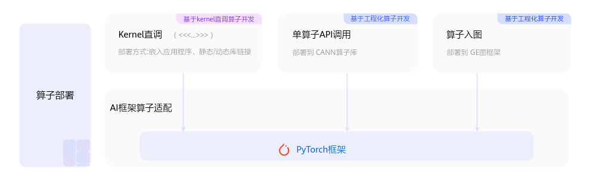

# PyTorch框架-AI框架算子适配-附录-编程指南-Ascend C算子开发-算子开发-CANN社区版8.5.0开发文档-昇腾社区

**页面ID:** atlas_ascendc_10_0057
**来源：** https://www.hiascend.com/document/detail/zh/CANNCommunityEdition/850/opdevg/Ascendcopdevg/atlas_ascendc_10_0057.html
---

# PyTorch框架

通过PyTorch框架进行模型的训练、推理时，会调用很多算子进行计算。开发者开发的自定义算子如果需要集成部署到PyTorch框架，有如下几种方式：

- Kernel直调：通过适配torch.library或Pybind注册自定义算子，可以实现PyTorch框架调用算子Kernel程序。
- 单算子API调用：该模式下的适配插件开发流程和具体样例请参见《Ascend Extension for PyTorch框架特性指南》中的“基于OpPlugin算子适配开发”章节。
- 图模式调用：自定义算子在Pytorch图模式下的适配开发指导请参见《PyTorch图模式使用指南(TorchAir)》中的“自定义算子入图”章节。

本节主要提供通过torch.library与Pybind注册自定义算子并实现PyTorch框架调用算子Kernel程序的指导。

- torch.library是用于扩展PyTorch核心算子库的API集合。它允许开发者创建新的算子、并为其提供自定义实现。
- Pybind是一个开源的C++和Python之间的桥接工具，它旨在使C++代码能够无缝地集成到Python环境中。

Pybind适用于快速将C++函数暴露给Python，实现高效接口绑定。但其生成的算子无法被PyTorch的算子系统识别，不具备schema定义与图追踪能力，因此不支持torch.compile优化。相比之下，torch.library提供了与PyTorch核心算子系统深度集成的机制，支持算子注册、schema定义和图追踪能力，是支持torch.compile的必要条件。开发者可根据需求选择对应方式。

#### torch.library

下面代码以add_custom（Add自定义算子为例）算子为例，介绍通过torch.library如何调用算子Kernel程序，文档中仅介绍核心步骤，完整样例请参考torch.library样例。

1. 环境准备。除了按照环境准备进行CANN软件包的安装，还需要安装以下依赖：安装PyTorch框架安装torch_npu插件
1. 实现NPU上的自定义算子。包括算子Kernel实现，并使用<<<>>>接口调用算子核函数完成指定的运算。样例中的c10_npu:getCurrentNPUStream接口用于获取当前npu流，返回值类型NPUStream，使用方式请参考《Ascend Extension for PyTorch自定义API参考》中的“(beta)c10_npu:getCurrentNPUStream”章节。需要注意的是，本样例的输入x，y的内存是在外层的Python调用脚本中分配的。123456789101112131415161718192021namespaceascendc_ops{at:Tensorascendc_add(constat:Tensor&x,constat:Tensor&y){// 运行资源申请，通过c10_npu:getCurrentNPUStream()的函数获取当前NPU上的流autoaclStream=c10_npu:getCurrentNPUStream().stream(false);// 分配Device侧输出内存at:Tensorz=at:empty_like(x);uint32_tblockDim=8;uint32_ttotalLength=1;for(uint32_tsize:x.sizes()){totalLength*=size;}// 用<<<>>>接口调用核函数完成指定的运算autoxGm=static_cast<uint8_t*>(const_cast<void*>(x.storage().data()));autoyGm=static_cast<uint8_t*>(const_cast<void*>(y.storage().data()));autozGm=static_cast<uint8_t*>(const_cast<void*>(z.storage().data()));add_custom<<<blockDim,nullptr,aclStream>>>(xGm,yGm,zGm,totalLength);// 将Device上的运算结果拷贝回Host并释放申请的资源returnz;}}// namespace ascendc_ops
1. 自定义算子的注册。PyTorch提供TORCH_LIBRARY宏作为自定义算子注册的核心接口，用于创建并初始化自定义算子库，注册后在Python侧可以通过torch.ops.namespace.op_name方式进行调用。TORCH_LIBRARY_IMPL用于将算子逻辑绑定到特定的DispatchKey（PyTorch设备调度标识），针对NPU设备，需要将算子实现注册到PrivateUse1这一专属的DispatchKey上。1234567891011// 注册算子到torch.libraryTORCH_LIBRARY(ascendc_ops,m){m.def("ascendc_add(Tensor x, Tensor y) -> Tensor");}// 注册PrivateUse1实现，NPU设备TORCH_LIBRARY_IMPL(ascendc_ops,PrivateUse1,m){m.impl("ascendc_add",TORCH_FN(ascendc_ops:ascendc_add));}
1. 编译生成算子动态库。
1. 使用Python测试脚本进行测试。在add_custom_test.py中，首先通过torch.ops.load_library加载生成的自定义算子库，调用注册的ascendc_add函数，并通过对比NPU输出与CPU标准加法结果来验证自定义算子的数值正确性。

#### Pybind

下面代码以add_custom算子为例，介绍通过Pybind方式实现Pytorch脚本中调用自定义算子的流程。文档中仅介绍核心步骤，完整样例请参考Pybind样例。

1. 环境准备。除了按照环境准备进行CANN软件包的安装，还需要安装以下依赖：安装PyTorch框架安装torch_npu插件安装pybind11pip3 install pybind11
1. 实现NPU上的自定义算子。包括算子Kernel实现，并使用<<<>>>接口调用算子核函数完成指定的运算。样例中的c10_npu:getCurrentNPUStream接口用于获取当前npu流，返回值类型NPUStream，使用方式请参考《Ascend Extension for PyTorch自定义API参考》中的“(beta)c10_npu:getCurrentNPUStream”章节。需要注意的是，本样例的输入x，y的内存是在Python调用脚本中分配的。123456789101112131415161718192021222324252627282930// Pybind和PyTorch调用所需的头文件#include<pybind11/pybind11.h>#include<torch/extension.h>#include"torch_npu/csrc/core/npu/NPUStream.h"// Kernel侧实现需要的头文件#include"kernel_operator.h"...namespacemy_add{at:Tensorrun_add_custom(constat:Tensor&x,constat:Tensor&y){// 运行资源申请，通过c10_npu:getCurrentNPUStream()的函数获取当前NPU上的流autoaclStream=c10_npu:getCurrentNPUStream().stream(false);// 分配Device侧输出内存at:Tensorz=at:empty_like(x);uint32_tblockDim=8;uint32_ttotalLength=1;for(uint32_tsize:x.sizes()){totalLength*=size;}// 用<<<>>>接口调用核函数完成指定的运算autoxGm=static_cast<uint8_t*>(const_cast<void*>(x.storage().data()));autoyGm=static_cast<uint8_t*>(const_cast<void*>(y.storage().data()));autozGm=static_cast<uint8_t*>(const_cast<void*>(z.storage().data()));add_custom<<<blockDim,nullptr,aclStream>>>(xGm,yGm,zGm,totalLength);// 将Device上的运算结果拷贝回Host并释放申请的资源returnz;}}// namespace my_add
1. 定义Pybind模块，将C++函数封装成Python函数。PYBIND11_MODULE是Pybind11库中的一个宏，用于定义一个Python模块。它接受两个参数，第一个参数是封装后的模块名，第二个参数是一个Pybind11模块对象，用于定义模块中的函数、类、常量等。通过调用m.def()方法，可以将上一步骤中函数my_add:run_add_custom()转成Python函数run_add_custom，使其可以在Python代码中被调用。1234PYBIND11_MODULE(add_custom,m){// 模块名add_custom，模块对象mm.doc()="add_custom pybind11 interfaces";// optional module docstringm.def("run_add_custom",&my_add:run_add_custom,"");// 将函数run_add_custom与Pybind模块进行绑定}
1. 编译生成算子动态库。
1. 在Python调用脚本中，使用torch接口生成随机输入数据并分配内存，通过导入封装的自定义模块add_custom，调用自定义模块add_custom中的run_add_custom函数，从而在NPU上执行算子。
