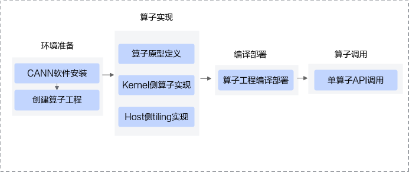

# 概述-工程化算子开发-附录-编程指南-Ascend C算子开发-算子开发-CANN社区版8.5.0开发文档-昇腾社区

**页面ID:** atlas_ascendc_10_0059
**来源：** https://www.hiascend.com/document/detail/zh/CANNCommunityEdition/850/opdevg/Ascendcopdevg/atlas_ascendc_10_0059.html
---

# 概述

工程化算子开发是指基于自动生成的自定义算子工程完成算子实现、编译部署、单算子调用代码自动生成等一系列流程。

该开发流程是标准的开发流程，建议开发者按照该流程进行算子开发。该方式下，算子开发的代码会更规范、统一、易于维护；同时该方式考虑了单算子API调用、算子入图、AI框架调用等功能的集成，使得开发者易于借助CANN框架实现上述功能。

工程化算子开发流程如下图所示：

1. 环境准备。CANN软件安装请参考环境准备。创建算子工程。使用msOpGen工具创建算子开发工程。
1. 算子实现。算子原型定义。通过原型定义来描述算子输入输出、属性等信息以及算子在AI处理器上相关实现信息，并关联tiling实现等函数。Kernel侧算子实现和host侧tiling实现请参考SIMD算子实现；工程化算子开发，支持开发者调用Tiling API基于CANN提供的编程框架进行tiling开发，kernel侧也提供对应的接口方便开发者获取tiling参数，具体内容请参考Kernel侧算子实现和Host侧Tiling实现，由此而带来的额外约束也在上述章节说明。
1. 编译部署。通过工程编译脚本完成算子的编译部署，分为算子包编译和算子动态库编译两种方式。
1. 单算子API调用：调用单算子API接口，基于C语言的API执行算子。
