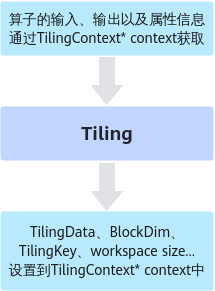
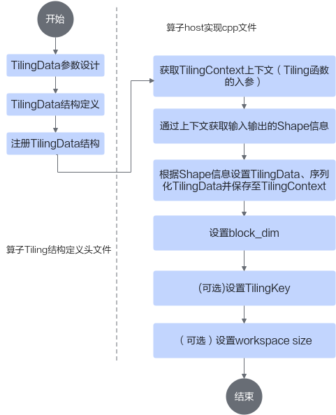

# 基本流程-Host侧Tiling实现-工程化算子开发-附录-编程指南-Ascend C算子开发-算子开发-CANN社区版8.5.0开发文档-昇腾社区

**页面ID:** atlas_ascendc_10_0064
**来源：** https://www.hiascend.com/document/detail/zh/CANNCommunityEdition/850/opdevg/Ascendcopdevg/atlas_ascendc_10_0064.html
---

# 基本流程

在SIMD算子实现章节已经介绍了host侧Tiling核心的实现方法，本章节侧重于介绍接入CANN框架时编程模式和API的使用。

大多数情况下，Local Memory的存储，无法完整的容纳算子的输入与输出，需要每次搬运一部分输入进行计算然后搬出，再搬运下一部分输入进行计算，直到得到完整的最终结果，这个数据切分、分块计算的过程称之为Tiling。根据算子的shape等信息来确定数据切分算法相关参数（比如每次搬运的块大小，以及总共循环多少次）的计算程序，称之为Tiling实现。

Tiling实现完成后，获取到的Tiling切分算法相关参数，会传递给kernel侧，用于指导并行数据的切分。由于Tiling实现中完成的均为标量计算，AI Core并不擅长，所以我们将其独立出来放在host CPU上执行。

如上图所示，Tiling实现即为根据算子shape等信息来确定切分算法相关参数的过程，这里的算子shape等信息可以理解为是Tiling实现的输入，切分算法相关参数可以理解为是Tiling实现的输出。输入和输出都通过Tiling函数的参数（TilingContext* context上下文结构）来承载。也就是说，开发者可以从上下文结构中获取算子的输入、输出以及属性信息，也就是Tiling实现的输入，经过Tiling计算后，获取到TilingData数据结构（切分算法相关参数）、blockDim变量、用于选择不同的kernel实现分支的TilingKey、算子workspace的大小，也就是Tiling实现的输出，并将这些输出设置到上下文结构中。

TilingData、blockDim、TilingKey、workspace这些概念的具体解释如下：

- TilingData：切分算法相关参数，比如每次搬运的块大小，以及总共循环多少次，通过结构体存储，由开发者自行设计。TilingData结构定义支持单结构定义方法，也支持结构体嵌套：单结构定义方法，以平铺的形式定义：123456789namespaceoptiling{BEGIN_TILING_DATA_DEF(MyAddTilingData)// 声明tiling结构名字TILING_DATA_FIELD_DEF(uint32_t,field1);// 结构成员的类型和名字TILING_DATA_FIELD_DEF(uint32_t,field2);TILING_DATA_FIELD_DEF(uint32_t,field3);END_TILING_DATA_DEF;REGISTER_TILING_DATA_CLASS(MyAdd,MyAddTilingData)// tiling结构注册给算子}Tiling实现函数中对tiling结构成员赋值的方式如下：123MyAddTilingDatamyTiling;myTiling.set_field1(1);myTiling.set_field2(2);支持结构体嵌套：12345678910111213141516171819namespaceoptiling{BEGIN_TILING_DATA_DEF(MyStruct1)// 声明结构1名字TILING_DATA_FIELD_DEF(uint32_t,field1);// 结构成员的类型和名字TILING_DATA_FIELD_DEF(uint32_t,field2);// 结构成员的类型和名字END_TILING_DATA_DEF;REGISTER_TILING_DATA_CLASS(MyStruct1Op,MyStruct1)// 注册结构体到<op_type>OpBEGIN_TILING_DATA_DEF(MyStruct2)// 声明结构2名字TILING_DATA_FIELD_DEF(uint32_t,field3);// 结构成员的类型和名字TILING_DATA_FIELD_DEF(uint32_t,field4);// 结构成员的类型和名字END_TILING_DATA_DEF;REGISTER_TILING_DATA_CLASS(MyStruct2Op,MyStruct2)// 注册结构体到<op_type>OpBEGIN_TILING_DATA_DEF(MyAddTilingData)// 声明tiling结构名字TILING_DATA_FIELD_DEF_STRUCT(MyStruct1,st1);// 结构成员的引用结构体TILING_DATA_FIELD_DEF_STRUCT(MyStruct2,st2);// 结构成员的引用结构体END_TILING_DATA_DEF;REGISTER_TILING_DATA_CLASS(MyAdd,MyAddTilingData)// tiling结构注册给算子}Tiling实现函数中对tiling结构成员赋值的方式如下：12345MyAddTilingDatamyTiling;myTiling.st1.set_field1(1);myTiling.st1.set_field2(2);myTiling.st2.set_field3(3);myTiling.st2.set_field4(4);
- blockDim：规定了核函数将会在几个核上执行。例如，需要计算8M的数据，每个核上计算1M的数据，blockDim设置为8，但是为了充分利用硬件资源，一般将blockDim设置为硬件平台的核数，根据核数进行数据切分。blockDim是逻辑核的概念，取值范围为[1,65535]。为了充分利用硬件资源，一般设置为物理核的核数或其倍数。对于耦合模式和分离模式，blockDim在运行时的意义和设置规则有一些区别，具体说明如下：耦合模式：由于其Vector、Cube单元是集成在一起的，blockDim用于设置启动多个AI Core核实例执行，不区分Vector、Cube。AI Core的核数可以通过GetCoreNumAiv或者GetCoreNumAic获取。分离模式针对仅包含Vector计算的算子，blockDim用于设置启动多少个Vector(AIV)实例执行，比如某款AI处理器上有40个Vector核，建议设置为40。针对仅包含Cube计算的算子，blockDim用于设置启动多少个Cube(AIC)实例执行，比如某款AI处理器上有20个Cube核，建议设置为20。针对Vector/Cube融合计算的算子，启动时，按照AIV和AIC组合启动，blockDim用于设置启动多少个组合执行，比如某款AI处理器上有40个Vector核和20个Cube核，一个组合是2个Vector核和1个Cube核，建议设置为20，此时会启动20个组合，即40个Vector核和20个Cube核。注意：该场景下，设置的blockDim逻辑核的核数不能超过物理核（2个Vector核和1个Cube核组合为1个物理核）的核数。AIC/AIV的核数分别通过GetCoreNumAic和GetCoreNumAiv接口获取。如果开发者使用了Device资源限制特性，那么算子设置的blockDim不应超过PlatformAscendC提供核数的API（GetCoreNum/GetCoreNumAic/GetCoreNumAiv等）返回的核数。例如，使用aclrtSetStreamResLimit设置Stream级别的Vector核数为8，那么GetCoreNumAiv接口返回值为8，针对Vector算子设置的blockDim不应超过8，否则会抢占其他Stream的资源，导致资源限制失效。
- TilingKey（可选）：TilingKey是一个算子内为了区分不同的实现而将kernel代码进行区分的方法，该方法类似于C++的Template模板机制，可减少不必要的icache miss以及scalar耗时，有助于优化单次调用kernel的性能。不同的kernel实现分支可以通过TilingKey来标识，host侧设置TilingKey后，可以选择对应的分支。例如，一个算子在不同的shape下，有不同的算法逻辑，kernel侧可以通过TilingKey来选择不同的算法逻辑，在host侧Tiling算法也有差异，host/kernel侧通过相同的TilingKey进行关联。假如有如下kernel代码：12345if(condition){ProcessA();}else{ProcessB();}如果函数ProcessA、ProcessB两个函数是个非常大的函数，那么上述代码在编译后会变得更大，而每次kernel运行只会选择1个分支，条件的判断和跳转在代码大到一定程度（16-32K，不同芯片存在差异）后会出现icache miss。通过TilingKey可以对这种情况进行优化，给2个kernel的处理函数设置不同的TilingKey 1和2：12345if(TILING_KEY_IS(1)){ProcessA();}elseif(TILING_KEY_IS(2)){ProcessB();}这样device kernel编译时会自动识别到2个TilingKey并编译2个kernel入口函数，将条件判断进行常量折叠。同时需要和host tiling函数配合，判断走ProcessA的场景设置TilingKey为1，走ProcessB的场景设置TilingKey为2：12345678910staticge:graphStatusTilingFunc(gert:TilingContext*context){// some codeif(condition){context->SetTilingKey(1);}else{context->SetTilingKey(2);}returnge:GRAPH_SUCCESS;}编译时，可以通过设置--tiling_key编译选项指定TilingKey，编译时只编译指定TilingKey相关的kernel代码，用于加速编译过程。
- WorkspaceSize：workspace是设备侧Global Memory上的一块内存。在Tiling函数中可以设置workspace的大小。设置后：单算子API执行场景，可以通过单算子API调用第一段接口获取workspace的大小，然后由开发者申请对应大小的Global Memory；入图场景，框架会根据设置的大小自动申请对应大小的Global Memory。申请workspace后，在算子Kernel实现时，可以使用这块workspace内存。workspace内存分为两部分：Ascend C API需要的workspace内存和算子实现使用到的workspace内存（按需）。Ascend C API需要预留workspace内存API在计算过程需要一些workspace内存作为缓存，因此算子Tiling函数需要为API预留workspace内存，预留内存大小通过GetLibApiWorkSpaceSize接口获取。算子实现使用到的workspace内存（按需）算子内部需要通过额外的device内存进行数据交换或者缓存的时候才需要分配，根据算子计算的空间自行分配。整体的workspace内存就是上述两部分之和，在Tiling函数中设置方法如下：12autoworkspaceSizes=context->GetWorkspaceSizes(1);// 只使用1块workspaceworkspaceSizes[0]=sysWorkspaceSize+usrWorkspaceSize;

#### Tiling实现基本流程

Tiling实现开发的流程图如下：

下面将从一个简单的Add算子为例介绍Tiling的实现流程。本样例中待处理数据的Shape大小可以平均分配到每个核上，并且可以对齐到一个datablock(32B)的大小。

首先完成算子TilingData结构定义头文件的编写，该文件命名为“算子名称_tiling.h”，位于算子工程的op_host目录下。样例代码如下：

| 12345678910111213 | #ifndef ADD_CUSTOM_TILING_H#define ADD_CUSTOM_TILING_H#include"register/tilingdata_base.h"namespaceoptiling{BEGIN_TILING_DATA_DEF(TilingData)// 注册一个tiling的类，以tiling的名字作为入参TILING_DATA_FIELD_DEF(uint32_t,totalLength);// 添加tiling字段，总计算数据量TILING_DATA_FIELD_DEF(uint32_t,tileNum);// 添加tiling字段，每个核上总计算数据分块个数END_TILING_DATA_DEF;// 注册算子tilingdata类到对应的AddCustom算子REGISTER_TILING_DATA_CLASS(AddCustom,TilingData)}#endif// ADD_CUSTOM_TILING_H |
| ----------------- | ------------------------------------------------------------------------------------------------------------------------------------------------------------------------------------------------------------------------------------------------------------------------------------------------------------------------------------------------------------------------------------------------------------------------------------------------------------------------------------------------------- |

具体的编写步骤如下：

1. 代码框架编写，需要增加#ifndef...的判断条件，防止头文件的重复包含；需要包含register/tilingdata_base.h头文件，tilingdata_base.h中定义了多个用于tilingdata注册的宏。样例代码如下：123456789#ifndef ADD_CUSTOM_TILING_H#define ADD_CUSTOM_TILING_H#include"register/tilingdata_base.h"namespaceoptiling{// tiling结构定义和注册代码// ...}#endif// ADD_CUSTOM_TILING_H
1. TilingData参数设计，TilingData参数本质上是和并行数据切分相关的参数，本示例算子使用了2个tiling参数：totalLength、tileNum。totalLength是指需要计算的数据量大小，tileNum是指每个核上总计算数据分块个数。比如，totalLength这个参数传递到kernel侧后，可以通过除以参与计算的核数，得到每个核上的计算量，这样就完成了多核数据的切分。
1. TilingData结构定义，通过BEGIN_TILING_DATA_DEF接口定义一个TilingData的类，通过TILING_DATA_FIELD_DEF接口增加TilingData的两个字段totalLength、tileNum，通过END_TILING_DATA_DEF接口结束TilingData定义。相关接口的详细说明请参考TilingData结构定义。1234BEGIN_TILING_DATA_DEF(TilingData)// 注册一个tiling的类，以tiling的名字作为入参TILING_DATA_FIELD_DEF(uint32_t,totalLength);// 添加tiling字段，总计算数据量TILING_DATA_FIELD_DEF(uint32_t,tileNum);// 添加tiling字段，每个核上总计算数据分块个数END_TILING_DATA_DEF;
1. 注册TilingData结构，通过REGISTER_TILING_DATA_CLASS接口，注册TilingData类，和自定义算子相关联。REGISTER_TILING_DATA_CLASS第一个参数为op_type（算子类型），本样例中传入AddCustom，第二个参数为TilingData的类名。REGISTER_TILING_DATA_CLASS接口介绍请参考TilingData结构注册。12// 注册算子tilingdata类到对应的AddCustom算子REGISTER_TILING_DATA_CLASS(AddCustom,TilingData)

然后完成算子host实现cpp文件中Tiling函数实现，该文件命名为“算子名称.cpp”，位于算子工程的op_host目录下。Tiling函数的原型是固定的，接受一个TilingContext作为输入，在此context上可以获取到输入、输出的Shape指针等内容。注册的Tiling函数由框架调用，调用时会传入TilingContext参数。样例代码如下：

| 1234567891011121314151617 | namespaceoptiling{constuint32_tBLOCK_DIM=8;constuint32_tTILE_NUM=8;staticge:graphStatusTilingFunc(gert:TilingContext*context){TilingDatatiling;uint32_ttotalLength=context->GetInputShape(0)->GetOriginShape().GetShapeSize();context->SetBlockDim(BLOCK_DIM);tiling.set_totalLength(totalLength);tiling.set_tileNum(TILE_NUM);tiling.SaveToBuffer(context->GetRawTilingData()->GetData(),context->GetRawTilingData()->GetCapacity());context->GetRawTilingData()->SetDataSize(tiling.GetDataSize());size_t*currentWorkspace=context->GetWorkspaceSizes(1);currentWorkspace[0]=0;returnge:GRAPH_SUCCESS;}}// namespace optiling |
| ------------------------- | ------------------------------------------------------------------------------------------------------------------------------------------------------------------------------------------------------------------------------------------------------------------------------------------------------------------------------------------------------------------------------------------------------------------------------------------------------------------------------------------------------------------------------------------------------------------------------------------------------------------------------- |

具体步骤如下：

1. 获取TilingContext的上下文，即Tiling函数的入参gert:TilingContext* context。
1. 设置TilingData。在步骤3中定义了TilingData类后，可以创建该类的一个实例，并通过调用set_{field_name}方法来设置各个字段值（其中field_name是步骤3中定义的tiling字段名）。设置完tiling字段后，通过调用SaveToBuffer方法完成TilingData实例的序列化和保存。通过上下文获取输入输出shape信息。本样例中通过TilingContext的GetInputShape接口获取输入的shape大小。12// 获取输入shape信息uint32_ttotalLength=context->GetInputShape(0)->GetOriginShape().GetShapeSize();设置TilingData。通过调用set_{field_name}方法来设置TilingData的字段值。12345// 用TilingData定义一个具体的实例TilingDatatiling;// 设置TilingDatatiling.set_totalLength(totalLength);tiling.set_tileNum(TILE_NUM);调用TilingData类的SaveToBuffer接口完成序列化并保存至TilingContext上下文。SaveToBuffer的第一个参数为存储Buffer的首地址，第二个参数为Buffer的长度。通过调用GetRawTilingData获取无类型的TilingData的地址，再通过GetData获取数据指针，作为Buffer的首地址；通过调用GetRawTilingData获取无类型的TilingData的地址，再通过GetCapacity获取TilingData的长度，作为Buffer的长度。完成SaveToBuffer操作后需要通过SetDataSize设置TilingData的长度，该长度通过TilingData类的GetDataSize接口获取。123// 序列化并保存tiling.SaveToBuffer(context->GetRawTilingData()->GetData(),context->GetRawTilingData()->GetCapacity());context->GetRawTilingData()->SetDataSize(tiling.GetDataSize());
1. 通过SetBlockDim接口设置blockDim。1context->SetBlockDim(BLOCK_DIM);
1. （可选）通过SetTilingKey设置TilingKey。1context->SetTilingKey(1);
1. （可选）通过GetWorkspaceSizes获取workspace size指针，并设置size大小。此处仅作为举例，设置workspace的大小为0。12size_t*currentWorkspace=context->GetWorkspaceSizes(1);currentWorkspace[0]=0;
