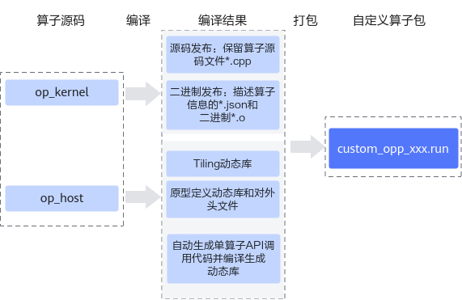

# 算子工程编译-算子包编译-工程化算子开发-附录-编程指南-Ascend C算子开发-算子开发-CANN社区版8.5.0开发文档-昇腾社区

**页面ID:** atlas_ascendc_10_0068
**来源：** https://www.hiascend.com/document/detail/zh/CANNCommunityEdition/850/opdevg/Ascendcopdevg/atlas_ascendc_10_0068.html
---

# 算子工程编译

算子kernel侧和host侧实现开发完成后，需要对算子工程进行编译，生成自定义算子安装包*.run，详细的编译操作包括：

- 编译Ascend C算子kernel侧代码实现文件*.cpp，分为源码发布和二进制发布两种方式。源码发布：不对算子kernel侧实现进行编译，保留算子kernel源码文件*.cpp。该方式可以支持算子的在线编译、通过ATC模型转换的方式编译算子的场景。二进制发布：对算子kernel侧实现进行编译，生成描述算子相关信息的json文件*.json和算子二进制文件*.o。算子调用时，如果需要直接调用算子二进制，则使用该编译方式，比如通过单算子API调用的方式完成单算子的调用，PyTorch框架中单算子调用的场景，动态网络中调用算子的场景。
- 编译Ascend C算子host侧代码实现文件*.cpp、*.h。将原型定义和shape推导实现编译成算子原型定义动态库libcust_opsproto_*.so，并生成算子原型对外接口op_proto.h。将Tiling实现编译成Tiling动态库liboptiling.so等。基于算子原型定义，自动生成单算子API调用代码和头文件aclnn_*.h，并编译生成单算子API调用的动态库libcust_opapi.so。

#### 编译步骤

1. 完成工程编译相关配置。修改工程目录下的CMakePresets.jsoncacheVariables的配置项。CMakePresets.json文件内容如下，需要配置的参数请参考表1，其他参数会在工程创建时自动生成。{
    "version": 1,
    "cmakeMinimumRequired": {
        "major": 3,
        "minor": 19,
        "patch": 0
    },
    "configurePresets": [
        {
            "name": "default",
            "displayName": "Default Config",
            "description": "Default build using Unix Makefiles generator",
            "generator": "Unix Makefiles",
            "binaryDir": "${sourceDir}/build_out",
            "cacheVariables": {
                "CMAKE_BUILD_TYPE": {
                    "type": "STRING",
                    "value": "Release"
                },
                "ENABLE_SOURCE_PACKAGE": {
                    "type": "BOOL",
                    "value": "True"
                },
                "ENABLE_BINARY_PACKAGE": {
                    "type": "BOOL",
                    "value": "True"
                },
                "ASCEND_COMPUTE_UNIT": {
                    "type": "STRING",
                    "value": "ascendxxx"
                },
                "ENABLE_TEST": {
                    "type": "BOOL",
                    "value": "True"
                },
                "vendor_name": {
                    "type": "STRING",
                    "value": "customize"
                },
                "ASCEND_PYTHON_EXECUTABLE": {
                    "type": "STRING",
                    "value": "python3"
                },
                "CMAKE_INSTALL_PREFIX": {
                    "type": "PATH",
                    "value": "${sourceDir}/build_out"
                },
                "ENABLE_CROSS_COMPILE": {
                    "type": "BOOL",
                    "value": "False"
                },
                "CMAKE_CROSS_PLATFORM_COMPILER": {
                    "type": "PATH",
                    "value": "/usr/bin/aarch64-linux-gnu-g++"
                },
                "ASCEND_PACK_SHARED_LIBRARY": {
                    "type": "BOOL",
                    "value": "False"
                }
            }
        }
    ]
}表1需要开发者配置的参数列表参数名称参数描述默认值CMAKE_BUILD_TYPE编译模式选项，可配置为：“Release”，Release版本，不包含调试信息，编译最终发布的版本。“Debug”，“Debug”版本，包含调试信息，便于开发者开发和调试。“Release”ENABLE_SOURCE_PACKAGE是否开启源码编译“True”ENABLE_BINARY_PACKAGE是否开启二进制编译“True”vendor_name标识自定义算子所属厂商的名称。建议开发者自行指定所属厂商名称，避免和其他厂商提供的算子包冲突。“customize”ASCEND_PACK_SHARED_LIBRARY是否开启动态库编译功能。“False”配置编译相关环境变量（可选）表2环境变量说明环境变量配置说明CMAKE_CXX_COMPILER_LAUNCHER用于配置C++语言编译器（如g++）、毕昇编译器的启动器程序为ccache，配置后即可开启cache缓存编译，加速重复编译并提高构建效率。使用该功能前需要安装ccache。配置方法如下，在对应的CMakeLists.txt进行设置：set(CMAKE_CXX_COMPILER_LAUNCHER <launcher_program>)其中<launcher_program>是ccache的安装路径，比如ccache的安装路径为/usr/bin/ccache，示例如下：set(CMAKE_CXX_COMPILER_LAUNCHER /usr/bin/ccache)
1. 在算子工程目录下执行如下命令，进行算子工程编译。./build.sh编译成功后，会在当前目录下创建build_out目录，并在build_out目录下生成自定义算子安装包custom_opp_<target os>_<target architecture>.run。用户如果需要编译过程日志存盘，可以使用环境变量ASCENDC_BUILD_LOG_DIR来控制存储路径。用户设置该选项之后，如果编译过程中无错误产生，则对应的log文件后缀会添加"_success"，若编译过程有错误产生，则会在屏幕打印对应的报错信息，以及指示用户log文件的具体路径与文件名，同时，对应log文件后缀会添加“_error”。# 如希望编译日志存储在/home/build_log/，则可以按照如下设置，默认不打开日志存储
export ASCENDC_BUILD_LOG_DIR=/home/build_log/

#### 算子包交叉编译

完成算子代码实现后，如果当前平台架构和运行环境一致则参考上一节的内容进行编译即可，如果需要实现算子包的交叉编译，您可以参考如下流程。

1. 交叉编译工具下载，下表以Ubuntu系列操作系统为例，展示了编译工具下载命令的样例。其他操作系统，请替换为实际的下载命令。表3Ubuntu系列操作系统交叉编译工具下载命令样例当前平台架构运行环境平台架构编译工具下载命令x86_64aarch64sudo apt-get install -y g++-aarch64-linux-gnuaarch64x86_64sudo apt-get install g++-x86-64-linux-gnu
1. 自定义算子工程交叉编译，构建生成自定义算子包。修改CMakePresets.json中ENABLE_CROSS_COMPILE为True，使能交叉编译。"ENABLE_CROSS_COMPILE": {
    "type": "BOOL","value": "True"}修改CMakePresets.json中CMAKE_CROSS_PLATFORM_COMPILER为安装后的交叉编译工具路径。"CMAKE_CROSS_PLATFORM_COMPILER": {
    "type": "PATH",
    "value": "/usr/bin/aarch64-linux-gnu-g++"
}在算子工程目录下执行如下命令，进行算子工程交叉编译。./build.sh编译成功后，会在当前目录下创建build_out目录，并在build_out目录下生成自定义算子安装包custom_opp_<target os>_<target architecture>.run

#### 支持自定义编译选项

在算子工程中，如果开发者想对算子kernel侧代码增加一些自定义的编译选项，可以参考如下内容进行编译选项的定制。

修改算子工程op_kernel目录下的CMakeLists.txt，使用add_ops_compile_options来增加编译选项，方法如下：

具体参数的介绍如下：

| 参数名称           | 可选/必选 | 参数描述                                                                                                                                                                                                                                                                                                                                                                                                                                                                                                                                                                                                                                                                                                                                                                                                                                                                                                                                                                                                                                                                                                                            |
| ------------------ | --------- | ----------------------------------------------------------------------------------------------------------------------------------------------------------------------------------------------------------------------------------------------------------------------------------------------------------------------------------------------------------------------------------------------------------------------------------------------------------------------------------------------------------------------------------------------------------------------------------------------------------------------------------------------------------------------------------------------------------------------------------------------------------------------------------------------------------------------------------------------------------------------------------------------------------------------------------------------------------------------------------------------------------------------------------------------------------------------------------------------------------------------------------- |
| OpType（算子类型） | 必选      | 第一个参数应传入算子类型，如果需要对算子工程中的所有算子生效，需要配置为ALL。                                                                                                                                                                                                                                                                                                                                                                                                                                                                                                                                                                                                                                                                                                                                                                                                                                                                                                                                                                                                                                                       |
| COMPUTE_UNIT       | 可选      | 标识编译选项在哪些AI处理器型号上生效，多个型号之间通过空格间隔。不配置时表示对所有AI处理器型号生效。说明：COMPUTE_UNIT具体配置如下：针对如下产品：在安装昇腾AI处理器的服务器执行npu-smi info命令进行查询，获取Name信息。实际配置值为AscendName，例如Name取值为xxxyy，实际配置值为Ascendxxxyy。Atlas A2 训练系列产品/Atlas A2 推理系列产品Atlas 200I/500 A2 推理产品Atlas推理系列产品Atlas训练系列产品针对如下产品，在安装昇腾AI处理器的服务器执行npu-smi info -t board -iid-cchip_id命令进行查询，获取Chip Name和NPU Name信息，实际配置值为Chip Name_NPU Name。例如Chip Name取值为Ascendxxx，NPU Name取值为1234，实际配置值为Ascendxxx_1234。其中：id：设备id，通过npu-smi info -l命令查出的NPU ID即为设备id。chip_id：芯片id，通过npu-smi info -m命令查出的Chip ID即为芯片id。Atlas A3 训练系列产品/Atlas A3 推理系列产品                                                                                                                                                                                                                                                                                                          |
| OPTIONS            | 必选      | 自定义的编译选项。多个编译选项之间通过空格间隔。增加-D编译选项，用于在编译时定义宏。OPTIONS -Dname=definition增加-g -O0等调试用编译选项。支持传入毕昇编译器编译选项：比如--cce-auto-sync=off，设置该选项可以关闭自动同步功能，自定义算子工程已默认开启，通常无需开发者手动设置。详细内容参见支持自动同步。更多编译选项可以参考毕昇编译器编译选项。Ascend C框架提供的编译选项介绍如下：-DASCENDC_DUMP用于控制Dump开关，默认开关打开，开发者调用printf/DumpTensor/assert后会有信息打印；设置为0后，表示开关关闭。OPTIONS -DASCENDC_DUMP=0-DASCENDC_DEBUG用于控制Ascend C API的调测开关，默认开关关闭；增加该编译选项后，表示开关打开，此时接口内部的assert校验生效，校验不通过会有assert日志打屏。开启该功能会对算子实际运行的性能带来一定影响，通常在调测阶段使用。OPTIONS -DASCENDC_DEBUG当前-DASCENDC_DEBUG功能支持的产品型号为：Atlas推理系列产品Atlas A2 训练系列产品/Atlas A2 推理系列产品--tiling_key，设置该选项后，只编译指定的TilingKey相关的kernel代码，用于加速编译过程。若不指定TilingKey编译，则默认编译所有的TilingKey。配置多个TilingKey时，TilingKey之间不能有空格。示例如下，其中1、2为tiling_key。--tiling_key=1,2 |

- 编译选项是基于“算子类型+AI处理器型号系列”进行配置的，也就是说不同的“算子类型+AI处理器型号系列”可以配置不同的编译选项。add_ops_compile_options(AddCustomCOMPUTE_UNITAscendxxxyy... OPTIONS -DNEW_MACRO1=xx)
add_ops_compile_options(AddCustomCOMPUTE_UNITAscendxxxyy... OPTIONS -DNEW_MACRO2=xx)
add_ops_compile_options(AddCustomCOMPUTE_UNITAscendxxxyy... OPTIONS -DNEW_MACRO3=xx)
- 对相同算子类型+AI处理器型号系列，做多次编译选项配置，以后配置的为准。
- 对ALL生效的编译选项和对单一算子生效的编译选项如果没有冲突，同时生效，如果有冲突，以单一算子的编译选项为准。
