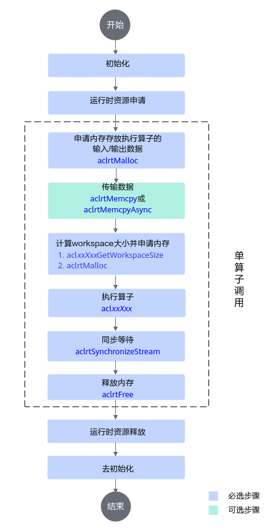

# 单算子API调用-工程化算子开发-附录-编程指南-Ascend C算子开发-算子开发-CANN社区版8.5.0开发文档-昇腾社区

**页面ID:** atlas_ascendc_10_0070
**来源：** https://www.hiascend.com/document/detail/zh/CANNCommunityEdition/850/opdevg/Ascendcopdevg/atlas_ascendc_10_0070.html
---

# 单算子API调用

单算子API调用方式，是指直接调用单算子API接口，基于C语言的API执行算子。算子工程创建完成后，基于工程代码框架完成算子原型定义、kernel侧算子实现、host侧tiling实现，通过工程编译脚本完成算子的编译部署，之后再进行单算子API的调用。

#### 基本原理

完成自定义算子编译后，会自动生成单算子API，可以直接在应用程序中调用。

单算子API的形式一般定义为“两段式接口”，形如：

| 12  | aclnnStatusaclnnXxxGetWorkspaceSize(constaclTensor*src,...,aclTensor*out,uint64_t*workspaceSize,aclOpExecutor**executor);aclnnStatusaclnnXxx(void*workspace,uint64_tworkspaceSize,aclOpExecutor*executor,aclrtStreamstream); |
| --- | ---------------------------------------------------------------------------------------------------------------------------------------------------------------------------------------------------------------------------- |

其中aclnnXxxGetWorkspaceSize/aclnnXxxTensorGetWorkspaceSize为第一段接口，主要用于计算本次API调用过程中需要多少workspace内存，获取到本次计算所需的workspaceSize后，按照workspaceSize申请NPU内存，然后调用第二段接口aclnnXxx执行计算。Xxx代表算子原型注册时传入的算子类型。

aclnnXxxGetWorkspaceSize接口的输入输出参数生成规则如下：

- 可选输入的命名增加Optional后缀。如下样例中，x是可选输入。1aclnnStatusaclnnXxxGetWorkspaceSize(constaclTensor*xOptional,...,aclTensor*out,uint64_t*workspaceSize,aclOpExecutor**executor);

- 输入输出同名、使用同一个Tensor承载的情况下，生成的aclnn接口中只保留input参数同时去掉input的const修饰，并以Ref作为后缀。如下样例中，原型定义input、output都定义为x，xRef既作为输入，又作为输出。1aclnnStatusaclnnXxxGetWorkspaceSize(aclTensor*xRef,...,uint64_t*workspaceSize,aclOpExecutor**executor);
- 如果仅有一个输出，输出参数命名为out；如果存在多个输出，每个输出后面都以Out作为后缀。1234// 仅有一个输出aclnnStatusaclnnXxxGetWorkspaceSize(constaclTensor*src,...,aclTensor*out,uint64_t*workspaceSize,aclOpExecutor**executor);// 存在多个输出aclnnStatusaclnnXxxGetWorkspaceSize(constaclTensor*src,...,aclTensor*yOut,aclTensor*y1Out,...,uint64_t*workspaceSize,aclOpExecutor**executor);
- 如果算子包含属性，则属性参数的位置介于输入输出之间。如下示例中，x是算子输入，negativeSlope是算子属性，out是算子输出。aclnnStatusaclnnXxxGetWorkspaceSize(const aclTensor *x, double negativeSlope, aclTensor *out, uint64_t *workspaceSize, aclOpExecutor **executor);

当算子原型注册时使用ValueDepend接口标识输入为数据依赖输入时，会额外生成一个API，该API支持值依赖场景输入数据为空的一阶段计算。

| 1   | aclnnStatusaclnnXxxTensorGetWorkspaceSize(constaclTensor*src,...,aclTensor*out,uint64_t*workspaceSize,aclOpExecutor**executor); |
| --- | ------------------------------------------------------------------------------------------------------------------------------- |

| 12  | aclnnStatusaclnnXxxGetWorkspaceSize(constaclIntArray*x0,constaclBoolArray*x1,constaclFloatArray*x2,aclTensor*out,uint64_t*workspaceSize,aclOpExecutor**executor);aclnnStatusaclnnXxxTensorGetWorkspaceSize(constaclTensor*x0,constaclTensor*x1,constaclTensor*x2,aclTensor*out,uint64_t*workspaceSize,aclOpExecutor**executor); |
| --- | ------------------------------------------------------------------------------------------------------------------------------------------------------------------------------------------------------------------------------------------------------------------------------------------------------------------------------- |

#### 前置步骤

- 参考创建算子工程完成自定义算子工程的创建。
- 参考Kernel侧算子实现完成kernel侧实现的相关准备，参考Host侧Tiling实现、算子原型定义完成host侧实现相关准备。
- 对于算子包编译场景，参考算子工程编译、算子包部署完成算子的编译部署，编译部署时需要开启算子的二进制编译功能：修改算子工程中的编译配置项文件CMakePresets.json，将ENABLE_BINARY_PACKAGE设置为True。编译部署时可将算子的二进制部署到当前环境，便于后续算子的调用。"ENABLE_BINARY_PACKAGE": {
                    "type": "BOOL","value": "True"},算子编译部署后，会在算子包安装目录下的op_api目录生成单算子调用的头文件aclnn_xx.h和动态库libcust_opapi.so。以默认安装场景为例，单算子调用的头文件。h和动态库libcust_opapi.so所在的目录结构，如下所示：├── opp    //算子库目录
│   ├── vendors     //自定义算子所在目录
│       ├── config.ini
│       └──vendor_name1// 存储对应厂商部署的自定义算子，此名字为编译自定义算子安装包时配置的vendor_name，若未配置，默认值为customize
│           ├── op_api
│           │   ├── include
│           │   │  └── aclnn_xx.h
│           │   └── lib
│           │       └── libcust_opapi.so
...
- 对于算子动态库编译场景，参考算子动态库和静态库编译完成算子的编译。编译完成后会在如下路径生成单算子调用的头文件aclnn_xx.h和动态库libcust_opapi.so。其中CMAKE_INSTALL_PREFIX为开发者在cmake文件中配置的编译产物存放路径。动态库路径：${CMAKE_INSTALL_PREFIX}/op_api/lib/libcust_opapi.so头文件路径：${CMAKE_INSTALL_PREFIX}/op_api/include

#### 准备验证代码工程

下文将重点介绍和单算子调用流程相关的main.cpp、op_runner.cpp文件、CMakeLists.txt文件如何编写，其他文件请自行参考。

#### 单算子调用流程

单算子API执行流程如下：

本节以AddCustom自定义算子调用为例，介绍如何编写单算子调用的代码逻辑。其他算子的调用逻辑与Add算子大致一样，请根据实际情况自行修改代码。

以下是关键步骤的代码示例，不可以直接拷贝编译运行，仅供参考，调用接口后，需增加异常处理的分支，并记录报错日志、提示日志，此处不一一列举。

| 12345678910111213141516171819202122232425262728293031323334353637383940414243444546474849505152 | // 1.初始化aclRet=aclInit("../scripts/acl.json");// 2.运行管理资源申请intdeviceId=0;aclRet=aclrtSetDevice(deviceId);// 获取软件栈的运行模式，不同运行模式影响后续的接口调用流程（例如是否进行数据传输等）aclrtRunModerunMode;boolg_isDevice=false;aclErroraclRet=aclrtGetRunMode(&runMode);g_isDevice=(runMode==ACL_DEVICE);// 3.申请内存存放算子的输入输出// ......// 4.传输数据if(aclrtMemcpy(devInputs_[i],size,hostInputs_[i],size,kind)!=ACL_SUCCESS){returnfalse;}// 5.计算workspace大小并申请内存size_tworkspaceSize=0;aclOpExecutor*handle=nullptr;autoret=aclnnAddCustomGetWorkspaceSize(inputTensor_[0],inputTensor_[1],outputTensor_[0],&workspaceSize,&handle);// ...void*workspace=nullptr;if(workspaceSize!=0){if(aclrtMalloc(&workspace,workspaceSize,ACL_MEM_MALLOC_HUGE_FIRST)!=ACL_SUCCESS){ERROR_LOG("Malloc device memory failed");}}// 6.执行算子if(aclnnAddCustom(workspace,workspaceSize,handle,stream)!=ACL_SUCCESS){(void)aclrtDestroyStream(stream);ERROR_LOG("Execute Operator failed. error code is %d",static_cast<int32_t>(ret));returnfalse;}// 7.同步等待aclrtSynchronizeStream(stream);// 8.处理执行算子后的输出数据，例如在屏幕上显示、写入文件等，由用户根据实际情况自行实现// ......// 9.释放运行管理资源aclRet=aclrtResetDevice(deviceId);// ....// 10.去初始化aclRet=aclFinalize(); |
| ----------------------------------------------------------------------------------------------- | ------------------------------------------------------------------------------------------------------------------------------------------------------------------------------------------------------------------------------------------------------------------------------------------------------------------------------------------------------------------------------------------------------------------------------------------------------------------------------------------------------------------------------------------------------------------------------------------------------------------------------------------------------------------------------------------------------------------------------------------------------------------------------------------------------------------------------------------------------------------------------------------------------------------------------------------------------------------------------------------------------------------------------------------------------------------------------------------------------------------------------------------------------------------------------------------------------------------------------------------------------------------------------------------------------------------------- |

#### CMakeLists文件

算子编译后，会生成单算子调用的头文件aclnn_xx.h和动态库libcust_opapi.so。具体路径请参考前置步骤。

编译算子调用程序时，需要在头文件的搜索路径include_directories中增加单算子调用的头文件目录，便于找到该头文件；同时需要链接cust_opapi动态库并在库文件的搜索路径link_directories中增加libcust_opapi.so所在目录。

- 在头文件的搜索路径include_directories中增加单算子调用的头文件目录。以下样例仅为参考，请根据头文件的实际目录位置进行设置。include_directories(
    ${INC_PATH}/runtime/include
    ${INC_PATH}/atc/include
    ../inc${OP_API_PATH}/include)

- 链接cust_opapi链接库。target_link_libraries(execute_add_op
    ascendclcust_opapiacl_op_compiler
    nnopbase
    stdc++
)
- 在库文件的搜索路径link_directories中增加libcust_opapi.so所在目录。以下样例仅为参考，请根据库文件的实际目录位置进行设置。link_directories(
    ${LIB_PATH}
    ${LIB_PATH1}
    ${OP_API_PATH}/lib
)

#### 生成测试数据

在样例工程目录下，执行如下命令：

会在工程目录下input目录中生成两个shape为(8,2048)，数据类型为float16的数据文件input_0.bin与input_1.bin，用于进行AddCustom算子的验证。

代码样例如下：

#### 编译与运行

1. 开发环境上，设置环境变量，配置单算子验证程序编译依赖的头文件与库文件路径，如下为设置环境变量的示例。${INSTALL_DIR}请替换为CANN软件安装后文件存储路径。以root用户安装为例，则安装后文件存储路径为：/usr/local/Ascend/cann。{arch-os}为运行环境的架构和操作系统，arch表示操作系统架构，os表示操作系统，例如x86_64-linux或aarch64-linux。export DDK_PATH=${INSTALL_DIR}export NPU_HOST_LIB=${INSTALL_DIR}/{arch-os}/devlib
1. 编译样例工程，生成单算子验证可执行文件。切换到样例工程根目录，然后在样例工程根目录下执行如下命令创建目录用于存放编译文件，例如，创建的目录为“build”。mkdir -p build进入build目录，执行cmake编译命令，生成编译文件命令示例如下所示：cd buildcmake ../src -DCMAKE_SKIP_RPATH=TRUE执行如下命令，生成可执行文件。make会在工程目录的output目录下生成可执行文件execute_add_op。
1. 执行单算子以运行用户（例如HwHiAiUser）拷贝开发环境中样例工程output目录下的execute_add_op到运行环境任一目录。说明：若您的开发环境即为运行环境，此拷贝操作可跳过。在运行环境中，执行execute_add_op文件：chmod +x execute_add_op
./execute_add_op会有如下屏显信息：123456789101112131415[INFO]Setdevice[0]success[INFO]GetRunMode[1]success[INFO]Initresourcesuccess[INFO]Setinputsuccess[INFO]Copyinput[0]success[INFO]Copyinput[1]success[INFO]Createstreamsuccess[INFO]ExecuteaclnnAddCustomGetWorkspaceSizesuccess,workspacesize0[INFO]ExecuteaclnnAddCustomsuccess[INFO]Synchronizestreamsuccess[INFO]Copyoutput[0]success[INFO]Writeoutputsuccess[INFO]Runopsuccess[INFO]ResetDevicesuccess[INFO]Destroyresourcesuccess如果有Run op success，表明执行成功，会在output目录下生成输出文件output_z.bin。
1. 比较真值文件切换到样例工程根目录，然后执行如下命令：python3 scripts/verify_result.py output/output_z.bin output/golden.bin会有如下屏显信息：1testpass可见，AddCustom算子验证结果正确。
